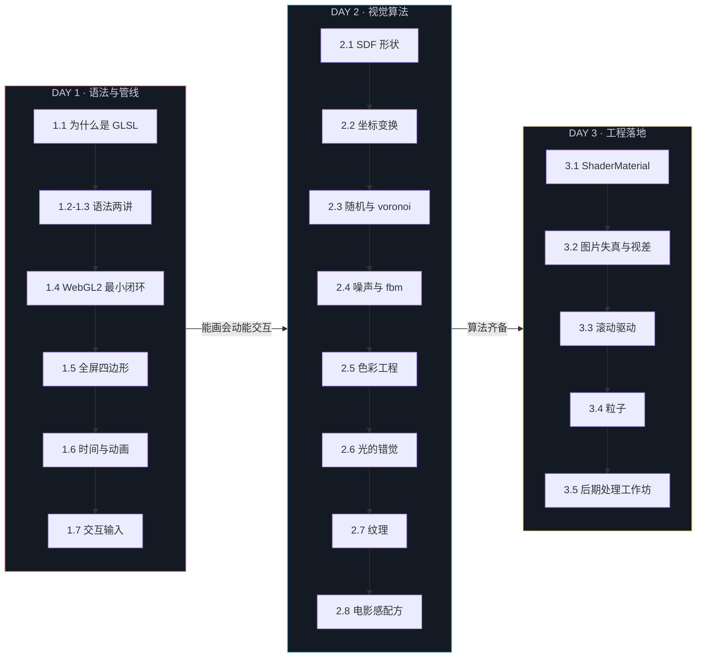
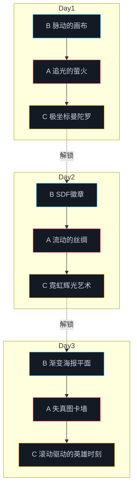

# 00 课程计划与学习地图

三天、每天八小时、一条主线：看得懂语法与管线 → 画得出画面 → 落得了工程。创意网站的 shader 效果 = 视觉算法 × 动画（时间）× 交互（用户输入），Day 1 结束时四根支柱全部立起来，Day 2 专心做视觉算法，Day 3 负责工程落地。时长是净学习时间，课间休息自己安排。

## 三天时刻表

| 时段 | Day 1 | Day 2 | Day 3 |
|------|-------|-------|-------|
| 上午 · 讲义 | 1.1 → 1.4（约 3.5h） | 2.1 → 2.4（约 3.5h） | 3.1 → 3.2（约 2h） |
| 下午 · 讲义+demo | 1.5 → 1.7 + 全部 demo（约 3h） | 2.5 → 2.8 + 全部 demo（约 3h） | 3.3 → 3.5 + 全部 demo（约 3.5h） |
| 晚间 · 作业 | B 档 30min / A 档 60min | B 档 40min / A 档 60min | B 档 45min / A 档 75min |
| 晚间 · 加码 | C 档 90min（可留到 Day 2/3 补） | C 档 90min（可留到 Day 3 补） | C 档 2h（作品集级） |

## Day 1　语法与管线：让 GPU 听懂你的命令

| 模块 | 时长 | 内容 | 配套 |
|------|------|------|------|
| 1.1 | 45min | 为什么前端要学 GLSL | demo 01 |
| 1.2 | 50min | 类型与变量 | demo 01 |
| 1.3 | 50min | 表达式与结构 | demo 01 |
| 1.4 | 60min | 原生 WebGL2 最小闭环 | demo 01 |
| 1.5 | 55min | 数据流与全屏四边形 | demo 02 |
| 1.6 | 50min | 时间与动画 | demo 03 |
| 1.7 | 60min | 交互输入 | demos 04 / 05 / 06 |
| 巩固 | 晚间 | 三档作业 | homework/day1 |

Day 1 的前四讲共用 demo 01（渐变三角形）作为逐行标注对象反复改造，到 1.5 才拆出 demo 02，1.6 / 1.7 各自拆出独立 demo——这种安排刻意减少了「再搭一遍脚手架」的损耗。demo 01 同时是全课程所有 demo 的结构范本：深色画框、四角标注、错误面板、视觉规格，之后你写的每个页面都长这样。

## Day 2　视觉算法：fragment shader 的算法箱

| 模块 | 时长 | 内容 | 配套 |
|------|------|------|------|
| 2.1 | 55min | 像素级绘画：从 step 到符号距离场 | demo 01 |
| 2.2 | 50min | 坐标变换：旋转平铺与极坐标图案 | demo 02 |
| 2.3 | 50min | 伪随机与图案：hash 格子与 voronoi | demo 02 |
| 2.4 | 60min | 噪声：value noise 到 domain warping | demos 03 / 04 |
| 2.5 | 45min | 色彩工程：余弦调色板与配色直觉 | demo 05 |
| 2.6 | 55min | 光的错觉：伪 3D 光感的手法 | demo 06 |
| 2.7 | 45min | 纹理：把图片交给 GPU 之后 | 无独立 demo（落点见下） |
| 2.8 | 40min | 电影感配方：grain、vignette 与合成模式 | demo 06 |
| 巩固 | 晚间 | 三档作业 | homework/day2 |

Day 2 每个 demo 只服务一个算法母题，并排开着看：demo 03（fbm 云海）是塔的基座，demo 04（域扭曲流场）是塔的尖顶；demo 06 同装 2.6 与 2.8 两讲，前半场开光、后半场开配方卡。2.7 是唯一不设独立 demo 的讲义——纹理手法的落点在 C 档作业的加分项与 demo 03 的两段十分钟练习，把失真六行贴进云海 fragment 就算过手。

## Day 3　工程落地：把 GLSL 搬进 Three.js

| 模块 | 时长 | 内容 | 配套 |
|------|------|------|------|
| 3.1 | 55min | ShaderMaterial：从原生到 Three.js 的迁移 | demo 01 |
| 3.2 | 60min | 图片失真与鼠标视差 | demo 02 |
| 3.3 | 60min | 滚动驱动 shader：u_scroll、Lenis 与转场遮罩 | 不设独立 demo |
| 3.4 | 55min | 粒子场：Points、gl_PointSize 与噪声粒子场 | demo 03 |
| 3.5 | 70min | 后期处理工作坊：装配作品集 hero | demo 03 |
| 巩固 | 晚间 | 三档作业 | homework/day3 |

Day 3 只有三个 demo：3.4 与 3.5 共用 demo 03（粒子星云与 bloom），前半场粒子、后半场 pass 链；3.3 的滚动手法不设独立 demo——它的完整工程实现就是晚间 C 档作业「滚动驱动的英雄时刻」，做完对照 `solutions/`。三天收尾在 3.5 的工作坊：把五讲的存货装配成一个作品集级 hero。

## 学习路径

每个模块的推进方式都一样：读讲义的 Why / What / How，跑一遍对应 demo，然后做作业。讲义负责讲清为什么，demo 给你能跑的实现，作业把学习点挖空——打开骨架页面，错误面板会告诉你第一件事做什么。

## 作业递进

三档的取舍逻辑：基础档验收「概念通」，进阶档验收「能组合」，挑战档验收「可以拿去当作品集片段」。递进链条有明确的前置关系——Day 1 的 A 档练出的「缓动跟随与视差手感」是 C 档曼陀罗鼠标扰动的前置；Day 2 的 A 档 domain warping 是 C 档辉光场的前置；Day 3 的 A 档 hover 状态机与失真参数是 C 档转场遮罩的前置。时间不够就只做 B 档，第二天照样能跟上；反过来 C 档做不出来不要恋战，标记 TODO 隔天回来——它考察的是组合能力，不是意志力。

## 结营之后

按 00 到 3.5 的顺序走完，你已经有「GLSL 视觉算法 + Three.js 工程落地」的完整能力。接下来的路径建议：

1. 从 [实例网站清单.md](实例网站清单.md) 挑一个站，用「三步观察法」看懂其中一个片段，再用课程讲义对应章节复刻 80%（不追求像素级，追求技术同构）
2. 系统回读 [参考资料.md](参考资料.md) 第 3 层：Inigo Quilez 的文章合集与 Shadertoy，SDF / fbm / 调色的原产地都在那里
3. 把三天作业的三个挑战档整合成一个可展示的作品集页面——Day 3 的 C 档已经给了你 Lenis 滚动 + 转场 + 粒子的全部零件
4. 对照 webgpu 课的结营清单：那边攒下的是「GPU 怎么工作」，这边攒下的是「GLSL 怎么画出东西」，两条合起来才是创意前端的全图
