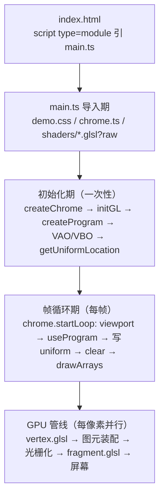

# 项目架构与搭建说明

> 读者对象：维护者、二次开发者，以及想搞清楚「这套课程工程是怎么搭起来、GLSL 是怎么一路渲染到屏幕上的」的学员。
> 学员路线文档见 `README.md` / `00-课程计划与学习地图.md` / `01-环境准备.md`；制作规格见 `_制作计划/`。本文补的是中间缺失的那一层：工程视角的架构与调用流程。

---

## 1. 搭建逻辑：四个问题决定了一切

这个仓库不是「一堆 html 各玩各的」，而是一个统一工程，同时承载四种内容：讲义（`讲义/`）、教学 demo（`demos/`）、作业骨架（`homework/`）、参考答案（`solutions/`）。搭建时的四个关键取舍：

| 问题 | 决策 | 理由 |
|------|------|------|
| 单页应用还是多页面？ | 多页面，每个单元自带 `index.html` | 每个单元是独立的可运行作品；学员从门户页进入任意单元互不干扰；dev server 直接按路径访问，不需要路由 |
| shader 放字符串还是独立文件？ | 独立 `.glsl` 文件，`?raw` 导入 | 编辑器高亮、报错行号对应真实文件行号——这要求 `#version` 必须是文件第一行，报错定位才成立 |
| 公共代码抽多少？ | 只抽 `shared/chrome.ts` + `demo.css` | 把「页面设计感」「报错可读」「事件翻译成 uniform」三件事剥离出学习内容；GLSL 管线代码（VAO/VBO/drawArrays）留在每个 demo 里手写——那是教学内容本身 |
| 框架用不用？ | 不用。Day 1–2 原生 WebGL2，Day 3 引入 Three.js | 先亲手走完管线，才知道 Three.js 的 `ShaderMaterial` 帮你省了什么；Day 3 的第一个 demo 就是一次「迁移对账」 |

一句话概括：**chrome 脚手架管外壳，GLSL 管线代码留在教学单元里，Three.js 只在工程落地层出现。**

---

## 2. 技术栈与工程配置

| 依赖 | 版本 | 角色 |
|------|------|------|
| vite | 8.3.0 | dev server + 构建；`?raw` 导入是它的能力 |
| typescript | 7.0.2 | `tsc --noEmit` 全量类型检查（`npm run typecheck` / 内置于 build） |
| three | 0.186.0 | 仅 Day 3 的 11 个单元使用 |
| gsap / lenis | 3.12.5 / 1.1.13 | 仅 Day 3 challenge「滚动驱动的英雄时刻」使用（滚动平滑 + 缓动编排） |

`vite.config.ts` 刻意近乎空配置，只有一条端口设定（5174）。多页面不靠插件：vite 天然把项目里任意 `index.html` 当作入口页，`demos/day1/01-渐变三角形/index.html` 就是可直接访问的路由。

`tsconfig.json` 的 `include` 列出四种 TS 所在位置（`shared` / `demos` / `homework` / `solutions`），`strict: true` + `noEmit: true`——TypeScript 在这里只做类型守门，产物交给 vite。

三条命令：

```bash
npm run dev        # 5174 端口，从根 index.html 门户页进入
npm run typecheck  # tsc --noEmit 全量检查
npm run build      # typecheck 通过后才 vite build
```

---

## 3. 目录结构

```
GLSL_Shader/
├── index.html                  # 门户页：三天全部单元的入口清单（纯手写 HTML，无构建）
├── package.json / vite.config.ts / tsconfig.json
├── shared/
│   ├── chrome.ts               # 核心脚手架：页面外壳 + WebGL2 设施 + 交互状态桥 + 错误面板
│   └── demo.css                # 深色画框样式（#0B0E14 底、四角标注、错误面板、入场淡入）
├── 讲义/
│   ├── day1-GLSL语言与WebGL2管线/   # 1.1–1.7 七篇
│   ├── day2-片段着色器视觉算法/      # 2.1–2.8 八篇
│   └── day3-Three.js实战落地/       # 3.1–3.5 五篇
├── demos/dayN/NN-名称/          # 教学单元，每个目录四件套（见第 7 节）
├── homework/dayN/档-名称/       # 作业骨架，与 solutions/ 同构目录树
├── solutions/dayN/档-名称/      # 参考答案，chrome 自动与 homework 互跳
├── assets/diagrams/            # 12 张深色底 SVG，讲义引用
├── _制作计划/                   # 制作规格与进度台账（学员不需要读）
└── 00-课程计划与学习地图.md / 01-环境准备.md / 参考资料.md / 实例网站清单.md
```

单元目录名用中文（如 `01-渐变三角形`），页面角标用大写英文（`GRADIENT TRIANGLE`）——目录给文件系统看，角标给画框看，两者不冲突。

---

## 4. 核心调用流程：GLSL 如何一路渲染到屏幕

以黄金样例 `demos/day1/01-渐变三角形/` 为准（所有 Day 1–2 单元都是这张骨架的变体）。全链路分五层：



### 4.1 静态入口层

`index.html` 的 `<body>` 里只有一个节点：

```html
<script type="module" src="./main.ts"></script>
```

页面骨架（画框、四角标注、错误面板）不由 HTML 声明，而由 chrome 在运行时创建——因为骨架是每个单元完全相同的样板，写 15 遍 HTML 不如写一遍 TS。

### 4.2 资源导入层：`?raw` 是 shader 进 JS 的桥

```ts
import vsSource from './shaders/vertex.glsl?raw';
import fsSource from './shaders/fragment.glsl?raw';
```

vite 的 `?raw` 后缀把文件内容原样导出为字符串：dev 模式按路径取文件，build 时内联进 bundle。GLSL 因此保住了独立文件的编辑器高亮与报错行号，又不需要引入任何 glsl 编译插件——**字符串进 JS，编译在 GPU**。

### 4.3 初始化层：chrome 三件套

```ts
const chrome = createChrome({ day: 1, index: '01', title: 'GRADIENT TRIANGLE',
                              tags: ['WEBGL2', 'GLSL'], hint: '移动鼠标：渐变随之轻微扰动' });
const gl = initGL(chrome);                                  // getContext('webgl2')，失败自动进错误面板
const program = createProgram(gl, vsSource, fsSource, chrome); // 编译+链接，错误带行号直达面板
```

`initGL` 拿上下文，失败几乎只意味着浏览器禁了硬件加速，错误面板直接给出修复路径。`createProgram` 是本工程的第一教学设施：`getShaderInfoLog` 的行号对应 `.glsl` 文件真实行号，面板会附上两个最高频原因（`#version` 前混入了空行或注释；float 字面量漏写小数点）。链接失败则提示 varying 两端的 `out`/`in` 名字必须逐字相同——**报错面板就是这门课的 tsc**。

### 4.4 几何层：VAO 管布局，VBO 管数据

```ts
const vao = gl.createVertexArray()!;  gl.bindVertexArray(vao);
const vbo = gl.createBuffer()!;       gl.bindBuffer(gl.ARRAY_BUFFER, vbo);
gl.bufferData(gl.ARRAY_BUFFER, vertices, gl.STATIC_DRAW);
gl.vertexAttribPointer(0, 2, gl.FLOAT, false, 20, 0);  // a_position，offset 0
gl.vertexAttribPointer(1, 3, gl.FLOAT, false, 20, 8);  // a_color，同块 buffer 偏移 8 字节
```

全课程只有两种几何，都小到不值得抽公共函数：

| 几何 | 用法 | 出现位置 |
|------|------|---------|
| 独立三角形 | `TRIANGLES` 3 顶点，interleaved（位置 vec2 + 颜色 vec3） | 仅 demo 01，演示 varying 插值 |
| 全屏四边形 | `TRIANGLE_STRIP` 4 顶点 `(-1,-1)(1,-1)(-1,1)(1,1)` | 其余全部 Day 1–2 单元 |

全屏四边形意味着顶点着色器几乎不干活（clip space 直出，不需要 MVP 矩阵），真正的工作全部落在 fragment——这正是「学 GLSL 先学 fragment」的工程前提。

### 4.5 帧循环层：每帧五步，顺序固定

```ts
const start = performance.now();
chrome.startLoop((now) => {
  const t = ((now - start) / 1000) % 3600;          // 时间契约：秒为单位，取相位防精度劣化
  gl.viewport(0, 0, chrome.width, chrome.height);   // 每帧重设：画布尺寸随时可能被 ResizeObserver 改
  gl.useProgram(program);
  gl.uniform1f(uTime, t);
  gl.uniform2f(uMouse, chrome.pointer.sx, chrome.pointer.sy);
  gl.uniform1f(uAspect, chrome.width / chrome.height);
  gl.clearColor(0.043, 0.055, 0.078, 1.0);          // 与 CSS 底色 #0B0E14 同值，画布与画框无缝
  gl.clear(gl.COLOR_BUFFER_BIT);
  gl.drawArrays(gl.TRIANGLE_STRIP, 0, 4);
});
```

`startLoop` 内部由 chrome 统一负责：`requestAnimationFrame` 驱动、FPS 滚动窗口统计（右下角实时显示）、`pointer.sx/sy` 的 lerp 平滑刷新、首帧后 800ms 淡入。demo 的回调里只剩 GPU 那几行。

至此 `drawArrays` 触发 GPU 管线：顶点着色器（每个顶点一次）→ 图元装配 → 光栅化（把四边形拆成上百万个片元）→ 片元着色器（每个片元一次，这一步就是你写的 GLSL 视觉算法）→ 输出合并 → 屏幕。**JS 侧每帧只做一件事：把 uniform 广播给 GPU，然后下命令。**

---

## 5. 交互状态桥：浏览器事件如何进入 shader

chrome 用三段式解耦了 DOM 事件频率与 GPU 帧率：

```
DOM 事件（pointermove / down / up / wheel / click / leave）
   → chrome.pointer 状态对象     事件处理器只写字段，不做任何计算
   → chrome.startLoop 每帧       sx/sy = lerp 平滑刷新；demo 读状态写 uniform
   → fragment shader             u_mouse / u_scroll / u_click_time 响应
```

设计理由写在 `chrome.ts` 头注释里：**事件更新状态，帧循环消费**。鼠标事件一秒可以触发上百次，GPU 帧率只有 60Hz——事件侧只记「最新值」，帧侧统一取用并平滑，两边互不等待。

`PointerState` 的三个坐标域是全课程反复出现的地图：

| 域 | 范围 | 原点 | 用途 |
|----|------|------|------|
| `x` / `y` | CSS 像素 | 左上 | DOM 习惯，做 UI 相关计算 |
| `nx` / `ny` | 0–1 | 左下（ny 已翻转） | GL 习惯；`ny = 1 - cy` 这步翻转是手写时最容易漏的 |
| `sx` / `sy` | 0–1，lerp 平滑 | 左下 | 直接喂 uniform 的推荐档 |

lerp 阻尼固定 0.08（60fps 下约 0.5s 收敛），是 awwwards 站「手感」的默认档位；demo 可以调，但必须写进该单元 README 的视觉规格节。此外还有 `isDown`（按压状态）、`wheel`（滚轮累积量，demo 自行归一化）、`clickTime` / `clickX` / `clickY`（最近一次点击的时刻与位置）。

---

## 6. Three.js 分层：渲染权的交接（Day 3）

Day 3 引入 Three.js 时，架构上前两层不变——chrome 继续管 canvas DOM、物理像素尺寸、事件桥、FPS、错误面板；**three 只接管「画」这一个动作**：

```ts
const chrome = createChrome({ ..., onResize: syncSize });
renderer = new THREE.WebGLRenderer({ canvas: chrome.canvas });  // 复用 chrome 的 canvas，不新建
renderer.setPixelRatio(1);
syncSize(chrome.width, chrome.height);
```

三个细节保证两个体系不打架：

| 细节 | 写法 | 为什么 |
|------|------|--------|
| 尺寸主权 | chrome 的 ResizeObserver 算好物理像素（DPR ≤ 2）写进 `canvas.width/height`，three 侧 `setSize(w, h, false)` 只同步缓冲区、第三参 `false` 不动 CSS | 尺寸只有一份真相，杜绝 DPR 被乘两次 |
| 初始化时序 | `syncSize` 开头 `if (!renderer) return` | chrome 的 `applySize` 在 `createChrome` 时就执行一次，早于 renderer 创建，必须放行这次空回调 |
| 全屏四边形 | `OrthographicCamera(-1,1,1,-1,0,1)` + `PlaneGeometry(2,2)` | three 版全屏四边形，与 Day 1 的 `TRIANGLE_STRIP` 完全等价 |

uniform 走 `material.uniforms` 对象，每帧赋值后 `renderer.render(scene, camera)`。GLSL 方言也随 three 切换：ShaderMaterial 由 three 注入头（自动声明 `projectionMatrix` 等），因此不写 `#version`、不写 `precision`、用 `varying` / `gl_FragColor` / `texture2D`——这是设计选择而非违反约定，Day 1–2 的原生 GLSL ES 3.00 风格在 Day 3 不适用。对照细节见讲义 `3.1-ShaderMaterial：从原生到Three.js的迁移.md` 的行数对账表。

时间契约在 three 侧同样成立：`material.uniforms.u_time.value = ((now - start) / 1000) % 3600`。取模 3600 防 float32 尾数耗尽；3600 同时是 3 / 4.5 / 6 这些常用动效周期的公倍数，回卷瞬间画面无跳变（这一注释来自「时间仪器馆」的实测取舍）。

---

## 7. 教学三层：demo / homework / solutions 的同构机制

三个目录是同一结构的三个状态：

| 目录 | main.ts 状态 | 学习方式 |
|------|-------------|---------|
| `demos/` | 完整可运行，分段注释与讲义 How 节一一对应 | 跟读 |
| `homework/` | 脚手架齐全，学习点挖空为 `TODO(dayN-x-N)` | 补全 |
| `solutions/` | 完整答案，与骨架逐字对齐只差 TODO 部分 | 对照 |

homework 的挖空规则：脚手架段落用 `---- XXX（脚手架，无需改动）----` 分隔注释明确圈出；TS 侧的 TODO 用 `throw new Error('TODO(day1-basic-1) 未完成：见 README')`，GLSL 侧用注释标记。未完成的页面打开即触发 chrome 的全局错误捕获，面板直接告诉学员「按 README 任务清单补全 TODO 后刷新」——**错误面板同时是教学引导界面**。

homework 与 solutions 之间不需要手工维护链接：chrome 按 URL 正则 `/(homework|solutions)/dayX/...` 推断出对页路径，`fetch HEAD` 探测存在后自动挂上「答案参考 ↗ / 返回作业 ↗」角标；探测失败（如 `file://` 打开）静默降级，不影响作业本身。目录树同构 + 约定式互跳，新增单元零注册成本。

每个单元的四件套固定为：`README.md`（五段式：对应讲义 → 运行 → 关键点 → 视觉规格 → 常见报错表）、`index.html`、`main.ts`、`shaders/`。视觉规格节是设计交付物的一部分，必须含精确 hex 色板、动效周期与阻尼参数——这是「每个页面都是设计作品」这条验收线的落点。

---

## 8. 全课程统一约定速查

写新单元前对照这一节，违反任何一条都算偏离工程基线。

| 类别 | 约定 |
|------|------|
| GLSL 版本 | Day 1–2 用 GLSL ES 3.00：`#version 300 es` 必须是文件第一行；片元声明 `out vec4 fragColor;`；`in`/`out` 取代 attribute/varying；片元顶部 `precision highp float;` |
| 命名前缀 | uniform `u_`、attribute `a_`、varying `v_`、常量大写 SNAKE_CASE、函数 camelCase |
| uniform 纪律 | 单 demo 不超过 8 个；超了先考虑 vec 打包或拆函数 |
| 时间契约 | `u_time` 单位秒：`((now - start) / 1000) % 3600` |
| 色板 | 底 `#0B0E14`（clearColor 0.043, 0.055, 0.078）；玫红 `#FF4D6D` / 天青 `#4CC9F0` / 琥珀 `#FFC145` 三强调色 |
| 交互手感 | 鼠标输入必须过 `chrome.pointer.sx/sy`（lerp 0.08）；禁止生硬跟随 |
| 性能红线 | 60fps、DPR ≤ 2、单 pass 优先；例外必须在 README 说明理由 |
| 注释语言 | GLSL 与 TS 注释用中文，讲「为什么」不讲「是什么」 |

---

## 9. 如何新增一个单元

以「在 Day 2 加一个新 demo」为例，五步：

1. 复制黄金样例四件套到 `demos/day2/NN-名称/`（Day 3 单元则复制 `demos/day3/01` 的 three 版结构）。
2. 改 `createChrome` 的五个参数（`day` / `index` / `title` / `tags` / `hint`），改 `index.html` 的 `<title>`。
3. 写 `shaders/fragment.glsl`——`#version 300 es` 第一行，色板用第 8 节三强调色。
4. `main.ts` 帧循环里写 uniform、`drawArrays`；几何照抄全屏四边形。
5. 门户 `index.html` 对应 day 区块加一行链接；如配套作业与答案，同构复制到 `homework/` 与 `solutions/` 并做挖空/填答（互跳自动生效，无需注册）。

收尾动作固定：`npm run typecheck` 零报错 + 浏览器实测 + 在 `_制作计划/PROGRESS.md` 追加一行台账。

---

## 10. 文档与规格体系

代码之外，这个工程靠四层文档维持一致性：

| 层 | 位置 | 作用 |
|----|------|------|
| 学员路线 | `README.md`、`00-课程计划与学习地图.md`、`01-环境准备.md` | 定位、时刻表、环境检查 |
| 讲义 | `讲义/` 20 篇，统一六段式（Why → What → How 精讲配套 demo → 常见坑 → Checkpoint → 相关材料） | 知识主体；How 节与 demo 代码逐段对应，代码即蓝本 |
| 制作规格 | `_制作计划/00-制作总纲.md` 起的五份规格 + `05-审计报告` | 总纲是全部内容的「宪法」：风格、模板、验收线；day 规格是每篇讲义/每个单元的施工图 |
| 进度台账 | `_制作计划/PROGRESS.md` | 每个批次的完成记录与日期 |

`assets/diagrams/` 的 12 张 SVG 是讲义的配套图（shader 管线、坐标域、事件桥、fbm 合成、three uniform 映射、后期链等），统一深色底与三强调色描边，引用时 alt 写完整的文字描述版。

---

改这块工程时最值得记住的一句话：**chrome 负责把「页面像作品、报错可阅读、事件进 shader」三件事做对，教学单元里只剩下 GLSL 本身。** 动 shared/ 之前先读 `chrome.ts` 头注释——那里写着每个设计的原始动机。
