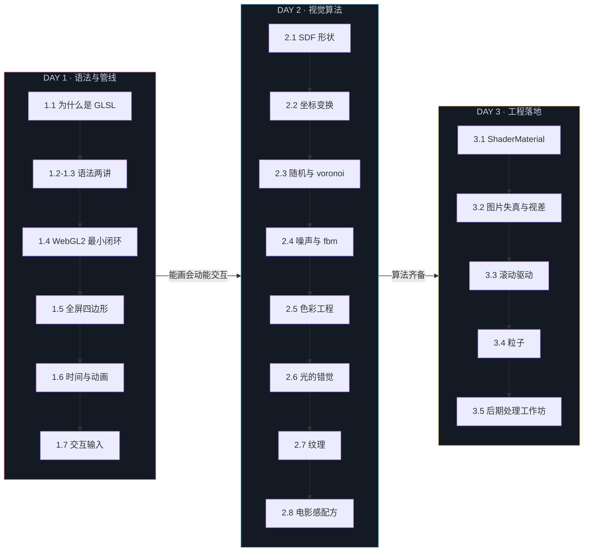

# GLSL 三天实战课程 · 制作总纲

> 本文档是「制作指令」，读者是负责生成课程内容的执行模型，不是学员。
> 所有课程文档面向同一位学员画像：五年经验的前端工程师。
> 每生成一个批次，先重读本文档的「写作风格指南」，再动笔；写完对照「批次自查清单」逐条核对。

---

## 0. 课程定位与读者画像

**学员画像**：五年前端。TypeScript / Vite / React 熟练，CSS 动画与设计系统有手感；图形学没有系统学过，Three.js 用过内置材质但没写过 shader。已经在同一知识库完成《WebGPU 三天实战课程》（原生 API + WGSL + TSL），对「管线、bind group、顶点缓冲」有肌肉记忆——这是本课最重要的先验，所有对照都从这里出发。

**课程终点**：三天后，学员能独立读懂 awwwards 获奖网站里 fragment shader 的每一行，能从零写出「SDF 形状 + 噪声流动 + 调色板 + 交互跟随 + 滚动驱动」级别的完整作品片段。对标层次：lusion.co、igloo.inc、orage.studio 的创意技术能力，不要求工程规模对等。

**一句话定位**：webgpu 课教「GPU 怎么工作」，本课教「GLSL 怎么画出东西」——视觉算法、动画、交互，以及把这套语言搬进 Three.js 工程的完整路径。

**先验课程**（同一知识库，讲义开头「理论对照」栏单向链接，不重复展开）：

| 课程 | 路径 | 本课何时引用 |
|------|------|------------|
| WebGPU 三天实战 | `learning/前端/webgpu/` | 1.1（GPU 架构、SIMT）、1.4（管线对象模型）、1.5（坐标空间）、3.1（框架桥接思想） |
| Three.js 创意 3D | `learning/前端/Threejs创意3D/课程笔记/` | 3.1–3.5（Three.js API 与场景管理） |
| GAMES101 图形学 | `learning/计算机图形学/GAMES101/` | 2.2（变换矩阵推导）、2.6（着色模型） |

> 引用规则：执行时先 `ls` 对应课程目录按笔记标题匹配最相关课次；链接写相对路径（如 `../../webgpu/讲义/day1-原生WebGPU基础/1.1-GPU架构与WebGPU全景.md`）。不确定就不硬链，改用文字说明出处。

---

## 1. 三天路线（能力主线）

**看得懂语法与管线（Day 1）→ 画得出画面（Day 2）→ 落得了工程（Day 3）**

Day 1 的四根支柱：**语法、管线、动画、交互**。创意网站的 shader 效果 = 视觉算法（Day 2/3）× 动画（时间）× 交互（用户输入）。Day 1 结束时四根支柱全部立起来，Day 2 专心做视觉算法，Day 3 负责工程落地。



**每天时刻表**（写进 `00-课程计划与学习地图.md`，学员按此推进）：

| 时段 | Day 1 | Day 2 | Day 3 |
|------|-------|-------|-------|
| 上午 · 讲义 | 1.1 → 1.4（约 3.5h） | 2.1 → 2.4（约 3.5h） | 3.1 → 3.2（约 3h） |
| 下午 · 讲义+demo | 1.5 → 1.7 + 全部 demo（约 3h） | 2.5 → 2.8 + 全部 demo（约 3h） | 3.3 → 3.5 + 全部 demo（约 3.5h） |
| 晚间 · 作业 | B 档 30min / A 档 60min | B 档 40min / A 档 60min | B 档 45min / A 档 75min |
| 晚间 · 加码 | C 档 90min（可留到 Day 2/3 补） | C 档 90min（可留到 Day 3 补） | C 档 2h（作品集级） |

**降级原则**（写进每天的作业 README）：时间不够就只做 B 档，第二天照样能跟上；C 档做不出来不要恋战，标记 TODO 隔天回来——它考察的是组合能力，不是意志力。

---

## 2. 完整目录树与生成批次

★ = 已由本计划书阶段完成，**不要改动，只需链接**；批次号 = 执行模型生成该文件的顺序。

```
GLSL_Shader/
├── README.md                          # 批7 · 课程门面：定位/三天路线/快速开始/目录导航/先验课程
├── 00-课程计划与学习地图.md             # 批7 · 先读：模块时刻表/mermaid 路线/作业递进图/结营标准
├── 01-环境准备.md                      # 批7 · WebGL2 浏览器支持表/十分钟环境检查/常见环境问题
├── 参考资料.md                        # 批7 · 按 _制作计划/04 底稿全文生成分层资源清单
├── 实例网站清单.md                     # 批7 · 按 _制作计划/04 底稿全文生成站点观察清单
├── _制作计划/                          # ★ 本目录：制作规格，学员不需要读
├── index.html                          # 批8 · 补全门户链接（地基已就位，替换占位行）
├── package.json                        # ★ 工程地基
├── vite.config.ts                      # ★
├── tsconfig.json                       # ★
├── .gitignore                          # ★
├── shared/
│   ├── chrome.ts                       # ★ WebGL2 外壳 + GLSL 编译错误面板 + pointer 交互桥
│   └── demo.css                        # ★ 色板与页面样式
├── 讲义/
│   ├── day1-GLSL语言与WebGL2管线/      # 批1 · 7 篇（1.1–1.7，见 01-day1-规格.md）
│   ├── day2-片段着色器视觉算法/         # 批3 · 8 篇（2.1–2.8，见 02-day2-规格.md）
│   └── day3-Three.js实战落地/          # 批5 · 5 篇（3.1–3.5，见 03-day3-规格.md）
├── demos/
│   ├── day1/01-渐变三角形/             # ★ 黄金样例：所有 demo 的结构范本
│   ├── day1/02-全屏四边形与UV/          # 批2
│   ├── day1/03-时间的画面/             # 批2
│   ├── day1/04-光标的追随/              # 批2
│   ├── day1/05-点击的涟漪/              # 批2
│   ├── day1/06-滚轮的浪潮/              # 批2
│   ├── day2/01-SDF动物园/              # 批4
│   ├── day2/02-voronoi细胞/            # 批4
│   ├── day2/03-fbm云海/               # 批4
│   ├── day2/04-域扭曲流场/              # 批4
│   ├── day2/05-调色板实验室/            # 批4
│   ├── day2/06-霓虹辉光与电影感/         # 批4
│   ├── day3/01-ShaderMaterial初见/     # 批6
│   ├── day3/02-hover失真图卡/           # 批6
│   └── day3/03-粒子星云与bloom/         # 批6
├── homework/
│   ├── day1/README.md                 # 批2 · 当天三档总览（考点表+mermaid 递进图）
│   ├── day1/basic-脉动的画布/           # 批2 · 骨架四件套
│   ├── day1/advanced-追光的萤火/         # 批2
│   ├── day1/challenge-极坐标曼陀罗/      # 批2
│   ├── day2/…（basic-SDF徽章/advanced-流动的丝绸/challenge-霓虹辉光艺术）# 批4
│   └── day3/…（basic-渐变海报平面/advanced-失真图卡墙/challenge-滚动驱动的英雄时刻）# 批6
├── solutions/                          # 与 homework 同构目录树，无 day 级 README
│   ├── day1/…                          # 批2 · 3 套参考答案
│   ├── day2/…                          # 批4
│   └── day3/…                          # 批6
└── assets/diagrams/                    # 深色底 SVG，规格见第 12 节
    ├── shader-pipeline.svg             # 批1
    ├── simt-parallel.svg               # 批1
    ├── glsl-data-flow.svg              # 批1
    ├── uv-coordinate.svg               # 批1
    ├── interaction-event-bridge.svg    # 批1
    ├── animation-easing.svg            # 批1
    ├── sdf-distance-field.svg          # 批3
    ├── noise-fbm-composition.svg       # 批3
    ├── domain-warping.svg              # 批3
    ├── palette-cosine.svg              # 批3
    ├── threejs-uniform-mapping.svg     # 批5
    └── postprocess-chain.svg           # 批5
```

**批次总表**：

| 批次 | 内容 | 自查重点 |
|------|------|---------|
| 批1 | Day1 讲义 7 篇 + SVG 6 张 | 六段式结构 / 编号交叉引用 / 禁用词 |
| 批2 | Day1 demo 5 个（02–06）+ 作业 3 套 + 答案 3 套 | 黄金样例结构 / TODO 编号 / 设计规格节 |
| 批3 | Day2 讲义 8 篇 + SVG 4 张 | 同批1 + 代码段可运行 |
| 批4 | Day2 demo 6 个 + 作业 3 套 + 答案 3 套 | 同批2 |
| 批5 | Day3 讲义 5 篇 + SVG 2 张 | Threejs创意3D 课程链接 / three 0.186 API |
| 批6 | Day3 demo 3 个 + 作业 3 套 + 答案 3 套 | 同批2 + Lenis/GSAP 引入方式 |
| 批7 | 根级文档 5 份（README/00/01/参考资料/实例网站清单） | 按 04 底稿 / 门户一致 |
| 批8 | 门户 index.html 补全 + `e:\ObsidianPart\LLM_Wiki\index.md` 登记 + `log.md` 追加 | 链接全部可达 / SCHEMA 合规 |

**每批完成后统一动作**：`grep` 检查禁用词（见第 6 节）→ 检查所有内部链接路径真实存在 → 在 `_制作计划/PROGRESS.md` 追加一行「批N 完成 · 日期」。

---

## 3. 视觉规范

### 3.1 色板（本课程专属，与 webgpu 课的蓝紫区分）

| 用途 | 色值 | 说明 |
|------|------|------|
| 底色 | `#0B0E14` | 与 webgpu 课程家族一致，画布 clearValue 同值 (0.043, 0.055, 0.078) |
| 主强调 | `#FF4D6D` 玫红 | GLSL 课程的「签名色」：chrome 角标、demo 主题渐变起点 |
| 辅强调 | `#4CC9F0` 天青 | 主题渐变终点、次级高亮 |
| 点缀 | `#FFC145` 琥珀 | challenge 档、警示强调 |
| mermaid 节点 | fill `#141a24`，stroke 分别用三强调色 | 全课程 mermaid 统一 |

demo 的主题渐变默认「玫红 → 天青」；Day 2 调色板实验室除外（它本身是色彩课）。每个 demo 的「视觉规格」节必须给出实际使用的色值。

### 3.2 页面骨架（shared/chrome.ts 已实现，demo 三行接入）

```ts
import '../../../shared/demo.css';
import { createChrome, initGL, createProgram } from '../../../shared/chrome.ts';

const chrome = createChrome({
  day: 1, index: '02', title: 'FULLSCREEN QUAD',
  tags: ['WEBGL2', 'GLSL', 'UV'],
  hint: '移动鼠标：画面随光标轻微流动',
});
```

- 四角标注：左上 `DAY N · 编号 — 标题`、右上技术标签、左下中文操作提示、右下 FPS·分辨率
- 800ms 入场淡入；DPR 上限 2；错误面板接住一切未捕获报错
- `initGL(chrome)` 返回 `WebGL2RenderingContext | null`，失败自动给中文指引
- `createProgram(gl, vsSrc, fsSrc)` 编译链接，**GLSL 编译错误会带行号显示在错误面板**——这是本课第一教学设施
- `chrome.pointer`：交互状态桥（`x/y` 像素坐标 + `sx/sy` lerp 平滑坐标 + `isDown` + `wheel` 累积量 + `clicks` 时间戳数组），每帧自动刷新，demo 直接读

### 3.3 文字与排版约定（文档侧）

- 正文中文，技术名词保留英文：fragment、varying、swizzle、SDF、fbm 不翻译
- 代码块标注语言：`glsl` / `ts` / `bash`
- 数字与英文术语两侧留半角空格（如「约 60 分钟」「step() 函数」）
- 标题层级：文档 H1 唯一，小节 H2，再往下 H3；不跳级

---

## 4. 设计质量标准（awwwards 对标，每个可运行页面强制执行）

这六条是 demo / homework / solution 的验收线，不是「加分项」：

1. **每个可运行页面都有完整「视觉规格」节**（README 内）：色彩系统（主/辅/点缀/背景，精确 hex）、构图一句话（三分法 / 中心聚焦 / 黄金分割，任选其一说明）、动效规格（缓动函数名+参数、周期秒、幅度百分比、层次延迟）、细节清单（grain / 暗角 / 辉光 / 微交互——按效果勾选）。
2. **页面骨架完整**：shader 画布为 hero + 四角标注 + 800ms 入场淡入；challenge 作业在画布外另配页头（诗意中文标题 + 英文小标 + 一句副标题文案），观感对标「一个页面讲完一个作品」。
3. **交互手感**：所有鼠标 / 滚动输入必须过 lerp 平滑（`chrome.pointer.sx/sy`），阻尼系数写进视觉规格；禁止生硬跟随——这是 awwwards 级与 demo 级的分水岭。
4. **动效曲线**：呼吸 / 脉动类统一给缓动与周期参数（如 `sin` 呼吸、周期 3s、幅度 8%）；涟漪 / 转场类给持续时间与曲线。
5. **微文案**：demo 用中文诗意命名（「时间的画面」而非「time demo」）+ 大写英文角标；操作提示一句中文；错误面板文案可读、可行动。
6. **性能红线**：60fps、DPR ≤ 2、单 pass 优先；违反需在 README 说明理由。

---

## 5. GLSL 语法约定（全课程统一，违反即返工）

> 适用范围：本节适用于**原生 WebGL2 部分**（Day 1–2 的全部 demo / 作业 / 答案）。Day 3 的 Three.js ShaderMaterial 走 three 注入的 GLSL1 方言——不写 `#version`、不声明 precision、用 `varying` / `gl_FragColor` / `texture2D`（讲义 3.1 的风格对照表是唯一标准），属设计选择而非违反；`u_` / `v_` 前缀与 uniform 数量纪律两边通用。

- **版本**：GLSL ES 3.00，两个着色器文件第一行必须是 `#version 300 es`（之前不允许有任何字符，包括注释与空行）
- **片元输出**：声明 `out vec4 fragColor;` 于 main 之外（GLSL ES 3.00 无 gl_FragColor）
- **顶点输入**：`in`（GLSL ES 3.00 中 attribute/varying 关键字已废弃，`in`/`out` 取代）
- **命名前缀**：uniform 用 `u_`、attribute 用 `a_`、varying（顶点 out ↔ 片元 in）用 `v_`、常量用大写 SNAKE_CASE、函数 camelCase
- **精度**：片元着色器顶部写 `precision highp float;`（WebGL2 中 int 默认 highp，float 必须显式声明）
- **文件组织**：每个着色器一个 `.glsl` 文件，放 `shaders/` 子目录，`?raw` 导入：`import fsSource from './shaders/fragment.glsl?raw'`
- **注释语言**：GLSL 内注释用中文，讲「为什么」不讲「是什么」
- **uniform 数量纪律**：单 demo 的 uniform 控制在 8 个以内；超过说明该拆函数或用 vec 打包（如 `u_mouse` 用 vec2 不用两个 float）

---

## 6. 写作风格指南（反 AI 味，最高优先级）

### 6.1 禁用词表（生成后 grep 自查，命中即改写）

「首先 / 其次 / 再次 / 最后（作段落开头时）/ 总而言之 / 综上所述 / 值得注意的是 / 值得一提的是 / 让我们 / 我们一起来 / 在本节中 / 在本章中 / 相信通过 / 不难发现 / 众所周知 / 简而言之 / 总的来说 / 希望本文 / 本文将介绍 / 接下来我们将」

### 6.2 句式规则

- **先结论后论证**：每段第一句就是这段的结论，论证跟在后面；不铺垫、不设悬念（导语除外）
- **第二人称直接对话**：「你会」「你写」「你的」，像资深同事在旁边结对编程
- **有观点、有取舍**：写「这一步 90% 的场景用 smoothstep，别纠结」而不是「有多种方法可以选择」
- **金句收束**：每篇讲义至少一处可被单独摘抄的判断句（参照 webgpu 课的「纸就是命令缓冲」），如「uniform 是广播，varying 是插值」「hash 是 shader 世界的 Math.random()，但每一帧都一致」
- **表格优先于段落**：对比、清单、报错、参数，能用表格不用列表，能用列表不用长段落

### 6.3 比喻库（面向五年前端的知识锚点，讲义中主动使用）

| GLSL 概念 | 前端锚点 |
|-----------|---------|
| fragment shader | 对每个像素执行的 `map` 回调 |
| uniform | 组件 props——每次渲染统一广播 |
| varying / 插值 | 父组件传给子组件的 props，中间连续取值 |
| 着色器编译 | tsc 编译——同样的报错文化（行号、类型错误） |
| getShaderInfoLog | tsc 的 stderr，但是 GPU 方言 |
| draw call | 一次 setState 触发的整棵子树 re-render |
| gl_FragCoord / u_resolution | getBoundingClientRect 归一化 |
| lerp 平滑 | CSS transition 之于直接赋值 |
| rAF 帧循环 | React 的渲染循环，但你要自己写 |
| SDF | 一个返回「离形状多远」的 TypeScript 函数，负值在形状内 |
| hash21 | 每帧结果一致的 Math.random() |
| domain warping | 给坐标先过一道「扰动函数」再采样，相当于先处理数据再渲染 |

### 6.4 代码呈现规则

- 代码块注释讲**为什么**（Why this way），不讲**是什么**（What is this）
- 前向 / 后向引用讲义编号：`// 讲义 2.4 会解释为什么这里要乘 0.5`
- 行数当论证材料：「demo 03 的 fragment 只有 41 行，其中一半在处理坐标」
- 每个完整代码段可直接运行：不省略 `#version`、precision、out 声明

---

## 7. 讲义模板（六段式，与 webgpu 课程同构）

文件名：`讲义/dayN-目录/序号-标题.md`（如 `1.4-原生WebGL2最小闭环.md`）

```markdown
# N.M 讲义标题（问题式或断言式）

> Day N · 模块 M · 约 XX 分钟
> 理论对照：《课程名》第 X 章「章节名」——一句话说明本篇与它的分工

导语：两三句。第一句真实网站案例或上一模块的悬念钩子；最后一句预告本模块讲什么。

## Why：本模块存在的理由（或融入具象标题的概念段）

## What：核心概念 2–4 段（标题用问题式/断言式，多用表格与图示）


## How：demo XX 逐段精讲（对照配套 demo 代码逐段拆解，固定节）

## 常见坑（表格：症状 | 原因，5–6 行，全部来自真实易错点）

## Checkpoint（4–5 条「能说出 / 能解释 / 能复述 / 能写出」的能力自测）

## 相关材料（demo 路径 + 图路径 + 前情讲义编号 + 延伸阅读 URL）
```

**图示讲解模式**：先放图 →「对着图从左到右过一遍数据流」→ 点出图里最值得盯住的一条线。

**长度纪律**：每篇 250–400 行。超过 400 行说明该拆两篇，低于 200 行说明没讲透。

---

## 8. demo 模板（四件套，结构照抄黄金样例 `demos/day1/01-渐变三角形/`）

```
demos/dayN/NN-名称/
├── README.md     # 五段式：对应讲义 → 运行 → 关键点（4条，每条含设计决策+后向引用）→ 视觉规格 → 常见报错表
├── index.html    # 照抄黄金样例，只改 <title>
├── main.ts       # 60–120 行；接入 chrome；代码分段注释与讲义 How 段一一对应
└── shaders/
    ├── vertex.glsl
    └── fragment.glsl
```

README「视觉规格」节模板（按第 4 节六条标准填写）：

```markdown
## 视觉规格
- 色板：玫红 `#FF4D6D` → 天青 `#4CC9F0`，中心聚焦构图
- 动效：噪声流动周期 6s（流速 0.15），光标半径 12% 缓动跟随（阻尼 0.08）
- 细节：grain ±2%、暗角 18%、入场 800ms 淡入
- 性能：单 pass、DPR ≤ 2，预计 60fps（M 级 GPU）
```

---

## 9. homework / solution 模板（B/A/C 三档，照抄 webgpu 课程挖空哲学）

**day 级 README**（`homework/dayN/README.md`）：
- 开篇骨架哲学说明：页面/初始化/帧循环全部就位，学习点以 `TODO(dayN-x-N)` 统一格式留空——打开页面，错误面板会告诉你第一件事做什么
- 三档总览表：档（B/A/C）× 目录 × 考点 × 前置讲义 × 参考时长（30/60/90 分钟，day3 为 45/75/120 分钟）
- mermaid 递进图（B → A → C，三强调色描边）+ 递进逻辑一段：A 的什么是 C 的什么的前置；「时间不够就只做 B」
- 「为什么是这三题」一段：每题一句话说明它对标真实网站的哪个模式

**作业 README**（每套固定六段）：

```markdown
# 作业 X · 中文名
## 目标        # 一段话：视觉目标 + 技术考点
## 前置讲义    # 讲义编号 + 该讲哪个知识点是本题主线
## 任务清单    # 编号列表，每条 = TODO(dayN-x-N) + 文件 + 位置 + 做什么；执行顺序说明
## 验收标准    # 3–5 条可观察标准（含设计质量条款：lerp 手感/动效参数）+ 加分项
## 提示        # <details> 三档折叠：第一档·思路 → 第二档·API 名 → 第三档·伪代码
```

**骨架 main.ts 挖空规则**：
- 文件头注释：「对应讲义 X.Y」+ 任务概述
- 脚手架段落用 `---- XXX（脚手架，无需改动）----` 分隔
- TODO 形态：TS 里 `throw new Error('TODO(day1-basic-1) 未完成：见 README')`；GLSL 里注释标记 + 说明「画面停在上一完成态」
- 预埋教学性报错：让未完成时错误面板出现可读指引

**solution 四段式**：`## 运行` → `## 实现要点`（按任务编号讲关键算法取舍）→ `## 与骨架的差异`（逐 TODO 列改动，其余逐字一致）→ `## 视觉规格`（把答案当设计交付物描述：色板十六进制、动效周期、阻尼系数）。

---

## 10. 交互与动画的统一约定（全课程的技术底座）

**事件桥模式**（讲义 1.6/1.7 讲透，后续所有 demo 默认使用）：

```
用户输入（pointermove / down / up / wheel / click / touch）
   → chrome.pointer 状态对象（每帧刷新：raw 坐标 / lerp 平滑坐标 / isDown / wheel 累积 / click 时间戳）
   → 每帧写入 uniform（u_mouse / u_scroll / u_click_time…）
   → shader 内响应
```

- **lerp 默认阻尼**：`smooth += (raw - smooth) * 0.08`（60fps 下约 0.5s 收敛），demo 可调但需写进视觉规格
- **时间约定**：`u_time` 单位秒（不是毫秒），`performance.now() / 1000`
- **缓动函数库**：讲义 1.6 给出 GLSL 实现（`easeInOutCubic / easeOutElastic / easeOutBack`），后续讲义直接引用不重复实现
- **滚动**：Day 1–2 不做滚动（单屏画布），Day 3 引入 `u_scroll`（0–1 归一化进度）+ Lenis 平滑滚动

---

## 11. 黄金样例与参照系

- **demo 结构范本**：`demos/day1/01-渐变三角形/`（四件套齐全、chrome 接入方式、视觉规格节写法、GLSL 注释风格）
- **讲义风格范本**：webgpu 课 `讲义/day1-原生WebGPU基础/1.1-GPU架构与WebGPU全景.md`（六段式、图示讲解、表格密度、口吻）——写作前先通读一遍找语感
- **作业范本**：webgpu 课 `homework/day1/README.md` + `basic-呼吸的渐变/README.md`

---

## 12. SVG 图示规格（12 张，`assets/diagrams/`）

统一风格：底 `#0B0E14`、画布 900×520（流程图）/ 720×520（概念图）、字体 monospace 13px、文字 `#C8D0DE`、三强调色描边（玫红主数据流 / 天青辅助 / 琥珀警示）、节点圆角 6、连线 2px。每张图要求：无光栅素材、文字不小于 12px、双击可读（讲义引用时 alt 写完整文字描述版）。

| 文件 | 讲义 | 内容要点 |
|------|------|---------|
| shader-pipeline.svg | 1.1 | 顶点着色器 → 图元装配 → 光栅化 → 片元着色器 → 输出合并 五阶段横向流水线，标注每阶段输入输出 |
| simt-parallel.svg | 1.1 | 一个 fragment 程序被数百万线程并行的示意：同一指令、不同坐标 |
| glsl-data-flow.svg | 1.4 | attribute / uniform / varying 三条数据通路汇入片元的接线图 |
| uv-coordinate.svg | 1.5 | 屏幕像素坐标 → 归一化 UV (0–1) → 居中坐标系 (-1–1) 三种坐标域 |
| interaction-event-bridge.svg | 1.7 | 浏览器事件 → JS 状态对象 → uniform → shader 响应 全链路 |
| animation-easing.svg | 1.6 | 线性 / smoothstep / cubic / elastic 四条缓动曲线并列对比 |
| sdf-distance-field.svg | 2.1 | 圆的 SDF 等值线图：负值在形状内、边界为零、正值在外 |
| noise-fbm-composition.svg | 2.4 | value noise 单倍频 → 多倍频叠加 → fbm 的灰度演变三联图 |
| domain-warping.svg | 2.4 | 规则网格坐标 → 加扰动 → 采样结果的「前后对比」双联图 |
| palette-cosine.svg | 2.5 | 余弦调色板公式与 a/b/c/d 四参数各自改变什么的四条色带 |
| threejs-uniform-mapping.svg | 3.1 | Three.js 内置注入（projectionMatrix 等）与自定义 uniform 的映射表图形化 |
| postprocess-chain.svg | 3.5 | 场景渲染 → render target → bloom pass → 合成 → 屏幕 的后期链 |

---

## 13. 验收总标准（全部批次完成后逐条核对）

1. **结构**：目录树与第 2 节完全一致；每个 demo/作业/solution 四件套齐全；讲义 20 篇（7+8+5）
2. **交叉引用**：讲义编号引用（如「见 1.6」）全部指向真实存在的文件；demo README「对应讲义」双向可达
3. **风格**：禁用词 grep 零命中；每篇讲义有 Checkpoint；每个可运行页 README 有视觉规格节
4. **可运行**：每个 demo 的 main.ts + shaders 可直接 `npm run dev` 打开；GLSL 语法约定（第 5 节）零违反
5. **设计质量**：第 4 节六条逐 demo 核对，challenge 作业有完整页头
6. **先验链接**：理论对照栏指向 webgpu / Threejs创意3D / GAMES101 的路径全部真实存在
7. **知识库合规**：`index.md` Learning 节有本课条目；`log.md` 有完整生成记录（中文）
