# Day 1 作业 · 三档实战

三份骨架共用课程的视觉外壳：页面结构、WebGL2 初始化、全屏四边形几何、帧循环全部就位，学习点以 `TODO(day1-x-N)` 的统一格式留空。TS 侧未完成的任务会在帧循环里 throw，错误面板自动接住并提示你按 README 任务清单补全后刷新；GLSL 侧无法 throw，挖空处是保守占位——改一段、刷新一次，画面逐段点亮。做完 B 档再看 A 档，你会发现自己已经会了一半。

时间紧就只做 B 档：30 分钟，hero 背景的全部要素都在里面。

## 三档总览

| 档 | 目录 | 考点 | 前置讲义 | 参考时长 |
|----|------|------|---------|---------|
| B | [basic-脉动的画布](./basic-脉动的画布/) | uniform 三件套（u_time / u_colorA / u_colorB）、居中等比坐标域、mix + sin 呼吸、vignette | 1.5、1.6 | 30 min |
| A | [advanced-追光的萤火](./advanced-追光的萤火/) | 事件桥全链路：chrome.pointer 打包、双坐标域换算、距离场 glow、easeOutBack 回弹、帧差速度向量 | 1.7（1.5、1.6 是弹药） | 60 min |
| C | [challenge-极坐标曼陀罗](./challenge-极坐标曼陀罗/) | 极坐标换算、N 重对称折叠、花瓣 SDF、呼吸与扰动、点击波包推瓣、challenge 页头 | 1.5–1.7 全部 | 90 min |

```mermaid
graph LR
    B["B · 脉动的画布<br/>uniform 时间"] --> A["A · 追光的萤火<br/>时间 + 交互双输入"] --> C["C · 极坐标曼陀罗<br/>全要素合成"]
    style B fill:#141a24,stroke:#FF4D6D,stroke-width:2px
    style A fill:#141a24,stroke:#4CC9F0,stroke-width:2px
    style C fill:#141a24,stroke:#FFC145,stroke-width:2px
```

递进逻辑一句话：B 的 uniform 时间，是 A 的「时间 + 交互双输入」的前置；A 的居中等比坐标域，是 C 的极坐标换算的前置。C 做完，Day 1 三讲的全部考点都过了一遍手。

## 为什么是这三题

- **B · 脉动的画布**对标全屏渐变 hero 背景——每个品牌站首页都有的那块会呼吸的底图，本题把它压成「一个三角形几何 + 三个 uniform」的最小单元。
- **A · 追光的萤火**对标 hover 光晕跟随——awwwards 获奖站的标准交互件：光点永远慢半拍、按压有回弹、拖动有形变。
- **C · 极坐标曼陀罗**对标极坐标图案背景——igloo、lusion 首页那类数学花纹铺满全屏的 hero 纹理，极坐标 + 对称折叠就是它的全部秘密。

## 目录说明

- 运行：`npm run dev` 后访问 `http://localhost:5174/homework/day1/<目录名>/index.html`。
- TODO 编号：`TODO(day1-basic-1)` 里的 basic / adv / ch 对应三档目录，编号与各作业 README 的任务清单一一对应。
- 提示的使用纪律：每题 README 末尾的三档 `
` 折叠，卡住 15 分钟再打开下一档；直接看第三档伪代码，这道题就白做了。
- 对答案：作业页右下角的「答案参考 ↗」一键直达对页（答案页同样能一键返回）；`solutions/day1/` 下的四段式 README 讲清每处取舍，「与骨架的差异」逐 TODO 对照，方便你精确定位自己漏了什么。
