# Day 2 作业 · 三档实战

三份骨架同 Day 1 的挖空哲学，但层次升了一档：`main.ts` 全部是脚手架，挖空集中在 `fragment.glsl`——Day 2 的学习点全在「每个像素的颜色怎么算」。GLSL 无法 throw，骨架的占位是「透传上一层」或「保守回退」：补全一段、刷新一次，画面逐段点亮；每题 README 的任务清单就是点亮顺序。

时间紧就只做 B 档：SDF 徽章是 C 档前景构图的最小零件，40 分钟把这颗零件的所有加工手法过一遍手。

## 三档总览

| 档 | 目录 | 考点 | 前置讲义 | 参考时长 |
|----|------|------|---------|---------|
| B | [basic-SDF徽章](./basic-SDF徽章/) | SDF 圆角方 + 描边通道 + 呼吸 + fwidth 抗锯齿 | 2.1 | 40 min |
| A | [advanced-流动的丝绸](./advanced-流动的丝绸/) | fbm + domain warping + 调色板 + 流速动画 | 2.4、2.5 | 60 min |
| C | [challenge-霓虹辉光艺术](./challenge-霓虹辉光艺术/) | SDF 组合场景 + 法线 + 双层 glow + 电影感配方（作品集级） | 2.1、2.6、2.8 全部 | 90 min |

```mermaid
graph LR
    B["B · SDF徽章<br/>单个形状"] --> A["A · 流动的丝绸<br/>连续噪声场"] --> C["C · 霓虹辉光艺术<br/>三层合成"]
    style B fill:#141a24,stroke:#FF4D6D,stroke-width:2px
    style A fill:#141a24,stroke:#4CC9F0,stroke-width:2px
    style C fill:#141a24,stroke:#FFC145,stroke-width:2px
```

递进逻辑一句话：B 的 SDF 是 C 的场景零件；A 的 warp 流动是 C 的背景层——C 档把两题当零件装进三层结构（背景 / 前景 / 收尾），再补上光感与配方。

## 为什么是这三题

- **B · SDF 徽章**对标徽章 / logo 的 shader 化——hover 按钮与卡片光晕的内核，圆角、描边、抗锯齿三件套一次过手。
- **A · 流动的丝绸**对标 lusion 式丝绸背景——几乎每个获奖站都有的那层「呼吸的底」，噪声塔三层的完整走通。
- **C · 霓虹辉光艺术**对标霓虹 hero 完整作品——iyO、赛博类站点的核心画面：构图、光感、辉光、收尾一条龙。

## 目录说明

- 运行：`npm run dev` 后访问 `http://localhost:5174/homework/day2/<目录名>/index.html`。
- TODO 编号：`TODO(day2-basic-N / day2-adv-N / day2-ch-N)` 与各作业 README 任务清单一一对应；A 档任务 5 与 C 档任务 6 各有一个 TS 半边，位置在 `main.ts` 里有标记。
- 提示纪律：三档 `
` 卡住 15 分钟再开下一档；直接看第三档，这题就白做了。
- 对答案：`solutions/day2/` 同构目录，四段式 README 讲清每处取舍——B 档「描边恒宽靠 fwidth 不靠写死」、A 档「占位透传」、C 档「背景对比度让给前景」。
