# Day 2 作业 · 三档实战

三份骨架同 Day 1 的挖空哲学，但层次升了一档：`main.ts` 全部是脚手架，挖空集中在 `fragment.glsl`——Day 2 的学习点全在「每个像素的颜色怎么算」。GLSL 无法 throw，骨架的占位是「透传上一层」或「保守回退」：补全一段、刷新一次，画面逐段点亮；每题 README 的任务清单就是点亮顺序。

时间紧就只做 B 档：全息卡面把 SDF 填充、描边、呼吸的加工手法一次过手，40 分钟掌握 C 档前景零件的全部工艺。

## 三档总览

| 档 | 目录 | 考点 | 前置讲义 | 参考时长 |
|----|------|------|---------|---------|
| B | [basic-全息卡面](./basic-全息卡面/) | sdBox 圆角化 + fwidth 填充 + 二次 SDF 恒宽描边 + 呼吸 + 全息流光 | 2.1 | 40 min |
| A | [advanced-墨纹大理石](./advanced-墨纹大理石/) | value noise 四步 + fbm + domain warping + 调色板 + gamma + 搅水交互 | 2.4、2.5 | 60 min |
| C | [challenge-深海回响](./challenge-深海回响/) | SDF 布尔组合（smin）+ 法线光照 + 双层 glow + 深海雪背景 + 配方卡（作品集级） | 2.1、2.6、2.8 全部 | 90 min |

```mermaid
graph LR
    B["B · 全息卡面<br/>单个形状"] --> A["A · 墨纹大理石<br/>连续噪声场"] --> C["C · 深海回响<br/>三层合成"]
    style B fill:#141a24,stroke:#FF4D6D,stroke-width:2px
    style A fill:#141a24,stroke:#4CC9F0,stroke-width:2px
    style C fill:#141a24,stroke:#FFC145,stroke-width:2px
```

递进逻辑一句话：B 的 SDF 是 C 的场景零件；A 的 warp 流动是 C 的背景层——C 档把两题当零件装进三层结构（背景 / 前景 / 收尾），再补上光感与配方。

## 为什么是这三题

- **B · 全息卡面**对标全息收藏卡的 shader 化——售价 999 的全息 foil 内核件：圆角、描边、抗锯齿、流光四件套一次过手。
- **A · 墨纹大理石**对标 suminagashi 墨纹背景——获奖站里那层「会呼吸的纸」：噪声塔三层完整走通，宣纸上墨、墨分五色。
- **C · 深海回响**对标深海 / 科考类 hero 完整作品——声呐环、深潜灯、海雪慢沉：构图、光感、辉光、收尾一条龙。

## 目录说明

- 运行：`npm run dev` 后访问 `http://localhost:5174/homework/day2/<目录名>/index.html`。
- TODO 编号：`TODO(day2-basic-N / day2-adv-N / day2-ch-N)` 与各作业 README 任务清单一一对应；A 档任务 5 与 C 档任务 6 各有一个 TS 半边，位置在 `main.ts` 里有标记。
- 提示纪律：三档 `
` 卡住 15 分钟再开下一档；直接看第三档，这题就白做了。
- 对答案：作业页右下角「答案参考 ↗」直达对页（答案页可一键返回）；`solutions/day2/` 同构目录，四段式 README 讲清每处取舍——B 档「描边恒宽靠 fwidth 不靠写死」、A 档「占位透传」、C 档「背景对比度让给前景」。
