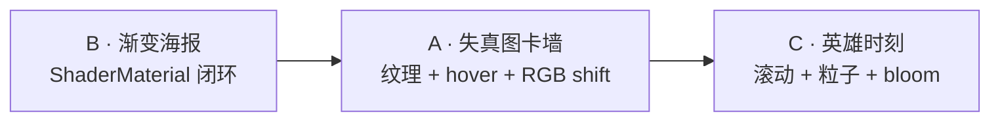

# Day 3 作业 —— Three.js 实战落地

> 三档任选起点：B 是迁移热身（约 45 min），A 对标获奖站图卡墙（约 75 min），C 是三天课程的毕业作品（约 120 min）。做完对 [solutions/day3](../../solutions/day3/)。

## 三档总览

| 档 | 目录 | 考点 | 前置讲义 | 参考时长 |
|----|------|------|---------|---------|
| B | [basic-渐变海报平面](./basic-渐变海报平面/) | ShaderMaterial 最小闭环 + u_time 呼吸 | [3.1](../../讲义/day3-Three.js实战落地/3.1-ShaderMaterial：从原生到Three.js的迁移.md) | 45 min |
| A | [advanced-失真图卡墙](./advanced-失真图卡墙/) | 纹理失真 + hover 状态机 + RGB shift + 视差 | [3.2](../../讲义/day3-Three.js实战落地/3.2-图片失真与鼠标视差.md) | 75 min |
| C | [challenge-滚动驱动的英雄时刻](./challenge-滚动驱动的英雄时刻/) | u_scroll + Lenis + 转场遮罩 + 粒子聚合 | [3.3](../../讲义/day3-Three.js实战落地/3.3-滚动驱动shader：u_scroll、Lenis与转场遮罩.md)、[3.4](../../讲义/day3-Three.js实战落地/3.4-粒子场：Points、gl_PointSize与噪声粒子场.md) | 120 min |

## 为什么是这三题

- **B**：不迁移完就无法开始 3.2 之后的一切——ShaderMaterial 最小闭环是 Day 3 的入场券。
- **A**：图卡墙是获奖站 portfolios 的标配模块，3.2 的全部考点（纹理、失真、hover、RGB shift、视差）落进一个组件。
- **C**：滚动叙事 + 粒子 hero，对标 Shopify Editions / iyO 的核心段落——三天课程的毕业作品。

## 递进关系

## 完成方式

- 骨架可以跑但画面不对（占位状态）——这正是起点：每补一个 TODO 刷新一次，看见变化再往下走。
- TODO 编号规则 `TODO(day3-basic-1)` / `TODO(day3-adv-3)` / `TODO(day3-ch-6)`，全局搜索即可定位。
- 卡住 15 分钟再打开 README 提示区的下一档（思路 → API → 伪代码）。
- 完成后对照 `solutions/day3/` 的同名答案复盘（作业页右下角「答案参考 ↗」直达，答案页可一键返回）：重点看 JS 侧状态机与 shader 侧纯函数的分工。

## 硬约束（三天课程的收口纪律）

1. three addons 路径一律 `three/addons/...`；
2. ShaderMaterial 内不写 `#version`，attribute 用内置 `position / uv`，矩阵用内置注入；
3. Lenis 包名是 `lenis`，GSAP 只用 core；
4. 图片资源放各自目录 `public/`（骨架已备占位图），不引外部图床；
5. 图卡 hover 用 DOM 事件（或等价的数学矩形判定），raycaster 属于《Threejs 创意 3D》的领地。
