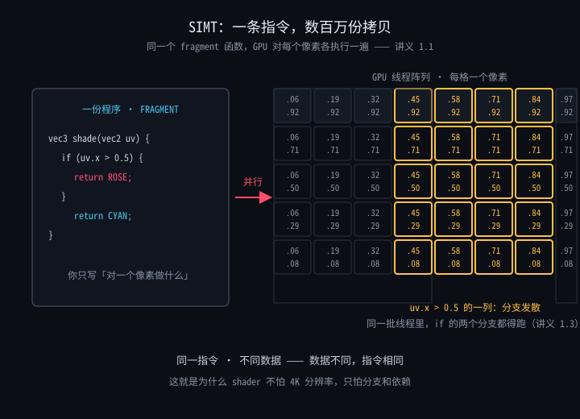

# 1.1 为什么前端要学 GLSL：创意网站的另一半引擎

> Day 1 · 模块 1 · 约 45 分钟
> 理论对照：《WebGPU 三天实战课程》1.1「GPU 架构与 WebGPU 全景」——硬件与 SIMT 部分不重复，本篇只讲语言层（[1.1-GPU架构与WebGPU全景.md](../../../webgpu/讲义/day1-原生WebGPU基础/1.1-GPU架构与WebGPU全景.md)）

打开 [orage.studio](https://orage.studio) 的首页：一整面网格，每个格子里是被 shader 实时遮罩的视频，鼠标划过时格子像被拨动的乐器逐一震颤。这个效果拆开看只有两半——前一半是 Three.js 管场景、相机和交互，后一半全是 GLSL：遮罩、色彩、扭曲、流动，都发生在那几段几十行的着色器代码里。这一模块回答一个问题：这门语言是什么、跑在哪、你能拿它做什么，以及为什么它值得一个五年前端的下一个 90 小时。

## GLSL 到底是什么

GLSL（OpenGL Shading Language）是一门跑在 GPU 上的小型强类型语言。它和 JavaScript 最根本的差异不在语法，而在**执行位点**：JS 在 CPU 上被引擎解释执行，GLSL 被编译后烧进 GPU 的渲染管线，在两个固定位置被成千上万个线程同时执行。

| 执行位点 | 语言形态 | 执行次数 | 职责 |
|---------|---------|---------|------|
| 顶点着色器 vertex shader | 函数，输入一个顶点 | 每个顶点一次 | 算出顶点在屏幕上的位置 |
| 片元着色器 fragment shader | 函数，输入一个像素 | 每个像素一次（可能几十万次） | 算出这个像素是什么颜色 |

把 fragment shader 理解成「对每个像素执行的 `map` 回调」，你的心智模型就立住了：

```ts
// 伪代码：一次 draw call 在 GPU 上发生的事
pixels.map((pixel) => shade(pixel, time, mouse)) // shade 就是你的 fragment shader
```

区别只有一个：这个 `map` 不是引擎调度的，是 GPU 上几百万个线程**同时**执行的。你在 webgpu 课的 1.1 里见过 SIMT 的硬件原理，这里补一张语言视角的图——左边是你写的那份程序，右边是同时执行它的线程阵列：



对着图盯住一件事：你写的代码只有一份，但执行它的拷贝有几百万份。所以 GLSL 里没有「某个像素」的概念——**你写的不是「对某像素做什么」，而是「对一个像素做什么」**。这句话是整个 fragment shader 编程的地基，后面每一天你都在用它。

## 你已经在 WGSL 里见过它的影子

你在 webgpu 课写过 WGSL，那门语言的类型系统、管线思维、in/out 数据流，和 GLSL 是同一个思想的两门方言。对照表放这里，之后每次遇到语法差异回来查：

| 概念 | WGSL（你写过的） | GLSL ES 3.00（本课的） |
|------|-----------------|----------------------|
| 顶点输入 | `@location(0) pos: vec2f` | `layout(location = 0) in vec2 a_position;` |
| 片元输出 | `@location(0) fragColor` | 自己声明 `out vec4 fragColor;` |
| uniform | `var<uniform> time: f32` | `uniform float u_time;` |
| 坐标内建 | `@builtin(position)` | `gl_FragCoord` |
| 采样纹理 | `textureSample(tex, samp, uv)` | `texture(tex, uv)` |
| 精度声明 | 每个变量标 `f32/i32/u32` | 文件顶部 `precision highp float;` 一次声明 |

结论很直接：**你学的是同一套思维，换一门方言**。本课不重复讲管线原理（对象模型、bind group、渲染 pass 在 webgpu 1.2 与 1.3 已讲透），所有精力都花在「用这门语言画出东西」上。

## 创意网站用 GLSL 在做什么

你逛过的那些让你停在页面上的网站，它们的「氛围」九成来自 fragment shader。四类典型用途，每一类你在实例清单里都能找到对应站点：

| 用途 | 画面特征 | 典型站点 | 本课哪一天拿下它 |
|------|---------|---------|----------------|
| 全屏背景流动 | 噪声驱动的缓慢流场，像液体或云 | [igloo.inc](https://igloo.inc) | Day 2（2.4 噪声与 fbm） |
| 图片 hover 失真 | 鼠标划过时图片局部扭曲、RGB 错位 | [lusion.co](https://lusion.co) | Day 3（3.2） |
| 滚动转场 | 滚动驱动 shader 进度，画面被遮罩推开 | [orage.studio](https://orage.studio) | Day 3（3.3） |
| 粒子成型 | 几万颗粒子从混乱聚成 logo 或文字 | [activetheory.net](https://activetheory.net) | Day 3（3.4） |

注意共同点：这些效果的「前端工程」部分都不难——一个 canvas、一个 render loop、几个事件监听，你都写过一百遍。难的是 shader 里那几十行视觉算法，而这正是本课三天要交付给你的能力。

## 为什么是 WebGL2 而不是 WebGPU

2026 年，创意网站的主流运行时仍是 WebGL2，原因有三：Three.js 的默认渲染器、成熟材质生态、以及全球浏览器的兼容覆盖率——WebGPU 在 Safari 和部分移动端仍有落空场景。创意工作室交付作品时不会为一个 shader demo 放弃 Safari 用户。

所以本课的语言是 GLSL ES 3.00（WebGL2 的 shader 方言），API 是 WebGL2。你在 webgpu 课学的知识不会浪费——管线哲学是通的，而且 Day 3 会告诉你 WebGPURenderer 与 TSL 如何把这套 GLSL 思维搬回 WebGPU。

GLSL ES 3.00 与桌面版 GLSL 的关系一句话带过：前者是后者的精简子集（去掉部分动态特性，强制声明精度），本课只碰 ES 3.00，所有写法在 WebGL2 与 Three.js 的 ShaderMaterial 里通用。

## How：跑通本课程的第一个页面

先看全景——一次 draw call 在 GPU 上流过的五个阶段，可编程的只有头尾两个：


对着图从左到右过一遍：顶点着色器只跑 3 次（三角形只有三个顶点），光栅化把三角形切成了几万个片元，片元着色器对每个片元跑一遍你的代码。**你的 GLSL 代码 95% 写在片元阶段，成本也几乎全在片元阶段**——这是后面所有性能讨论的前提。

现在跑起来：

```bash
cd learning/前端/GLSL_Shader
npm install
npm run dev
```

打开 `demos/day1/01-渐变三角形/`，你会看到深色画布上一枚玫红到天青的渐变三角形，随时间轻微呼吸，随鼠标偏移色相。它的 `main.ts` 一共 74 行，分五段，每段一个职责——这张表是全课程所有 demo 的骨架图：

| 段落 | 代码 | 职责 |
|------|------|------|
| chrome 接入 | `createChrome({ day: 1, index: '01', title: 'GRADIENT TRIANGLE', ... })` | 画布四角标注、入场淡入、错误面板——课程的教学外壳 |
| GL 初始化 | `const gl = initGL(chrome)` | 拿到 WebGL2 上下文，失败自动给出中文指引 |
| 程序编译 | `createProgram(gl, vsSource, fsSource, chrome)` | 编译链接两段 GLSL，报错带行号直达页面 |
| 几何与 uniform | `bufferData` / `getUniformLocation` | 喂顶点数据，拿到 uniform 的「地址」 |
| 帧循环 | `chrome.startLoop((now) => { ... })` | 每帧写 uniform、清屏、`drawArrays` |

这 74 行里你今天只需要读懂结构，1.4 会逐段拆到每一行为止。动笔改点什么：把 `fragment.glsl` 里的 `0.06 * sin(u_time * 0.8)` 改成 `0.2 * sin(u_time * 3.0)`，保存——呼吸会变快变猛，错误面板与热更新的体验就是你未来三天的工作流。

## 常见坑

| 症状 | 原因 |
|------|------|
| `npm run dev` 报 module 找不到 | 没装依赖。clone 后必须先 `npm install`，Vite 的依赖都在 node_modules 里 |
| 页面白屏，控制台报 `Failed to load module script` | 直接双击 index.html 用 file:// 协议打开。ES module 在 file:// 下被浏览器拦截，必须走 dev server |
| 画布区域灰屏，错误面板提示 WebGL2 不可用 | 浏览器禁用了硬件加速。Chrome/Edge 检查「设置 → 系统 → 使用硬件加速」，Firefox 检查 `webgl.disabled` 配置 |
| 换浏览器或换机器后 dev server 起不来 | 显卡驱动进了浏览器黑名单（老核显常见）。换 Chrome 或更新驱动；虚拟机里大概率没有 GPU 直通 |
| 改了 shader 画面没变化 | `?raw` 导入的热更新对 .glsl 文件部分场景失效，手动刷新页面即可 |

## Checkpoint

- 能说出顶点/片元着色器各自的执行次数与职责——「3 次对几十万次」这个量级差能复述
- 能列出 GLSL 与 WGSL 的至少三处语法对应（in/out ↔ @location、uniform 声明、gl_FragCoord ↔ @builtin(position)）
- 能说出创意网站 GLSL 的四类用途，并各对应一个真实站点
- 能解释「你写的不是对某像素做什么，而是对一个像素做什么」
- 能跑通 demo 01 并说出 main.ts 五段各自干什么

## 相关材料

- 配套 demo：[demos/day1/01-渐变三角形](../../demos/day1/01-渐变三角形/)（全课程结构范本，之后每个 demo 都长这样）
- 先验讲义：[WebGPU 1.1「GPU 架构与 WebGPU 全景」](../../../webgpu/讲义/day1-原生WebGPU基础/1.1-GPU架构与WebGPU全景.md)——SIMT 硬件原理在本篇只借结论，推导在那里
- 延伸阅读：[The Book of Shaders 前言](https://thebookofshaders.com/00/)——本课 Day 2 的噪声体系与它同源，它是免费的，但按创意工作者的方式写；本课按前端工程师的方式写，两条路最后会合
- 下一讲：[1.2 类型与变量](1.2-类型与变量.md)——GLSL 的世界观是「向量优先」
