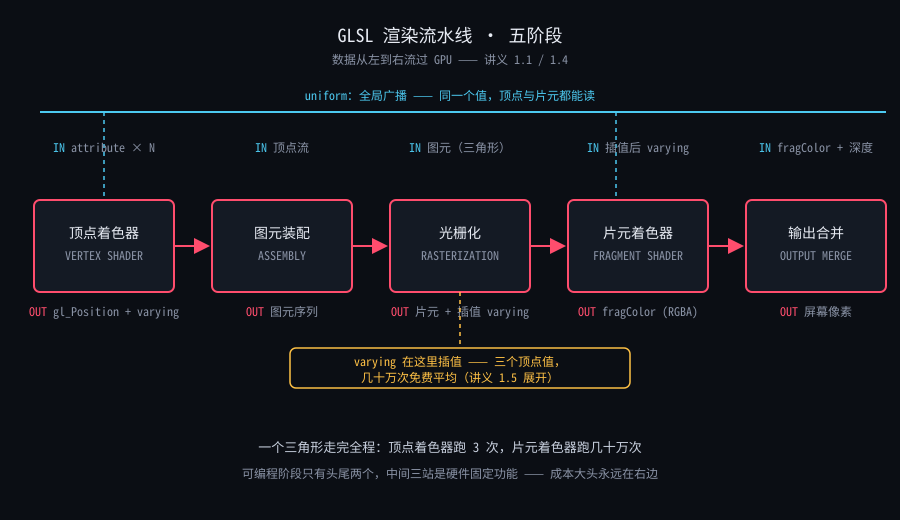

# 1.4 原生 WebGL2 最小闭环：从 canvas 到渐变三角形

> Day 1 · 模块 4 · 约 60 分钟
> 理论对照：《WebGPU 三天实战课程》1.2「对象模型与初始化」+ 1.3「渲染管线全解」——对象名不同，生命周期哲学同构（[1.2-WebGPU对象模型与初始化.md](../../../webgpu/讲义/day1-原生WebGPU基础/1.2-WebGPU对象模型与初始化.md)、[1.3-第一个三角形：渲染管线全解.md](../../../webgpu/讲义/day1-原生WebGPU基础/1.3-第一个三角形：渲染管线全解.md)）

WebGPU 课里你写过 device → pipeline → pass 的仪式代码，每帧录制命令再提交。WebGL2 的仪式是另一套：**编译–链接**——把两段 GLSL 字符串当场编译成着色器对象，链接成一个 program，然后数据进、画出去。这套仪式比 WebGPU 多了一样你在那边没见过的东西：**着色器编译错误**。WebGPU 的 shader module 编译出错要等 validation 才暴露；WebGL2 的 `compileShader` 是同步的，错在当下、报在当下，行号直达。它将成为你整个学习期打交道最频繁的对象——所以本篇把「读报错」当正式教学内容，而不是脚注。

本篇的任务清单只有一条主线：从空的 `canvas` 元素出发，经过五个对象，到达屏幕上的渐变三角形。讲完主线，How 节把 demo 01 的 `main.ts` 逐段精讲——**它是全课程所有 demo 的结构范本**，之后每个 demo 都是这张骨架的变体。

## 五个对象，一条流水账

WebGL2 的最小闭环由五个对象接力：

```
canvas
  │  getContext('webgl2')
  ▼
WebGL2RenderingContext（gl）—— 一切调用的起点
  │
  ├─① createShader ×2 ──② compileShader（编译两段 GLSL）
  │           │
  │           ▼
  │      ③ createProgram ── linkProgram（链接成一个程序）
  │
  ├─④ createVertexArray + createBuffer（VAO 管布局，VBO 管数据）
  ▼
⑤ drawArrays —— go 按钮，三角形上屏
```

五个对象各司其职，与渲染管线阶段的对应关系在 1.1 的全景图里画过，这里再放一次——**注意 JS 侧对象与 GL 侧阶段是一一对应的**：



写过 WebGPU 的话，这张流水账可以逐行翻译。对照表放这里，之后遇到「这东西在 WebGL2 里叫什么」就回来查：

| WebGPU（1.2 / 1.3 课） | WebGL2 | 差异要点 |
|------------------------|--------|----------|
| `requestAdapter()` → `requestDevice()` | `canvas.getContext('webgl2')` | 设备对象 vs 上下文对象：WebGPU 的 device 跨 canvas，WebGL2 的 gl 绑死一个 canvas |
| `device.createShaderModule()` | `createShader` + `compileShader` ×2 | WebGPU 异步编译、报错走 compilationInfo；WebGL2 同步编译、报错立刻可读 |
| `device.createRenderPipeline()` | `createProgram` + `linkProgram` | WebGPU 管线是聚合体（含顶点布局、混合状态）；WebGL2 的 program 只管着色器，其余状态是散装 API |
| 录制 command encoder → `queue.submit()` | 每帧直接调 `drawArrays` | **WebGPU 是录制-提交，WebGL2 是直接调用**——没有命令缓冲这一层 |
| 管线的 `buffers` 字段声明顶点布局 | VAO + `vertexAttribPointer` | 布局信息的位置不同：一个在管线里，一个在 VAO 里 |

**金句：WebGPU 是录制后提交，WebGL2 是当场执行——对象少一半，仪式感不少一克。**

## 编译与链接：GLSL 的 tsc

把编译链接的完整仪式手写一遍——不是让你以后每次手写（chrome.ts 已封装），而是**手写过一遍才记得住每个环节在做什么**。编译一段着色器固定五步：

```ts
function compile(gl: WebGL2RenderingContext, type: number, source: string): WebGLShader {
  const shader = gl.createShader(type)!;  // ① 造壳：VERTEX_SHADER 或 FRAGMENT_SHADER
  gl.shaderSource(shader, source);        // ② 挂源码（字符串，此时还不编译）
  gl.compileShader(shader);               // ③ 编译——同步执行，错了立刻知道
  if (!gl.getShaderParameter(shader, gl.COMPILE_STATUS)) {  // ④ 查状态
    throw new Error(gl.getShaderInfoLog(shader));           // ⑤ 失败才读日志
  }
  return shader;
}
```

链接是同样的五拍节奏：

```ts
const program = gl.createProgram()!;
gl.attachShader(program, vs);   // 顶点着色器挂上
gl.attachShader(program, fs);   // 片元着色器挂上
gl.linkProgram(program);        // 链接：把两个阶段焊在一起
if (!gl.getProgramParameter(program, gl.LINK_STATUS)) {
  throw new Error(gl.getProgramInfoLog(program));
}
```

编译查 `COMPILE_STATUS`，链接查 `LINK_STATUS`——**两个状态都要显式查询，GL 不会主动告诉你失败**。这就是坑表里「getShaderInfoLog 空串 ≠ 成功」的由来：日志只在失败时有内容，成功与否的唯一依据是状态位。

chrome.ts 里的 `createProgram` 就是上面两段的生产版，外加两个教学设计：编译/链接失败时通过 `chrome.fail()` 把日志投递到页面错误面板（你不需要开 DevTools 就能读报错），以及链接成功后 `deleteShader` 释放着色器壳（program 已持有编译产物，壳可以扔）。**本课程所有 demo 的报错体验都来自这个封装**——用的时候记得里面发生的就是这十步。

### 读一条真实的报错

`getShaderInfoLog` 的输出长这样（Chrome / ANGLE 风格）：

```
ERROR: 0:7: 'float' : syntax error
```

三段式拆解：`ERROR` 固定前缀；`0:7` 里第一个数字是着色器编号（单段着色器编译时恒为 0），**第二个数字是 .glsl 源文件内的行号**；最后是错误描述。两个最常见的实操要点：

- **行号属于 shader 源文件，与 main.ts 无关。** shader 是作为独立字符串传给 GPU 编译的，`0:7` 就是 .glsl 文件的第 7 行——把 `?raw` 导入的源文件打开，直接跳到那一行。
- 报错描述经常言简意赅到冷酷：`syntax error` 不告诉你是哪种错。经验法则：第 7 行看不出问题时，**检查第 6 行结尾**——少个分号、少个小数点，报错往往落在下一行。

链接错误没有行号（它发生在两个文件之间），典型输出是 varying 对不上：`vertex 的 out 'v_color' 与 fragment 的 in 类型/名字不一致`。这就是 1.2 说的「接头暗号」——两边必须逐字相同。

**金句：getShaderInfoLog 是你在 GPU 世界里的第一条栈追踪——学会读它，后面三天你已经赢了一半。**

## VAO 与 VBO：顶点数据的行李箱

顶点数据入场的两个对象，分工用行李箱类比一次说清：**VBO 是行李箱本身**（一整块显存里的 Float32Array），**VAO 是行李箱的收纳清单**（这块数据怎么读：哪个偏移是位置、哪个偏移是颜色、每个顶点占多少字节）。

demo 01 的几何是 interleaved 布局——位置和颜色逐顶点交错存放，每个顶点 5 个 float：

```
一个顶点 = 5 个 float = 20 字节：

[  x  |  y  |  r  |  g  |  b  ]
  0-3   4-7   8-11  12-15 16-19   ← 字节偏移
└a_position┘
 (loc 0, size 2)
             └──a_color──┘
              (loc 1, size 3, offset 8)

stride = 20：读完一个顶点后，跳过 20 字节找下一个顶点的开头
```

对应的 JS 代码（下一节逐行精讲，这里先看骨架）：

```ts
const vao = gl.createVertexArray()!;
gl.bindVertexArray(vao);              // 布局清单开始记录
const vbo = gl.createBuffer()!;
gl.bindBuffer(gl.ARRAY_BUFFER, vbo);  // 行李箱绑上传送带
gl.bufferData(gl.ARRAY_BUFFER, vertices, gl.STATIC_DRAW);  // 装箱：数据进显存

gl.enableVertexAttribArray(0);
gl.vertexAttribPointer(0, 2, gl.FLOAT, false, 20, 0);   // 位置：offset 0
gl.enableVertexAttribArray(1);
gl.vertexAttribPointer(1, 3, gl.FLOAT, false, 20, 8);   // 颜色：offset 8
```

`vertexAttribPointer` 六个参数是这一节的全部难点，逐个过：`0` 是 attribute 的 location（下一节细讲）；`2` 是每个元素几个分量（vec2 就是 2）；`gl.FLOAT` 是分量类型；`false` 是不做归一化（整数数据才需要）；`20` 是 stride——相邻两个顶点的起点间隔；`8` 是本属性在顶点内的字节偏移。**记住一条：stride 与 offset 的单位都是字节**，`gl.FLOAT` 占 4 字节，所以 vec2 + vec3 = 20 字节，颜色从第 8 字节开始。

与 WebGPU 课 1.5 的 bufferLayout 对照着看，两个世界在说同一件事：

| WebGL2 | WebGPU（1.5 课） | 对应关系 |
|--------|------------------|----------|
| `vertexAttribPointer(loc, 2, FLOAT, false, 20, 0)` | `attributes: [{ shaderLocation: 0, offset: 0, format: 'float32x2' }]` | location ↔ shaderLocation；size+type ↔ format；offset 就是 offset |
| 第六参 `20`（stride） | `arrayStride: 20` | 顶点跨度，单位同为字节 |
| `enableVertexAttribArray(0)` | attributes 数组里声明即生效 | WebGL2 要显式启用，WebGPU 不需要 |
| `bindVertexArray(vao)` 后 draw | pipeline 绑定时自动生效 | 布局生效的时机不同 |

**金句：VAO 记得怎么读行李箱，VBO 是行李箱本身——一个管布局，一个管数据，别再混为一谈。**

## attribute 与 location：顶点输入的地址

上一节的 `vertexAttribPointer(0, ...)` 里那个 `0`，是顶点属性的**端口号**。GLSL 侧的声明（vertex.glsl 第 3 行）：

```glsl
layout(location = 0) in vec2 a_position;  // 0 号端口进 vec2
layout(location = 1) in vec3 a_color;     // 1 号端口进 vec3
```

JS 侧的接线（`enableVertexAttribArray(0)`、`vertexAttribPointer(0, ...)`）与 GLSL 侧的 `location = 0` 靠同一个数字对上——**GLSL 里声明端口，JS 里往端口接数据，两边必须写同一个号**。

不写 `layout(location = ...)` 也可以，编译器会自动分配，JS 侧用 `gl.getAttribLocation(program, 'a_position')` 查询实际端口号。但课程约定**全部手写 location**，理由有二：省一次查询调用，代码里少一层间接；示教更清晰——讲义、demo、错误排查里的「0 号端口」永远是 0 号，不会因编译器心情变化。WebGPU 课的 `shaderLocation: 0` 也是手写的，习惯直接平移过来。

**金句：location 是顶点属性的端口号——GLSL 声明，JS 接线，同一个数字两边对上。**

## drawArrays：go 按钮

一切对象就位后，`gl.drawArrays(gl.TRIANGLES, 0, 3)` 是唯一让 GPU 干活的调用。第一个参数选图元类型——**同一份数据，图元不同，画出来的东西完全不同**：

| 常量 | 图元 | 顶点消费方式 | 课程用途 |
|------|------|--------------|----------|
| `gl.TRIANGLES` | 独立三角形 | 每 3 个顶点一组 | 常规几何（本 demo） |
| `gl.TRIANGLE_STRIP` | 三角形条带 | 相邻 3 个顶点连环成面 | 全屏四边形（1.5 起的主角） |
| `gl.LINES` | 线段 | 每 2 个顶点一条 | 调试线框 |
| `gl.POINTS` | 点 | 每 1 个顶点画一个点 | 点精灵粒子（Day 2） |

本课程全部 demo 只用 TRIANGLES 与 TRIANGLE_STRIP 两种：普通几何用前者，1.5 的全屏四边形用后者（4 个顶点画满 2 个三角形，比 TRIANGLES 的 6 个顶点省三分之一）。第二、三个参数是起始索引与顶点个数——**count 是顶点数不是字节数**，三个顶点传 `3`，传 `60`（20 字节 × 3）是新手高频错误。

**金句：前面四个对象都是搭台，drawArrays 是唯一的开唱——每帧一嗓子。**

## How：demo 01 的 main.ts 逐段精讲

全文件 74 行，六段。每段都标注它在 WebGPU 课里的对应物——学完这一节，你应该能对着任何一张 GLSL 课程的 demo 说出「哪几行是仪式、哪几行是本课正题」。

### 第 1 段：导入与页面骨架（1–18 行）

```ts
import '../../../shared/demo.css';
import { createChrome, initGL, createProgram } from '../../../shared/chrome.ts';
import vsSource from './shaders/vertex.glsl?raw';
import fsSource from './shaders/fragment.glsl?raw';

const chrome = createChrome({
  day: 1,
  index: '01',
  title: 'GRADIENT TRIANGLE',
  tags: ['WEBGL2', 'GLSL'],
  hint: '移动鼠标：渐变随之轻微扰动',
});
```

`?raw` 是 Vite 的原样导入：**整个 .glsl 文件作为字符串进 JS**——这正是 `#version` 必须是文件第一行的原因之一，字符串头尾任何多余内容都会进编译器。chrome 负责「画框与报错面板」这些非教学内容，与 WebGPU 课共用同一套。

### 第 2 段：拿上下文（20–22 行）

```ts
const gl = initGL(chrome);
if (!gl) throw new Error('WebGL2 初始化失败，详情见页面错误面板');
```

对应 WebGPU 课的 `requestAdapter + requestDevice`。initGL 内部就是 `canvas.getContext('webgl2')`，失败（硬件加速被关是最常见原因）直接投递错误面板——**上下文为 null 是每个 WebGL 教程的第一课，这里被封装成了一行**。

### 第 3 段：编译与链接（24–26 行）

```ts
const program = createProgram(gl, vsSource, fsSource, chrome);
if (!program) throw new Error('着色器编译失败，详情见页面错误面板');
```

上一节手写的十步仪式，生产环境里就是这一行。编译错误直达页面错误面板，带 .glsl 行号。对应 WebGPU 课的 `createShaderModule + createRenderPipeline`。

### 第 4 段：几何——interleaved 数据与 VAO/VBO（28–48 行）

```ts
const vertices = new Float32Array([
  //  x      y      r      g      b
    0.00,  0.42,  1.000, 0.302, 0.427, // 顶部 · 玫红
   -0.38, -0.26,  0.298, 0.624, 0.941, // 左下 · 天青
    0.38, -0.26,  0.508, 0.464, 0.686, // 右下 · 双色各半
]);

const vao = gl.createVertexArray()!;
gl.bindVertexArray(vao);
const vbo = gl.createBuffer()!;
gl.bindBuffer(gl.ARRAY_BUFFER, vbo);
gl.bufferData(gl.ARRAY_BUFFER, vertices, gl.STATIC_DRAW);

gl.enableVertexAttribArray(0);
gl.vertexAttribPointer(0, 2, gl.FLOAT, false, 20, 0);
gl.enableVertexAttribArray(1);
gl.vertexAttribPointer(1, 3, gl.FLOAT, false, 20, 8);
```

三个顶点、五种属性逐个读：坐标是 NDC（-1 到 1，原点居中），颜色是 0–1 浮点（右下顶点 0.508/0.464 是玫红与天青的中间值，让三角形底边的插值过渡更自然）。VAO/VBO 的分工与 stride/offset 的读法见前两节。对应 WebGPU 课 1.5 的 `createBuffer + writeBuffer` 与 bufferLayout。

### 第 5 段：uniform 地址簿（50–53 行）

```ts
const uTime = gl.getUniformLocation(program, 'u_time');
const uMouse = gl.getUniformLocation(program, 'u_mouse');
const uAspect = gl.getUniformLocation(program, 'u_aspect');
```

uniform 与 attribute 的接线方式不同：attribute 靠 location 端口号，**uniform 靠名字查询地址**（WebGPU 课的 bindGroup 是「声明式打包」，WebGL2 是「逐个查地址」——这是两套 API 哲学差异最大的地方）。查询结果在链接后有效，返回 null 说明名字拼错或该 uniform 被编译器优化掉了（shader 里没用它）。1.6 与 1.7 会真正往这些地址里喂数据。

### 第 6 段：帧循环（55–74 行）

```ts
const start = performance.now();
chrome.startLoop((now) => {
  const t = (now - start) / 1000; // 秒，不是毫秒

  gl.viewport(0, 0, chrome.width, chrome.height);

  gl.useProgram(program);
  gl.uniform1f(uTime, t);
  gl.uniform2f(uMouse, chrome.pointer.sx, chrome.pointer.sy);
  gl.uniform1f(uAspect, chrome.width / chrome.height);

  gl.clearColor(0.043, 0.055, 0.078, 1.0);
  gl.clear(gl.COLOR_BUFFER_BIT);

  gl.drawArrays(gl.TRIANGLES, 0, 3);
});
```

每帧五件事，顺序固定：算时间（毫秒转秒，GLSL 世界的时间单位是秒）、设 viewport（画布尺寸可能随时被 ResizeObserver 改变，所以每帧设置）、绑 program 后上传三个 uniform（不绑 program 的上传是静默无效的——坑表见）、清屏（清屏色 0.043/0.055/0.078 就是 CSS 底色 `#0B0E14` 的浮点形式，画布与画框无缝）、draw。对应 WebGPU 课 1.3 的「录制 renderPass → submit」，这里的等价物就是从 viewport 到 draw 的五连发，直接执行，无命令缓冲。

对比 WebGPU 课你会发现一个消失的角色：**pass 上下文没了**。WebGL2 没有 beginPass/endPass，整个 canvas 就是一张「默认帧缓冲」，viewport、clear、draw 都是全局状态机的直接调用。状态机的代价是状态会残留——本课靠「每帧全部重设」来规避，这也是每帧五件事都要重做的原因。

## 常见坑

| 症状 | 原因 |
|------|------|
| `#version 300 es` 前有空行或注释，部分驱动报错指向第 1 行 | 规范允许空白与注释在前，但老驱动在此翻脸不认人。课程纪律：`?raw` 导入的文件第一行就是 `#version`，头部什么都别加 |
| uniform 上传无效，画面纹丝不动 | 忘了 `useProgram`。uniform 是 program 的属性，不绑 program 的上传被静默丢弃 |
| 黑屏 + 控制台警告 no buffer bound | VAO 未 bind 就 draw。`bindVertexArray` 必须先于 `drawArrays` |
| 编译失败但 getShaderInfoLog 返回空串 | 空串 ≠ 成功。判断成败唯一依据是 `getShaderParameter(shader, gl.COMPILE_STATUS)`，失败才读日志 |
| `getContext('webgl2')` 返回 null | 硬件加速被关闭（最常见）或驱动被浏览器拉黑。initGL 已投递带修复指引的错误面板 |
| `getUniformLocation` 返回 null 后继续上传 | 名字拼错或 uniform 被优化掉。上传给 null 地址是静默无效，不报错 |
| `drawArrays(gl.TRIANGLES, 0, 60)` 画出一堆乱面 | count 是顶点个数不是字节数。三个顶点传 `3` |
| 每帧 uniform 只在第一帧生效，之后不动 | 上传写在了帧循环外。时间类 uniform 必须每帧上传（第 6 段的 `uniform1f` 在循环里） |

## Checkpoint

- 能默写编译五步与链接五步（createShader → shaderSource → compileShader → 查 COMPILE_STATUS → 读 InfoLog，以及 attach ×2 → linkProgram → 查 LINK_STATUS）
- 给你一条真实报错 `ERROR: 0:12: 'position' : undeclared identifier`，能说出 12 是哪个文件的行号（shader 源文件内，与 main.ts 无关），以及下一步去哪看
- 能说出 VAO 与 VBO 各自管什么，并解释 `vertexAttribPointer(0, 2, gl.FLOAT, false, 20, 8)` 里 20 和 8 的含义
- 能解释课程为什么手写 `layout(location = 0)` 而不是用 getAttribLocation 查询
- 能对照四个图元说出 TRIANGLE_STRIP 与 TRIANGLES 的取舍（4 顶点 vs 6 顶点画四边形）
- 能对着 main.ts 六段说出每段的职责，以及「每帧五件事」为什么每帧都要做

## 相关材料

- 配套 demo：[demos/day1/01-渐变三角形](../../demos/day1/01-渐变三角形/)（本讲 How 节的精讲对象，全课程 demo 的结构范本）
- 权威教程：[WebGL2 Fundamentals 中文版](https://webgl2fundamentals.org/webgl/lessons/zh_cn/)——「WebGL2 基础概念」与「GLSL 着色器」两章与本讲一一对应，本讲提到的所有 API 都有交互式示例
- 理论对照：[WebGPU 1.2「对象模型与初始化」](../../../webgpu/讲义/day1-原生WebGPU基础/1.2-WebGPU对象模型与初始化.md)——device/pipeline 仪式与编译-链接仪式的同构对照
- 理论对照：[WebGPU 1.5「顶点缓冲与几何数据」](../../../webgpu/讲义/day1-原生WebGPU基础/1.5-顶点缓冲与几何数据.md)——bufferLayout 与 vertexAttribPointer 的逐参数对照
- 全景图出处：[1.1 为什么前端要学 GLSL](1.1-为什么前端要学GLSL.md)——shader-pipeline.svg 的首次出场与管线阶段精讲
- 下一讲：[1.5 数据流与全屏四边形](1.5-数据流与全屏四边形.md)——varying 插值登场，全屏四边形把 fragment shader 变成你的画布
