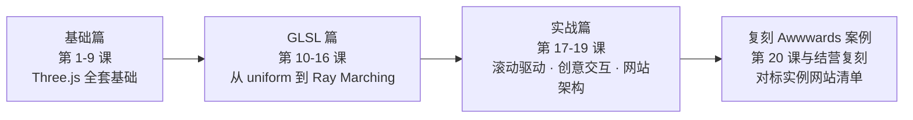

# 00 · 学习地图

README 管这门课是什么，这份地图管你现在走到哪、接下来去哪。每次课后花一分钟更新状态列，迷茫的时候就回来看这张表。

## 20 课模块表

| 周 | 课 | 主题 | 状态 | 等级 |
|----|-----|------|------|------|
| 1 | 1 | Three.js 项目架构 | 已完成 | L1 |
| 1 | 2 | 几何体与图元 | 已完成 | L1 |
| 1 | 3 | 材质系统 | 已完成 | L1 |
| 1 | 4 | 灯光与阴影 | 已完成 | L1 |
| 1 | 5 | 相机与控制 | 已完成 | L2 |
| 2 | 6 | 纹理与贴图 | 已完成 | L2 |
| 2 | 7 | 场景图与变换 | 已完成 | L2 |
| 2 | 8 | 模型加载 | 已完成 | L2 |
| 2 | 9 | 动画系统 | 已完成 | L2 |
| 2 | 10 | GLSL 基础 | 已完成 | L3 |
| 3 | 11 | GLSL 数学函数 | 已完成 | L3 |
| 3 | 12 | 噪声函数 | 已完成 | L3 |
| 3 | 13 | 高级 Shader 效果 | 未开始 | L3 |
| 3 | 14 | 后处理效果 | 未开始 | L3 |
| 3 | 15 | 粒子系统 | 未开始 | L4 |
| 4 | 16 | Ray Marching 与 SDF | 未开始 | L4 |
| 4 | 17 | 滚动驱动动画 | 未开始 | L4 |
| 4 | 18 | 创意交互 | 未开始 | L4 |
| 5 | 19 | 网站架构设计 | 未开始 | L4 |
| 5 | 20 | 性能调优与部署 | 未开始 | L4 |

进度汇总：**12 / 20 已完成**（2026-07-06 至 2026-08-31，课程评分平均 9.5/10）。逐课的问答记录、费曼讲解与评分明细见《学习进度跟踪》。

## 五级路径当前位置

| 等级 | 状态 | 对应课次 |
|------|------|---------|
| L1 零基础 | 已完成 | 第 1-4 课（场景/相机/渲染器/灯光/材质基础） |
| L2 能做 demo | 已完成 | 第 5-9 课（相机控制、纹理、场景图、模型加载、动画） |
| L3 能做项目 | **进行中** | 第 10-12 课已完成，第 13-14 课待上 |
| L4 能做特效创意 | 待开始 | 第 15-20 课 |
| L5 能做技术指导 | 超出本课程范围 | 通向《WebGPU 三天实战课程》（`../webgpu/`） |

**当前位置：L3 进行中。** 依据 12 课完成的实际内容：自定义 ShaderMaterial 与 GLSL 数学基础已随第 10-12 课建立，L3 的其余核心能力（高级 Shader 效果、后处理链）对应第 13-14 课，上完即收口。

注：《学习进度跟踪》五级表的等级状态停留在课程早期的标注（「L1 已完成、进入 L2」），未随第 10-12 课更新；本表按已上课次的能力覆盖标注，两处不一致时以本表为准。

## 课程路线图

三篇的分工与 README 的定位一致：基础篇解决「能画出并控制一个 3D 场景」，GLSL 篇解决「效果由我自己写」，实战篇解决「拼成一个能上线的作品」。正在 GLSL 篇中段。

## 结营标准

总标准即五级路径的 L4 通关标准：**能复刻一个 Awwwards 获奖网站的核心 3D 效果。** 落到三条可检验的关卡：

1. **独立写一个带自定义 shader 的场景**——不抄笔记，从空的 ShaderMaterial 起步写出顶点与片元着色器，并接入光照或后处理（对应第 10-14 课）。
2. **做一个滚动驱动的多屏页面**——DOM 内容与 WebGL 舞台同步，至少三屏，滚动接管相机或元素动画（对应第 17 课）。
3. **复刻实例网站清单里一站的核心效果**——按「技术同构」原则拆一个画面出来做，不必像素级还原（对应第 17-19 课与《实例网站清单》）。

## 结营之后

三条路都开放，顺序随意：

1. **完整复刻一站**：从《实例网站清单》挑一个气质对味的站，复刻它的整段招牌效果而不只是核心一帧。
2. **进 WebGPU 课程**：《WebGPU 三天实战课程》（`../webgpu/`），搞清楚 Three.js 替你屏蔽了什么（渲染管线、绑定组、compute shader）。
3. **做一个整合项目**：把 20 课的技术——自定义 shader、粒子、滚动驱动、物理、架构——融进一个属于你自己的作品，部署上线。
