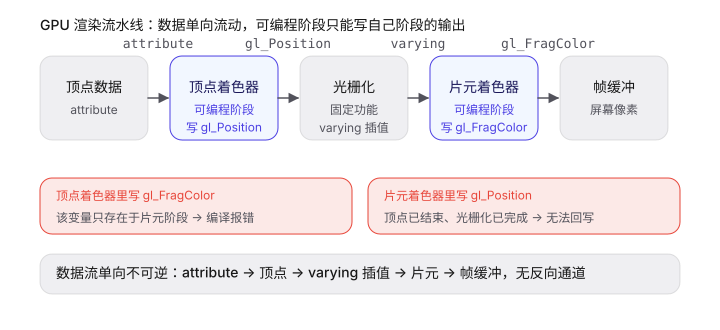

# 第10课-GLSL基础

> 日期：2026-08-05
> 状态：进行中
> 评分：待定

---

## 课程内容

### 学习目标
1. 理解 Vertex Shader / Fragment Shader 的结构和执行流程
2. 掌握 `gl_Position` / `gl_FragColor` 的作用
3. 区分 `uniform` / `varying` / `attribute` 三种变量类型
4. 理解 `ShaderMaterial` vs `RawShaderMaterial` 的区别
5. 掌握坐标系变换（模型→世界→观察→裁剪）

---

## 核心概念

### 0. GLSL 基础语法（前置）

GLSL 是 C 风格的着色语言，写法和 JS/TS 略有不同。先认识最常用的"零件"。

**标量（单个值）**：
| 类型 | 说明 | 示例 |
|------|------|------|
| `int` | 整数 | `int a = 1;` |
| `float` | 浮点数（带小数） | `float f = 1.0;` |
| `bool` | 布尔值 | `bool ok = true;` |

**向量（一组数）**：
| 类型 | 分量个数 | 用处 |
|------|----------|------|
| `vec2` | 2 个 | UV 坐标 |
| `vec3` | 3 个 | position、normal、RGB 颜色 |
| `vec4` | 4 个 | 齐次坐标、RGBA 颜色 |

访问向量分量，可以用 `xyzw`（当坐标用）或 `rgba`（当颜色用），写法等价：
```glsl
vec4 pos   = vec4(1.0, 2.0, 3.0, 1.0);
float pz   = pos.z;      // 看坐标用 xyzw
vec4 color = vec4(0.5, 0.0, 1.0, 1.0);
float g    = color.g;    // 看颜色用 rgba
```

**矩阵**：
- `mat2` / `mat3` / `mat4` 是 2×2 / 3×3 / 4×4 矩阵
- 本课常用 `mat4`：`projectionMatrix`、`modelViewMatrix` 都是 4×4 变换矩阵

**构造向量**：
- `vec4(1.0)` → 四个分量全是 `1.0`（注意写 `1.0`，不能写 `1`）
- `vec4(vec3(p), 1.0)` → 用 3 维向量 + 1 个标量拼成 4 维向量

### 1. 顶点 Vertex

顶点就是 **3D 空间里的一个点**，是所有几何体的最小积木。

- 三角形 = 3 个顶点 + 3 条边
- 球体 = 成百上千个顶点拼成的网格（只有点，没有面）
- 类比：顶点像乐高的小积木，一个模型是一堆积木搭出来的


### 2. 顶点随身携带的数据（每顶点一份）

每个顶点不只"在哪"，还随身带着几样数据，就像每个学生一张信息卡：

| 数据 | 类型 | 通俗解释 |
|------|------|----------|
| `position` | vec3 | 这个点在哪（模型的坐标） |
| `normal` | vec3 | 这个点的"朝向"——从点垂直向外伸出的方向。光照靠它判断明暗：朝光就亮，背光就暗 |
| `uv` | vec2 | 这个点对应贴图上的位置。贴图是一张 2D 图片，uv 用 0~1 表示"在图片的哪个位置"，像地图的经纬度 |

关键：这三样**每个顶点都不一样**，叫 `attribute`。Three.js 从几何体自动传进来，顶点着色器直接读。

### 3. 数据怎么在着色器之间传递

着色器之间靠三种"通道"传数据，方向是**单一的**：

| 通道 | 通俗解释 | 每份给谁 |
|------|----------|----------|
| `attribute` | 每个顶点自己的信息卡 | 每个顶点一份，顶点着色器读 |
| `uniform` | 全班共用的黑板（时间、矩阵等），JS 写一次 | 所有顶点/像素共享 |
| `varying` | 顶点传给片元的"纸条"，GPU 自动插值 | 顶点 → 片元，单向 |

**varying 的插值**：顶点着色器给每个顶点写一个 varying 值，GPU 在三角形内部自动"拉一条中间值"出来，每个像素拿到的是插值后的值。所以片元着色器看到的 vUv 是平滑过渡的，不是某个顶点的原始值。

> 注意方向：**attribute / uniform → 顶点着色器 → varying → 片元着色器**，单向向下，片元不能把数据回传给顶点。

**三种通道在代码里怎么用（渐变球体完整示例）**：

JS 端设置 uniform（黑板，全局共享）：
```typescript
const material = new THREE.ShaderMaterial({
  vertexShader: gradientVertexShader,
  fragmentShader: gradientFragmentShader,
  uniforms: {
    uTime: { value: 0 },                 // 时间，JS 每帧更新
    uColorA: { value: new THREE.Color('#ff6b6b') },
    uColorB: { value: new THREE.Color('#4ecdc4') },
  },
})
```

顶点着色器：读 attribute（每顶点私有的 uv），写 varying（传给片元）：
```glsl
varying vec2 vUv;                 // 声明要和片元着色器一致
void main() {
  vUv = uv;                       // attribute → varying，每个顶点写一份
  gl_Position = projectionMatrix * modelViewMatrix * vec4(position, 1.0);
}
```

片元着色器：读 uniform（黑板）和 varying（顶点传来的插值）：
```glsl
uniform float uTime;              // 读 JS 传来的 uniform
uniform vec3 uColorA;
uniform vec3 uColorB;
varying vec2 vUv;                 // 读顶点传来的 varying（已插值）
void main() {
  float wave = sin(vUv.y * 6.2831 + uTime) * 0.5 + 0.5;
  vec3 color = mix(uColorA, uColorB, wave);
  gl_FragColor = vec4(color, 1.0);
}
```

对照关系：`uv`（attribute，每顶点）→ 顶点着色器赋值给 `vUv`（varying）→ GPU 插值 → 片元着色器读取；`uTime` / `uColorA` / `uColorB`（uniform，全局一份）由 JS 传入，两个着色器都能读。

### 4. 顶点着色器与光栅化

GPU 画一帧的流水线：
```
顶点数据 → 顶点着色器 → 光栅化 → 片元着色器 → 屏幕
```

- **顶点着色器**：对每个顶点跑一次，算出顶点最终在哪
- **光栅化**：把"顶点连成的三角形"填成一个个像素。顶点着色器只算好了几个角，光栅化负责把三角形内部填满像素，每个像素一个位置
- **片元着色器**：对每个像素跑一次，给像素上颜色



图里两个红色面板是**阶段契约**：可编程阶段只能写自己阶段的输出。顶点着色器里写 `gl_FragColor`（只存在于片元阶段）会编译报错；片元着色器里写 `gl_Position`（顶点阶段已结束、光栅化已完成）无法回写。数据流全程单向，没有反向通道。

> 类比：顶点着色器搭好骨架轮廓，光栅化往轮廓里填满小格子（像素），片元着色器给每个格子涂色。

### 5. gl_Position — 顶点最终位置

顶点着色器**必须**给 `gl_Position` 赋值，告诉 GPU"这个顶点最终在屏幕哪里"。

坐标要经过一串变换：
```
模型空间 →[modelMatrix]→ 世界空间 →[viewMatrix]→ 观察空间 →[projectionMatrix]→ 裁剪空间
```

| 变量 | 等价 | 通俗解释 |
|------|------|----------|
| `modelMatrix` | — | 模型→世界（物体的位置/旋转/缩放） |
| `viewMatrix` | — | 世界→观察（相机怎么看） |
| `projectionMatrix` | — | 观察→裁剪（透视/正交） |
| `modelViewMatrix` | `viewMatrix × modelMatrix` | 预计算的快捷变量 |

标准写法：
```glsl
gl_Position = projectionMatrix * modelViewMatrix * vec4(position, 1.0);
```

### 6. gl_FragColor — 像素颜色

片元着色器**必须**给 `gl_FragColor` 赋值，表示像素的 RGBA 颜色（0~1）：
```glsl
gl_FragColor = vec4(r, g, b, a);
```

### 7. ShaderMaterial vs RawShaderMaterial

| 特性 | ShaderMaterial | RawShaderMaterial |
|------|---------------|-------------------|
| 内置 uniform | ✅ 自动注入（projectionMatrix 等） | ❌ 不注入 |
| 内置 attribute | ✅ 自动声明（position、uv 等） | ❌ 不声明 |
| 精度声明 | ✅ 自动添加 | ❌ 需手动声明 |
| 适用场景 | 快速开发 | 完全自定义 |

ShaderMaterial 代码更简洁（不用手动声明内置变量），RawShaderMaterial 更灵活（完全控制 shader 头部）。

> 实际代码示例见下方「代码实现要点」第 4 节：RawShaderMaterial 需要手动声明 `precision`、`attribute position/uv`、`uniform modelViewMatrix/projectionMatrix`，与 ShaderMaterial 的自动注入形成直观对比。

### 8. 常见 GLSL 内置函数

| 函数 | 用途 | 示例 |
|------|------|------|
| `mix(a, b, t)` | 线性插值 | `mix(red, blue, 0.5)` → 紫色 |
| `sin(x)` / `cos(x)` | 周期性波动 | 颜色流动、顶点波浪 |
| `pow(x, n)` | 幂运算 | Fresnel 衰减曲线 |
| `normalize(v)` | 归一化向量 | 法线、光照方向 |
| `dot(a, b)` | 点积 | 光照计算、Fresnel |
| `max(a, b)` | 取最大值 | 防止负值 |
| `clamp(x, min, max)` | 限制范围 | 防止溢出 |
| `step(edge, x)` | 阶跃函数 | 硬边界 |
| `smoothstep(a, b, x)` | 平滑阶跃 | 柔和边界 |

### 9. GLSL 强类型：为什么 1 和 1.0 不一样

GLSL 是**强类型**语言，`1` 和 `1.0` 属于不同类型，不能混用：

| 写法 | 类型 | 说明 |
|------|------|------|
| `1` | `int` | 整数 |
| `1.0` | `float` | 浮点数 |
| `vec4(1)` | 编译错误 | int 不能直接构造 float 向量 |
| `vec4(1.0)` | 合法 | float 构造 |

规则要点：
- int 可以**隐式**转 float（`float x = 1;` 合法）
- float **不能**隐式转 int（`int x = 1.0;` 报错，需 `int(1.0)`）
- `1.0 + 1` 合法（int 提升为 float），但 `>=` / `==` 比较时类型必须一致
- 常见报错：`vec4(1)`、把 `int` 传给需要 `float` 的 uniform

实战建议：写常量时统一带小数点（如 `1.0`、`0.5`），避免类型不匹配的编译错误。

---

## 代码实现要点

### 1. 渐变球体 — 基础 ShaderMaterial

演示：uniform 传时间、varying 传 UV、mix() 混合颜色

```glsl
// Vertex Shader
varying vec2 vUv;
void main() {
  vUv = uv;  // 把 UV 传给片元着色器
  gl_Position = projectionMatrix * modelViewMatrix * vec4(position, 1.0);
}

// Fragment Shader
uniform float uTime;
uniform vec3 uColorA;
uniform vec3 uColorB;
varying vec2 vUv;
void main() {
  float wave = sin(vUv.y * 6.2831 + uTime) * 0.5 + 0.5;
  vec3 color = mix(uColorA, uColorB, wave);
  gl_FragColor = vec4(color, 1.0);
}
```

### 2. 波浪变形 — 顶点动画

演示：在 Vertex Shader 中修改 position、法线变换、漫反射光照

```glsl
// Vertex Shader
uniform float uTime;
uniform float uAmplitude;
uniform float uFrequency;
varying vec3 vNormal;
varying float vDisplacement;

void main() {
  float displacement = sin(position.x * uFrequency + uTime) * uAmplitude;
  vec3 newPosition = position + normal * displacement;
  vNormal = normalMatrix * normal;
  vDisplacement = displacement;
  gl_Position = projectionMatrix * modelViewMatrix * vec4(newPosition, 1.0);
}
```

### 3. Fresnel 效果 — 边缘发光

演示：世界空间法线变换、视线方向计算、pow() 衰减曲线

```glsl
// Fragment Shader
uniform vec3 uCameraPosition;
uniform float uFresnelPower;
varying vec3 vWorldNormal;
varying vec3 vWorldPosition;

void main() {
  vec3 viewDir = normalize(uCameraPosition - vWorldPosition);
  vec3 normal = normalize(vWorldNormal);
  float fresnel = pow(1.0 - max(dot(viewDir, normal), 0.0), uFresnelPower);
  vec3 finalColor = uColor + vec3(1.0) * fresnel;
  gl_FragColor = vec4(finalColor, 1.0);
}
```

### 4. RawShaderMaterial — 手动声明内置变量

演示：对比 ShaderMaterial「自动注入」 vs RawShaderMaterial「手动声明」

```glsl
// Vertex Shader（注意：与 ShaderMaterial 不同，必须手动声明精度、attribute、uniform）
precision highp float;

attribute vec3 position;
attribute vec2 uv;

uniform mat4 modelViewMatrix;
uniform mat4 projectionMatrix;

varying vec2 vUv;

void main() {
  vUv = uv;
  gl_Position = projectionMatrix * modelViewMatrix * vec4(position, 1.0);
}

// Fragment Shader
precision highp float;

uniform float uTime;
uniform vec3 uColor;

varying vec2 vUv;

void main() {
  // 沿 X 方向做周期性明暗变化的脉冲效果
  float pulse = (sin(vUv.x * 6.2831 + uTime) + 1.0) * 0.5;
  gl_FragColor = vec4(uColor * pulse, 1.0);
}
```

创建方式：
```typescript
const material = new THREE.RawShaderMaterial({
  vertexShader: rawVertexShader,
  fragmentShader: rawFragmentShader,
  uniforms: {
    uTime: { value: 0 },
    uColor: { value: new THREE.Color('#fdcb6e') },
  },
})
```

两者对比：
- **ShaderMaterial**：`gl_Position = projectionMatrix * modelViewMatrix * vec4(position, 1.0)` 直接可用，内置变量（position/uv/modelViewMatrix/projectionMatrix）已由 Three.js 注入，且自动添加精度声明
- **RawShaderMaterial**：必须手动声明所有内置 attribute、uniform 和精度，代码更啰嗦但完全可控 shader 头部
- **结论**：日常开发优先用 ShaderMaterial；只有需要完全自定义 shader 头部（如自定义精度、int 属性、多 uniform 前缀）时才用 RawShaderMaterial

---

## 相关资源
- [The Book of Shaders](https://thebookofshaders.com)
- [Three.js ShaderMaterial 文档](https://threejs.org/docs/#api/en/materials/ShaderMaterial)
- [Shadertoy](https://www.shadertoy.com)
- [Inigo Quilez — 文章集合](https://iquilezles.org)

---

## 复盘自测（答案）

**1. gl_Position 和 gl_FragColor 分别在哪个阶段生效？**
- `gl_Position`：在**顶点着色器**阶段，每个顶点必须赋值，表示该顶点在裁剪空间的最终位置。
- `gl_FragColor`：在**片元着色器**阶段，每个像素必须赋值，表示该像素显示的颜色。

**2. varying 是怎么从顶点着色器传到片元着色器的？**
- 顶点着色器给 varying 赋一个"每顶点"的值；光栅化阶段 GPU 在三角形内部对每个 varying 做**线性插值**；片元着色器拿到的就是"每像素"插值后的值。所以 varying 声明必须在两个着色器里保持一致。

**3. 为什么 GLSL 里 1 和 1.0 不一样？**
- 因为 GLSL 是强类型语言：`1` 是 `int`，`1.0` 是 `float`。两者不能直接混用（如 `vec4(1)` 编译报错），float 不能隐式转 int。写常量统一带小数点可避免这类编译错误。

---
