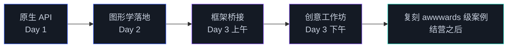
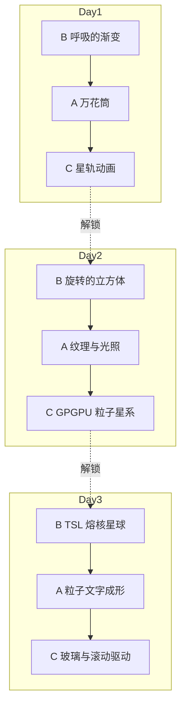

# 00 课程计划与学习地图

三天、每天八小时、一条主线：先让 GPU 听懂你的命令，再让画面符合你对空间的想象，最后让工具替你省下时间。每天的模块排布如下，时长是净学习时间，课间休息自己安排。

## Day 1　GPU 是如何画出一个三角形的

| 模块 | 时长 | 内容 | 配套 |
|------|------|------|------|
| 1.1 | 1h | GPU 架构与 WebGPU 全景 | demo 01 |
| 1.2 | 1h | WebGPU 对象模型与初始化 | demo 01 |
| 1.3 | 1h | 第一个三角形：渲染管线全解 | demo 01 |
| 1.4 | 1h | WGSL 语言核心 | demo 01 |
| 1.5 | 1.5h | 顶点缓冲与几何数据 | demos 02 / 03 |
| 1.6 | 1h | Uniform 与绑定组 | demo 04 |
| 巩固 | 1.5h | 改造 demo 实操 + 三档作业 | homework/day1 |

Day 1 的六个模块共用 demo 01 作为起点反复改造，到模块 1.5 才拆出 02 / 03，这种安排刻意减少了「再搭一遍脚手架」的损耗。

## Day 2　从三角形到会动的 3D 世界

| 模块 | 时长 | 内容 | 配套 |
|------|------|------|------|
| 2.1 | 1h | 2D 与 3D 空间变换 | demo 01 |
| 2.2 | 1h | 光栅化与片元插值 | demo 01 |
| 2.3 | 1h | 纹理采样与 Mipmap | demo 02 |
| 2.4 | 1h | 着色与光照模型 | demo 03 |
| 2.5 | 1h | 几何生成与顶点动画 | demo 04 |
| 2.6 | 1h | 计算着色器入门 | demo 05 |
| 2.7 | 1h | GPGPU 粒子与动画模拟 | demo 06 |
| 2.8 | 0.5h | 光线追踪与 Ray Marching | demo 07 |
| 作业 | 0.5h | 三档作业讲解 | homework/day2 |

Day 2 每个模块对应 GAMES101 笔记的一章，讲义开头有「理论对照」栏；数学推导看笔记，这里只讲 API 怎么落地。

## Day 3　用工程化武器上生产力

| 模块 | 时长 | 内容 | 配套 |
|------|------|------|------|
| 3.1 | 1.5h | WebGPURenderer 架构与迁移策略（含 demo 01 上手） | demo 01 |
| 3.2 | 1.5h | TSL 节点着色语言 | demo 02 |
| 3.3 | 1h | TSL 计算与数据流 | demo 03 |
| 3.4 | 1h | 后处理与性能调优 | demo 04 |
| 3.5 | 2h | 创意网站实战工作坊 | 实例网站清单.md |
| 作业 | 0.5h | 三档作业讲解 | homework/day3 |
| 结营 | 0.5h | 学习地图与后续路径 | 本文档 |

Day 3 只有五篇讲义：WebGPURenderer 的架构与上手合并在 3.1，一天的重心在 TSL 与下午的工作坊。三档作业是三天的综合收尾——基础档用 TSL 复刻 Day 2，进阶档和挑战档直接按作品集片段的标准设计。

## 学习路径

每个模块的推进方式都一样：读讲义的 Why / What / How，跑一遍对应 demo，然后做作业。作业分三档，难度递进但共享同一份视觉外壳——你交付的每个页面从第一天起就该是有设计感的作品。

## 作业递进

三档的取舍逻辑：基础档验收「概念通」，进阶档验收「能组合」，挑战档验收「可以拿去当作品集片段」。时间不够就只做到基础档，第二天照样能跟上；反过来，挑战档做不出来也不要恋战，标记 TODO 第二天回来。

## 结营之后

按 00 到 3.5 的顺序走完，你已经有完整的原生 + 框架双栈能力。接下来的路径建议：

1. 从 `实例网站清单.md` 里挑一个站，完整复刻其中一种效果（不追求像素级，追求技术同构）
2. 精读 `参考资料.md` 里「深入」一级的 Chrome Best Practices 与 WWDC25 Session 236
3. 用 Three.js TSL 起一个自己的小项目，把三天作业的三个挑战档整合成一个可展示页面
