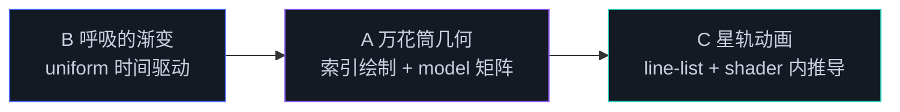

# Day 1 作业 · 三档递进

六个模块读完，是时候把管线握在自己手里了。三份骨架共用课程的视觉外壳：页面结构、初始化、帧循环全部就位，学习点以 `TODO(day1-x-N)` 的统一格式留空——打开页面，错误面板会告诉你第一件事做什么。三档考点递进：B 档只考 uniform，A 档组合顶点缓冲与矩阵，C 档把推导逻辑下沉到着色器。

## 三档总览

| 档 | 目录 | 考点 | 前置讲义 | 参考时长 |
|----|------|------|---------|---------|
| B 基础 | `basic-呼吸的渐变/` | uniform 全流程：struct 声明、buffer 创建、每帧上传 | 1.5 / 1.6 | 30 分钟 |
| A 进阶 | `advanced-万花筒几何/` | interleaved + drawIndexed + 2D model 矩阵 | 1.5 / 1.6 | 60 分钟 |
| C 挑战 | `challenge-星轨动画/` | line-list 图元 + 着色器内环号与相位推导 | 1.3 / 1.5 / 1.6 | 90 分钟 |

递进关系：B 的 uniform 是 A 的前置（model 矩阵要走同一套绑定），A 的索引绘制是 C 的前置（星轨的数据组织更密一档）。时间不够就只做 B，Day 2 照样能跟上；C 做不出来不要恋战，标记 TODO 第二天回来。



## 目录说明

每个作业目录固定四件，与 demo 完全同构：

```
homework/day1/basic-呼吸的渐变/    ← 你的工作区（另两档同构）
├─ index.html    页面模板（勿动）
├─ main.ts       初始化、管线、帧循环已写全，TODO 集中在标注处
├─ quad.wgsl     着色器骨架，TODO 处即学习点
└─ README.md     任务清单、验收标准、三档提示
```

- 运行：`npm run dev` 后打开 `http://localhost:5173/homework/day1/<目录名>/index.html`，作业页也已挂进课程门户
- TODO 编号与各 README 的任务清单一一对应；main.ts 里的 TODO 直接 `throw`，错误面板显示「TODO(day1-x-N) 未完成：见 README」，按编号顺序消灭即可
- WGSL 里的 TODO 无法 throw：未完成时着色器照常编译，画面停在「上一个完成态」——按任务清单推进，动效逐级点亮
- 后面的任务经常消费前面的产物，A 档的页面会按 1 → 2 → 4 → 3 的顺序提示未完成项（任务 3 要用前两者的返回值）
- 三档提示按「思路 → API 名 → 伪代码」折叠，逐档展开，别一次看到底
- 全部完成后对照 `solutions/`（后续补充），先自己做完再看
