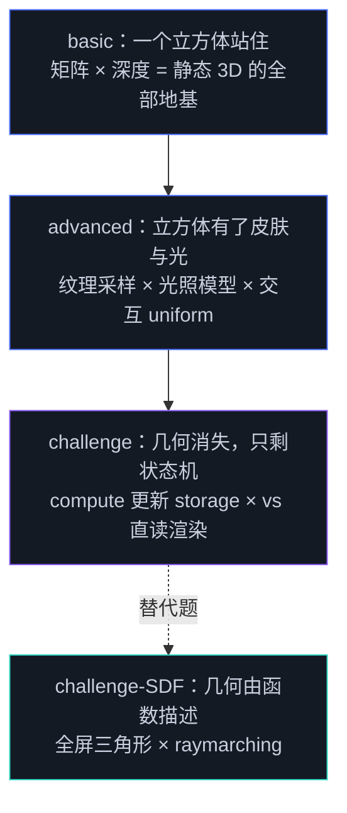

# Day 2 作业 · 渲染进阶与 GPU 计算

三档作业对应 Day 2 的两条主线：上午的渲染管线（变换、深度、纹理、光照）与下午的计算管线（compute、GPGPU）。每档都给全脚手架——初始化、外壳、帧循环、resize 都已就位，学习点用 `TODO(day2-x-n)` 编号留空，与下面各目录 README 的任务清单一一对应。打开页面看到错误面板是预期行为，按编号补完对应 TODO 即可。

| 档位 | 目录 | 主题 | 前置讲义 | 净时长 |
|------|------|------|---------|--------|
| 基础 | `basic-旋转的立方体/` | 手写三个矩阵 + 深度测试三件套 | 2.1 / 2.2 | 约 1h |
| 进阶 | `advanced-纹理与光照/` | 程序化纹理 + Blinn-Phong + 色温切换 | 2.1 / 2.3 / 2.4 | 约 1.5h |
| 挑战 | `challenge-GPGPU粒子星系/` | 双缓冲粒子状态机全链路（附 SDF 替代题） | 2.5 / 2.6 / 2.7 | 约 2h |

## 三档的递进关系



## 为什么是这三题

基础档选深空信标（实体水晶 + 线框立方笼），因为它天生「必须用深度测试」——实体与线框两种拓扑要互相遮挡，一旦没有深度缓冲，后画的会直接盖在前画的上面，水晶棱与笼横杆的穿插关系立刻穿帮，肉眼立刻可见；而三个矩阵（perspective、lookAt、model）是 Day 3 之前一切 3D 画面的地基，抄一遍 demo 再默写一遍，肌肉记忆才算建立。进阶档在同一颗立方体上叠加纹理与光照：纹理走「canvas 程序化生成 → GPU 上传」的完整链路，光照把 2.4 的 Blinn-Phong 公式亲手写一遍，色温切换练习 uniform 的交互联动——创意网站里「点击改变场景情绪」的交互原形。挑战档把渲染的地基抽掉：没有顶点缓冲、没有静态几何，一万颗粒子的位置每帧由 compute 算出，渲染管线直读 storage——这是 lusion 与 igloo 那类效果的最小完整闭环，也是通往 Day 3 TSL 计算节点的直路。

挑战档另附一道 SDF 替代题：不做粒子，改做 2.8 风格的 raymarching 场景。两题难度等价、知识点互不重叠，按兴趣二选一。

## 各档入口

- [basic-旋转的立方体](./basic-旋转的立方体/)——`CRYSTAL GYRO`
- [advanced-纹理与光照](./advanced-纹理与光照/)——`TEXTURE & LIGHT`
- [challenge-GPGPU粒子星系](./challenge-GPGPU粒子星系/)——`EMBER RISE`（含 [SDF 替代题](./challenge-GPGPU粒子星系/#替代题sdf-场景)）

运行方式与 demo 相同：

```bash
npm run dev
# http://localhost:5173/homework/day2/basic-旋转的立方体/index.html
```
