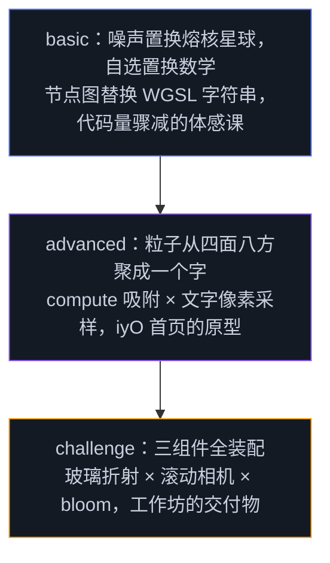

# Day 3 作业 · Three.js / TSL 与创意网站

三档作业对应 Day 3 的主线：上午的 TSL 节点语言与计算数据流，下午的创意网站工作坊。每档都给全脚手架——chrome 外壳、WebGPURenderer 初始化、帧循环、resize 都已就位，学习点用 `TODO(day3-x-n)` 编号留空，与下面各目录 README 的任务清单一一对应。打开页面看到错误面板是预期行为，按编号补完对应 TODO 即可。Day 3 的作业没有 `.wgsl` 文件：TSL 节点全部写在 `main.ts` 里，这也是引擎层相对原生层的直观差异之一。

| 档位 | 目录 | 主题 | 前置讲义 | 净时长 |
|------|------|------|---------|--------|
| 基础 | `basic-TSL波浪网格/` | TSL 噪声置换熔核星球：三频 fBm + 蓄热交互，代码量对比 | 3.2 | 约 1h |
| 进阶 | `advanced-粒子文字成形/` | TSL compute + 文字像素采样 + 吸附动画 | 3.3 / 2.7 | 约 1.5h |
| 挑战 | `challenge-玻璃与滚动驱动/` | transmission 玻璃 + 滚动驱动相机 + bloom | 3.4 / 3.5 | 约 2h |

## 三档的递进关系



## 为什么是这三题

基础档不再复刻任何一片现成的海：demo 02 已经示范了 TSL 怎么写行波，作业换成噪声置换的熔核星球——三频 fBm 叠出地形、熔岩从低谷透光，鼠标也从参数调制换成蓄热状态机（按住注入热量、松开冷却），置换数学自己组织，验收「会不会用」而不只是「跟着写」。行数对比的论据保留：同样的星球用原生 WGSL 写参照 Day 2 demo 04 的 313 行式样（main.ts 216 行 + ocean.wgsl 97 行），两份代码摆在一起，引擎层的价值就不再是口号而是行数。它同时是 TSL 的最小完整闭环——positionNode、colorNode、varying、uniform 交互一次练完。进阶档在 TSL 计算管线里重建 Day 2 的粒子状态机，再加两样新东西：文字离屏采样成吸附目标、弹簧吸附与噪声呼吸——做完它，实例清单里 iyO 首页的粒子文字对你就从魔术变成了工程。挑战档是 3.5 工作坊三个组件的全装配：玻璃材质、滚动驱动相机、bloom 后处理咬合在一页里，风格锚点 haoqi.design 与 igloo.inc，这一档的完成品可以直接当作品集片段。

工程说明一条：three 0.186.0 的 npm 包不带 `three/webgpu` 与 `three/tsl` 的类型声明，作业 `main.ts` 里这两处导入行带着 `@ts-ignore` 注释（真实项目安装 `@types/three` 即可补全，课程工程刻意不引入，避免与锁定的版本脱节）。删掉它们不影响运行，只影响 typecheck。

## 各档入口

- [basic-TSL波浪网格](./basic-TSL波浪网格/)——`MOLTEN CORE`
- [advanced-粒子文字成形](./advanced-粒子文字成形/)——`PARTICLE TYPE`
- [challenge-玻璃与滚动驱动](./challenge-玻璃与滚动驱动/)——`GLASS & SCROLL`

运行方式与 demo 相同：

```bash
npm run dev
# http://localhost:5173/homework/day3/basic-TSL波浪网格/index.html
```
