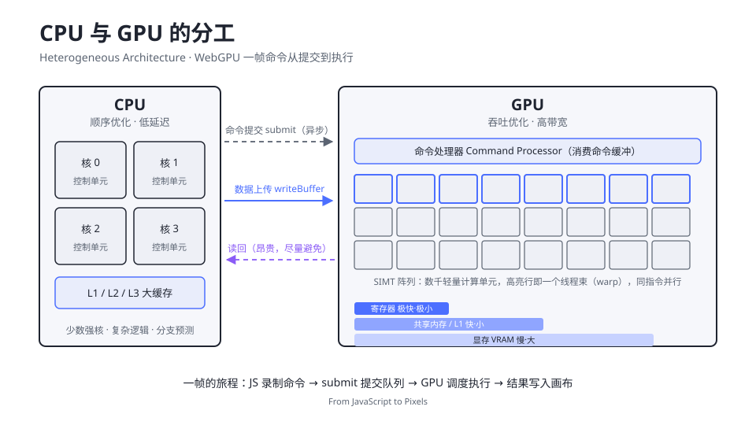

# 1.1 GPU 架构与 WebGPU 全景

> Day 1 · 模块 1 · 约 60 分钟
> 理论对照：《GAMES101 现代计算机图形学课程笔记》第 1 章「概览与光栅化」

Samsy 的作品集首页有一片可以穿行的赛博朋克城市，Aurelia 用一只全程序化生成的水母告诉你：它的钟体收缩、触手摆动、虹彩光泽，全部实时算在浏览器里。这两个站分别跑在 WebGPU 和 Three.js 的 WebGPURenderer 上，帧率稳定在 120 以上。五年前你做前端，GPU 是别人的领域；WebGPU 之后，它成了你工具箱里的一层 API。

这三天要回答三个问题：GPU 是怎么画图的（今天）、图形学理论如何落进管线阶段（明天）、怎么用工程化武器快速做出 lusion 级效果（后天）。本模块先把地基打好——GPU 硬件到底是什么形状，WebGPU 又凭什么值得学。

## 为什么是 WebGPU，为什么是现在

WebGL 诞生于 2011 年，本质是把 OpenGL ES 2.0 搬进浏览器。它的设计假设是「单线程、低并发的桌面应用」，由此继承了一批历史包袱：全局状态机让每次 draw 前要设置十几种状态、驱动层靠猜测你的意图来优化、GLSL 每个浏览器实现都略有方言、而计算能力只能靠把数据伪装成纹理的 hack（GPGPU）挤出一点来。2013 年到 2023 年，桌面与主机图形早就换了一代范式——Vulkan、Metal、Direct3D 12 把「显式资源管理」作为核心：你告诉驱动资源的精确布局和生命周期，换回可预测的性能。

WebGPU 是这套范式进浏览器的形态，2023 年 4 月随 Chrome 113 首发稳定版，由 W3C 的「GPU for the Web」工作组标准化。它带来三样 WebGL 给不了的东西：

| 能力 | WebGL | WebGPU |
|------|-------|--------|
| 计算着色器 | 无正式支持（纹理 hack） | 一等公民，`@compute` 入口点 |
| 资源绑定 | 全局状态机 + 每次切换全量验证 | Bind Group 显式描述，验证一次反复复用 |
| 着色语言 | GLSL（各实现有差异） | WGSL，单一规范、跨后端一致 |
| 多线程录制 | 无 | Worker 中构建 command buffer |

对创意网站来说，第一行是决定性的：粒子系统、布料、流体这些让 lusion 和 igloo 封神的效果，全部依赖大规模并行计算。WebGL 时代用纹理 hack 绕路，WebGPU 时代是一条直路。

浏览器支持方面（2026 年 9 月）：Chrome / Edge 113+ 全平台，Safari 26+，Firefox 已支持，MDN 尚未标记 Baseline——所以线上产品仍要做能力检测，教学环境用 Chrome / Edge 即可。细节与降级路径见 `01-环境准备与浏览器支持.md`。

## GPU 到底在做什么

先把 CPU 和 GPU 放在同一张图上看。它们的差异不是「快慢」，而是设计哲学的分歧：CPU 用晶体管堆预测、乱序执行和大缓存，让单线程跑得尽可能快；GPU 把晶体管铺成数千个简单计算单元，用海量并行掩盖访存延迟。



图里有三条值得盯住的通路。命令提交（虚线）是异步的：`submit()` 返回时 GPU 还没开始执行，你的 JavaScript 继续跑，GPU 在自己的队列里消化命令——这是 WebGPU 一切异步设计的硬件根源。数据上传（实线）走 `writeBuffer`，把字节从 JS 世界搬进显存。读回（紫色虚线）标着「昂贵」，因为它要把 GPU 拉回同步点，创意网站的性能调优有一半就是在消灭读回。

SIMT（Single Instruction, Multiple Threads）是理解 GPU 行为的钥匙：计算单元按「线程束」成组，一束 32 个线程在同一时钟执行同一条指令，只是数据不同。写 WGSL 时你会感觉自己在写普通的循环，但心里要清楚：循环体正在被几千个线程束同时执行，每个线程束处理数据的一小片。用前端的语言说，GPU 是一台天然擅长 `map` 的机器，而 `reduce`、同步、分支都是它不擅长的——分支发散（同一束内线程走向不同分支）会让两边的指令都执行一遍再合并。

显存层次决定了优化的方向。寄存器极快极小，共享内存快一些，显存（VRAM）慢但大，三者延迟差着数量级。一个顶点着色器从 uniform buffer 里读一个矩阵，走的是显存；两个相邻片元读同一张纹理的相邻像素，命中缓存就便宜，随机乱采就贵。这个金字塔会在整门课里反复出现：2.3 的 mipmap、2.6 的 workgroup 共享内存、3.5 的性能清单，全是围绕它做文章。

## 从 2D 到 3D：这三天会走到哪

GPU 图形的全部秘密可以压进一条流水线：几何数据经过变换投到屏幕上，光栅化成一片片像素，每个像素算一次颜色，最后按深度规则合并。三天的课程就是沿着这条线走，每一天解锁一段：

| 阶段 | 你将掌握 | 对应模块 |
|------|---------|---------|
| 管线与绘制 | device、renderPass、draw，画出一个三角形 | Day 1 全天 |
| 顶点与几何 | 顶点缓冲、索引、程序化网格生成 | 1.5、2.5 |
| 空间与变换 | MVP 矩阵、透视投影、坐标系旅行 | 2.1 |
| 光栅化与着色 | 片元插值、Blinn-Phong、纹理采样 | 2.2–2.4 |
| 计算与模拟 | compute pipeline、粒子系统、顶点动画 | 2.5–2.7 |
| 光线追踪思想 | Ray Marching 与 SDF 场景 | 2.8 |
| 工程化 | Three.js WebGPURenderer、TSL、后处理 | Day 3 |

其中「计算与模拟」值得单独强调：它不在传统图形管线上，却是现代创意网站的分水岭。lusion 的布料、igloo 的粒子 footer、iyO 的 160 万粒子文字，全是计算着色器驱动的。WebGL 时代这些效果要么做不了，要么要付出扭曲的工程代价。

## 打开 demo，看一眼你要驯服的东西

```bash
npm run dev
# http://localhost:5173/demos/day1/01-hello-triangle/index.html
```

现在不用读懂每一行。只看三件事：左上角的 `DAY 1 · 01` 是课程的视觉外壳（`shared/chrome.ts` 提供的画框、标注与 FPS），画布中央呼吸的蓝紫渐变三角形是接下来四个模块的实验对象，右下角的 FPS 会告诉你 GPU 还很闲——今天画一个三角形，明天让它变成上万个。

讲义 1.2 会拆开这个 demo 的第一段：`navigator.gpu` 通往 `GPUDevice` 的对象模型。

## Checkpoint

- 能说出 CPU 与 GPU 的设计分歧，以及 SIMT、线程束、分支发散各是什么
- 能解释 `submit()` 为什么是异步的，读回为什么昂贵
- 能列出 WebGPU 相对 WebGL 的三项核心增益（计算、显式绑定、WGSL）
- 知道浏览器支持现状与自己的环境状态

## 相关材料

- demo：`demos/day1/01-hello-triangle/`（本模块只需运行与观察）
- 图中案例：Samsy 作品集、Aurelia 水母（WebGPU/TSL 实时渲染），见 `实例网站清单.md`
- 延伸阅读：[webgpu.org](https://webgpu.org/) 的 FAQ 与 [WebGPU Best Practices](https://toji.dev/webgpu-best-practices/)（Chrome WebGPU 团队成员 Brandon Jones 的系列）前两篇
