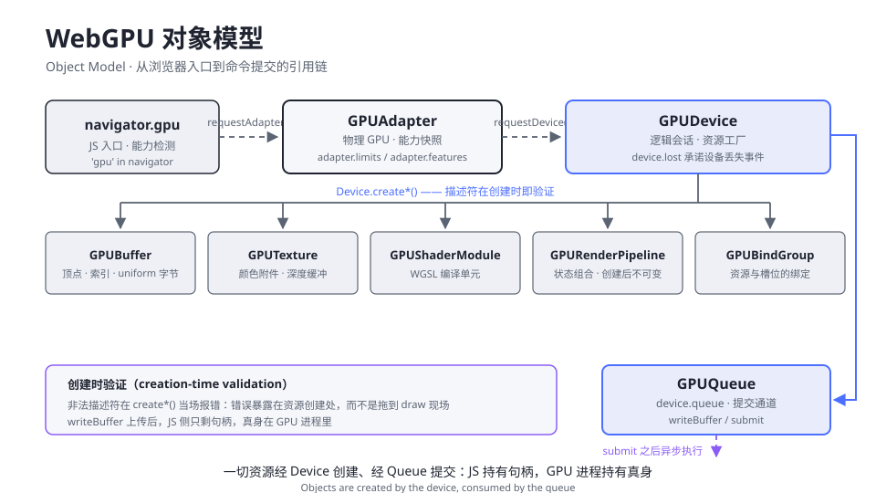
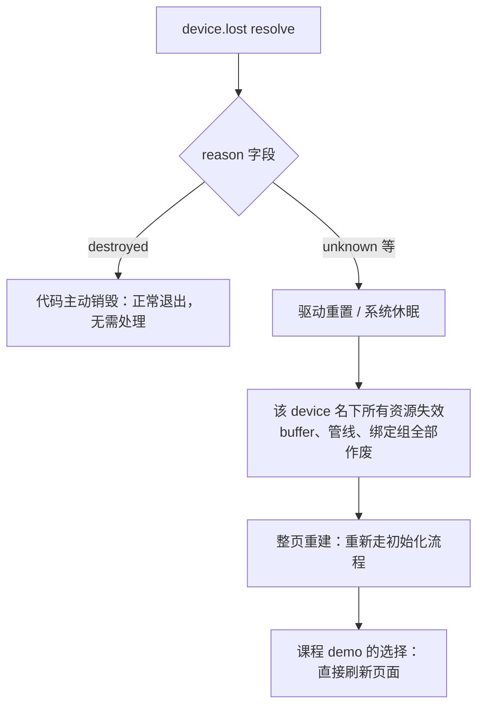

# 1.2 WebGPU 对象模型与初始化

> Day 1 · 模块 2 · 约 60 分钟
> 理论对照：无图形学先修；着色器侧理论从 1.4 起对照《Three.js 创意 3D 课程笔记》第 10 课「GLSL 基础」

打开 demo 01 的 `main.ts`，真正把 GPU「接通」的只有两行：`await navigator.gpu.requestAdapter()` 与 `await adapter.requestDevice()`。但这两行背后是浏览器工程里最谨慎的一段设计：一段任意来源的网页脚本，凭什么可以指挥一块几千块钱的硬件，还能保证一个页面搞不挂整个系统。答案分三层——进程隔离、能力协商、创建时验证——它们共同决定了 WebGPU 对象模型长成现在的样子。

## 为什么需要这套仪式：浏览器如何安全地交出 GPU

GPU 危险的地方在于它直接操作显存与驱动。WebGL 时代浏览器只能靠沙箱与驱动各自自觉，于是有了经典的「context lost」黑箱：标签页一休眠、驱动一重置，画布就灰了，你只能注册一个 `webglcontextlost` 事件然后祈祷。WebGPU 把这件事变成了显式契约：JS 进程从头到尾拿到的都只是句柄，GPU 资源真身住在独立的 GPU 进程里，两边靠进程间通信传递命令。页面崩了，系统无恙；驱动重置了，只有 `GPUDevice` 收到一份 `device.lost` 的正式通知。

第二层是能力协商。不同机器的 GPU 差异巨大：手机上纹理上限 4096，桌面卡轻松 16384；时间戳查询有的后端有、有的没有。WebGPU 不让代码「试了才知道」，而是让 `requestAdapter()` 一次性带回能力快照——`adapter.limits` 里的几十个数值上限，`adapter.features` 里的一组可选特性。你的粒子系统需要 160 万粒子，就在启动时对照 `maxBufferSize` 和 `maxComputeInvocationsPerWorkgroup` 决定降级方案，而不是跑到一半炸掉。

第三层是创建时验证，也是 WebGPU 与 WebGL 心智模型的最大分野。创建 buffer、管线、绑定组时传入的描述符会在创建现场全部检查，非法参数当场报 validation error。错误暴露在你写 `device.createBuffer(...)` 的那一行，而不是埋到几百帧之后的某次 draw。定位问题的成本因此从「全局搜索」降到「看调用栈」。

## 对象模型全景：从入口到队列

把整个家族画在一张图上，三级主对象横向贯穿，资源对象与队列挂在 `GPUDevice` 身上。



读这张图的三条要点。第一，两个异步请求各有一次「扑空」的可能：`requestAdapter()` 在没有可用 GPU 时返回 `null`（注意是返回 null，不是抛错），所以判空是硬性步骤；`requestDevice()` 理论上也可能失败，实践中更常见的是它静默降级到软件适配器。第二，五类资源对象全部由 `device.create*()` 创建，其中 `GPURenderPipeline` 创建后不可变——改状态等于换一个新管线对象，这是 WebGPU 没有「全局状态机」的根本原因。第三，`device.queue` 是 JS 与 GPU 执行之间的唯一通道：`writeBuffer` 上传数据、`submit` 提交命令，全部经过它，图中右侧的折线就是这条唯一引用。

`GPUDevice` 派生资源的主要方法与用途：

| 方法 | 产物 | 用途 | 后续模块 |
|------|------|------|---------|
| `createBuffer` | `GPUBuffer` | 顶点 / 索引 / uniform 的字节容器 | 1.5、1.6 |
| `createTexture` | `GPUTexture` | 颜色附件、深度缓冲、贴图 | 2.2、2.3 |
| `createShaderModule` | `GPUShaderModule` | WGSL 源码的编译单元 | 1.3、1.4 |
| `createRenderPipeline` | `GPURenderPipeline` | 顶点/片元状态与布局的组合 | 1.3 |
| `createBindGroup` | `GPUBindGroup` | buffer/纹理与着色器槽位的绑定 | 1.6 |

错误体系与之配套，共三档，严重程度递进：

| 档位 | 机制 | 典型场景 |
|------|------|---------|
| 同步异常 | `create*()` 直接 `throw` | 传了类型错误的描述符（JS 侧低级错误） |
| validation error | `uncapturederror` 事件、`pushErrorScope` 捕获 | 尺寸不是 16 倍数、usage 缺标志、布局不匹配 |
| 设备丢失 | `device.lost` Promise resolve | 系统休眠、驱动重置、显存耗尽 |

课程的外壳 `shared/chrome.ts` 已经把前两档接好了：`initGPU` 里注册 `uncapturederror` 监听，validation error 会直达页面错误面板；`device.lost` 的处理也在其中，挂掉时你会看到一块可读的红色面板。设备丢失后的恢复路径如下，教学环境里最省事的终点就是刷新页面：



## How：demo 01 初始化段逐行精讲

demo 01 的初始化被课程的 `initGPU` 封装了一层，先看它内部的关键段（`shared/chrome.ts`）：

```ts
if (!('gpu' in navigator)) {
  chrome.fail('WEBGPU NOT AVAILABLE', 'navigator.gpu 不存在：当前浏览器不支持 WebGPU。');
  return null;
}

let adapter: GPUAdapter | null;
try {
  adapter = await navigator.gpu.requestAdapter();
} catch (e) {
  chrome.fail('REQUEST ADAPTER FAILED', String(e));
  return null;
}
if (!adapter) {
  chrome.fail('NO ADAPTER', 'requestAdapter() 返回 null：没有可用的 GPU 适配器。');
  return null;
}

const device = await adapter.requestDevice();
chrome.attachDevice(device);
device.lost.then((info) => {
  if (info.reason !== 'destroyed') {
    chrome.fail('DEVICE LOST', `GPUDevice 丢失（${info.reason}）：${info.message}`);
  }
});
```

逐段拆开。`'gpu' in navigator` 是能力检测的第一道闸，老浏览器在这里就分流，`requestAdapter` 都不会碰。`requestAdapter()` 的返回类型是 `Promise<GPUAdapter | null>`——「返回 null 而不是抛错」是刻意设计：没有 GPU 属于正常环境状态（无头机器、禁用硬件加速），调用方应该走降级路径而非异常路径。`requestDevice()` 在默认参数下等于「给我一个满足核心上限的逻辑会话」，你的 `limits` 请求如果超出适配器能力，它会直接拒绝而不是悄悄给你一个残血设备。

回到 demo 01 的 `main.ts`，初始化的最后一件事是配置画布上下文：

```ts
const context = chrome.canvas.getContext('webgpu');
if (!context) throw new Error('无法获取 webgpu context');
const format = navigator.gpu.getPreferredCanvasFormat();
context.configure({ device, format, alphaMode: 'opaque' });
```

`getContext('webgpu')` 的判空在 TypeScript strict 模式下是必须的，返回类型允许 `null`。`getPreferredCanvasFormat()` 问浏览器「这块屏幕最省力的纹理格式是什么」，macOS 上通常是 `bgra8unorm`，Windows 上可能是 `rgba8unorm`——写死任何一个都会在另一半世界多一次格式转换。`configure` 把 device、格式、透明策略绑定到画布；忘了这一步，后面 `getCurrentTexture()` 会直接产生 validation error，这也是新手第一天的固定节目。

最后是留给你的探针。把这段贴进任一 demo 的 `main.ts`（或直接在控制台跑，`navigator.gpu` 是全局的），看看自己机器的家底：

```ts
const adapter = await navigator.gpu.requestAdapter();
if (!adapter) throw new Error('没有可用适配器，见 01-环境准备');
console.table({
  maxBufferSize: adapter.limits.maxBufferSize,
  maxTextureDimension2D: adapter.limits.maxTextureDimension2D,
  maxVertexAttributes: adapter.limits.maxVertexAttributes,
  maxUniformBufferBindingSize: adapter.limits.maxUniformBufferBindingSize,
  maxComputeWorkgroupSizeX: adapter.limits.maxComputeWorkgroupSizeX,
});
console.log([...adapter.features].join('\n'));
```

多数桌面机会给你 `maxBufferSize: 268435456`（256 MB）起步、`maxTextureDimension2D: 16384`，features 大概率是空的——可选特性默认都不开，用 `requestDevice({ requiredFeatures: [...] })` 显式申请。这份快照在 2.6 写计算着色器时会再回来对照。

## 常见坑

| 报错/症状 | 原因 |
|-----------|------|
| `requestAdapter()` 返回 `null`，错误面板显示 NO ADAPTER | 环境问题：硬件加速被禁、远程桌面、虚拟机。处理路径见 [01-环境准备与浏览器支持](../../01-环境准备与浏览器支持.md)，包括 `forceSoftware: true` 软件渲染方案 |
| `canvas context` 相关 validation error，画布一片黑 | 忘了 `context.configure({ device, format, ... })`，或 configure 用的 format 与管线 `targets` 不一致 |
| `TypeError: Cannot read properties of undefined` | `requestAdapter()` / `requestDevice()` 忘了 `await`，拿着 Promise 当 adapter 用 |
| `requestDevice` 后 limits「不对劲」 | `requestDevice` 默认按核心上限裁剪；超出即拒绝。申请更高上限要在描述符里显式列出 |
| 页面突然全灰，面板显示 DEVICE LOST | 系统休眠或驱动重置。旧 device 名下资源全部作废，教学环境刷新页面即可 |

## Checkpoint

- 能画出 navigator.gpu → Adapter → Device → 资源对象 → Queue 的对象关系图，并说出每一步是同步还是异步
- 能解释 `requestAdapter()` 为什么返回 null 而不是抛错，判空为什么是硬性步骤
- 能说出三档错误体系（同步异常 / validation error / device.lost）各自的触发场景
- 知道 `create*()` 是创建时验证、pipeline 创建后不可变意味着什么
- 用探针代码看过自己机器的 limits 与 features

## 相关材料

- demo：`demos/day1/01-hello-triangle/`（本模块关注 `initGPU` 调用前后）
- 环境排查：[01-环境准备与浏览器支持](../../01-环境准备与浏览器支持.md)
- 延伸阅读：[MDN GPUAdapter](https://developer.mozilla.org/docs/Web/API/GPUAdapter)、[webgpufundamentals.org](https://webgpufundamentals.org/webgpu/lessons/webgpu-fundamentals.html) 的「Get an adapter」一节
