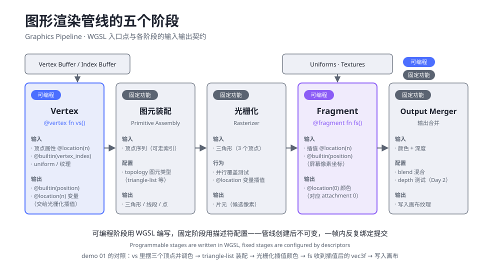
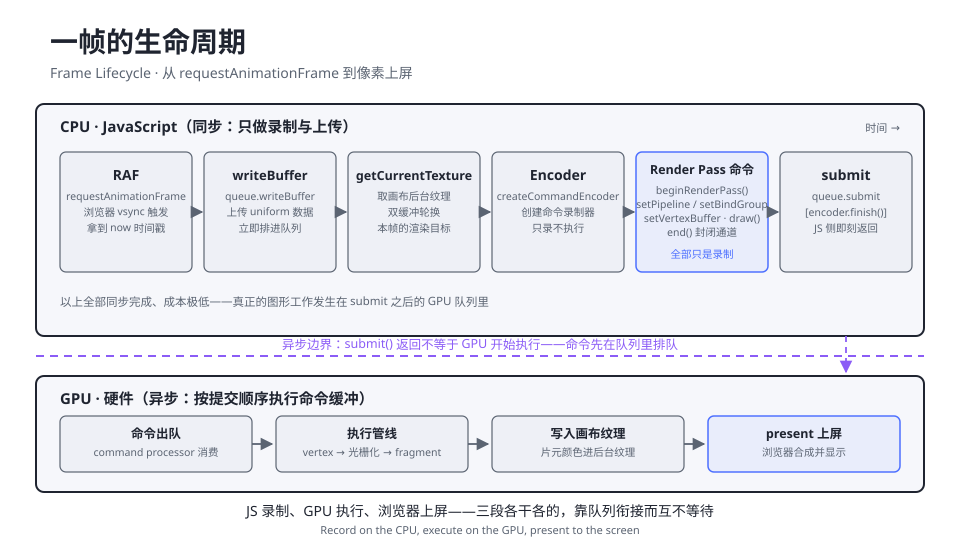
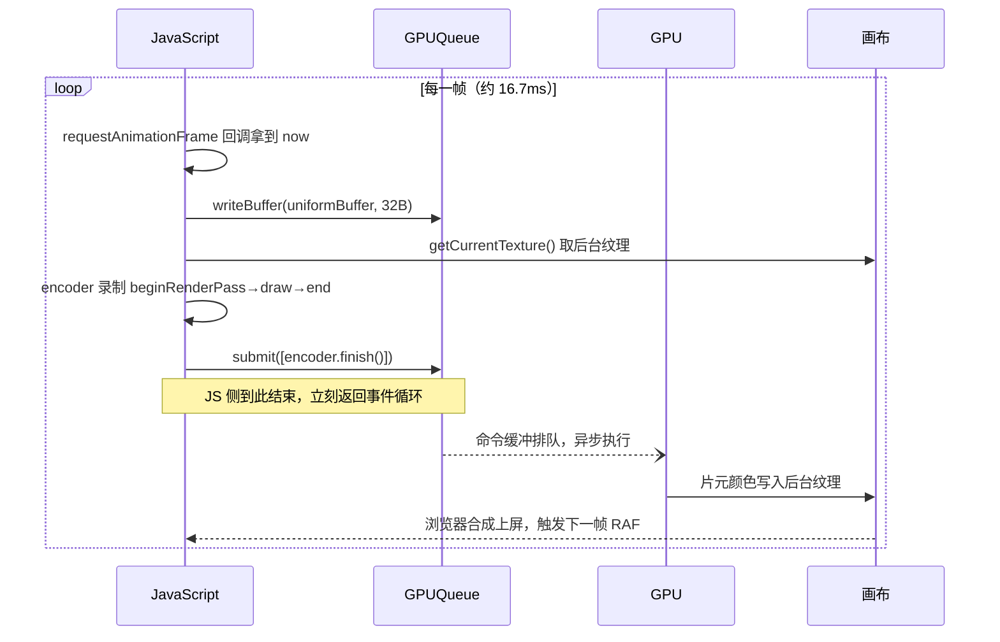

# 1.3 第一个三角形：渲染管线全解

> Day 1 · 模块 3 · 约 60 分钟
> 理论对照：《GAMES101 现代计算机图形学课程笔记》第 1 章「概览与光栅化」——光栅渲染管线的阶段划分

`pass.draw(3)` 是 demo 01 里最短的一行，也是 GPU 工作量最大的一行。这一行触发的事情，在 GPU 内部是一条五个阶段的流水线：三个顶点被并行变换，组装成三角形，光栅化成成千上万个片元，每个片元独立算一次颜色，最后合并写入画布。本模块把这条流水线拆开，再把它在 JS 侧的镜像——一段「录制后提交」的命令缓冲——拆开。这两条线讲透，demo 01 的 87 行就再无秘密。

## 为什么图形硬件长成流水线

三角形是图形学的原子：三个顶点定义一个平面，屏幕上的任何曲面最终都被切成微小三角形逼近。渲染一个三角形的工序天然分两类。一类高度统一：把顶点从一个坐标系搬到另一个坐标系，判断一个像素在不在三角形内——这类活规则固定、数量巨大，做成固定电路比编程灵活一万倍。另一类每个应用都不一样：顶点怎么变形、像素是什么颜色——这类活必须留给开发者编程。所以图形管线从硬件时代起就是「固定阶段与可编程阶段交替」的结构，WGSL 的两个入口点 `@vertex` 与 `@fragment` 正好落在两个可编程坑位上。

WebGPU 在这条硬件流水线之外又加了一层 JS 侧的组织。WebGL 的做法是全局状态机：draw 之前逐项设置颜色混合、深度测试、纹理绑定，驱动每次都要猜测你改了什么、哪里能复用缓存。WebGPU 把这些状态预组装成一个不可变的 `GPURenderPipeline` 对象：创建时验证一次，之后无数次绑定使用，零重复检查。代价是你不能「顺手改一个开关」——改任何状态都是换一个新管线对象。这个取舍换来的是可预测的性能，也是它敢把线程模型开放给 Worker 的前提。

## 管线的五个阶段与 WGSL 的契约

五个阶段首尾相接，可编程的两个用 WGSL 编写，固定的三个由描述符配置。



对着图从左到右过一遍数据流。Vertex 阶段的输入有两路：顶点缓冲里的属性（demo 01 用 `@builtin(vertex_index)` 在着色器内生成，1.5 换成真缓冲）和 uniform（时间、鼠标）。它的输出被合约钉死：`@builtin(position)` 是必须项，光栅化靠它确定三角形落在屏幕哪里；`@location(n)` 变量是自由项，demo 01 输出了一个 `vec3f` 颜色。图元装配按 `topology` 把顶点流切成图元，`triangle-list` 即每 3 个一组的无脑切分。光栅化做覆盖测试：哪些像素中心落在三角形内，就是哪些片元；同时把顶点阶段的 `@location` 变量在三角形内部线性插值——demo 01 里渐变色的「渐」字就发生在这里。Fragment 阶段每个片元执行一次你的 `fs`，输入是插值后的颜色，输出 `@location(0)`，对应颜色附件的第 0 个。Output Merger 负责写入，深度测试与混合也在这里配置，Day 2 才需要。

片元与像素的区别值得专门记一笔：片元是「候选像素」，带着颜色、深度与坐标，还要过完合并阶段的测试才算数。2.2 讲片元插值时这个区分会反复出现。

## 一帧的生命周期：录制、提交、上屏

管线讲的是 GPU 内部，帧生命周期讲的是 JS 与 GPU 的配合方式。关键事实只有一条：你写的所有渲染代码都是「录制」，不是「执行」。



图的上半部分是 JS 帧。`getCurrentTexture()` 从画布的双缓冲对里取回本帧要写的那张后台纹理（浏览器正在显示另一张，所以叫双缓冲）；`createCommandEncoder()` 创建录制器；render pass 里的一串 `set*` 与 `draw` 只是往命令缓冲里追加指令；直到 `submit` 把命令缓冲交给 `device.queue`，JS 侧的工作就结束了——注意图中间那条紫色虚线，异步边界：`submit()` 返回时 GPU 可能还没开始执行第一条命令。时序上完整的一帧如下：



这个模型解释了一个第一天最容易犯的直觉错误：在 draw 之前 `writeBuffer`、draw 之后改数据，并不会让这一帧用到新数据——`writeBuffer` 是立即排队的，而 pass 里的命令要到 GPU 执行时才读取资源。顺序是「先 writeBuffer 再录制 draw」，两件事都在 submit 前完成即可，先后无所谓。

## How：demo 01 渲染段的逐字段精讲

demo 01 的渲染段从着色器模块开始。`createShaderModule` 把 WGSL 源码交给驱动编译，语法错误在创建时就报出来，报错信息带行列号，直接定位到行。

```ts
const module = device.createShaderModule({ code: shader });

const pipeline = device.createRenderPipeline({
  layout: 'auto', // 讲义 1.6：让管线从着色器自动推导绑定组布局
  vertex: { module, entryPoint: 'vs' },
  fragment: { module, entryPoint: 'fs', targets: [{ format }] },
  primitive: { topology: 'triangle-list' },
});
```

把描述符展开成缩进树，每个字段的存在理由一目了然：

```text
createRenderPipeline
├─ layout: 'auto'              绑定组布局来源，1.6 换成显式 GPUPipelineLayout
├─ vertex                       顶点阶段配置
│  ├─ module                   编译好的 WGSL 单元
│  ├─ entryPoint: 'vs'          指认 @vertex fn vs()，字符串必须精确匹配
│  └─ buffers: []              顶点缓冲布局；demo 01 空，1.5 的 demo 02 在这里填
├─ fragment                    片元阶段配置
│  ├─ module + entryPoint      复用同一 module 的 fs
│  └─ targets[0].format        输出格式 = 画布 configure 的 format，双方必须一致
└─ primitive
   └─ topology: 'triangle-list'  图元装配：每 3 个顶点切一个三角形
```

`entryPoint` 与 WGSL 的 `fn` 名是字符串对字符串的弱连接，拼错就是经典的 `Entry point 'vs' doesn't exist`。`targets[0].format` 是 JS 侧与画布的契约：configure 时问过浏览器的格式，必须原样抄到管线里，一边写 `bgra8unorm` 一边写 `rgba8unorm` 就是第二经典的报错。

帧循环里，录制的语义要盯住动词：`begin`、`set`、`draw`、`end`、`finish`、`submit`。

```ts
const encoder = device.createCommandEncoder();
const pass = encoder.beginRenderPass({
  colorAttachments: [{
    view: context.getCurrentTexture().createView(),
    clearValue: { r: 0.043, g: 0.055, b: 0.078, a: 1 },
    loadOp: 'clear',
    storeOp: 'store',
  }],
});
pass.setPipeline(pipeline);
pass.setBindGroup(0, bindGroup);
pass.draw(3); // 三个顶点，一个三角形
pass.end();
device.queue.submit([encoder.finish()]);
```

`colorAttachments` 声明这个 pass 要写哪些纹理、开场是清屏还是保留（`loadOp: 'clear'` 配 `clearValue`，颜色与页面底色 `#0B0E14` 严格一致，画布与画框才能无缝）。`view` 是纹理的「取景」——本帧的后台纹理。随后三条 `set*`/`draw` 全部是往命令缓冲里写字：`draw(3)` 的字面意思是「用当前绑定的所有状态，跑一遍管线，顶点数 3」。`pass.end()` 封闭渲染通道，`encoder.finish()` 封装成不可变的 `GPUBuffer`（命令缓冲），最后 `submit` 才让它排队等 GPU。全部七个动词里只有 `getCurrentTexture` 与 `writeBuffer` 真正动了 GPU 侧的状态，其余都在纸上谈兵——纸就是命令缓冲。

## 常见坑

| 报错/症状 | 原因 |
|-----------|------|
| `Entry point 'vs' doesn't exist` | `entryPoint` 字符串与 WGSL 的 `fn` 名对不上，大小写敏感 |
| `Color attachment formats are incompatible` | `targets[0].format` 与 `context.configure` 的 format 不一致；始终用 `getPreferredCanvasFormat()` 的返回值 |
| 页面空白且无报错 | 忘了 `pass.draw(3)` 或 `submit`——没有命令被提交，画布保持初始黑 |
| 画面突然消失 / 闪烁 | 对已 configure 的 context 重复 configure 且参数变化，之前的纹理视图失效；configure 只做一次 |
| `encoder is finished` 一类 validation error | `encoder.finish()` 之后继续往这个 encoder 录命令；finish 即封口，需要新 encoder |
| 着色器报错带行列号但看不懂 | WGSL 编译错误在 `createShaderModule` 时抛出，格式形如 `Shader 'wgsl' parsing error`；对照 1.4 的语法表排查 |

## Checkpoint

- 能按顺序说出五个阶段、各自可编程还是固定、WGSL 两个入口点分别落在哪
- 能解释 `@location` 变量为什么会在三角形内部自动插值、插值发生在哪个阶段
- 能复述「录制—提交—执行」三段模型，说清 `submit()` 返回时 GPU 在干什么
- 能对 pipeline descriptor 的每个字段说出「删掉它会发生什么」
- 遇到 validation error 会先检查 entryPoint、format、draw/submit 三处

## 相关材料

- demo：`demos/day1/01-hello-triangle/`（对照 `main.ts` 帧循环段阅读）
- 理论：GAMES101 笔记第 1 章的光栅化流程图（管线的图形学视角）
- 延伸阅读：[webgpufundamentals.org · WebGPU Fundamentals](https://webgpufundamentals.org/webgpu/lessons/webgpu-fundamentals.html) 的「A Draw Diagram」一节，有完整的命令流示意图
