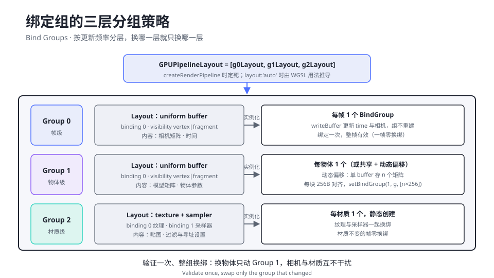

# 1.6 Uniform 与绑定组

> Day 1 · 模块 6 · 约 60 分钟
> 理论对照：《Three.js 创意 3D 课程笔记》第 10 课「GLSL 基础」——uniform 是「全班共用的黑板」，WebGPU 给这块黑板换了一套批量管理系统

demo 04 的三个三角形绕着轨道公转、反向自转、在电蓝与青之间循环变色，但它的 WGSL 里没有一个会自己变的数字：9 个顶点全部由 `vertex_index` 推导，着色器代码自始至终一行不改。全部动态压缩在一块 32 字节的 buffer 里，每帧被 `writeBuffer` 重写一次。这块 buffer 是 uniform，围绕它的绑定组（BindGroup）是 WebGPU 资源模型的核心，也是 Day 1 的最后一块拼图：装上它，管线从此由数据驱动。

## 为什么 WebGL 的 uniform1f 模式到头了

在 Three.js 的 ShaderMaterial 里你已经写过 `uniforms: { uTime: { value: 0 } }`，每帧更新一次 value，底层是几十次 `gl.uniform1f` 与 `gl.uniformMatrix4fv`。这套「逐字段设值」在 WebGL 里是唯一的路，代价有三笔。每设一个字段都是一次状态修改：驱动当场验证槽位类型、打脏内部状态，一帧几十次全是纯 CPU 开销。字段散落在各自的槽位上：驱动无法把它们合并成一次显存传输。绑定关系是隐式的：着色器里二十个 uniform 各自从哪来，只看 draw 时刻的全局状态，缓存能否复用全凭驱动猜。

WebGPU 的解法一一对应。数据集中——一个 uniform buffer 装下全部字段，`writeBuffer` 一次整块上传。关系显式——buffer 与着色器槽位的连接声明成 `GPUBindGroup` 对象，创建时验证一次，之后反复绑定。体系统一——uniform、纹理、采样器共用同一套 `@group/@binding` 坐标系，管线只认布局不认具体资源。对创意网站的直接收益是规模化：上千个物体的矩阵可以躺进同一块 buffer 按偏移切分，帧循环里零 JS 对象分配。

## uniform buffer 与它的字节纪律

JS 侧的 uniform buffer 就是一块普通的 `GPUBuffer`，usage 写 `UNIFORM | COPY_DST`；WGSL 侧用一行 `var<uniform>` 声明承接。真正的知识量在两者之间：uniform 地址空间有严格的内存对齐规则，JS 写进 `Float32Array` 的每个数必须落在 WGSL struct 自动排布的对应字节上。规则一共三条：struct 整体尺寸对齐到 16 的倍数，不足补尾部 padding；每个成员落在自身对齐值的整数倍偏移上——`f32` 对齐 4、`vec2f` 对齐 8、`vec3f` 与 `vec4f` 对齐 16；`vec3f` 自身 12 字节，但按 16 字节的间隔安排，排在它后面的字段经常要等到下一个 16 边界。

Day 1 三个 demo 共用的 32 字节布局，把三条规则全占齐了：

```text
A1 · Uniforms struct 的字节布局（demo 02–04 共用的 32 字节方案）

struct Uniforms {
  time:   f32,        → 字节 0–4     f32 对齐 4，从头开始
  _pad:   f32,        → 字节 4–8     填充：mouse 是 vec2f，必须落在 8 的倍数上
  mouse:  vec2f,      → 字节 8–16    vec2f 对齐 8、占 8 字节
  aspect: f32,        → 字节 16–20   f32 对齐 4
};                      → 20 补到 32   struct 尺寸对齐到 16 的倍数

JS 侧（Float32Array(8)，1 个索引 = 4 字节）：
  uniforms[0] = t          // 字节 0
  uniforms[2] = mouse.x    // 字节 8——索引 1 是填充槽，跳过
  uniforms[3] = mouse.y    // 字节 12
  uniforms[4] = aspect     // 字节 16
```

`_pad` 是显式写进 struct 的填充字段。它不参与任何计算，唯一的作用是把「布局里有个洞」从隐性规则变成显式代码——demo 01 注释里「为什么留这么多字节」的悬念在这里揭晓：4 个有效字段只需要 20 字节，是规则把它撑到 32。JS 侧因此必须跳着写：`mouse.x` 是索引 2，而非直觉上的 1。把 `vec3f` 换进布局时同理，对齐升到 16，安排字段时按 16 字节的间隔算。

数据上传走 `queue.writeBuffer(buffer, offset, data)`。它不等 submit、立即排进队列，所以「先 writeBuffer 再录 draw」与「先录 draw 再 writeBuffer」在 submit 之前完成即可，顺序无关（回看 1.3 的时序图）。第二个参数 offset 是字节单位；可选的后两个参数 `dataOffset` 与 `size` 反而是元素个数（`Float32Array` 下 1 个单位 = 4 字节）——这组单位差是高频坑，文末表格里收。

## BindGroup：资源与槽位的显式连接

buffer 造好后并不会自动出现在着色器里，中间隔着一层显式绑定。WGSL 的 `@group(0) @binding(0) var<uniform> u: Uniforms` 声明「0 号组的 0 号槽住着一个 Uniforms」；JS 侧用 `createBindGroup` 把真实的 buffer 挂进这个槽。连接双方的是布局对象——`GPUBindGroupLayout` 描述每个槽的类型与可见性，`GPUPipelineLayout` 把若干组布局组成有序元组交给管线。四者的分工一张表收齐：

| 对象 | 创建方式 | 回答的问题 |
|------|---------|-----------|
| `GPUBindGroupLayout` | `device.createBindGroupLayout` | 每个槽位装什么类型、哪些阶段可见 |
| `GPUPipelineLayout` | `device.createPipelineLayout([g0, g1, …])` | 管线消费哪几组、顺序如何 |
| `GPUBindGroup` | `device.createBindGroup`（布局 + 真资源） | 这块 buffer、这张纹理挂到哪个槽 |
| `layout: 'auto'` | 管线创建时反推 | 让着色器用法替你写布局，Day 1 的省事通道 |

课程到今天全部用 `layout: 'auto'`：管线从 WGSL 里实际用到的 `@group/@binding` 反推布局，`pipeline.getBindGroupLayout(0)` 取出给 `createBindGroup` 用。反推以「着色器用到」为准——声明了却没用到的资源不会出现在布局里。代价是布局跟着着色器源码走：两个管线想共享同一套绑定结构时它无能为力，那时改用显式 `createBindGroupLayout`，Day 2 的 MVP 立方体会现场切换。

分组的意义在换绑成本：`setBindGroup` 换一整组是廉价操作，而组里任何一个资源变化都要求换绑。成熟工程按更新频率分三层，让「会一起变的资源」住进同一组：



图里的三层是社区沉淀的默认答案。Group 0 帧级共享：相机矩阵、时间——一帧写一次、所有 draw 共用，整帧零换绑。Group 1 物体级：模型矩阵——每个物体一个 bind group，或者整批物体住进同一块 buffer、每个占一个 256 字节对齐块，`setBindGroup(1, group, [i * 256])` 用动态偏移一次绑定按需切换；256 是 `minUniformBufferOffsetAlignment` 的默认值，动态偏移必须是它的倍数。Group 2 材质级：纹理与采样器成组换绑，材质不变的帧整组不动。今天画一个物体用不上三层，但这套结构直接决定 Day 2 的代码组织方式。

## How：demo 04 的三段精讲

第一段是数据与 buffer 的创建，32 字节一次到位：

```ts
const uniforms = new Float32Array(8);
const uniformBuffer = device.createBuffer({
  size: 32,
  usage: GPUBufferUsage.UNIFORM | GPUBufferUsage.COPY_DST,
});
```

`Float32Array(8)` 是 8 个 float 共 32 字节，`size: 32` 与 A1 的字节图一致——尺寸是 16 的倍数，绑定尺寸检查直接通过。`COPY_DST` 给 `writeBuffer` 发写入许可证，`UNIFORM` 给管线读取权。

第二段是布局与绑定。管线照旧 `layout: 'auto'`，绑定组从管线的第 0 组布局实例化：

```ts
const bindGroup = device.createBindGroup({
  layout: pipeline.getBindGroupLayout(0),
  entries: [{ binding: 0, resource: { buffer: uniformBuffer } }],
});
```

`entries` 把 `@binding(0)` 槽位与真实的 buffer 连起来——布局说「0 号槽是 uniform buffer」，绑定组说「0 号槽就是这一块」。WGSL 侧的对应物是两段声明：

```wgsl
struct Uniforms {
  time: f32,      // 字节 0：秒
  _pad: f32,      // 字节 4：对齐填充，下一个 vec2f 按 8 字节对齐
  mouse: vec2f,   // 字节 8：鼠标 NDC 坐标（-1..1）
  aspect: f32,    // 字节 16：画布宽高比
};

@group(0) @binding(0) var<uniform> u: Uniforms;
```

第三段在帧循环里，32 字节每帧重写一遍：

```ts
chrome.startLoop((now) => {
  const t = (now - start) / 1000;
  uniforms[0] = t; // time        → 字节 0
  uniforms[2] = mouse[0]; // mouse.x → 字节 8（索引 1 是填充槽）
  uniforms[3] = mouse[1]; // mouse.y → 字节 12
  uniforms[4] = chrome.width / chrome.height; // aspect → 字节 16
  device.queue.writeBuffer(uniformBuffer, 0, uniforms);
```

索引是 0、2、3、4 而不是 0、1、2、3，就是 A1 那个填充槽的直接后果。着色器侧的消费在 rings.wgsl 的顶点入口：轨道号由 `vertex_index` 推出，半径、转速、公转相位全部是 `u.time` 的函数——

```wgsl
@vertex
fn vs(@builtin(vertex_index) i: u32) -> VertexOut {
  let ring = i / 3u;   // 轨道号 0..2，决定半径、转速与色相相位
  let corner = i % 3u; // 三角形的三个顶角
```

```wgsl
  let spin = u.time * (0.55 - 0.12 * f32(ring));
  let orbit = u.time * 0.22 + f32(ring) * (TAU / 3.0);
```

这一帧的成本账：一次 32 字节的 `writeBuffer`、一个命令缓冲、一次 `draw(9)`。动画参数全部住在数据里——想改转速改 JS 数字，不动着色器；想加交互加字段，不重建管线。Day 2 的 2.1 把矩阵装进同一套机制，2.5 起顶点动画改走 storage buffer，`writeBuffer` 与绑定组的心智模型一路通用。

## 常见坑

| 报错/症状 | 原因 |
|-----------|------|
| `Binding sizes ... are not multiples of 16 bytes` | uniform buffer 尺寸不是 16 的倍数：`Float32Array(6)` 是 24 字节，补成 8 个 float（32 字节） |
| `time` 是对的，`mouse` / `aspect` 读出来是 0 或错位 | struct 布局与 JS 索引没对上：`vec2f` 成员落在 8 字节边界，前面的 `f32` 之后是 4 字节填充槽；在 struct 里显式写 `_pad`，JS 索引跳过（A1） |
| struct 明明只有 20 字节，buffer 却要 32 | 尾部 padding：uniform 里 struct 尺寸对齐到 16 的倍数；字段顺序同样影响——`{ pos: vec3f, time: f32 }` 共 16 字节，`{ time: f32, pos: vec3f }` 则要 32 |
| `writeBuffer` 写错位置 | 第二个参数是字节偏移；可选的 `dataOffset` / `size` 却是元素个数（typed array 下 1 单位 = 4 字节） |
| `getBindGroupLayout(0)` 报第 0 组不存在 | WGSL 里没有着色器实际用到的 `@group(0)` 资源——`layout: 'auto'` 按用法反推，没有用法就没有组 |
| 画面静止不动 | 帧循环里忘了 `writeBuffer`，或写进了别的 buffer / 错误的 offset |

## Checkpoint

- 能默写 32 字节布局：time@0、填充@4、mouse@8、aspect@16、尾部补到 32，并解释 JS 索引为什么是 0/2/3/4
- 能解释 `vec3f` 在 uniform 里的对齐（16）与自身尺寸（12），以及它如何制造空洞
- 能说出 BindGroupLayout / PipelineLayout / BindGroup / `layout: 'auto'` 各自回答什么问题
- 能复述三层分组策略，以及 256 字节动态偏移解决什么问题
- 能算出任一 struct 的 uniform 布局尺寸（含尾部 padding）

## 相关材料

- demo：`demos/day1/04-uniform-animation/`（对照 main.ts 的 uniform 段与 rings.wgsl）
- 延伸阅读：[webgpufundamentals.org · Bind Groups](https://webgpufundamentals.org/webgpu/lessons/webgpu-bind-groups.html)——显式布局与动态偏移的完整示例
- 精确定义：[WGSL 规范](https://www.w3.org/TR/WGSL/) 的「Alignment and Size」一节
- 作业：`homework/day1/basic-呼吸的渐变/`（uniform 的第一次独立上手）
