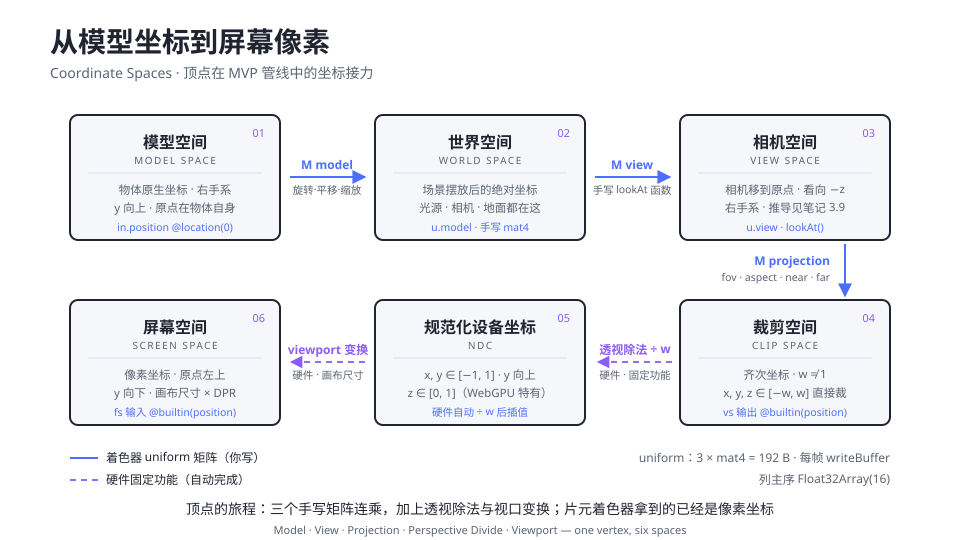

# 2.1 2D 与 3D 空间变换

> Day 2 · 模块 1 · 约 1 小时
> 理论对照：《GAMES101 现代计算机图形学课程笔记》第 3 章「变换」（3.8 MVP 变换总览 / 3.9 视图变换 / 3.10 投影变换）

demo 01 的三角形活得很好，但它住在一个假世界里：顶点坐标直接就是 NDC，等于把「摆好姿势、架好相机、按下快门」三步全部略过。今天要画一个真的 3D 立方体，它能自转、能被你拖拽着从任意角度端详、面与面之间有正确的遮挡关系——这一切从一行代码开始：`out.position = u.mvp * vec4f(position, 1.0)`。这句着色器代码背后是一条完整的空间接力链，本模块把它逐段拆开，并且在 JavaScript 里亲手写出每一棒。

课程笔记第 3 章用「拍照」类比过这三步：摆物体（Model）、放相机（View）、按快门（Projection）。推导——齐次坐标为什么用 w 分量区分点与向量、view 矩阵如何用正交矩阵的转置求逆——都在笔记 3.3 与 3.9 里，这里不重复，篇幅全部留给 WebGPU 侧的落地细节。

## GPU 只认 NDC，所以需要一整条链

顶点缓冲里存的立方体角点是 `[-1, -1, -1]` 到 `[1, 1, 1]`——模型空间，原点在物体自身，y 向上。GPU 的光栅化器却只认识 NDC：x、y ∈ [-1, 1]，z ∈ [0, 1]（WebGPU 特有，后面细说）。中间隔着的全部工作，就是把「物体自己的坐标」翻译成「屏幕上的像素」，而翻译员是三个矩阵加两步硬件固定操作。



图里有七个空间，上半部分三个由你手写的 uniform 矩阵负责（蓝色实线），下半部分由硬件固定功能完成（紫色虚线）。值得盯住三件事。第一，裁剪空间与 NDC 是被「透视除法」隔开的两级：顶点着色器输出的是齐次坐标 `vec4f`，w ≠ 1，硬件接着做 ÷w 才得到 NDC——透视感全部来自这一除。第二，`@builtin(position)` 在 vs 输出侧是裁剪坐标，到了 fs 输入侧已经是屏幕像素坐标（原点左上、y 向下），同一个 builtin 在两级语义不同。第三，WebGPU 的 NDC z 范围是 [0, 1]：近平面映到 0、远平面映到 1，而 OpenGL 是 [-1, 1]。这半个区间的差别会直接改变透视矩阵的第三行，抄错版本的矩阵深度关系会整体错乱。

| 空间 | 输入 → 输出 | 谁负责 | 范围与方向 |
|------|------------|--------|-----------|
| 模型 → 世界 | Model 矩阵 | JS 手写，uniform 上传 | y 向上，右手系 |
| 世界 → 相机 | View 矩阵 | JS 手写（lookAt） | 相机在原点，看向 −z |
| 相机 → 裁剪 | Projection 矩阵 | JS 手写（perspective） | x, y, z ∈ [−w, w] |
| 裁剪 → NDC | 透视除法 ÷w | 硬件自动 | x, y ∈ [−1, 1]，z ∈ [0, 1] |
| NDC → 屏幕 | viewport 变换 | 硬件自动（画布尺寸 × DPR） | 原点左上，y 向下 |

## 列主序：手写矩阵的第一约定

三个 demo 全部自带一份手写 mat4 工具函数，刻意不引 gl-matrix 这类数学库。列主序约定正是这个模块要看清的东西，库会把它藏起来。约定本身一句话：`Float32Array(16)` 的 0–3 号元素是矩阵第 1 列，4–7 号是第 2 列，平移量住在第 4 列（下标 12–14）。WGSL 的 `mat4x4f` 内存布局与此一致，所以 JS 侧算好的 16 个 float 可以整块拷进 uniform，着色器里 `u.mvp * vec4f(p, 1.0)` 的「矩阵在左、列向量在右」方向天然对上。

一个 4×4 矩阵在内存里的样子，配上行列标注：

```text
列主序 Float32Array(16)——下标即列 × 4 + 行
        第 1 列     第 2 列     第 3 列     第 4 列
      ┌──────────┬──────────┬──────────┬──────────┐
第 1 行│ m[0]     │ m[4]     │ m[8]     │ m[12]=tx │
第 2 行│ m[1]     │ m[5]     │ m[9]     │ m[13]=ty │
第 3 行│ m[2]     │ m[6]     │ m[10]    │ m[14]=tz │
第 4 行│ m[3]     │ m[7]     │ m[11]    │ m[15]=1  │
      └──────────┴──────────┴──────────┴──────────┘
平移量在第 4 列：m[12..14]——这是「列主序」最直观的证据
```

乘法方向也随之确定：`mat4Multiply(a, b)` 算的是数学记号下的 a·b，作用顺序是向量先被 b 作用再被 a 作用。于是 MVP 的组合写作 `P·V·M`——离顶点最近的 M 最先起作用，和「先摆好物体、再放相机、最后投影」的直觉一致。

## How：demo 01 的矩阵逐个手写

### 乘法：三重循环就是定义本身

```ts
function mat4Multiply(a: Float32Array, b: Float32Array): Float32Array {
  // 结果 = a · b（数学记号）：向量先被 b 作用，再被 a 作用
  const out = new Float32Array(16);
  for (let col = 0; col < 4; col++) {
    for (let row = 0; row < 4; row++) {
      let sum = 0;
      for (let k = 0; k < 4; k++) {
        sum += a[k * 4 + row] * b[col * 4 + k];
      }
      out[col * 4 + row] = sum;
    }
  }
  return out;
}
```

外两层循环遍历结果的每个位置 `(col, row)`，内层按「a 的第 row 行」点乘「b 的第 col 列」。`a[k * 4 + row]` 取的是 a 的第 k 列第 row 行——列主序下「先算列偏移再 加行」的取数方式会贯穿所有矩阵函数。

### 透视矩阵：WebGPU 版，别抄 OpenGL

```ts
function mat4Perspective(fovY: number, aspect: number, near: number, far: number): Float32Array {
  // WebGPU 的 NDC z ∈ [0, 1]（OpenGL 是 [-1, 1]），直接抄 OpenGL
  // 教材里的矩阵会导致深度关系整体错乱，这一份是 WebGPU 版
  const f = 1 / Math.tan(fovY / 2);
  const m = new Float32Array(16);
  m[0] = f / aspect;
  m[5] = f;
  m[10] = far / (near - far);
  m[11] = -1; // w = -z_view：把「相机前方」变成正的 w
  m[14] = (near * far) / (near - far);
  return m;
}
```

四个参数与笔记 3.10、3.11 的定义一致：`fovY` 是垂直视场角，`aspect` 是宽高比，`near` 与 `far` 是两个裁剪面到相机的距离。矩阵的推导思路（先把视锥体挤压成长方体再做正交投影）见笔记 3.10，落到代码上是五个非零元素。`m[11] = -1` 在第 3 列第 4 行，它的作用是让输出的 w 等于 −z_view——相机看向 −z，于是相机前方的物体 w 为正，透视除法才有意义。`m[10]` 与 `m[14]` 那对分数负责把 z 从 [near, far] 压进 [0, 1]，这正是 WebGPU 版与 OpenGL 版的差别所在。

near 与 far 有两条硬规则：都必须为正，且 near < far。demo 里取 0.1 与 100，这个比值还决定了深度精度，2.2 会拿它做实验。

### lookAt：把相机搬到原点

```ts
function mat4LookAt(
  eye: readonly number[],
  target: readonly number[],
  up: readonly number[],
): Float32Array {
  // 右手系 view：把相机搬到原点、转向 -z。列向量推导见 GAMES101 笔记 3.9
  let zx = eye[0] - target[0];
  let zy = eye[1] - target[1];
  let zz = eye[2] - target[2];
  let len = Math.hypot(zx, zy, zz) || 1;
  zx /= len;
  zy /= len;
  zz /= len;
  // x = up × z（相机的右方向），再 y = z × x（与 up 正交的真正上方向）
  let xx = up[1] * zz - up[2] * zy;
  let xy = up[2] * zx - up[0] * zz;
  let xz = up[0] * zy - up[1] * zx;
  len = Math.hypot(xx, xy, xz) || 1;
  xx /= len;
  xy /= len;
  xz /= len;
  const yx = zy * xz - zz * xy;
  const yy = zz * xx - zx * xz;
  const yz = zx * xy - zy * xx;

  const m = new Float32Array(16);
  m[0] = xx; m[1] = yx; m[2] = zx; m[3] = 0; // 第 1 列 = 相机 x 轴
  m[4] = xy; m[5] = yy; m[6] = zy; m[7] = 0; // 第 2 列 = 相机 y 轴
  m[8] = xz; m[9] = yz; m[10] = zz; m[11] = 0; // 第 3 列 = 相机 z 轴（后方）
  m[12] = -(xx * eye[0] + xy * eye[1] + xz * eye[2]);
  m[13] = -(yx * eye[0] + yy * eye[1] + yz * eye[2]);
  m[14] = -(zx * eye[0] + zy * eye[1] + zz * eye[2]);
  m[15] = 1;
  return m;
}
```

思路是笔记 3.9 的「核心观察」：相机和所有物体一起移动，照片不变——所以干脆把世界反向搬，让相机停在原点、看向 −z、上方向 +y。代码里先取 z 轴（eye 指向 target 的反方向，即相机的「后方」），再用 up 与 z 叉乘出相机的右方向 x，最后 z × x 得到与两者正交的真正上方向 y——三步叉乘保证三个轴严格正交，即使传入的 up 稍微歪一点也会被修正。矩阵本体只有两块：旋转部分是三个基向量按列摆放（注意第 1 列的三个元素是 x 轴的 xyz），平移部分是三个轴与 eye 的负点积。

### 旋转、平移、缩放：模型动画的全部零件

```ts
function mat4RotateY(angle: number): Float32Array {
  const c = Math.cos(angle);
  const s = Math.sin(angle);
  const m = new Float32Array(16);
  m[0] = c; m[2] = -s; // 第 1 列
  m[5] = 1;
  m[8] = s; m[10] = c; // 第 3 列
  m[15] = 1;
  return m;
}

function mat4Translate(x: number, y: number, z: number): Float32Array {
  // 平移量住在第 4 列（下标 12–14）：列主序最直观的证据
  const m = new Float32Array(16);
  m[0] = 1;
  m[5] = 1;
  m[10] = 1;
  m[15] = 1;
  m[12] = x;
  m[13] = y;
  m[14] = z;
  return m;
}
```

绕 y 轴的旋转矩阵在笔记 3.7 有完整推导，注意它的形式与绕 x、z 轴不同（sin 的符号位置反着），列主序下 `m[2] = -s` 与 `m[8] = s` 分别落在第 1、3 列。平移与缩放没有推导负担，它们是「矩阵左上 3×3 装线性部分、第 4 列装平移」这一布局的直接应用。demo 01 的帧循环里，模型矩阵把这三者叠起来：

```ts
const model = mat4Multiply(
  mat4Translate(0, bob, 0),
  mat4Multiply(mat4RotateY(cubeAngle), mat4Scale(breathe)),
);
const view = mat4LookAt(eye, [0, 0, 0], [0, 1, 0]);
const proj = mat4Perspective(
  (50 * Math.PI) / 180,
  chrome.width / chrome.height,
  0.1,
  100,
);
// 组合顺序 P·V·M：向量最先被 M 作用
const mvp = mat4Multiply(proj, mat4Multiply(view, model));
```

从右往左读：立方体先缩放呼吸、再绕 y 自转、最后上下浮动——作用顺序就是书写顺序的倒序。相机位置 `eye` 来自拖拽的球坐标（theta、phi、radius），每帧与目标值做插值，让拖拽手感带上阻尼。

## uniform 打包：80 字节与 16 字节对齐

矩阵算好就要送给着色器。demo 01 的 uniform 结构是 WGSL 里的 `struct Uniforms { mvp: mat4x4f, params: vec4f }`，共 80 字节。讲义 1.6 讲过 uniform 地址空间的对齐规则：struct 整体 16 字节对齐、`vec3f` 实际占 16 字节。`mat4x4f` 四列各 16 字节、天然对齐，`vec4f` 收尾也不用补——80 字节正好是 16 的倍数，无需手动 padding。JS 侧准备一个 `Float32Array(20)`，每帧把 16 个矩阵元素整块 `set` 进去再 `writeBuffer`：

```ts
uniforms.set(mvp, 0); // 整块列主序矩阵直接拷进 uniform
uniforms[16] = t;
device.queue.writeBuffer(uniformBuffer, 0, uniforms);
```

矩阵在 JS 侧的内存布局与 WGSL 一致，所以拷贝不需要任何转置——这是列主序约定带来的第二份红利。

## 深度测试：遮挡关系的裁决者

有了 MVP 只解决「画在哪」，立方体 12 个三角形谁遮谁还需要裁决。答案在渲染管线的固定功能里：一张逐像素记录深度的纹理（depth texture）加一次比较。WebGPU 侧一共四件事，demo 01 全做了。

创建管线时声明深度状态，格式 `depth24plus`（24 位深度 + 模板位），写入开启，比较规则 `less`——深度值更小（离相机更近）的片元才能通过：

```ts
depthStencil: {
  format: 'depth24plus',
  depthWriteEnabled: true,
  depthCompare: 'less', // 深度值更小（离相机更近）才能通过
},
```

创建一张与画布同尺寸的 depth texture，只当渲染目标用。它必须逐像素跟画布一致，所以画布一变就要重建——这正是 `createChrome` 留了 `onResize` 回调的原因：

```ts
let depthTexture: GPUTexture | null = null;
function ensureDepth(w: number, h: number) {
  if (depthTexture && depthTexture.width === w && depthTexture.height === h) return;
  depthTexture?.destroy();
  depthTexture = device.createTexture({
    size: [w, h],
    format: 'depth24plus',
    usage: GPUTextureUsage.RENDER_ATTACHMENT,
  });
}
```

`ensureDepth` 被挂进 chrome 的 `onResize`，同时帧循环里也兜底调用一次——chrome 的尺寸回调可能在 `initGPU` 完成之前触发，所以回调里用 `gpuReady` 旗子拦住 GPU 尚未就绪的调用。渲染时把它的 view 挂进 `depthStencilAttachment`，清屏值 1.0 表示「最远」，`'less'` 规则下只有更近的片元才写入：

```ts
depthStencilAttachment: {
  view: depthTexture.createView(),
  depthClearValue: 1.0, // 1 = 最远；'less' 比较下「更近」才写入
  depthLoadOp: 'clear',
  depthStoreOp: 'store',
},
```

注意 NDC z ∈ [0, 1] 在这里兑现：深度 0 最近、1 最远，与 `depthClearValue: 1.0` 的语义正好衔接。如果管线忘了配 `depthStencil` 而渲染 pass 挂了 depth attachment，画面不会报错，只会看到面片乱序穿插——这类「无报错的错」在 GPU 编程里最磨人。

## 常见坑

| 报错/症状 | 原因 |
|-----------|------|
| `... have differing sizes ...`（depth 与 color attachment） | depth texture 尺寸与画布不一致：必须在 `onResize` 里重建，且长宽用物理像素（chrome 已含 DPR） |
| （无报错）面片乱序穿插 | pipeline 忘配 `depthStencil`，或 `depthWriteEnabled` 没开——深度测试根本没参与 |
| （无报错）画面全空 | near/far 反了（必须 near < far 且均为正），或 `cullMode` 与三角形绕序不匹配（见 2.2） |
| 深度关系整体错乱、面忽隐忽现 | 透视矩阵抄了 OpenGL 版（z ∈ [-1, 1]），WebGPU 的 NDC z 是 [0, 1]，`m[10]`、`m[14]` 都不同 |
| 立方体看起来被「压扁」 | `mat4Perspective` 的 aspect 传了画布 CSS 尺寸比值以外的值，或忘了除法（用 `chrome.width / chrome.height`） |
| uniform 读出来矩阵错位 | JS 侧做了转置或按行主序写矩阵——`writeBuffer` 原样搬运字节，两侧约定必须同为列主序 |

## Checkpoint

- 能按顺序说出七个空间的名字，以及每两级之间由谁负责（uniform 矩阵或硬件固定功能）
- 能画出列主序 `Float32Array(16)` 的布局图，标出平移量的下标位置（12–14）
- 能解释 `m[11] = -1` 让 w = −z_view 的作用，以及为什么透视除法能产生近大远小
- 能说出 WebGPU NDC 的 z 范围与 OpenGL 的差别，以及抄错矩阵的后果
- 能列出深度测试的四个 WebGPU 侧步骤：pipeline 的 `depthStencil`、同尺寸 depth texture、`onResize` 重建、pass 的 `depthStencilAttachment`
- 能默写 MVP 组合顺序 `P·V·M` 并解释为什么作用顺序与书写顺序相反

## 相关材料

- demo：`demos/day2/01-mvp-cube/`（本模块与 2.2 的实验对象，重点读 `main.ts` 的矩阵段与 depth 段）
- 理论：GAMES101 笔记第 3 章（MVP 总览 3.8、视图 3.9、投影 3.10、FOV 3.11），推导细节不在本讲义重复
- 延伸阅读：[webgpufundamentals.org · Matrices](https://webgpufundamentals.org/webgpu/lessons/webgpu-matrices.html)——同一套列主序约定的英文对照实现，可交叉验证手写矩阵
- 下一模块：2.2 拿这个立方体做三组「改一行」实验，观察剔除与深度精度的行为
