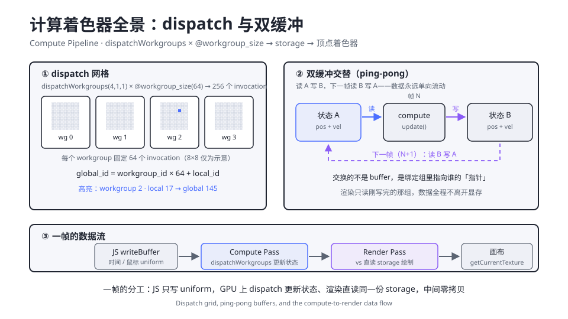

# 2.6 计算着色器入门

> Day 2 · 模块 6 · 约 60 分钟
> 理论对照：无直接章节——计算着色器不在 GAMES101 的课程范围内，它是 Vulkan / Metal / DX12 一代的现代 API 能力；硬件思想回看讲义 1.1 的 SIMT 与线程束

WebGL 时代想在 GPU 上跑一段与画面无关的通用计算，要把数据伪装成纹素、用片元着色器读写、再从颜色通道里把结果解码回来。2026 年再看这个 hack 像在用算盘模拟寄存器。WebGPU 把计算管线做成一等公民：一条 `dispatchWorkgroups` 调用，几万个线程同时执行你写的一个函数，数据全程待在显存里。lusion 的布料、igloo 的粒子 footer、本模块之后的全部 GPGPU 内容都建立在这条管线上。

## 渲染管线之外的第二条管线

渲染管线的骨架是「顶点 → 光栅化 → 片元」，每一级都被图形学的固定语义框住：顶点必须产出裁剪坐标，片元必须产出颜色。计算管线把这层语义全部剥掉，只剩一个普通函数——给它一个线程编号，它算什么都行。这就是两条管线的分工：渲染管线负责把数据画出来，计算管线负责让数据动起来。

WebGPU 侧的创建只有三件套，比渲染管线还短：

```ts
const pipeline = device.createComputePipeline({
  layout: 'auto', // 与渲染管线同款：从着色器的绑定声明自动推导
  compute: { module, entryPoint: 'update' }, // 没有	vertex/fragment，只有一个入口
});
```

WGSL 侧的入口用 `@compute` 标记，`@workgroup_size` 声明每个工作组的大小：

```wgsl
@compute @workgroup_size(8, 8)
fn update(@builtin(global_invocation_id) gid: vec3u) {
  // gid 就是「我是第几号线程」——一个函数被同时调用几万次，每次编号不同
}
```

## dispatch、workgroup 与全局编号

三层概念把「几万个线程」组织起来。invocation 是最小单位，一个 invocation 执行一次函数体；workgroup 是一组一起调度的 invocation，大小由 `@workgroup_size` 声明；dispatch 的参数是 workgroup 的个数。总线程数是两者的乘积——这是初学阶段最容易算错的一笔账：

```text
dispatchWorkgroups(4, 1, 1) × @workgroup_size(64)
= 4 个 workgroup × 64 个 invocation = 256 个 invocation

workgroup      0            1            2            3
              ┌────────────┬────────────┬────────────┬────────────┐
local_id      0 … 63       0 … 63       0 … 63       0 … 63
global_id     0 … 63       64 … 127     128 … 191    192 … 255
              └────────────┴────────────┴────────────┴────────────┘
global_id = workgroup_id × workgroup_size + local_id
```

`@global_invocation_id` 是三维向量 `vec3u`，三维 dispatch 与三维 workgroup_size 逐维相乘再相加。网格数据天然适合 `(x, y)` 两维——demo 05 的 64×64 点阵用 `@workgroup_size(8, 8)` 配 `dispatchWorkgroups(8, 8)`，每个 invocation 拿到的 `gid.xy` 正好是一枚点的格点坐标，索引就是一行算术：

```wgsl
let i = gid.y * GRID + gid.x; // 展平成线性索引，与 JS 的二维数组同构
```

一个必须内化的事实：invocation 之间没有执行顺序保证。硬件按线程束调度，第 200 号可能先于第 0 号跑完，两个 invocation 之间也不能直接看到对方的写入。想要通信，要么用 `workgroupBarrier()` 在 workgroup 内部同步，要么把依赖拆到两次 dispatch。前端直觉里的「循环从 0 到 255」在这里不成立——把 invocation 当成 `Promise.all` 里的并发任务来想才对。

## storage：计算管线的存取窗口

uniform 是广播（每个 invocation 读同一份只读数据），storage 是分账本（每个 invocation 读写自己名下的那段）。地址空间声明成 `read_write`，dispatch 结束后写入就留在显存里：

```wgsl
@group(0) @binding(0) var<storage, read_write> pts: array<vec4f>;
```

JS 侧的对应物是一块带 `STORAGE` 用途的 buffer。用途标志是许可证，建 buffer 时漏了 `GPUBufferUsage.STORAGE`，绑定那一刻就是 validation error——这是本模块的坑位榜首。

计算与渲染在同一帧里汇合：同一个 encoder 先录 compute pass 再录 render pass，一次 `submit` 全部提交。渲染管线的顶点着色器把同一块 buffer 声明成 `var<storage, read>`，直读刚被 compute 更新过的数据，中间零拷贝。这条「计算 → 渲染」的数据流是 Day 2 后半程的主干道。



图里三个面板对应本模块的三个侧面。左侧 dispatch 网格把「4 × 64 = 256」的编号账算清楚；右侧一帧的数据流展示了 JS 只写 uniform、GPU 上计算与渲染共享 storage 的分工。中间的双缓冲是 2.7 的主角，这里先立概念：一个 invocation 既读又写同一个 buffer 的同一个元素是数据竞争，解法是准备两份状态——帧 N 读 A 写 B，帧 N+1 读 B 写 A。渲染永远读刚写完的那份，数据单向流动，不需要任何同步原语。

## How：demo 05 逐段精讲

```bash
npm run dev
# http://localhost:5173/demos/day2/05-compute-basics/index.html
```

demo 05 的可视对象是一片 64×64 的青色点阵，噪声场让它缓慢呼吸，鼠标扫过去点被驱散再弹回。全部状态在一个 storage buffer 里——每点一个 `vec4f`，`(x, y, vx, vy)` 打包，4096 个点共 64KB：

```ts
const GRID = 64;
const COUNT = GRID * GRID; // 4096 个点

const stateBuffer = device.createBuffer({
  size: COUNT * 16,
  usage: GPUBufferUsage.STORAGE,
});
```

同一个 WGSL 模块提供两个计算入口。`init` 只在启动时跑一次，把点摆回格点；`update` 每帧跑一次做积分。两个入口对应两条 compute pipeline，各配各的绑定组：

```ts
const initPipeline = device.createComputePipeline({
  layout: 'auto',
  compute: { module: simModule, entryPoint: 'init' },
});
const updatePipeline = device.createComputePipeline({
  layout: 'auto',
  compute: { module: simModule, entryPoint: 'update' },
});
```

`init` 的 body 一行，却是「初始化也在 GPU 上做」的完整示范——JS 侧从此不碰这块 buffer，不 writeBuffer、不读回：

```wgsl
@compute @workgroup_size(8, 8)
fn init(@builtin(global_invocation_id) gid: vec3u) {
  // 维度与 dispatch 不整除时，越界的 invocation 必须自己兜底
  if (gid.x >= GRID || gid.y >= GRID) { return; }
  let i = gid.y * GRID + gid.x;
  pts[i] = vec4f(homeOf(gid.xy), 0.0, 0.0);
}
```

开头那行 guard 不是仪式。`dispatchWorkgroups(8, 8)` × `@workgroup_size(8, 8)` 在这里恰好整除，但把 GRID 改成 60 就有 4×64 个越界 invocation——它们照样执行函数体，读写的索引已经越出数组，轻则数据错乱、重则 validation error。只要「数据总数不是 workgroup 尺寸整数倍」，guard 就必须写。

`update` 是 2.7 粒子系统的最小原型：弹簧拉回格点、噪声给漂移、鼠标给斥力，半隐式欧拉积分推进。渲染侧的顶点着色器直读同一块 buffer，把每个点展开成一个 6 顶点小 quad——WebGPU 的 point-list 恒为 1 像素，想要可见的点必须自己展开，这套 quad 技巧 2.7 展开。帧循环里两条 pass 的先后就是数据流的方向：

```ts
const cpass = encoder.beginComputePass();
cpass.setPipeline(updatePipeline);
cpass.setBindGroup(0, updateBindGroup);
cpass.dispatchWorkgroups(GRID / 8, GRID / 8);
cpass.end();

const rpass = encoder.beginRenderPass({ /* ... */ });
rpass.setPipeline(renderPipeline);
rpass.setBindGroup(0, renderBindGroup);
rpass.draw(6, COUNT); // 6 顶点 quad × 4096 实例
rpass.end();

device.queue.submit([encoder.finish()]); // compute 与 render 一次提交
```

## 常见坑

| 报错/症状 | 原因 |
|-----------|------|
| `Buffer usage (0x20) does not contain allowed usage flags (0x80)` | 建 buffer 的 usage 漏了 `GPUBufferUsage.STORAGE`（0x80）；只给了 UNIFORM（0x40）或 COPY_DST |
| dispatch 后立刻 `mapAsync` 读到旧数据 | `submit` 是异步的：命令还没执行完；要读回先 `await device.queue.onSubmittedWorkDone()` |
| 点阵只剩左上角一块 / 相邻数据互相覆盖 | invocation 越界没有 guard（`gid.x >= GRID` 就 return），或索引 `gid.x * GRID + gid.y` 把行列写反 |
| `Entry point 'update' doesn't exist` | entryPoint 字符串与 WGSL 的 `fn` 名不一致；本 demo 有 `init` / `update` 两个入口 |
| 改了 storage 里的数据但画面不动 | 渲染管线的绑定组还挂在另一块 buffer 上，或渲染管线声明成 `read_write` 却没有同步屏障——同一 pass 内读写顺序无保证 |

## Checkpoint

- 能算出 `dispatchWorkgroups(4,1,1)` × `@workgroup_size(64)` 产生多少个 invocation，以及 global id 的映射公式
- 能解释 invocation 之间为什么没有顺序保证，什么时候需要 `workgroupBarrier`
- 能说出 uniform 与 storage 两个地址空间在「广播 vs 分账本」上的区别
- 能把一个 64×64 的网格映射成 dispatch 与 workgroup_size 的组合，并解释为什么 guard 必须写
- 能描述「JS 写 uniform → compute 更新 storage → render 直读」的一帧数据流

## 相关材料

- demo：`demos/day2/05-compute-basics/`（本模块全程对照）
- 图：`assets/diagrams/compute-pingpong.svg`（dispatch 网格与双缓冲全景）
- 硬件背景：讲义 1.1 的 SIMT 一节——workgroup 与线程束的硬件对应
- 延伸阅读：[WebGPU buffer upload best practices](https://toji.dev/webgpu-best-practices/buffer-uploads)（toji.dev 系列中讲缓冲区上传时机的一篇）
