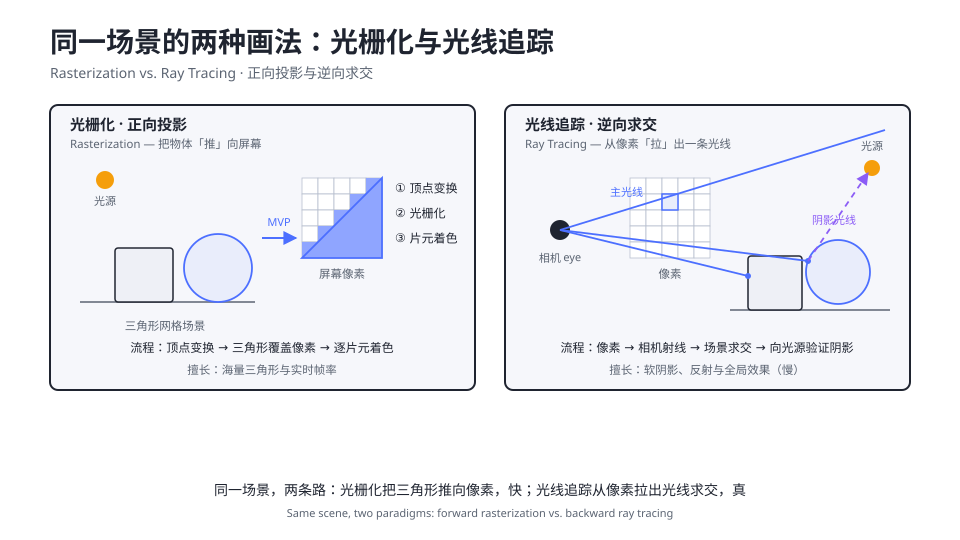

# 2.8 光线追踪与 Ray Marching

> Day 2 · 模块 8 · 约 30 分钟
> 理论对照：《GAMES101 现代计算机图形学课程笔记》第 7 章「光线追踪」——Whitted 式递归求交与阴影光线

2.4 的立方体立在场景里，但它的影子呢？没有。光栅化只问「这个像素被哪个三角形盖住」，一个物体对另一个物体的遮挡、镜面里的世界、玻璃后的折射，这些「光线要弹好几次才知道答案」的效果，正向投影的管线天生算不了——每个片元只看得见自己。Day 3 的后处理能补一部分（bloom、SSAO），补不了物理正确的那部分。要真影子，就得换一条路：从像素反向发射一条光线，去场景里找答案。

## 两种范式的对照

光栅化把顶点「推」向屏幕，光线追踪从像素「拉」出一条光线。同一个场景，两条路的走法如下——这帧图值得盯满一分钟，Day 2 全部的渲染内容都发生在左侧，右侧是另一整个世界：



左侧三步走完：顶点变换、三角形覆盖像素、逐片元着色，每一步都是 GPU 硬件固定流程，快得离谱，但片元之间互相看不见。右侧从一枚像素出发：构建相机射线 → 场景求交 → 命中点再向光源发射阴影光线验证可见性——要阴影有阴影，多弹几次就有反射与折射，代价是每一枚像素都要做一整串求交。GAMES101 第 7 章的 Whitted 光线追踪讲的就是这套递归树；实时光线追踪硬件（RTX）2026 年还没进浏览器，但思想有一个便宜的近似——Ray Marching，把「精确求交」换成「一步步试探」。

## SDF：距离场与试探步进

SDF（Signed Distance Function）返回任意一点到最近表面的距离，内部为负、外部为正。球心在原点、半径 r 的球，SDF 就是 `length(p) - r`——一行。复杂造型靠加减与 smooth min 融合，圆角盒和几个球融出有机雕塑：

```wgsl
fn sdSphere(p: vec3f, r: f32) -> f32 {
  return length(p) - r;
}

// smooth min：k 控制两个形状的「融化」宽度
fn smin(a: f32, b: f32, k: f32) -> f32 {
  let h = clamp(0.5 + 0.5 * (b - a) / k, 0.0, 1.0);
  return mix(b, a, h) - k * h * (1.0 - h);
}
```

Ray Marching 的核心只有一句：站在当前点，问 SDF「离最近的表面还有多远」，就前进多远。因为到最近表面的距离是安全步长——不可能一脚跨过任何表面。GLSL 版的完整推导你在《Three.js 创意 3D 课程笔记》第 16 课已经走过一遍，这里把同一套思想迁到 WebGPU，新增的只有两处工程细节：全屏三角形的画法与相机射线的构建。

```wgsl
fn march(ro: vec3f, rd: vec3f) -> f32 {
  var t = 0.0;
  for (var i = 0; i < 90; i++) {
    let d = map(ro + rd * t).x;
    if (d < 0.001 * t) { return t; } // 足够近：命中
    t += d;
    if (t > 22.0) { break; }        // 足够远：放弃
  }
  return -1.0;
}
```

## How：demo 07 逐段精讲

```bash
npm run dev
# http://localhost:5173/demos/day2/07-raymarching/index.html
```

整个 demo 没有顶点缓冲、没有 uniform 之外的数据，draw 只有一次、三个顶点。覆盖全屏的技巧是一个「伸出」NDC 边界的大三角形——`(-1,-1) (3,-1) (-1,3)` 三点围出的直角三角形被裁剪后恰好铺满屏幕，比两个三角形拼 quad 少一条对角线上的插值不连续：

```wgsl
@vertex
fn vs(@builtin(vertex_index) i: u32) -> VOut {
  var p = array<vec2f, 3>(
    vec2f(-1.0, -1.0),
    vec2f(3.0, -1.0),
    vec2f(-1.0, 3.0),
  );
  var out: VOut;
  out.position = vec4f(p[i], 0.0, 1.0);
  out.ndc = p[i]; // 光栅化插值后，屏幕内的取值正好是 -1..1
  return out;
}
```

顶点越界不是 bug 是设计：屏幕内的每个片元拿到的插值 `ndc` 恰好是 `-1..1`，这就是片元着色器里构建相机射线的原料。相机基（`fwd / right / up`）与半视野角一拼，每个像素一条独立射线——光栅化管线的 vs/fs 分工在 raymarching 里被压扁成一个 fs：

```wgsl
let fwd = normalize(ta - ro);
let right = normalize(cross(fwd, vec3f(0.0, 1.0, 0.0)));
let up = cross(right, fwd);
let halfH = tan(0.38); // 半视野角 ≈ 21.8°
let rd = normalize(fwd + right * in.ndc.x * halfH * u.params.y + up * in.ndc.y * halfH);
```

命中之后的着色是 2.4 的展开：法线用四面体差分（四次 SDF 采样），阴影不用等——沿光源方向再做一次 march，中途离遮挡物越近影子越软，这就是软阴影；AO 用沿法线的四次抬升采样近似。距离雾按 `t` 的平方衰减，把远处融进深空底色。场景在 `map` 里描述完：无限地面 `p.y` 加一个圆角盒与三个球的 smin 雕塑，改造型改的全是这一个函数——SDF 场景没有网格，分辨率无限，这是它相对三角网格的根本差异。

## 常见坑

| 报错/症状 | 原因 |
|-----------|------|
| 只画出一个三角形 / 半屏 | 大三角形顶点写成 `(-1,-1)(1,-1)(1,1)` 这类普通 quad 尺寸，没「伸出」NDC 范围 |
| 画面整体过曝、阴影发灰 | 射线方向没 `normalize`，命中距离与光照计算全乱 |
| 远处地面噪点闪烁、表面穿透 | 步数上限太小（< 60 就要小心）或命中阈值太小；地面掠射角本就费步数 |
| 法线差分报错或表面像断层 | 差分步长 `e` 过大，0.001–0.002 之间微调 |

## Checkpoint

- 能说清光栅化算不出阴影/反射的原因（片元互相不可见）与 RT 的解法（像素反向求交）
- 能写出覆盖全屏的大三角形顶点，并解释为什么插值后的 NDC 恰好是 `-1..1`
- 能解释步进循环为什么安全（SDF 即安全步长）与命中判据为什么用 `0.001·t`（相对误差防远处闪烁）
- 能把软阴影讲成「朝光源再 march 一次」，把 AO 讲成「沿法线抬升采样」

## 相关材料

- demo：`demos/day2/07-raymarching/`（本模块全程对照）
- 图：`assets/diagrams/raster-vs-raytracing.svg`（两种范式对照）
- 理论：GAMES101 笔记第 7 章「光线追踪」，Whitted 式递归与阴影光线
- GLSL 前置：《Three.js 创意 3D 课程笔记》第 16 课「Ray Marching 与 SDF」
- 延伸：Inigo Quilez 的 [distance functions 全表](https://iquilezles.org/articles/distfunctions/)——造型公式字典
