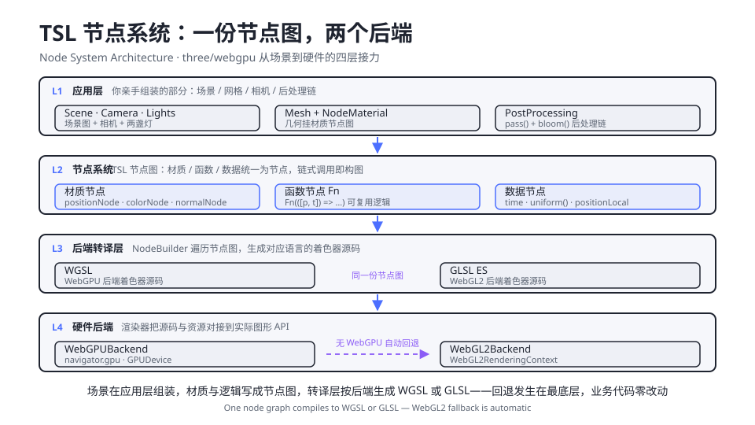
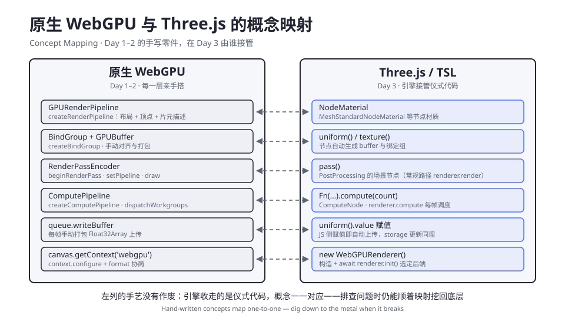

# 3.1 WebGPURenderer 架构与迁移策略

> Day 3 · 模块 1 · 约 1 小时
> 理论对照：《Three.js 创意 3D 课程笔记》第 10–13 课（GLSL 基础 / 数学函数 / 噪声函数 / 高级 Shader 效果）——着色知识原样有效，载体从 WGSL 字符串换成节点

Day 2 的 demo 06 一共 473 行：main.ts 274 行，particles.wgsl 139 行，render.wgsl 60 行。其中描述「一万颗粒子如何运动」的代码——星系初始分布、相机轨道、WGSL 里的力场积分——加起来不足一百行。剩下那三百多行里，有 64 行是手写的 mat4 工具与射线求交，它们与 demo 04 里的同名函数几乎逐字相同，这是两天里你第二次复制这一段；device 与 context 的初始化写了七遍，encoder 的 begin/end 编排也写了七遍。仪式代码在第一个 demo 里是学费，到第七个就是利息。

## Why：仪式代码的账单

把 demo 06 的 main.ts 按性质拆开，账目如下：

| 部分 | 行数（约） | 性质 |
|------|-----------|------|
| import 与 chrome 外壳 | 17 | 每个 demo 重复 |
| device / context 初始化 | 8 | 每个 demo 重复 |
| 双缓冲 buffer + 初始星系分布 | 23 | 后半段的分布算法才是作品 |
| 两组 uniform buffer | 11 | 仪式 |
| compute 管线 + 绑定组 × 2 | 16 | 仪式 |
| render 管线 + 绑定组 × 2 | 28 | 仪式 |
| 手写 mat4 + lookAt + 射线求交 | 64 | demo 04 的逐字拷贝 |
| 鼠标事件接线 | 14 | 仪式 |
| 帧循环：相机轨道 + uniform 打包 + encoder 编排 | 85 | 轨道约 27 行是作品，其余是仪式 |

七成左右的代码在做「让 WebGPU 跑起来」这件事，而非「让这个作品好看」。1.2 讲对象模型时说过，device、pipeline、bindGroup 这些抽象是为「一次性成本」设计的——问题在于写创意网站时你每周都要付一次，而且每次都一样。更隐蔽的代价是复用：手写的 waveField 是一段 WGSL 字符串，下个项目要用，拷文件；想让它同时兼容没有 WebGPU 的用户，再抄一份 GLSL。仪式代码收走之后，剩下的才全是作品。

## What：three/webgpu 的四层架构

three 0.186.0 把 WebGPU 支持放在两个入口里。`import * as THREE from 'three/webgpu'` 给出 WebGPURenderer、全套 NodeMaterial，以及 Scene / Mesh / PerspectiveCamera 这些核心类的再导出；`import { Fn, uniform, time, positionLocal } from 'three/tsl'` 给出节点构造函数。一个管「场景与渲染器」，一个管「着色逻辑」，Day 3 的每个文件开头都是这两行。

架构的关键是一层统一抽象：Node System。材质（positionNode / colorNode）、光照（灯自动生成的节点）、后处理（pass / bloom）全部收敛为节点图，渲染器在首次 render 时遍历节点图生成着色器源码——WebGPU 后端生成 WGSL，WebGL2 后端生成 GLSL。你在 Day 1–2 手写的每一层，在这里都能找到接管者。



上图从上往下是数据流的四层接力。L1 是你亲手组装的场景；L2 是 TSL 节点图，材质、函数、数据统一为节点；L3 的 NodeBuilder 把同一份节点图翻译成 WGSL 或 GLSL；L4 是真正的图形 API 后端。右下那条紫色虚线是整个设计里最实用的一条路径：浏览器没有 WebGPU 时，回退发生在 L4，L1 到 L3 的代码一行不用改，控制台只有一条 warn。

原生概念与引擎 API 的逐条对应关系如下，这张表在排查问题时会反复用到：



对照着看几个关键接管者。GPURenderPipeline 对应 NodeMaterial——你不再描述管线布局，而是把节点挂到材质通道上，管线由节点图反推出来；BindGroup 对应 uniform() / texture()——节点自动生成 buffer 与绑定，对齐规则（1.6 的那套 16 字节算法）全部内置；RenderPassEncoder 对应 pass() 或常规路径的 renderer.render()；Day 2 手写的 ping-pong 双缓冲，在 3.3 会看到它坍缩成一个 storage 节点。

## How：demo 01 的整合模式

WebGPURenderer 的启动只有两个动作：构造，然后 `await init()`。init 负责选定后端（有 WebGPU 用 WebGPUBackend，没有自动落 WebGL2Backend）、配置 canvas 上下文，它必须在第一次 render 之前完成。与 chrome 外壳的整合模式如下，Day 3 所有 demo 与作业照抄这一段：

```ts
const dpr = Math.min(window.devicePixelRatio || 1, 2);
let renderer: THREE.WebGPURenderer | null = null; // onResize 首次触发早于构造，必须判空
let camera: THREE.PerspectiveCamera | null = null;
const chrome = createChrome({
  day: 3,
  index: '01',
  title: 'WEBGPU RENDERER BASIC',
  tags: ['THREE', 'WEBGPU'],
  hint: '移动鼠标：相机做轨道微视差',
  onResize: (w, h) => {
    renderer?.setPixelRatio(dpr);
    renderer?.setSize(w / dpr, h / dpr, false); // false：不改样式，chrome 已管 CSS 尺寸
    if (camera) {
      camera.aspect = w / h;
      camera.updateProjectionMatrix();
    }
  },
});

try {
  const r = new THREE.WebGPURenderer({ canvas: chrome.canvas, antialias: true });
  await r.init(); // 必须在首次 render 之前（无 WebGPU 时此处自动回退 WebGL2）
  renderer = r;
} catch (e) {
  chrome.fail(
    'RENDERER INIT FAILED',
    String(e),
    '检查浏览器是否支持 WebGPU（Chrome/Edge 113+）。WebGPURenderer 会自动回退 WebGL2，走到这里通常是 canvas 或上下文冲突。',
  );
  throw e;
}
renderer!.setPixelRatio(dpr);
renderer!.setSize(chrome.width / dpr, chrome.height / dpr, false);
```

两个细节值得说明。onResize 的回调可能在构造 renderer 之前就触发一次，所以 renderer 与 camera 都先声明为可空，回调里用 `?.` 判空。setSize 的第三个参数传 false，是因为 chrome 已经接管 canvas 的 CSS 尺寸，渲染器只改物理分辨率。init 放进 try/catch：回退到 WebGL2 是静默的，真正的异常通常来自 canvas 被占用或上下文冲突，交给 chrome.fail 展示在页面里比控制台异常友好。

场景组装部分，Day 2 的 64 行手写矩阵在这里变成三行相机代码，帧循环里只剩一句 render：

```ts
camera = new THREE.PerspectiveCamera(42, chrome.width / chrome.height, 0.1, 40);
camera.position.set(0, 0.85, 3.4);
camera.lookAt(0, 0, 0);

const torus = new THREE.Mesh(
  new THREE.TorusGeometry(0.85, 0.32, 64, 200),
  new THREE.MeshStandardNodeMaterial({
    color: 0x4c6fff, // 电蓝：Day 3 首个 demo 的主题色
    metalness: 0.45,
    roughness: 0.22,
  }),
);
scene.add(torus);

const key = new THREE.DirectionalLight(0xf4f6ff, 2.2);
key.position.set(2.5, 3, 2);
scene.add(key);

const rim = new THREE.PointLight(0x8b5cf6, 30, 0, 2);
rim.position.set(-2.6, -0.6, -2.2);
scene.add(rim);

chrome.startLoop((nowMs) => {
  const t = nowMs / 1000;
  torus.rotation.x = 0.42 + t * 0.13;
  torus.rotation.y = t * 0.21;
  // 相机轨道与鼠标微视差的十几行更新……
  renderer!.render(scene, camera);
});
```

demo 01 还有一个容易视而不见的细节——底色。画布要和 CSS 的 `#0B0E14` 对齐，但 setClearColor 不走 outputColorSpace 的 sRGB 编码，直接写工作色空间数值，所以色值要按「已是工作色空间」原样传入：

```ts
renderer!.setClearColor(new THREE.Color().setHex(0x0b0e14, THREE.LinearSRGBColorSpace), 1);
```

直接 `setHex(0x0b0e14)` 会先把色值当 sRGB 解码再转线性，画布底色就与页面 CSS 对不上，画面边缘会看到一条色差。颜色管理是引擎接管清单里最容易被忽略的一项，出问题时回到这条。

最后是选型。两天原生功底的正确用法不是「以后全手写」，也不是「从今天起忘掉」，而是能判断手上这个项目停在哪一层最划算：

| 场景 | 建议 | 理由 |
|------|------|------|
| 学习期，想看清每层 | 原生 WebGPU | 管线与绑定组的直觉只能手写获得，Day 1–2 的目的正在于此 |
| 单一全屏效果（raymarching 屏保类） | 原生 WebGPU | 一个 pipeline + 一个 uniform，引擎的场景图反而是负担 |
| 产品级创意站 | three/webgpu | 场景图、材质、后处理、自动回退全部白送，团队协作有共同语言 |
| 大规模粒子 + 复杂材质混合 | three/webgpu + TSL compute | storage 节点直通几何，3.3 展开 |
| 线上出问题要排查 | 回到原生知识 | 沿映射表往下挖，引擎的抽象不挡路 |

## 常见坑

| 现象 / 报错 | 原因 |
|------------|------|
| `Package './nodes' has been deprecated` 之类的导入警告 | three/nodes 导入路径已废弃，0.186.0 统一从 three/tsl 导入节点函数 |
| 首帧之后一片黑，控制台有 renderer 未初始化的报错 | 忘了 `await renderer.init()`；构造是同步的，后端选定与上下文配置都在 init 里 |
| 画面空白或 `Context Lost`，两个渲染器同时报警 | three 核心包的 WebGLRenderer 与 three/webgpu 的 WebGPURenderer 混用，抢同一个 canvas；Day 3 项目里只用后者 |
| `TS7016: Could not find a declaration file for 'three/webgpu'` | 0.186.0 的官方 build 未随包发布类型声明，工程用 `demos/day3/three-shims.d.ts` 的环境声明兜底，tsc --noEmit 通过 |
| 画布底色与页面 CSS 对不上，边缘有色差 | setClearColor 直写工作色空间，setHex 时要传 `THREE.LinearSRGBColorSpace` 说明色值语义 |

## TSL API 变更注记

TSL 是 three 里迭代最快的部分，小版本之间也会有破坏性变更，本课程锁定 0.186.0（package.json 精确锁定）。两个已经踩实的例子：`timerLocal` 在 0.186.0 里不存在，时间节点统一用 `time`；网上大量教程还在用 `three/nodes` 旧路径。查新 API 的可靠顺序：先看 `node_modules/three/examples/jsm/nodes/` 的实际导出，再对照官方文档的 WebGPU 迁移指南与 webgpu_tsl_editor 示例，最后才轮到搜索结果。版本敏感是 TSL 当前的真实成本，锁定版本、按锁定的版本查文档，能把成本压到最低。

## Checkpoint

- 能说出 three/webgpu 与 three/tsl 两个入口各自负责什么
- 能默写 chrome + WebGPURenderer 整合模式：可空声明、try/catch 构造、await init、onResize 判空、startLoop
- 能解释自动回退：无 WebGPU 时 init 静默落 WebGL2Backend，业务代码零改动
- 能对照映射表说出 GPURenderPipeline、BindGroup、RenderPassEncoder 在 Day 3 的接管者
- 能按选型表为一个具体项目决定走原生还是引擎，并说出理由

## 相关材料

- demo：`../../demos/day3/01-webgpu-renderer-basic/`（本模块全程对照）
- 迁移参考：three.js 官方文档 WebGPU 与 TSL 迁移指南、webgpu_tsl_editor 示例，见 `../../参考资料.md` 的「深入」分组
- 前情：讲义 1.2（对象模型与一次性成本）、2.7（demo 06 的仪式代码账单来源）
- 下一篇：`3.2-TSL节点着色语言.md`——映射表右列的节点图到底怎么写
