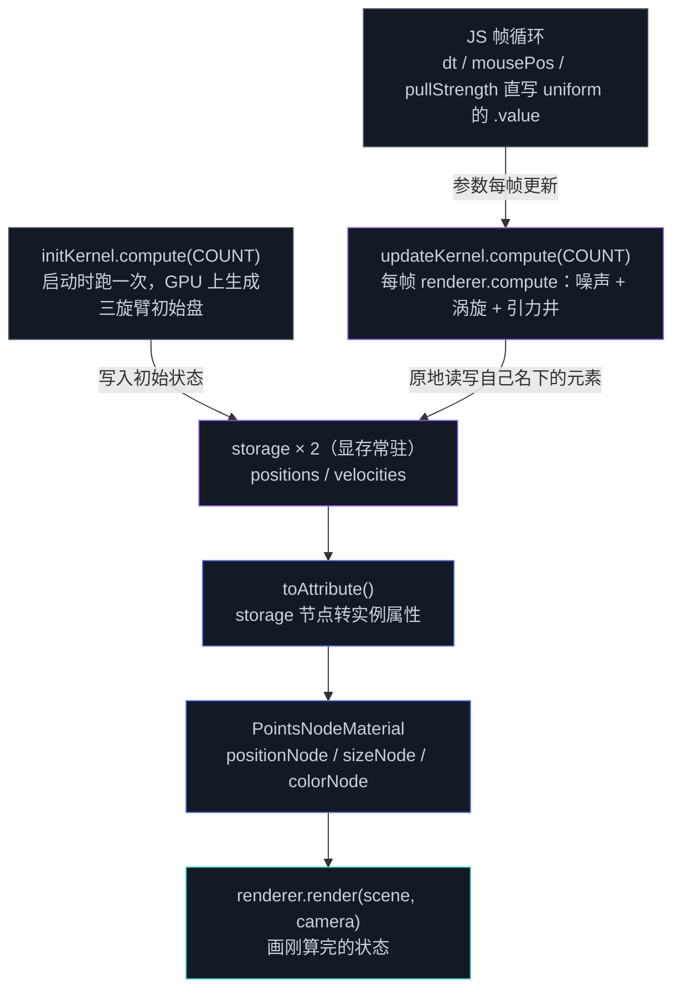

# 3.3 TSL 计算与数据流

> Day 3 · 模块 3.3 · 约 60 分钟
> 理论对照：《Three.js 创意 3D 课程笔记》第 12 课「噪声函数」、第 15 课「粒子系统」

Day 2 demo 06 的粒子星系，三个文件加起来 473 行。把真正在描述「星系长什么样、力场怎么算」的行挑出来数，不到四分之一；剩下三百多行是 GPUBuffer 创建、绑定组轮换、64 行的手写矩阵库，加上 encoder 里 compute 与 render 的编排。3.2 把着色器写进了节点，这张账单还没结清——storage buffer、计算管线、调度，仍然要一层层亲手搭。本模块用 TSL 的 compute 把它们一并收进节点系统：同一套物理，粒子数从一万加到两万，代码 217 行，单文件。

## 双缓冲的账单

先盘一遍 Day 2 流程里每道仪式的代价。状态要两块 storage buffer 轮换，绑定组配两组跟着换，渲染读哪块、compute 写哪块，交换时机错一帧就是「粒子抖回上上帧」；JS 侧手工打包 Float32Array，std430 的 16 字节对齐自己算账；想调一个参数，要去 uniform 布局表里找它的偏移量；相机每帧的 VP 矩阵，靠手写的 lookAt 与 perspective 换来。这些环节在 demo 06 的常见报错表里各有一个对应的翻车姿势，而其中没有一道在表达「你的效果是什么」。

TSL compute 把仪式收敛成三个节点：`storage()` 声明状态、`uniform()` 声明参数、`Fn(() => {...})().compute(count)` 声明一次调度。管线对象、绑定组、内存布局、越界 guard，全部由节点系统在首次执行前生成，之后按节点图缓存。JS 侧留下的只有两件事：每帧写进 uniform 的几个数，和先 compute 后 render 的调用顺序。

## 三个节点，一条数据流

状态声明长这样，位置和速度各一块：

```ts
const COUNT = 20480;
const positionBuffer = new THREE.StorageInstancedBufferAttribute(COUNT, 3);
const velocityBuffer = new THREE.StorageInstancedBufferAttribute(COUNT, 3);
const positions = storage(positionBuffer, 'vec3', COUNT);
const velocities = storage(velocityBuffer, 'vec3', COUNT);
```

`StorageInstancedBufferAttribute` 在显存里开出一块原始数组，`storage()` 把它包装成可参与运算的节点——之后 compute 与渲染引用的都是这个节点。第二个参数声明元素类型、第三个声明元素数；std430 那笔「vec3 按 16 字节对齐、JS 按 12 字节打包会静默错位」的账，由节点系统按声明自动落位。前提是两边自洽：itemSize 与 'vec3' 对不上照样错乱，坑表里见。

参数走 uniform 节点，声明之后 JS 侧直接改 `.value`：

```ts
const dt = uniform(1 / 60);
const mousePos = uniform(new THREE.Vector3(0, 0, 0));
const pullStrength = uniform(0.18);
```

kernel 的写法是 3.2 的 `Fn` 加一个尾巴。函数体内部用 `.element(instanceIndex)` 寻址，对应 WGSL 里 storage 数组的下标访问，`instanceIndex` 就是 2.6 讲过的全局编号：

```ts
const updateKernel = Fn(() => {
  const position = positions.element(instanceIndex);
  const velocity = velocities.element(instanceIndex);
  // 力场与积分，下节逐段拆
})().compute(COUNT);
```

`compute(COUNT)` 是点睛的一笔：函数节点由此变成 ComputeNode，COUNT 是总 invocation 数。2.6 那笔「dispatch 个数 × workgroup_size」的乘法，这里换成一个总数；`instanceIndex >= count` 的越界 guard 由引擎自动插入，Day 2 手写的 `if (i >= arrayLength(&src)) return` 不再需要。整条数据流画成一张图：



图 M5 · TSL compute 的数据流：初始状态与每帧更新都在 GPU 上原地完成，渲染经 toAttribute 直读 storage，JS 与显存之间只剩每帧几个 uniform 的写入

图里值得盯住的是箭头的「稀疏」：初始化和更新都发生在 GPU 上，JS 与显存之间没有粒子数据来回。渲染侧经 `toAttribute()` 直读 storage，中途没有 readback、没有 CPU 侧的粒子数组——Day 2 demo 06 强调的「数据全程待在显存里」，在这里成了默认形态而非需要努力维持的纪律。

还有一个语义细节要单独说。TSL 的 storage 节点是读写双向的，demo 03 的 update kernel 直接原地更新（`position.addAssign(...)`），Day 2 的双缓冲轮换整个消失了。依据在力场的依赖清单里：噪声只看时间与自身位置，引力井只看鼠标 uniform，每个 invocation 只读写自己名下的元素，不存在跨粒子的读写。哪天力场要读「别的粒子的旧值」——粒子间碰撞、邻域搜索——读写就得分开，2.7 的状态机思路照样搬得进来：两块 storage、读旧写新。模式没有过时，只是这个场景用不上。

## demo 03：两万粒子怎么搭

```bash
npm run dev
# http://localhost:5173/demos/day3/03-tsl-compute-particles/index.html
```

初始化也搬进了 GPU。Day 2 的初始星系盘在 JS 里算好再 writeBuffer 上传；这里 initKernel 启动时跑一次，两块 buffer 从出生起就没被 CPU 碰过。随机数用 `hash(instanceIndex)` 以粒子编号为种子，同帧内可复现：

```ts
const gauss = (offset: number) =>
  hash(instanceIndex.add(offset))
    .add(hash(instanceIndex.add(offset + 0.37)))
    .add(hash(instanceIndex.add(offset + 0.71)))
    .sub(1.5);
```

三个均匀随机数相加减 1.5，是便宜的近似高斯——Day 2 在 JS 侧用的同一个技巧，只是把 `Math.random()` 换成了以编号为种子的 hash。星系盘的生成逻辑：

```ts
const initKernel = Fn(() => {
  const position = positions.element(instanceIndex);
  const velocity = velocities.element(instanceIndex);

  // 半径 0.62 次幂：内密外疏；theta 沿臂展开 + 高斯散布
  const r = hash(instanceIndex).pow(0.62).mul(1.75).add(0.05);
  const theta = float(instanceIndex.mod(3)).mul((Math.PI * 2) / 3)
    .add(r.mul(2.2))
    .add(gauss(0.10).mul(0.16));

  position.assign(vec3(
    theta.cos().mul(r).add(gauss(0.20).mul(0.05)),
    gauss(0.30).mul(0.045),
    theta.sin().mul(r).add(gauss(0.40).mul(0.05)),
  ));

  // 开普勒式切向初速度：近快远慢，画面一开始就在转
  const vOrb = float(0.5).div(r.add(0.12).sqrt());
  velocity.assign(vec3(
    theta.sin().negate().mul(vOrb),
    0,
    theta.cos().mul(vOrb),
  ));
})().compute(COUNT);
```

半径取 0.62 次幂让盘面内密外疏，theta 沿三条旋臂展开再叠高斯散布；初速度取开普勒式切向分量，近快远慢。数值与 Day 2 逐个相同，搬的是同一套物理。

更新 kernel 每帧跑，四段力场与 Day 2 的 WGSL 逐行对应：

```ts
const updateKernel = Fn(() => {
  const position = positions.element(instanceIndex);
  const velocity = velocities.element(instanceIndex);

  // 1) 噪声场：三次偏移采样合成流动扰动
  const np = position.mul(0.85);
  const nt = time.mul(0.18);
  const drift = vec3(
    mx_noise_float(np.add(vec3(0.0, 0.0, nt))),
    mx_noise_float(np.add(vec3(31.4, 47.2, nt))),
    mx_noise_float(np.add(vec3(-12.9, 88.3, nt))),
  ).mul(0.4);

  // 2) 星系涡旋：切向推进（近快远慢）+ 向心束缚 + 压回薄盘
  const r = vec2(position.x, position.z).length().add(1e-4);
  const tangent = vec3(position.z.negate(), 0.0, position.x).div(r);
  const radial = vec3(position.x.negate(), 0.0, position.z.negate()).div(r);
  const accel = drift.toVar(); // toVar：可变局部量，后续 addAssign 就地累加
  accel.addAssign(tangent.mul(0.55).div(r.add(0.3)));
  accel.addAssign(radial.mul(0.45).div(r.mul(r).add(0.35)));
  accel.addAssign(vec3(0.0, position.y.mul(-1.1), 0.0));

  // 3) 鼠标引力井：平方衰减，力度由 JS 侧 uniform 控制
  const toMouse = mousePos.sub(position);
  const dm2 = toMouse.dot(toMouse);
  const pull = pullStrength.div(dm2.add(0.30));
  accel.addAssign(toMouse.div(dm2.add(1e-4).sqrt()).mul(pull));

  // 4) 半隐式欧拉 + 指数阻尼 + 限速：与 Day 2 的积分器完全一致
  const nv = velocity.add(accel.mul(dt)).mul(exp(float(-1.6).mul(dt))).toVar();
  const sp = nv.length().toVar();
  If(sp.greaterThan(2.4), () => {
    nv.mulAssign(float(2.4).div(sp));
  });
  position.addAssign(nv.mul(dt));
  velocity.assign(nv);
})().compute(COUNT);
```

对照着看最有意思。噪声场在 Day 2 是 80 行手抄的 simplex 函数，这里三次偏移采样各一行；涡旋与向心束缚是同一套公式，换成链式调用；积分器还是半隐式欧拉加指数阻尼，限速的 `if` 原样保留成 `If()` 节点。唯一改了行为的是鼠标力：Day 2 用 `select` 在「按住吸引 / 松开排斥」间切换，这里换成 pullStrength 这个 uniform 的两档（悬停 0.18、按住 1.8）——调参数不用碰 kernel，改 `.value` 就够。收敛掉的是仪式，物理一行没少。

渲染侧，storage 直接喂顶点：

```ts
const speed01 = velocities.toAttribute().length().mul(0.5).clamp(0.0, 1.0);

const material = new THREE.PointsNodeMaterial();
material.positionNode = positions.toAttribute(); // 粒子去哪，storage 说了算
material.sizeNode = float(0.05).add(speed01.mul(0.04)); // 快的粒子略大
material.colorNode = mix(
  mix(color(0x0F0A1E), color(0x8B5CF6), smoothstep(0.0, 0.5, speed01)), // 深空紫 → 主题紫
  color(0xE8ECF4), // 高速段提亮到主白
  smoothstep(0.55, 1.0, speed01),
);
material.opacityNode = smoothstep(1.0, 0.15, uv().sub(0.5).mul(2.0).length()); // 柔边圆点
material.transparent = true;
material.depthWrite = false;
material.blending = THREE.AdditiveBlending;

const particles = new THREE.Sprite(material);
particles.count = COUNT;
particles.frustumCulled = false; // 位置在 GPU 上，CPU 侧包围盒必然算错
```

`toAttribute()` 把 storage 节点转成实例属性来读。直接把 storage 挂给 positionNode 也能跑，但顶点阶段就变成 storage 读取，要额外申请 `maxStorageBuffersInVertexStage` 配额；走属性通道没有这个限制。柔边圆点的公式与 Day 2 render.wgsl 的片元着色器相同，现在是材质上的一行 opacityNode；WebGPU 没有 gl_PointSize，Day 2 手写 6 顶点 quad 展开，Day 3 交给 Sprite 与 sizeNode。速度色带从深空紫到主白，快的粒子更亮也略大——颜色逻辑从 WGSL 搬进节点图，形状逻辑（quad 展开、透视缩放）整个交给材质。

帧循环是全篇最短的一段：

```ts
chrome.startLoop((now) => {
  const t = (now - start) / 1000;
  dt.value = Math.min((now - last) / 1000, 1 / 30);
  last = now;

  // ……相机缓慢漂移 + 鼠标视差；Raycaster 与星系平面求交……

  renderer!.compute(updateKernel); // 两万粒子一步更新
  renderer!.render(scene, camera); // 画刚算完的状态，同帧内零拷贝
});
```

先 compute 后 render，中间零胶水——渲染画的就是刚写完的状态，同帧内零拷贝。鼠标世界坐标用 `THREE.Raycaster` 与星系平面求交，Day 2 为此手写了约 30 行的 ndcToPlane，这里是 `raycaster.setFromCamera` 加 `intersectPlane` 两行。

最后把两版的账摆在一起：

| 职责 | Day 2 原生（demo 06） | Day 3 TSL（demo 03） |
|------|----------------------|----------------------|
| 上下文初始化 | initGPU + getContext + configure，7 行 | WebGPURenderer 构造 + await init()，5 行 |
| 粒子状态 | createBuffer ×2 + JS 打包星系盘 + writeBuffer，23 行 | StorageInstancedBufferAttribute ×2 + storage()，4 行；初始盘由 initKernel 在 GPU 上生成 |
| 参数传递 | uniform buffer ×2 与 Float32Array 布局 11 行，每帧还要打包上传 | uniform() ×4，每帧直写 .value |
| 管线与绑定组 | 计算与渲染管线各一条、绑定组 ×4，44 行 | 零行——节点系统按节点图生成并缓存 |
| 数学库 | 手写 mat4 / vec3 / lookAt / 射线求交，64 行 | PerspectiveCamera + Raycaster 顶替 |
| 着色器 | WGSL 两文件 199 行，其中 simplex 噪声 80 行 | TSL 内嵌约 90 行，噪声一行 mx_noise_float |
| 帧循环 | 相机矩阵搭建、uniform 打包、encoder 编排、ping-pong 交换，85 行 | 相机漂移 + compute + render，约 25 行 |
| 合计 | 473 行 / 3 文件 | 217 行 / 1 文件 |

行数含注释与空行，两边口径一致；粒子数从 10000 加到 20480。省下来的三百多行里没有一行物理——收敛的全是 buffer、管线、绑定组、矩阵、编排这些让效果跑起来的脚手架，效果本身的代码在两版里几乎逐行可对照。

## 常见坑

| 现象 / 报错 | 原因 |
|-------------|------|
| `Renderer: ".compute()" called before the backend is initialized. Try using ".computeAsync()" instead.` | compute / render 在 `await renderer.init()` 之前调用。Day 3 所有 demo 的 chrome 整合模式里 init 排在最前；偶发场景可改用 `computeAsync()`（它会等就绪） |
| 画面中央一团亮点、其余全黑 | initKernel 没跑（或初始化失败被吞），粒子停在原点零值。GPU 上的初始盘不是免费的，忘了调度就没有 |
| 一半粒子不动 | `.compute(count)` 的 count 小于 storage 元素数：guard 只防越界不补数量，尾部粒子分不到 invocation。2.6 算过 dispatch × workgroup_size 的账，这里换成 count 一个数 |
| 控制台 storage / vertex stage 相关 validation error | positionNode 直接挂了 storage 节点，顶点阶段 storage 读取超出配额；改用 `.toAttribute()` 走实例属性通道 |
| 粒子数据错乱、坐标间隔串位 | `StorageInstancedBufferAttribute` 的 itemSize 与 `storage(buffer, 'vec3', COUNT)` 声明的类型不一致——对齐由节点系统接管的前提是两边自洽 |
| 相机一转整片粒子消失 | `frustumCulled` 没关：three 的剔除用 CPU 侧包围盒，storage 里的位置它看不见 |

## Checkpoint

- 能把 `Fn(() => {...})().compute(COUNT)` 拆成三段解释：函数体是 kernel、立即调用成节点、compute 生成 ComputeNode 并声明 invocation 总数
- 能说出 `storage(buffer, 'vec3', COUNT)` 声明了什么、`.element(instanceIndex)` 寻址到哪里，以及 itemSize 与类型必须自洽的原因
- 能判断原地更新是否安全（是否读别的粒子的旧值），并说出何时仍需要 2.7 的双缓冲
- 能举出原生版 473 行里至少四类仪式及其在 TSL 里的去向
- 能解释 toAttribute() 的作用、frustumCulled 要关掉的原因

## 相关材料

- demo：`demos/day3/03-tsl-compute-particles/`（本模块的完整实现）
- 对照版本：`demos/day2/06-particle-simulation/`（同一套物理的原生实现，README 附常见报错对照）
- 前置：讲义 2.6（dispatch / workgroup / invocation 三层概念）、2.7（双缓冲状态机与半隐式欧拉）、3.2（Fn 与节点构图）
- 理论对照笔记：《Three.js 创意 3D 课程笔记》第 12 课（噪声函数）、第 15 课（粒子系统）
