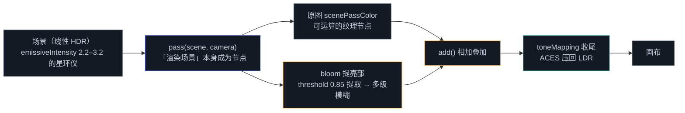

# 3.4 后处理与性能调优

> Day 3 · 模块 3.4 · 约 60 分钟
> 理论对照：《Three.js 创意 3D 课程笔记》第 14 课「后处理效果」、第 20 课「性能调优与部署」

打开 lusion.co，最先让你觉得「值钱」的细节往往是那层发光：暗部干净，亮部像隔着磨砂玻璃往外洇。这层质感有一条具体的流水线——bloom：把亮度超过阈值的像素提出来，降采样模糊，叠回原图。它在原生 WebGPU 里是三四个 render pass 加一串中间纹理的编排活（2.2 讲视口时提过「后处理链的中间目标」），在 Day 3 的节点系统里是三行接线。本模块拆完这条链，再把三天的性能知识收成一张清单——引擎替你做的事，得知道它替的是什么。

## 发光感从哪来

显示器是 LDR 设备，像素亮度到 1.0 封顶。真实场景里的光源动辄亮出几个数量级，这段「超出 1 的能量」有两种去处：色调映射把它压回可显示区间（保留细节的硬压缩），或者让它往邻域像素溢出一点（bloom，模拟镜头内部的散射与人眼眩光）。两者通常连用：管线内部保持线性 HDR，bloom 在 HDR 上算，输出前才用 ACES 之类的曲线压回 LDR。顺序不能反——先压暗再提取，亮部已经被削平，bloom 就无米下锅。

这也是获奖站点暗色调居多的技术原因之一：暗部把预算让给少数高光，发光才有对比度可借。igloo.inc 的冰晶、haoqi.design 的镜头光晕（据 Codrops 官方复盘）都在这条链上。第 14 课的 UnrealBloomPass 讲的是 WebGL 时代的同一件事，strength / radius / threshold 的语义原样平移到 TSL 的 bloom 节点。

原生 WebGPU 里这条链的成本拆开看：场景先渲到一张中间纹理，提取亮部是第二个 pass 加第二张纹理，模糊是一串降采样 pass，最后合成回画布。每张纹理的尺寸、格式、生命周期都要自己管——Day 2 没把作业留到这一步，因为它和顶点着色一样，属于思路简单、仪式繁重的活。RenderPipeline 的意义就是把这串仪式收进节点图。

## RenderPipeline：一条会算术的渲染链

**版本注记**：r183 起 `THREE.PostProcessing` 改名 `THREE.RenderPipeline`，本课程锁定的 0.186.0 用新名字。旧名仍在（作为子类保留），实例化时会打一条 `PostProcessing: "PostProcessing" has been renamed to "RenderPipeline"` 警告。跟 r183 之前写的教程、别人的旧代码对照时，认得这两个名字指同一个类；更老的 `EffectComposer` 是 WebGL 遗产，不要混进 WebGPURenderer 工程。three/webgpu 迭代快，升级时以官方迁移指南为准，3.1 的 TSL API 变更注记是同一本账。

接线三行，加两行色调映射：

```ts
pipeline = new THREE.RenderPipeline(renderer); // r183 前：new THREE.PostProcessing(renderer)
const scenePass = pass(scene, camera);
const scenePassColor = scenePass.getTextureNode('output');
const bloomPass = bloom(scenePassColor, 0.65, 0.55, 0.85); // (node, strength, radius, threshold)
pipeline.outputNode = scenePassColor.add(bloomPass);

renderer.toneMapping = THREE.ACESFilmicToneMapping;
renderer.toneMappingExposure = 1.15;
```

`pass(scene, camera)` 是整条链的支点：它把「渲染这个场景」这个动作本身变成节点，`getTextureNode('output')` 拿到的是刚渲染结果的纹理，可以像任何 texture 节点一样参与运算。`outputNode` 也是一个普通 vec4 节点，上面这两行写的「原图加辉光」只是最常用的姿势——你同样可以对它做减法、卷积、按 screenUV 重映射，后处理的全部自由度都从这一条来。

bloom 的三个参数各管一段：

| 参数 | 语义 | demo 04 取值 |
|------|------|-------------|
| strength | 提亮部叠加回原图的强度 | 0.65 基准，鼠标纵移在 0.4–0.9 联动 |
| radius | 光晕扩散半径，决定模糊的级数与跨度 | 0.55 |
| threshold | 进提亮部的亮度阈值，只有超过它的像素被提取 | 0.85 |

整条链的数据流：



后处理数据流 · pass 把场景渲染成纹理节点，bloom 从中提取超过阈值的亮部，两者相加后经色调映射输出；管线内部全程线性 HDR，最后一步才压回 LDR

图里从 pass 分出两路：原图直通相加节点，亮部绕经 bloom 再回来。分叉与汇合都是普通节点运算，没有 encoder、没有中间纹理的手工管理。色调映射挂在链尾，bloom 拿到的是未压暗的 HDR 亮度——这就是上一节说「顺序不能反」的落地位置。

## demo 04：暖光星环仪

```bash
npm run dev
# http://localhost:5173/demos/day3/04-postprocessing/index.html
```

bloom 的第一个参数不在 bloom 里，在场景里。要让 threshold 有东西可提，场景里必须存在超过阈值的亮度。demo 04 用 emissive 材质制造 HDR：

```ts
const core = new THREE.Mesh(
  new THREE.SphereGeometry(0.55, 48, 48),
  new THREE.MeshStandardNodeMaterial({
    color: 0x14141a,
    emissive: 0xf59e0b, // 主题琥珀
    emissiveIntensity: 2.2, // > 1：HDR 值，bloom 的提亮部靠它
    roughness: 0.4,
  }),
);
```

`emissiveIntensity` 2.2 意味着这块球面向缓冲区输出 2.2 倍于白的能量。普通 LDR 材质的颜色到 1 封顶，threshold 设 0.85 就一个像素都提不出来——「有 bloom 但看不出来」的根源在这里，解决方向是场景侧的 HDR 值，而非把 threshold 拉到 0。沿环滑动的热小球给到 3.2，是画面里最亮的部分，辉光从那里开始。

帧循环里 `pipeline.render()` 替换 `renderer.render(scene, camera)`，其余照旧：

```ts
chrome.startLoop((now) => {
  const t = (now - start) / 1000;

  // 中心球呼吸：emissive 脉动让 bloom 跟着呼吸
  core.material.emissiveIntensity = 2.2 + Math.sin(t * 0.85) * 0.55;

  // ……环进动、热小球沿环滑动；相机缓慢漂移 + 鼠标视差……

  // 鼠标联动：纵移 0.4–0.9 平滑跟随，克制优先
  const strengthTarget = 0.4 + (0.5 - 0.5 * mouseNdc[1]) * 0.5;
  bloomPass.strength.value += (strengthTarget - bloomPass.strength.value) * 0.12;

  pipeline!.render(); // 后处理版的「render」：场景 → pass → bloom → 输出
});
```

`bloomPass.strength` 本身是个 uniform 节点，改 `.value` 实时生效——3.3 里 uniform 的用法在后处理节点上同样成立。中心球的呼吸是另一层联动：帧循环调的是场景参数（emissiveIntensity），动的是后处理输出（辉光强弱），链的两头一起呼吸。`pipeline.render()` 与 `renderer.render()` 互斥，同一帧并存会画两遍场景，直出画面盖掉后处理——坑表榜首。

## 性能清单：三天的总账

引擎替你做的事散落在三天各处，这里收成一张表。右列是每件事替掉的原生知识，回链的用法是排查：行为不符预期或帧率异常时，你要能顺着它下潜回原生层，对着 1.3、2.3 的旧账去查。

| 条目 | 引擎里的形态 | 原生对应（Day 1–2 回链） |
|------|-------------|------------------------|
| 绑定组复用 | uniform() / storage() 声明即建，改 .value 只传数据，绑定组全程不变 | 1.6：绑定组「验证一次反复用」，对比 WebGL 逐字段设 uniform 的三笔代价 |
| 管线缓存 | NodeMaterial 按节点图缓存管线与着色器，参数不变不重编 | 1.3：GPURenderPipeline 是不可变对象，改任何状态都是换新管线——缓存是它存在的意义 |
| draw call 合并 | InstancedMesh / Sprite.count 一条 draw 画完全部实例 | 2.7 demo 06 的 draw(6, COUNT)：一万个粒子一次提交 |
| mipmap | 贴图上传时生成，采样按屏幕导数自动选级 | 2.3：每级 2×2 取平均、额外存储 1/3；不生成的代价是远处闪烁与缓存失效 |
| 抗锯齿成本 | antialias: true 即 MSAA 4×（渲染器 samples 置 4），片元着色器最多跑 4 份采样 | 2.2：采样与走样（GAMES101 4.1）；MSAA 的做法是只在边缘加密采样 |

清单的用法是排查顺序，不是必做项。帧率掉了按「粒子数 → 渲染像素比 → bloom」的次序降：先减粒子，成本与数量线性；再降 DPR，填充率与 DPR 的平方成正比；bloom 与抗锯齿最后动，它们影响的是质感底线。结营项目里这套顺序会展开成具体数字，见 3.5 的装配预算。

## 常见坑

| 现象 / 报错 | 原因 |
|-------------|------|
| `PostProcessing: "PostProcessing" has been renamed to "RenderPipeline". Please update your code to use "THREE.RenderPipeline" instead.` | 跟旧教程抄了 `new THREE.PostProcessing(...)`。0.186.0 里换成 `new THREE.RenderPipeline(...)` 即可，旧名是子类、仍能跑但每次实例化都警告 |
| 全屏过曝、糊成一片白 | threshold 设成 0：所有像素（包括暗部）都进提亮部，整帧被模糊后叠加。阈值从 0.6 起步，靠 HDR emissive 超阈值 |
| 辉光时有时无、画面闪烁 | 帧循环里 `pipeline.render()` 与 `renderer.render(scene, camera)` 并存：场景画了两遍，直出画面盖掉后处理。留一个 |
| 有 bloom 但完全看不出来 | 场景里没有超过 threshold 的 HDR 值——普通材质颜色 ≤ 1。把 emissive 材质的 emissiveIntensity 提到 1.5–3，或适度降 threshold |
| 画面发灰、对比怪 | 材质里手动做了色调映射，输出节点又做一遍。色调映射只交给 RenderPipeline 收尾 |

## Checkpoint

- 能复述 bloom 的三步（提取、模糊、叠加）与 strength / radius / threshold 各自的语义
- 能解释 threshold 为什么从 0.6 起步、HDR emissive 怎么把亮部送过阈值
- 能说出 `pipeline.render()` 与 `renderer.render()` 的互斥关系及并存时的症状
- 能背出性能清单里至少四条，以及各自的原生 Day 1–2 回链
- 知道 r183 的改名注记，读旧教程时认得出 PostProcessing 与 RenderPipeline 是同一个类

## 相关材料

- demo：`demos/day3/04-postprocessing/`（本模块的完整实现）
- 装配预算与降级顺序：讲义 3.5「装配期的预算」
- 前置：讲义 3.2（节点构图）、3.3（uniform 节点的 .value 直写）
- 理论对照笔记：《Three.js 创意 3D 课程笔记》第 14 课（后处理效果）、第 20 课（性能调优与部署）
- 延伸：Maxime Heckel《Field Guide to TSL and WebGPU》，见 `../../参考资料.md` 深入层
