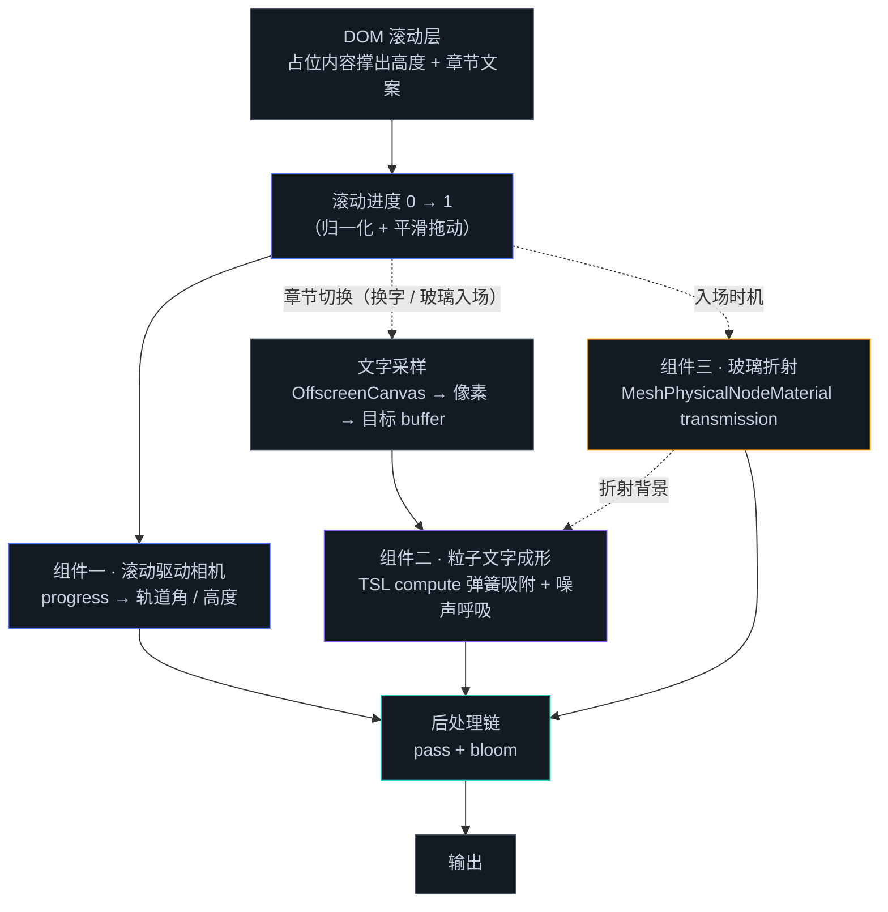
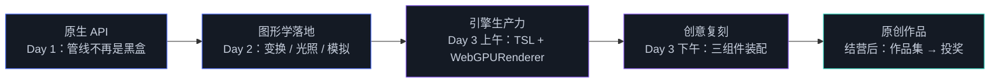

# 3.5 创意网站实战工作坊

> Day 3 · 模块 3.5 · 约 2 小时
> 理论对照：《Three.js 创意 3D 课程笔记》第 17–19 课（滚动驱动动画 / 创意交互 / 网站架构设计）

iyO 首页的 160 万颗粒子先聚成一片克拉尼图形，停留几秒，再散开、被同一个弹簧系统重新拉成一句俳句——从头到尾是同一批粒子，没有一次淡入淡出。三天走到这里，你和这个页面之间的差距已经不在「会不会某个 API」上：device、管线、矩阵、compute、TSL、后处理，每一件都给过你了。剩下的差距在装配——怎么把滚动、相机、粒子、材质、后处理咬合成一页有叙事的作品。本模块没有新 API，是一间工作坊：三个组件，分步复刻，最后拼成一个可以放进作品集的页面。

## 为什么最后一天是工作坊

前三天的每个 demo 都只孤立地做一个系统：波浪只是波浪，粒子只是粒子。真实站点是多个系统同时在线——iyO 的首页同时跑着粒子模拟、文字像素采样、光标交互与性能分级，旁边还有一整层 DOM 在负责滚动叙事。零件会了，装配是另一门手艺，它引入三类新问题：时序（compute 必须先于 render，初始化必须先于两者）、共享状态（滚动进度同时驱动相机轨道和章节切换，改一处要想到另一处）、预算（transmission、bloom、大规模粒子各自不贵，叠在一起开销做乘法）。

组件的选择标准是「案例站的最大公约数」。滚动驱动相机几乎出现在每一个获奖站里；粒子文字成形是 iyO 的招牌；玻璃折射是 igloo.inc、haoqi.design 与 lusion.co 共同的质感语言。三个组件分别代表叙事、模拟、材质三个维度，恰好覆盖 Day 2 全天与 Day 3 上午的知识面。lusion 式的烘焙顶点动画作为第四种脊柱，留给结营后当加餐——它是 2.5 顶点动画的离线版本，思路在讲义里已经埋好。

本篇不配独立 demo，作业即产出：三档作业分别是组件二的入门版、完整版，与三个组件的全装配。

## 四个站点，四种技术脊柱

先把四个锚点站的技术拆开，对照你已经学过的模块。完整的拆解（气质、观察要点、检索方法）在 `../../实例网站清单.md`，这里的表格只抽技术脊柱。

| 站点 | 技术脊柱 | 课程里的对应物 |
|------|---------|---------------|
| lusion.co | Houdini 模拟烘焙成顶点动画纹理回放，布料走 GPGPU（据公开访谈） | 2.5 顶点动画的离线版；2.7 GPGPU |
| igloo.inc | 容器内晶体生长算法程序化生成冰块，着色器驱动 UI 文字（据公开技术分享） | 2.5 几何生成；2.8「形状由函数描述」 |
| haoqi.design | DOM 与 WebGL 共享舞台：滚动同步、玻璃着色器、镜头光晕（据 Codrops 官方复盘） | 3.4 后处理；本模块组件一与组件三 |
| iyO | GPGPU 粒子读文字暗像素吸附成形，性能分级到设备（据 awwwards 官方案例复盘） | 2.6 / 2.7 / 3.3；本模块组件二 |

四站脊柱各不相同，地基却完全一致：大规模并行是 Day 1 给的，管线与材质语言是 Day 2 给的，引擎生产力是 Day 3 上午给的。igloo.inc 的冰晶生长看着神秘，拆开就是 2.5 的程序化几何加上 2.8 的距离场思想——「在容器约束下让形状按规则长出来」；iyO 的粒子文字，把 2.7 的吸附力场换成「读一张文字位图的暗像素当目标」，就多了一层信息。复刻的意义因此很具体：复刻的对象是技术路径——它用什么机制实现什么效果；像素只是路径跑出来的结果，抄不来的正是路径本身。

## 结营项目：一页「玻璃与文字」

工作坊的交付物是一个一页式滚动站：第一屏一块玻璃标志悬浮在深色空间里；向下滚动，相机绕过玻璃，几十万颗粒子聚成课程的结语字样；再向下，玻璃从粒子前穿过，折射出被压弯的字形，bloom 在收尾处亮起。DOM 层只有少量章节文案与滚动占位，贴着课程外壳的深色风格。

三个组件的关系如下图：滚动层是唯一的输入源，三个组件共享同一个场景与同一条后处理链。



图 M6 · 结营项目的组件关系：滚动进度是唯一输入，相机、文字目标、玻璃入场都由它驱动；三个组件汇入同一条后处理链

装配顺序建议：先做组件二让画面成立，再做组件三给画面质感，最后用组件一把它们串成叙事。顺序反过来容易陷入「滚动调了半天，画面里却没什么可看」的空转。

## 组件一：滚动驱动相机

滚动是创意网站里最便宜的交互——用户本来就要滚，把它接进相机，叙事就免费拿到了时间轴。做法分五步，每步标出处。

| 步骤 | 内容 | 用到哪天哪个模块 |
|------|------|-----------------|
| 1 | 撑出滚动高度的 DOM 占位（如 500vh），画布固定在底层 | 《Three.js 创意 3D 课程笔记》第 17 课；challenge 作业外壳已给 |
| 2 | 滚动进度归一化：`scrollY / (scrollHeight - innerHeight)`，分母为零要防 | Day 1 · 1.6（uniform 数据的准备习惯） |
| 3 | 平滑：进度值不直接用，每帧 `lerp` 拖动一个跟随变量 | Day 2 demo 04 的鼠标波源 lerp 0.14，同一招 |
| 4 | 映射：把进度经缓动曲线换算成轨道角、相机高度、fov | Day 2 · 2.1（轨道相机的球坐标） |
| 5 | 联动：按进度阈值切章节，通知组件二换字、组件三入场 | 组件二 / 三的输入约定 |

核心代码不过十行，放在帧循环里每帧读一次 `scrollY`，比监听 scroll 事件更省心（事件里只适合改标记，重活留给帧循环）：

```ts
let camProgress = 0;

chrome.startLoop(() => {
  const max = document.documentElement.scrollHeight - innerHeight;
  const progress = max > 0 ? scrollY / max : 0;      // 0 → 1
  camProgress += (progress - camProgress) * 0.08;    // 平滑拖动，去滚轮步进感
  const angle = -0.7 + camProgress * 2.6;            // 轨道角随进度扫过场景
  camera.position.set(
    Math.sin(angle) * 5.2,
    2.4 - camProgress * 1.6,
    Math.cos(angle) * 5.2,
  );
  camera.lookAt(0, 0.4, 0);
});
```

## 组件二：粒子文字成形

iyO 首页的技术脊柱，六步搭完。先看数据怎么流：文字在离屏画布上画一次，读出像素，命中暗像素的格点成为粒子的吸附目标；每帧 compute 把粒子往目标上拉，弹簧与阻尼让过程有生命感。

| 步骤 | 内容 | 用到哪天哪个模块 |
|------|------|-----------------|
| 1 | OffscreenCanvas 绘字，`getImageData` 读像素，alpha 通道就是命中图 | Day 2 demo 02（canvas 程序化纹理，同一招） |
| 2 | 按步长采样命中格点，收集成 `Float32Array`（步长至少 2px，防过密） | Day 1 · 1.5（顶点数据组织） |
| 3 | 三个 storage：当前位置、速度、目标位置 | Day 3 · 3.3（storage 与 instancedArray） |
| 4 | compute：弹簧吸附 + 速度阻尼 + 噪声呼吸 | Day 2 · 2.7（半隐式欧拉与阻尼）；Day 3 · 3.3 |
| 5 | 光标斥力：鼠标世界坐标进 uniform，按距离衰减推开粒子 | Day 2 demo 06（鼠标引力，改成斥力） |
| 6 | 渲染：storage 直接喂给精灵/点的 positionNode | Day 3 · 3.3（storage 直读渲染） |

采样与 compute 的骨架（与 three.js r186 官方 compute 粒子示例同构）：

```ts
// 采样：命中像素成为吸附目标（步长 3，防糊成一团）
const img = textCtx.getImageData(0, 0, W, H).data;
for (let y = 0; y < H; y += 3) {
  for (let x = 0; x < W; x += 3) {
    if (img[(y * W + x) * 4 + 3] > 128) targets.push(mapToWorld(x, y));
  }
}

// 吸附：弹簧拉向目标，速度带阻尼（deltaTime 来自 three/tsl）
const update = Fn(() => {
  const p = positionBuffer.element(instanceIndex);
  const v = velocityBuffer.element(instanceIndex);
  const pull = targetBuffer.element(instanceIndex).sub(p).mul(6.0);
  v.addAssign(pull.mul(deltaTime));
  v.mulAssign(0.96);
  p.addAssign(v.mul(deltaTime));
})();
update.compute(COUNT); // 每帧 renderer.compute(update)，先于 render
```

生命感的关键在「不完美」：吸附到位后让每颗粒子带一点噪声扰动（`mx_noise_float` 按 instanceIndex 加偏移采样），静止的字也会呼吸。iyO 的粒子换词成形用的也是这套结构——换词只是换一份目标 buffer，粒子池从头到尾不换。

## 组件三：玻璃折射与 bloom

玻璃是三个组件里代码最少、调参最多的一件。`MeshPhysicalNodeMaterial` 的 transmission 参数组把折射、厚度、粗糙度打包好了，你要做的是给它一个值得折射的世界。

| 步骤 | 内容 | 用到哪天哪个模块 |
|------|------|-----------------|
| 1 | 材质参数：`transmission = 1`、`thickness`、`roughness`、`ior` | Day 2 · 2.4（材质与光照模型）；Day 3 · 3.2 |
| 2 | 玻璃后面放可折射的内容：发光条、粒子墙、渐变背景 | Day 2 · 2.8（背景即场景的一部分） |
| 3 | PostProcessing：`pass()` 取场景，bloom 叠加，阈值不为 0 | Day 3 · 3.4（bloom 参数与坑） |
| 4 | 滚动驱动玻璃入场：进度映射位置与不透明度 | 组件一的联动约定 |

后处理链四行接完，帧循环里用 `post.render()` 替代 `renderer.render(scene, camera)`：

```ts
const post = new THREE.PostProcessing(renderer);
const scenePassColor = pass(scene, camera).getTextureNode('output');
const bloomPass = bloom(scenePassColor);
post.outputNode = scenePassColor.add(bloomPass);
// bloomPass.threshold.value / .strength.value / .radius.value 运行时可调
```

调参的顺序：先关掉 bloom 把玻璃调对（thickness 控制折射的位移量，roughness 给一点就够，0 完全透明如水），再开 bloom 只让高光溢出——阈值从 0.6 往下试，整页开始发白就回头。igloo.inc 的冰、haoqi.design 的玻璃面板、lusion.co 的液体玻璃（据社区逆向分析，其片元里融合了折射与波长色散）都在这一步花掉了项目里最多的时间。

## 装配期的预算

三个组件单开都便宜，合装时要算总账。transmission 每帧多渲染一次场景（折射采样），bloom 多两个全屏 pass，粒子 compute 与粒子数线性相关。中端设备的经验起点：粒子 5–10 万、DPR 上限 2、bloom 用默认分辨率，帧率掉了先减粒子再降 DPR，最后才是关 bloom。iyO 的分级策略值得抄：旧手机粒子数直接降到四分之一，视网膜屏略降渲染像素比（官方复盘称 shader 负载省约 44%），体验降级但叙事完整。

## 常见坑

| 现象 / 报错 | 原因 |
|-------------|------|
| `Failed to execute 'getImageData'` | 画布被跨域内容污染。本课程不加载外图不会遇到；自己加图片必须同源或带 CORS 头 |
| 粒子聚成的字糊成一团 | 采样步长小于 2px，目标点过密；或粒子数远大于目标点数，多颗粒子挤向同一目标。把粒子数按目标点数缩放 |
| 玻璃是一片均匀的灰 | transmission 折射到的是空背景色——玻璃后面必须有可折射的场景内容；另外 roughness 设成 1 就是全磨砂 |
| 滚动相机的运动一顿一顿 | 直接使用 `scrollY` 没有平滑插值；或在 scroll 事件监听里做了重活（应只读值，帧循环里消费） |
| 页面根本滚不动 | 占位容器高度没撑开（500vh 的 div 没放或被 `overflow: hidden` 吃掉） |
| 加上 bloom 整页发白 | 阈值设成 0，全屏像素都在发光——3.4 讲过的同一个坑，阈值从 0.6 起步 |
| 帧率从 60 骤降到 20 | transmission + bloom + 大规模粒子同时开，开销做乘法。按上一节的顺序降预算 |

## Checkpoint

- 能说出三个组件各自的技术脊柱，以及每一步对应哪天哪个模块
- 能解释复刻的判断标准：技术同构优先于像素相似
- 能把滚动进度安全地映射到相机参数（归一化、防除零、平滑三件套一个不落）
- 能举出至少三个「装配期才会出现」的问题（时序、共享状态、预算）
- 完成三档作业中的至少一档，挑战档做不出来也知道缺哪块

## 结营：从复刻到原创

三天走完，路径其实是一条线：先原生，让 GPU 对你不再是黑盒，报错看得懂、性能问题知道往哪查；再理论，空间、光照、模拟的词汇表齐了，看别人的拆解文不再跳过公式；然后引擎，TSL 让你把精力从仪式代码挪回效果本身；现在到复刻——从 `../../实例网站清单.md` 里挑一站，把它的一种效果完整拆出来再写出来；最后是原创，把三个挑战档作业整合成一个可展示的页面，那就是你作品集的第一页。



结营地图 · 与 `00-课程计划与学习地图.md` 的路径同一条：原生打底、理论落地、引擎提速，最后由复刻走向原创

往后的资源按需取用，都在 `../../参考资料.md` 里分好了层。深入层三件值得排期精读：Chrome WebGPU Best Practices（性能正确性清单）、WWDC25 Session 236（Safari 团队讲 WebGPU 如何映射到 Metal，演示案例就是清单里的 Aurelia 水母）、Maxime Heckel 的 TSL Field Guide（Day 3 的最佳延伸）。社区常驻三个地方：three.js 论坛（TSL 与 WebGPURenderer 的问题官方集散地）、webgpu.com（案例拆解）、Codrops（一线作者的第一手复盘）。要系统补 three.js 基础，Bruno Simon 的 Three.js Journey 是口碑最稳的付费课——他的作品集就在实例清单里，风格与课程的作业气质一脉。

节奏上的最后一条建议：结营后保持每周一个小实验，一个只做一种效果的小页面——lab.samsy.ninja 就是这么长出来的。三天给你的是地基，作品集是一块砖一块砖垒出来的。

## 相关材料

- 作业（本模块唯一产出）：`homework/day3/` 三档——basic 组件二入门版、advanced 组件二完整版、challenge 三组件全装配
- 案例拆解：`../../实例网站清单.md`
- 分层资源：`../../参考资料.md`
- 组件的孤立版本：`demos/day3/02-tsl-wave-deform/`（顶点节点）、`demos/day3/03-tsl-compute-particles/`（compute 粒子）、`demos/day3/04-postprocessing/`（bloom）
- 理论对照笔记：《Three.js 创意 3D 课程笔记》第 17 课（滚动驱动动画）、第 18 课（创意交互）、第 19 课（网站架构设计）
