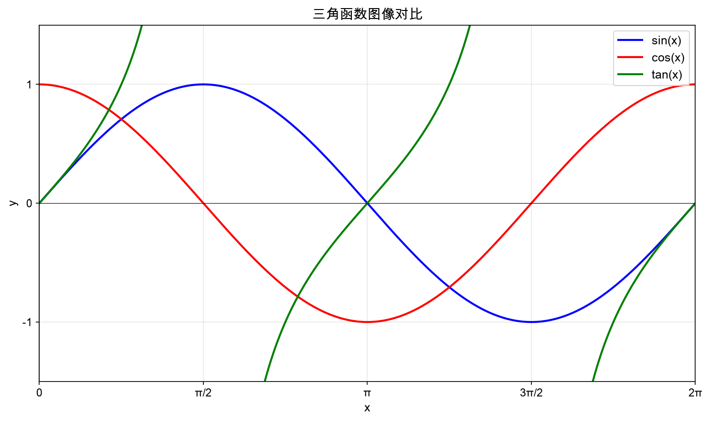
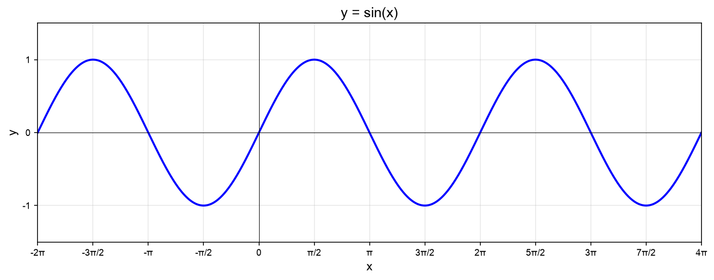
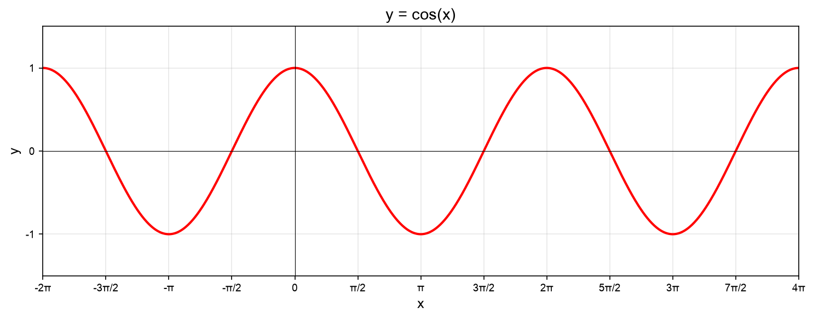
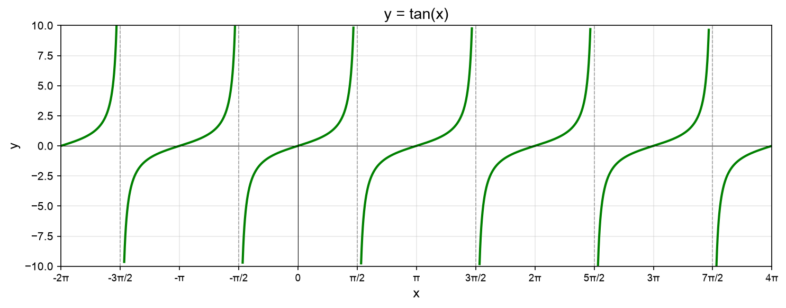
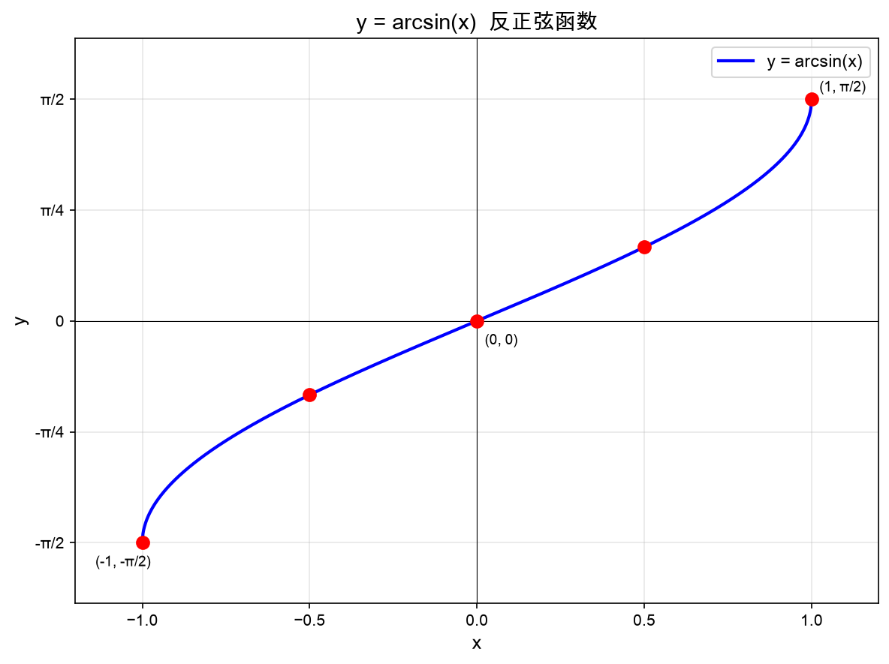
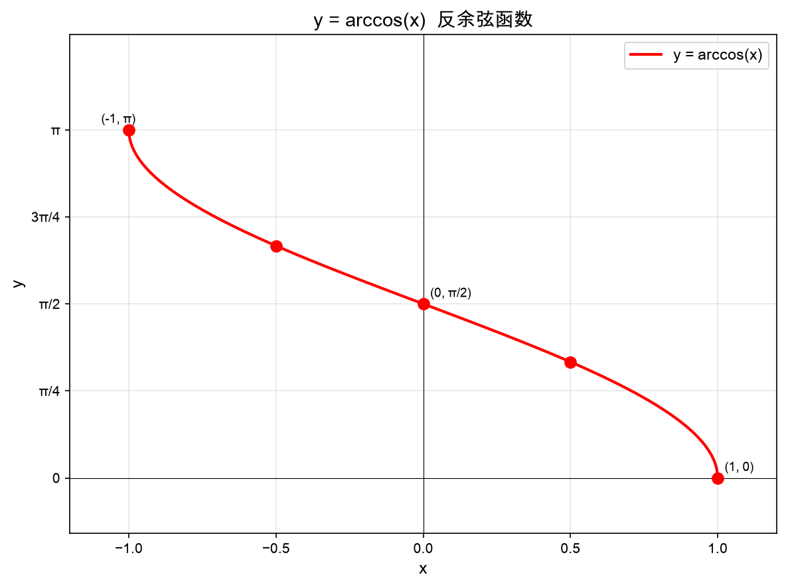
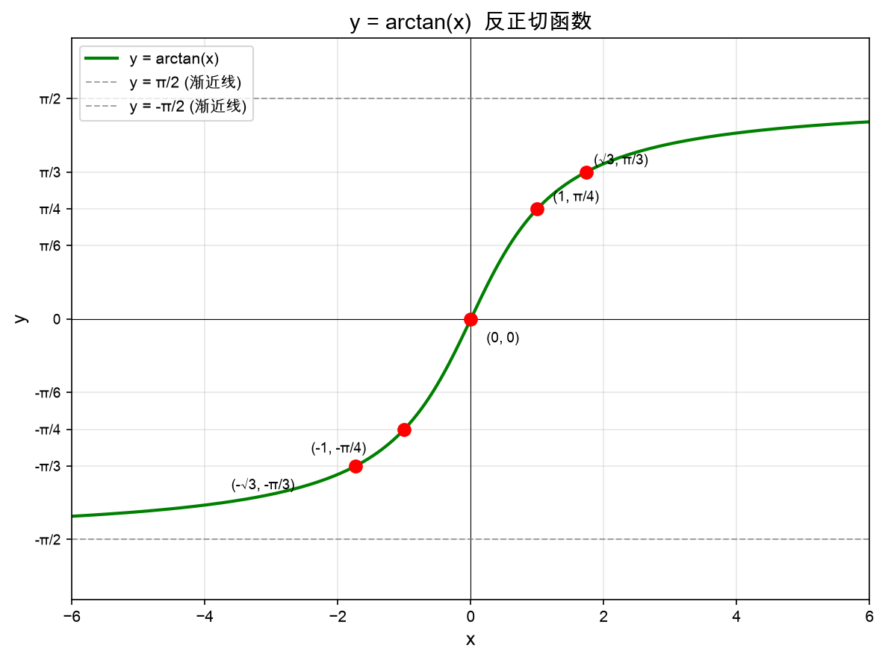

# 三角函数

## 目录

- [三角函数](#三角函数)
  - [目录](#目录)
  - [1. 基本定义](#1-基本定义)
    - [1.1 直角三角形定义](#11-直角三角形定义)
    - [1.2 对边、邻边、斜边计算公式](#12-对边邻边斜边计算公式)
    - [1.3 单位圆定义](#13-单位圆定义)
  - [2. 基本公式](#2-基本公式)
    - [2.1 倒数关系](#21-倒数关系)
    - [2.2 平方关系](#22-平方关系)
    - [2.3 和差公式](#23-和差公式)
    - [2.4 倍角公式](#24-倍角公式)
    - [2.5 半角公式](#25-半角公式)
  - [3. 常用角度的三角函数值](#3-常用角度的三角函数值)
  - [4. 三角函数图像](#4-三角函数图像)
    - [4.1 三函数对比图](#41-三函数对比图)
    - [4.2 正弦函数 $y = \\sin x$](#42-正弦函数-y--sin-x)
    - [4.3 余弦函数 $y = \\cos x$](#43-余弦函数-y--cos-x)
    - [4.4 正切函数 $y = \\tan x$](#44-正切函数-y--tan-x)
  - [5. 反三角函数](#5-反三角函数)
    - [5.1 什么是反三角函数](#51-什么是反三角函数)
    - [5.2 三种反三角函数](#52-三种反三角函数)
    - [5.3 计算示例](#53-计算示例)
    - [5.4 常用反三角函数值](#54-常用反三角函数值)
    - [5.5 反三角函数图像](#55-反三角函数图像)
      - [反正弦函数 $y = \\arcsin(x)$](#反正弦函数-y--arcsinx)
      - [反余弦函数 $y = \\arccos(x)$](#反余弦函数-y--arccosx)
      - [反正切函数 $y = \\arctan(x)$](#反正切函数-y--arctanx)
    - [5.6 基本关系](#56-基本关系)
      - [互补关系](#互补关系)
      - [互换关系](#互换关系)
    - [5.7 反三角函数的用途](#57-反三角函数的用途)
  - [6. 应用](#6-应用)
    - [6.1 解三角形](#61-解三角形)
    - [6.2 实际应用](#62-实际应用)
      - [6.2.1 数学领域](#621-数学领域)
      - [6.2.2 物理学](#622-物理学)
      - [6.2.3 工程应用](#623-工程应用)
      - [6.2.4 计算机科学](#624-计算机科学)
      - [6.2.5 天文与地理](#625-天文与地理)
      - [6.2.6 日常生活](#626-日常生活)

---

## 1. 基本定义

### 1.1 直角三角形定义
在直角三角形中，设角 $\theta$ 为一个锐角：
- **正弦** (sin)：$\sin\theta = \frac{\text{对边}}{\text{斜边}}$
- **余弦** (cos)：$\cos\theta = \frac{\text{邻边}}{\text{斜边}}$
- **正切** (tan)：$\tan\theta = \frac{\text{对边}}{\text{邻边}} = \frac{\sin\theta}{\cos\theta}$

### 1.2 对边、邻边、斜边计算公式
已知三角函数值和一条边，可以求其他边：

| 已知条件 | 对边 | 邻边 | 斜边 |
|---------|------|------|------|
| 斜边 $c$ | $a = c \cdot \sin\theta$ | $b = c \cdot \cos\theta$ | — |
| 邻边 $b$ | $a = b \cdot \tan\theta$ | — | $c = \frac{b}{\cos\theta}$ |
| 对边 $a$ | — | $b = \frac{a}{\tan\theta}$ | $c = \frac{a}{\sin\theta}$ |

**勾股定理**：$a^2 + b^2 = c^2$（对边² + 邻边² = 斜边²）

### 1.3 单位圆定义
在平面直角坐标系中，以原点为圆心，半径为1的圆称为单位圆。角 $\theta$ 的终边与单位圆交于点 $(x, y)$，则：
- $\sin\theta = y$
- $\cos\theta = x$
- $\tan\theta = \frac{y}{x}$ (当 $x \neq 0$)

---

## 2. 基本公式

### 2.1 倒数关系
- $\csc\theta = \frac{1}{\sin\theta}$
- $\sec\theta = \frac{1}{\cos\theta}$
- $\cot\theta = \frac{1}{\tan\theta} = \frac{\cos\theta}{\sin\theta}$

### 2.2 平方关系
- $\sin^2\theta + \cos^2\theta = 1$
- $1 + \tan^2\theta = \sec^2\theta$
- $1 + \cot^2\theta = \csc^2\theta$

### 2.3 和差公式
- $\sin(\alpha \pm \beta) = \sin\alpha\cos\beta \pm \cos\alpha\sin\beta$
- $\cos(\alpha \pm \beta) = \cos\alpha\cos\beta \mp \sin\alpha\sin\beta$
- $\tan(\alpha \pm \beta) = \frac{\tan\alpha \pm \tan\beta}{1 \mp \tan\alpha\tan\beta}$

### 2.4 倍角公式
- $\sin 2\theta = 2\sin\theta\cos\theta$
- $\cos 2\theta = \cos^2\theta - \sin^2\theta = 2\cos^2\theta - 1 = 1 - 2\sin^2\theta$
- $\tan 2\theta = \frac{2\tan\theta}{1 - \tan^2\theta}$

### 2.5 半角公式
- $\sin\frac{\theta}{2} = \pm\sqrt{\frac{1 - \cos\theta}{2}}$
- $\cos\frac{\theta}{2} = \pm\sqrt{\frac{1 + \cos\theta}{2}}$
- $\tan\frac{\theta}{2} = \frac{\sin\theta}{1 + \cos\theta} = \frac{1 - \cos\theta}{\sin\theta}$

---

## 3. 常用角度的三角函数值

| 角度 $\theta$ | 弧度 | $\sin\theta$ | $\cos\theta$ | $\tan\theta$ |
|:---:|:---:|:---:|:---:|:---:|
| 0° | 0 | 0 | 1 | 0 |
| 30° | $\frac{\pi}{6}$ | $\frac{1}{2}$ | $\frac{\sqrt{3}}{2}$ | $\frac{\sqrt{3}}{3}$ |
| 45° | $\frac{\pi}{4}$ | $\frac{\sqrt{2}}{2}$ | $\frac{\sqrt{2}}{2}$ | 1 |
| 60° | $\frac{\pi}{3}$ | $\frac{\sqrt{3}}{2}$ | $\frac{1}{2}$ | $\sqrt{3}$ |
| 90° | $\frac{\pi}{2}$ | 1 | 0 | 不存在 |
| 120° | $\frac{2\pi}{3}$ | $\frac{\sqrt{3}}{2}$ | $-\frac{1}{2}$ | $-\sqrt{3}$ |
| 135° | $\frac{3\pi}{4}$ | $\frac{\sqrt{2}}{2}$ | $-\frac{\sqrt{2}}{2}$ | $-1$ |
| 150° | $\frac{5\pi}{6}$ | $\frac{1}{2}$ | $-\frac{\sqrt{3}}{2}$ | $-\frac{\sqrt{3}}{3}$ |
| 180° | $\pi$ | 0 | $-1$ | 0 |
| 270° | $\frac{3\pi}{2}$ | $-1$ | 0 | 不存在 |
| 360° | $2\pi$ | 0 | 1 | 0 |

> **记忆口诀**：对于 30°、45°、60°，sin 值为 $\frac{\sqrt{1}}{2}$、$\frac{\sqrt{2}}{2}$、$\frac{\sqrt{3}}{2}$（分子递增）；cos 值则相反（分子递减）。

---

## 4. 三角函数图像

### 4.1 三函数对比图

### 4.2 正弦函数 $y = \sin x$

- 周期：$2\pi$
- 值域：$[-1, 1]$
- 奇函数：$\sin(-x) = -\sin x$

### 4.3 余弦函数 $y = \cos x$

- 周期：$2\pi$
- 值域：$[-1, 1]$
- 偶函数：$\cos(-x) = \cos x$

### 4.4 正切函数 $y = \tan x$

- 周期：$\pi$
- 值域：$(-\infty, +\infty)$
- 奇函数：$\tan(-x) = -\tan x$
- 渐近线：$x = \frac{\pi}{2} + k\pi$（$k$ 为整数）

---

## 5. 反三角函数

### 5.1 什么是反三角函数

**通俗理解**：反三角函数就是三角函数的"逆运算"。

- **三角函数**：已知角度 → 求函数值
  - 例：$\sin 30° = 0.5$（输入角度，输出数值）
- **反三角函数**：已知函数值 → 求角度
  - 例：$\arcsin(0.5) = 30°$（输入数值，输出角度）

### 5.2 三种反三角函数

| 反三角函数 | 符号 | 含义 | 定义域 | 值域 |
|:---:|:---:|:---:|:---:|:---:|
| 反正弦 | $\arcsin x$ | 已知 $\sin$ 值求角度 | $[-1, 1]$ | $[-\frac{\pi}{2}, \frac{\pi}{2}]$ |
| 反余弦 | $\arccos x$ | 已知 $\cos$ 值求角度 | $[-1, 1]$ | $[0, \pi]$ |
| 反正切 | $\arctan x$ | 已知 $\tan$ 值求角度 | $(-\infty, +\infty)$ | $(-\frac{\pi}{2}, \frac{\pi}{2})$ |

> **为什么值域有限制？** 因为三角函数是周期函数，一个函数值对应无数个角度。为了让反函数有唯一确定的值，我们限制在"主值区间"内。

### 5.3 计算示例

**例1**：求 $\arcsin(0.5)$ 的值
- 思路：哪个角度的 $\sin$ 值等于 0.5？
- 答案：$\arcsin(0.5) = 30° = \frac{\pi}{6}$

**例2**：求 $\arccos(0)$ 的值
- 思路：哪个角度的 $\cos$ 值等于 0？
- 答案：$\arccos(0) = 90° = \frac{\pi}{2}$

**例3**：求 $\arctan(1)$ 的值
- 思路：哪个角度的 $\tan$ 值等于 1？
- 答案：$\arctan(1) = 45° = \frac{\pi}{4}$

### 5.4 常用反三角函数值

| $x$ | $\arcsin x$ | $\arccos x$ | $\arctan x$ |
|:---:|:---:|:---:|:---:|
| $0$ | $0$ | $\frac{\pi}{2}$ | $0$ |
| $\frac{1}{2}$ | $\frac{\pi}{6}$ (30°) | $\frac{\pi}{3}$ (60°) | — |
| $\frac{\sqrt{2}}{2}$ | $\frac{\pi}{4}$ (45°) | $\frac{\pi}{4}$ (45°) | — |
| $\frac{\sqrt{3}}{2}$ | $\frac{\pi}{3}$ (60°) | $\frac{\pi}{6}$ (30°) | — |
| $1$ | $\frac{\pi}{2}$ (90°) | $0$ | $\frac{\pi}{4}$ (45°) |
| $\sqrt{3}$ | — | — | $\frac{\pi}{3}$ (60°) |
| $-1$ | $-\frac{\pi}{2}$ (-90°) | $\pi$ (180°) | $-\frac{\pi}{4}$ (-45°) |

### 5.5 反三角函数图像

#### 反正弦函数 $y = \arcsin(x)$

- 定义域：$[-1, 1]$
- 值域：$[-\frac{\pi}{2}, \frac{\pi}{2}]$
- 单调递增
- 奇函数：$\arcsin(-x) = -\arcsin(x)$

#### 反余弦函数 $y = \arccos(x)$

- 定义域：$[-1, 1]$
- 值域：$[0, \pi]$
- 单调递减
- 非奇非偶函数

#### 反正切函数 $y = \arctan(x)$

- 定义域：$(-\infty, +\infty)$
- 值域：$(-\frac{\pi}{2}, \frac{\pi}{2})$
- 单调递增
- 奇函数：$\arctan(-x) = -\arctan(x)$
- 渐近线：$y = \pm\frac{\pi}{2}$

### 5.6 基本关系

#### 互补关系
- $\arcsin x + \arccos x = \frac{\pi}{2}$
- $\arctan x + arccot x = \frac{\pi}{2}$

#### 互换关系
- $\arctan x = \arcsin\left(\frac{x}{\sqrt{1+x^2}}\right)$
- $\arctan x = \arccos\left(\frac{1}{\sqrt{1+x^2}}\right)$

### 5.7 反三角函数的用途

**核心作用**：已知三角函数值，求对应的角度。

**典型应用场景**：

1. **解三角形**：已知边长求角度
   - 直角三角形中，已知对边为 3，斜边为 5，求角度：
   - $\theta = \arcsin\left(\frac{3}{5}\right) \approx 36.87°$

2. **物理学**：角度计算
   - 光的折射：$\theta_r = \arcsin\left(\frac{n_1 \sin\theta_i}{n_2}\right)$
   - 斜面运动：最大倾斜角 $\theta = \arctan(\mu)$（$\mu$ 为摩擦系数）

3. **工程测量**：计算方位角
   - 已知坐标差求角度：$\theta = \arctan\left(\frac{\Delta y}{\Delta x}\right)$

4. **计算机科学**：计算旋转角度
   - 游戏开发中计算角色朝向
   - 图形学中计算向量夹角

---

## 6. 应用

### 6.1 解三角形
- **正弦定理**：$\frac{a}{\sin A} = \frac{b}{\sin B} = \frac{c}{\sin C} = 2R$
- **余弦定理**：$c^2 = a^2 + b^2 - 2ab\cos C$

### 6.2 实际应用

直角三角形只是理解三角函数的起点，真正的三角函数定义要广泛得多。三角函数是描述**周期性现象**的核心工具，广泛应用于以下领域：

#### 6.2.1 数学领域
- 几何与三角学：解任意三角形、球面三角学
- 微积分：求导积分、级数展开、微分方程
- 复分析：欧拉公式、傅里叶变换

#### 6.2.2 物理学
- 力学：力的分解、斜面运动、圆周运动
- 波动与振动：声波、光波、电磁波
- 光学：反射、折射、干涉、衍射
- 电路分析：交流电、阻抗、功率因数

#### 6.2.3 工程应用
- 信号处理：音频图像压缩、滤波器、通信系统
- 电子工程：电路设计、天线、雷达
- 机械工程：振动分析、齿轮传动
- 土木工程：结构设计、测量学

#### 6.2.4 计算机科学
- 图形学：2D/3D 旋转、动画、相机视角
- 游戏开发：物理引擎、碰撞检测
- 数据科学：傅里叶变换、时间序列分析

#### 6.2.5 天文与地理
- 天文学：星体位置、日食预测、卫星轨道
- 地理学：地球曲面、经纬度、地图投影

#### 6.2.6 日常生活
- 导航：GPS 定位、方位角计算
- 音乐：音调频率、和声泛音
- 医学：CT 扫描、心电图、超声波
