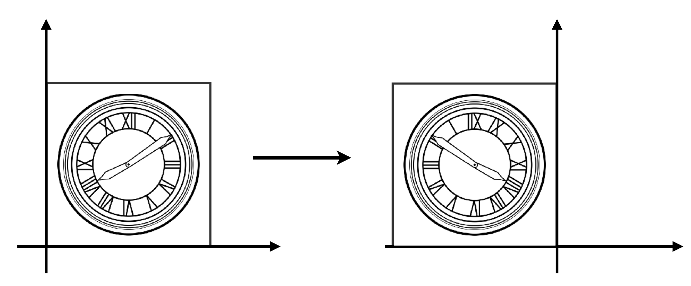
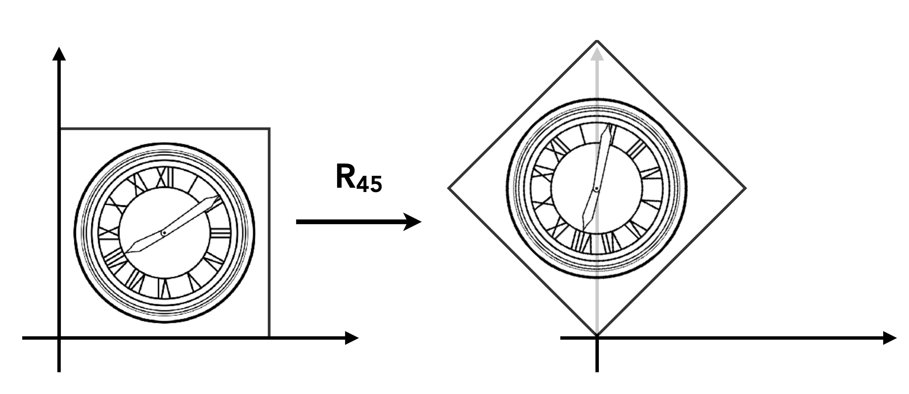
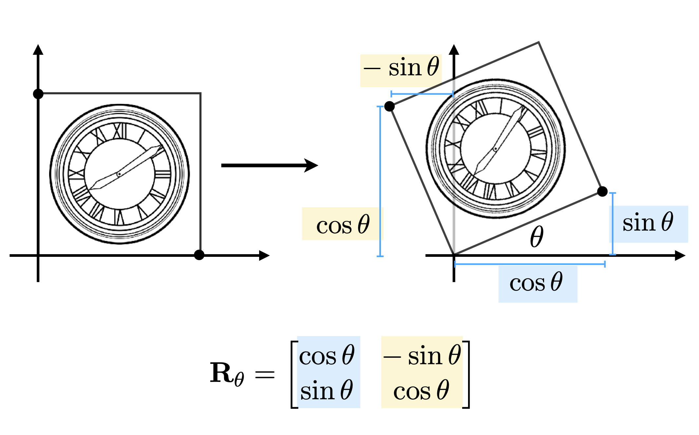
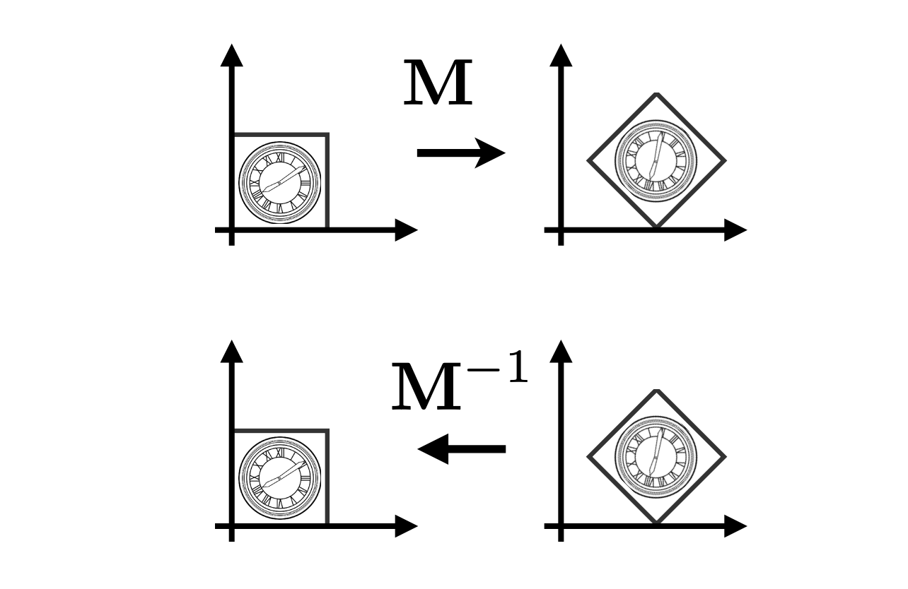
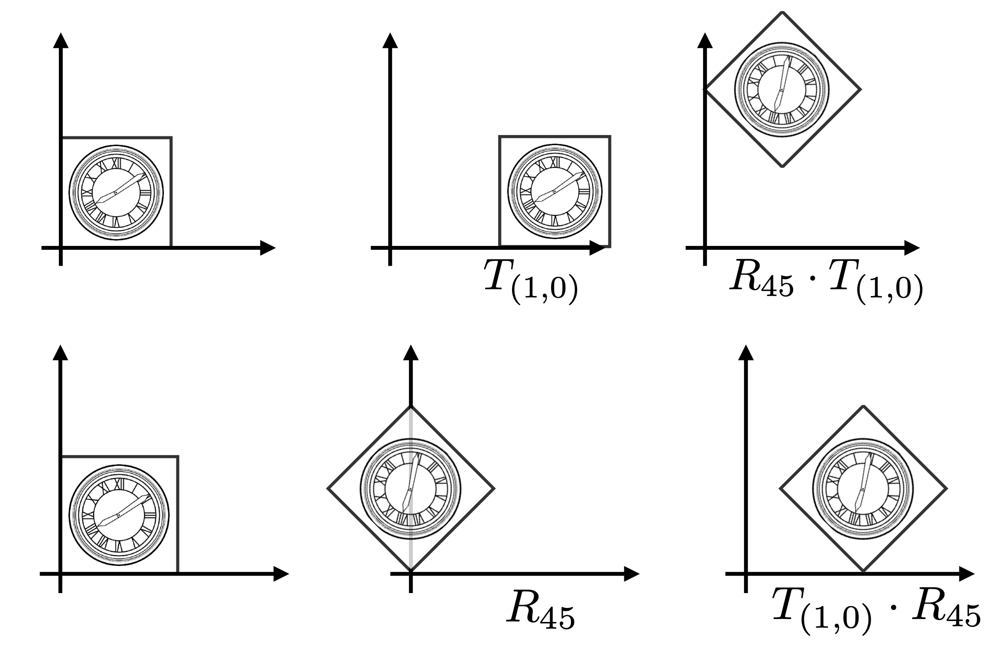
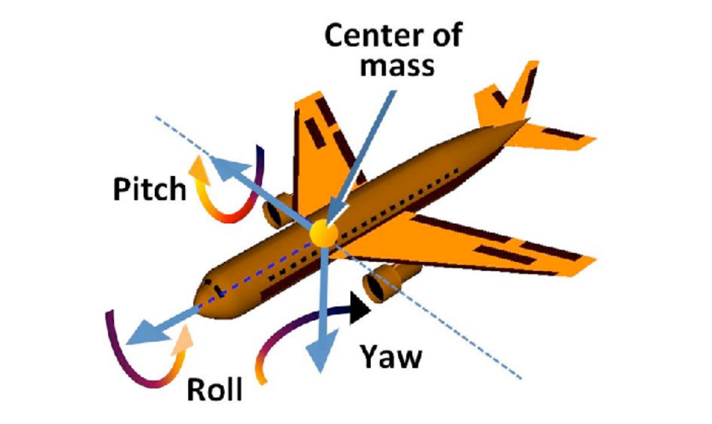
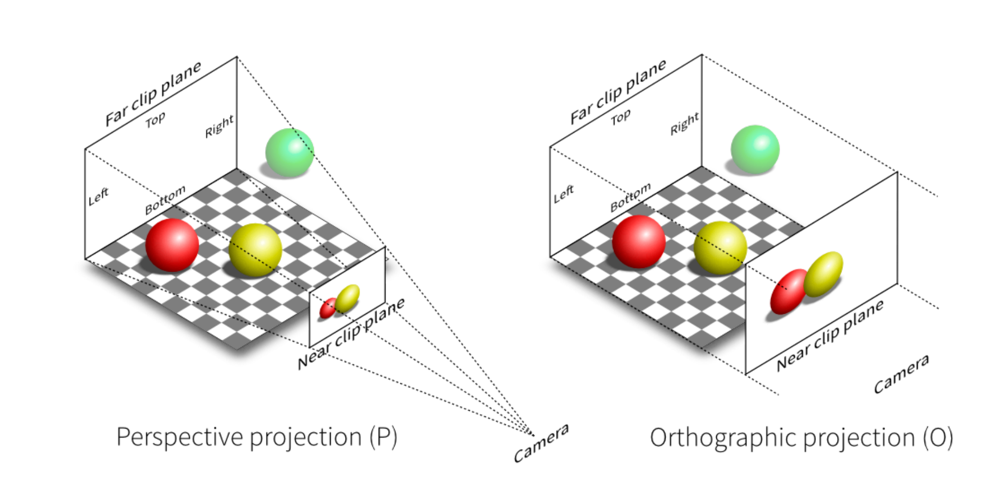
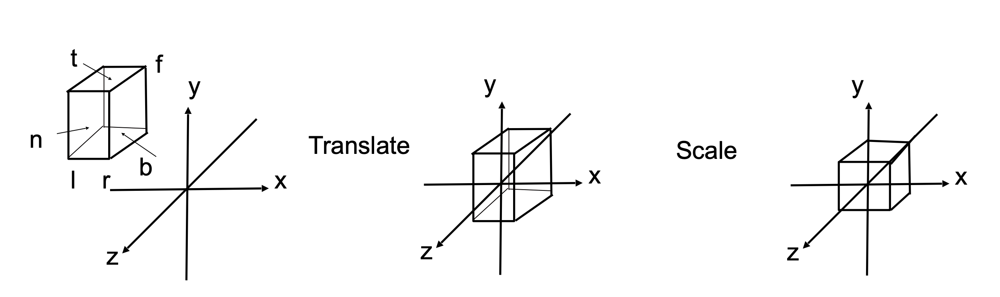
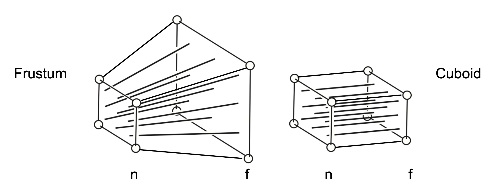
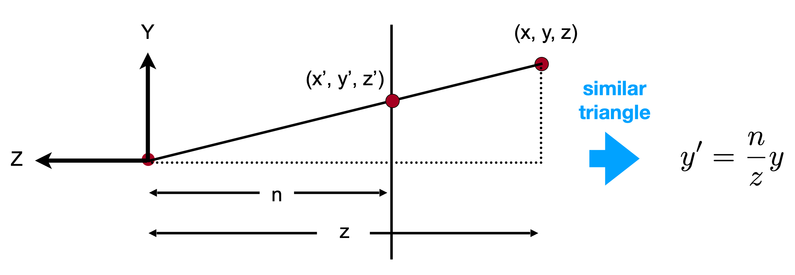

# GAMES101 - 现代计算机图形学课程笔记

> 课程主讲：闫令琪 (Lingqi Yan) | UCSB
> B站课程链接：https://www.bilibili.com/video/BV1X7411F744

---

## 目录

1. [概览与光栅化](#1-概览与光栅化)
2. [向量与线性代数](#2-向量与线性代数)
3. [变换](#3-变换)
4. [光栅化](#4-光栅化)
5. [着色](#5-着色)
6. [几何](#6-几何)
7. [光线追踪](#7-光线追踪)
8. [动画与模拟](#8-动画与模拟)

---

## 1. 概览与光栅化

### 1.1 什么是计算机图形学

- 计算机图形学是研究如何在计算机中表示、处理、显示图形的学科
- 应用领域：游戏、电影、设计、可视化、虚拟现实等

### 1.2 图形学与视觉

- 人眼看到的是光线经物体反射后进入眼睛的结果
- 图形学的核心问题：如何模拟这个过程（正向 vs 逆向）

### 计算机视觉 & 计算机图形学

| 方向 | 输入 | 输出 | 核心任务 |
|:---:|:---:|:---:|:---:|
| 计算机图形学 | 场景/模型/几何 | 图像 | 从模型到图像（渲染） |
| 计算机视觉 | 图像 | 场景理解/特征 | 从图像到理解（识别） |

**正向渲染 (Forward Rendering)**：
- 从场景出发 → 计算光线传播 → 生成图像
- 经典光线追踪、光栅化都属于正向渲染

**逆向问题 (Inverse Problem)**：
- 从图像出发 → 推断场景信息
- 图像分割、物体识别、三维重建

**两者的关系**：
- 计算机图形学和计算机视觉是互逆的过程
- 图形学：模型 → 图像（模拟物理过程）
- 视觉：图像 → 模型（理解视觉信息）
- 深度学习时代两者逐渐融合（如 NeRF、3D Gaussian Splatting）

### 1.3 图形成像基本流程

```
顶点数据 → 顶点着色器 → 图元装配 → 光栅化 → 片元着色器 → 帧缓冲 → 显示
```

---

## 2. 向量与线性代数

> 本章对应课程第 2 讲 [[课件 PDF](https://sites.cs.ucsb.edu/~lingqi/teaching/resources/GAMES101_Lecture_02.pdf)]

### 2.1 向量基础

#### 向量的定义


- 向量有**方向**和**长度**，没有绝对起始位置
- 通常记为 $\vec{a}$ 或粗体 **a**
- 用起止点表示：$\overrightarrow{AB} = B - A$

#### 向量归一化 (Normalization)

- 向量的模（长度）：$||\vec{a}||$
- **单位向量**：模为 1 的向量，用于表示方向
- 归一化：$\hat{a} = \frac{\vec{a}}{||\vec{a}||}$

#### 向量加法

- **几何表示**：平行四边形法则 & 三角形法则
- **代数计算**：对应坐标相加

$$
\vec{a} + \vec{b} = \begin{pmatrix} x_a + x_b \\ y_a + y_b \end{pmatrix}
$$

**向量加法的几何图示**：


> **平行四边形法则**：$\vec{a} + \vec{b} = \vec{b} + \vec{a}$（交换律）
> **三角形法则**：先 $\vec{a}$ 后 $\vec{b}$，首尾相连

#### 笛卡尔坐标系


$$
\vec{A} = \begin{pmatrix} x \\ y \end{pmatrix}, \quad \vec{A}^T = (x, y), \quad ||\vec{A}|| = \sqrt{x^2 + y^2}
$$

---

### 2.2 向量乘法

#### 点积 (Dot Product / Scalar Product)


点积计算，得到的是一个标量，解决这两个向量有多相似（投影、夹角、强度）问题

**定义**：

$$
\vec{a} \cdot \vec{b} = ||\vec{a}|| \cdot ||\vec{b}|| \cdot \cos\theta
$$

$$
\cos\theta = \frac{\vec{a} \cdot \vec{b}}{||\vec{a}|| \cdot ||\vec{b}||}
$$

对于单位向量：$\cos\theta = \hat{a} \cdot \hat{b}$

**坐标计算**：

- 2D：$\vec{a} \cdot \vec{b} = x_a x_b + y_a y_b$
- 3D：$\vec{a} \cdot \vec{b} = x_a x_b + y_a y_b + z_a z_b$

**性质**：

| 性质 | 公式 |
|:---|:---|
| 交换律 | $\vec{a} \cdot \vec{b} = \vec{b} \cdot \vec{a}$ |
| 分配律 | $\vec{a} \cdot (\vec{b} + \vec{c}) = \vec{a} \cdot \vec{b} + \vec{a} \cdot \vec{c}$ |
| 结合律 | $(k\vec{a}) \cdot \vec{b} = \vec{a} \cdot (k\vec{b}) = k(\vec{a} \cdot \vec{b})$ |

**在图形学中的应用**：

1. **计算两向量夹角**（如光线与法线的夹角）
2. **向量投影**：$\vec{b}$ 在 $\vec{a}$ 上的投影 $\vec{b}_\perp = (\vec{b} \cdot \hat{a})\hat{a}$
3. **判断方向**：点积 > 0 同向，< 0 反向，= 0 垂直

**点积的几何意义图示**：

<div style="display: flex; justify-content: space-between; gap: 10px;">
  
  
</div>

> **计算两向量夹角**：$\cos\theta = \frac{\vec{a} \cdot \vec{b}}{||\vec{a}|| \cdot ||\vec{b}||}$
> **向量投影**：$\vec{b}$ 在 $\vec{a}$ 上的投影 $\vec{b}_\perp = (\vec{b} \cdot \hat{a})\hat{a}$

[三角函数](../数学基础/三角函数.md)

**点积判断方向**：


> - $\vec{a} \cdot \vec{b} > 0$：同向（$\theta < 90°$）
> - $\vec{a} \cdot \vec{b} = 0$：垂直（$\theta = 90°$）
> - $\vec{a} \cdot \vec{b} < 0$：反向（$\theta > 90°$）

#### 叉积｜叉乘 (Cross Product / Vector Product)


叉积计算，得到的是一个向量，解决垂直于这两个向量的方向是什么（法线、旋转轴、方向）

**定义**：

- 叉积结果垂直于两个输入向量
- 方向由**右手定则**确定
- 常用于构建坐标系

**性质**：

| 性质 | 公式 |
|:---|:---|
| 反交换律 | $\vec{a} \times \vec{b} = -\vec{b} \times \vec{a}$ |
| 自身叉积 | $\vec{a} \times \vec{a} = \vec{0}$ |
| 分配律 | $\vec{a} \times (\vec{b} + \vec{c}) = \vec{a} \times \vec{b} + \vec{a} \times \vec{c}$ |
| 数乘结合 | $\vec{a} \times (k\vec{b}) = k(\vec{a} \times \vec{b})$ |

**标准正交基关系**：

$$
\vec{x} \times \vec{y} = +\vec{z}, \quad \vec{y} \times \vec{z} = +\vec{x}, \quad \vec{z} \times \vec{x} = +\vec{y}
$$

**坐标计算**：

$$
\vec{a} \times \vec{b} = \begin{pmatrix} y_a z_b - y_b z_a \\ z_a x_b - x_a z_b \\ x_a y_b - y_a x_b \end{pmatrix}
$$

**矩阵形式**（对偶矩阵）：

$$
\vec{a} \times \vec{b} = A^* \vec{b} = \begin{pmatrix} 0 & -z_a & y_a \\ z_a & 0 & -x_a \\ -y_a & x_a & 0 \end{pmatrix} \begin{pmatrix} x_b \\ y_b \\ z_b \end{pmatrix}
$$

**在图形学中的应用**：


1. **判断左右**：叉积方向判断点在向量的左侧还是右侧，如【图一】$\vec{a} \times \vec{b}$，对应坐标系为z轴正方向，及$\vec{b}$在$\vec{a}$的左侧
2. **判断内外**：用于三角形光栅化中判断点是否在三角形内，如【图二】$\vec{AB} \times \vec{AP}$，P在$\vec{AB}$ 的左侧，$\vec{BC} \times \vec{BP}$，P在$\vec{AB}$ 的左侧，$\vec{CA} \times \vec{CP}$，P在$\vec{AB}$ 的左侧
3. **计算法线**：三角形两边叉积得到法向量

**叉积的右手定则图示**：

右手螺旋法则：右手点赞状态，$\vec{a} \times \vec{b}$ ，四个手指从$\vec{a}$卷曲到$\vec{b}$，z轴方向为大拇指方向
> - $\vec{a} \times \vec{b}$ 垂直于 $\vec{a}$ 和 $\vec{b}$ 所在平面
> - 方向由**右手定则**确定：四指从 $\vec{a}$ 转向 $\vec{b}$，大拇指指向叉积方向

**叉积判断左右与内外**：


> **判断左右**：$\vec{a} \times \vec{b}$ 结果为正 → $\vec{b}$ 在 $\vec{a}$ 左侧


> **判断内外**：若 $P$ 在 $\vec{AB}$、$\vec{BC}$、$\vec{CA}$ 的同侧（左侧），则 $P$ 在三角形内
> 用于**三角形光栅化**判断像素是否在三角形内

**正交坐标系的条件**：

$$
||\vec{u}|| = ||\vec{v}|| = ||\vec{w}|| = 1 \quad \text{(单位向量)}
$$

$$
\vec{u} \cdot \vec{v} = \vec{v} \cdot \vec{w} = \vec{u} \cdot \vec{w} = 0 \quad \text{(两两垂直)}
$$

$$
\vec{w} = \vec{u} \times \vec{v} \quad \text{(右手系)}
$$
三位直角坐标系

**任意向量的分解**：

$$
\vec{p} = (\vec{p} \cdot \vec{u})\vec{u} + (\vec{p} \cdot \vec{v})\vec{v} + (\vec{p} \cdot \vec{w})\vec{w}
$$

**应用场景**：

- 坐标系转换：世界坐标、模型坐标、相机坐标、局部坐标
- 后续课程的 MVP 变换基础

**正交坐标系与向量分解图示**：


> **正交坐标系条件**：$||\vec{u}|| = ||\vec{v}|| = ||\vec{w}|| = 1$，且两两垂直，$\vec{w} = \vec{u} \times \vec{v}$


> **向量分解**：$\vec{p} = (\vec{p} \cdot \vec{u})\vec{u} + (\vec{p} \cdot \vec{v})\vec{v} + (\vec{p} \cdot \vec{w})\vec{w}$

**不同坐标系之间的关系**：


> **坐标系转换**：模型坐标 → 世界坐标 → 相机坐标 → 裁剪坐标（后续 MVP 变换）

---

### 2.4 矩阵 (Matrices)

#### 矩阵基本概念

- $m \times n$ 矩阵：$m$ 行 $n$ 列的数组
- 加法和标量乘法：逐元素操作

#### 矩阵乘法

**维度要求**：$(M \times N) \times (N \times P) = (M \times P)$


$$
C_{ij} = \sum_{k=1}^{N} A_{ik} \cdot B_{kj}
$$

- $c_{ij}$ 表示 **C** 的第 $i$ 行第 $j$ 列元素
- $a_{ik}$ 表示 **A** 的第 $i$ 行第 $k$ 列元素
- $b_{kj}$ 表示 **B** 的第 $k$ 行第 $j$ 列元素

设：
$$\mathbf{A} = \begin{bmatrix} a_{11} & a_{12} \\ a_{21} & a_{22} \end{bmatrix}, \quad \mathbf{B} = \begin{bmatrix} b_{11} & b_{12} \\ b_{21} & b_{22} \end{bmatrix}$$

则：
$$\mathbf{AB} = \begin{bmatrix} 
a_{11}b_{11} + a_{12}b_{21} & a_{11}b_{12} + a_{12}b_{22} \\
a_{21}b_{11} + a_{22}b_{21} & a_{21}b_{12} + a_{22}b_{22}
\end{bmatrix}$$

$
\begin{pmatrix} 1 & 3 \\ 5 & 2 \\ 0 & 4 \end{pmatrix}
\begin{pmatrix} 3 & 6 & 9 & 4 \\ 2 & 7 & 8 & 3 \end{pmatrix}
= \begin{pmatrix} 9 & 27 & 33 & 13 \\ 19 & 44 & 61 & 26 \\ 8 & 28 & 32 & 12 \end{pmatrix}
$

如何得到：以2行4列 26 举例，获取原来的两个向量数据 2行对应的为 5和2，4列对应的为 4和3，点积计算：$5*4 + 2*3 = 26$

**性质**：

| 性质 | 说明 |
|:---|:---|
| 非交换律 | $AB \neq BA$（一般情况） |
| 结合律 | $(AB)C = A(BC)$ |
| 分配律 | $A(B+C) = AB + AC$ |

#### 矩阵-向量乘法

- 向量视为列矩阵（$m \times 1$）
- 是变换的基础（如反射、旋转、缩放）

**矩阵变换图示**：


> **关于 y 轴对称（反射、镜像）**：$\begin{pmatrix} -1 & 0 \\ 0 & 1 \end{pmatrix} \begin{pmatrix} x \\ y \end{pmatrix} = \begin{pmatrix} -x \\ y \end{pmatrix}$

#### 矩阵转置

原本的2行3列矩阵，转置后变为3行2列矩阵，行列互换

$\begin{pmatrix} 1 & 2 \\ 3 & 4 \\ 5 & 6 \end{pmatrix}^T = \begin{pmatrix} 1 & 3 & 5 \\ 2 & 4 & 6 \end{pmatrix}$


$$
(A^T)_{ij} = A_{ji}, \quad (AB)^T = B^T A^T
$$

#### 单位矩阵与逆矩阵

$I_{3 \times 3} = \begin{pmatrix} 1 & 0 & 0 \\ 0 & 1 & 0  \\ 0 & 0 & 1 \end{pmatrix}$

矩阵的逆：两个矩阵相乘得到为单位矩阵。

> - **单位矩阵** $I$：对角线为 1，其余为 0，$AI = IA = A$
> - **逆矩阵** $A^{-1}$：$AA^{-1} = A^{-1}A = I$，$(AB)^{-1} = B^{-1}A^{-1}$

则 $A^{-1}$ 称为 $A$ 的**逆矩阵**，其中 $I$ 是单位矩阵。
> **注意**：只有**方阵**（行数=列数）且**行列式不为零**（满秩）的矩阵才有逆矩阵。

获取逆矩阵的方法


相机的旋转、平移。


## 3. 变换

> 本章对应课程第 3-4 讲
> - 第 3 讲 [[课件 PDF](https://sites.cs.ucsb.edu/~lingqi/teaching/resources/GAMES101_Lecture_03.pdf)]
> - 第 4 讲 [[课件 PDF](https://sites.cs.ucsb.edu/~lingqi/teaching/resources/GAMES101_Lecture_04.pdf)]
> - [[补充材料](https://sites.cs.ucsb.edu/~lingqi/teaching/resources/GAMES101_Lecture_04_supp.pdf)]

### 3.1 为什么要学习变换

变换在图形学中有两大核心应用：

| 应用场景 | 说明 | 示例 |
|:---:|:---|:---|
| **建模 (Modeling)** | 在场景中摆放物体 | 平移、旋转、缩放物体 |
| **观察 (Viewing)** | 将 3D 场景投影到 2D 图像 | 相机变换、投影变换 |

<!-- 截图：变换的应用示例 -->

---

### 3.2 二维变换

#### 线性变换的统一表示

所有二维线性变换都可以用矩阵乘法表示：

$$
\begin{bmatrix} x' \\ y' \end{bmatrix} = \begin{bmatrix} a & b \\ c & d \end{bmatrix} \begin{bmatrix} x \\ y \end{bmatrix}
$$

即 $\vec{x'} = M \vec{x}$

#### 缩放变换 (Scale)

**均匀缩放**（所有方向等比例）：


$x' = sx \qquad y' = sy$  

$$
\begin{pmatrix} x' \\ y' \end{pmatrix} = \begin{pmatrix} s & 0 \\ 0 & s \end{pmatrix} \begin{pmatrix} x \\ y \end{pmatrix}
$$

例如：$x = 2, \; y = 2, \; s = 0.5$

$$
\begin{pmatrix} x' \\ y' \end{pmatrix}
= \begin{pmatrix} 0.5 & 0 \\ 0 & 0.5 \end{pmatrix} \begin{pmatrix} 2 \\ 2 \end{pmatrix}
= \begin{pmatrix} 0.5 \times 2 + 0 \times 2 \\ 0 \times 2 + 0.5 \times 2 \end{pmatrix}
= \begin{pmatrix} 1 \\ 1 \end{pmatrix}
$$


**非均匀缩放**（各方向独立缩放）：


$$
\begin{pmatrix} x' \\ y' \end{pmatrix} = \begin{pmatrix} s_x & 0 \\ 0 & s_y \end{pmatrix} \begin{pmatrix} x \\ y \end{pmatrix}
$$

#### 反射变换 (Reflection)

关于 y 轴的反射：

$$
\begin{pmatrix} x' \\ y' \end{pmatrix} = \begin{pmatrix} -1 & 0 \\ 0 & 1 \end{pmatrix} \begin{pmatrix} x \\ y \end{pmatrix} = \begin{pmatrix} -x \\ y \end{pmatrix}
$$

#### 剪切变换 (Shear)

水平剪切（y=0 处不动，y=1 处水平偏移 a）：

$$
\begin{pmatrix} x' \\ y' \end{pmatrix} = \begin{pmatrix} 1 & a \\ 0 & 1 \end{pmatrix} \begin{pmatrix} x \\ y \end{pmatrix}
$$

参数 $a$ 的含义： 控制倾斜程度。$a = 0$ 时矩阵退化为单位矩阵（不变换），$a$ 越大倾斜越明显


#### 旋转变换 (Rotation)

默认旋转的原点为 $(0, 0)$，逆时针为正方向，旋转角度为 $\theta$。


绕原点逆时针旋转 $\theta$ 角：

$$
\begin{pmatrix} x' \\ y' \end{pmatrix} = \begin{pmatrix} \cos\theta & -\sin\theta \\ \sin\theta & \cos\theta \end{pmatrix} \begin{pmatrix} x \\ y \end{pmatrix}
$$

记作 $R_\theta$，特殊地：
- $R_{90°} = \begin{pmatrix} 0 & -1 \\ 1 & 0 \end{pmatrix}$
- $R_{-90°} = \begin{pmatrix} 0 & 1 \\ -1 & 0 \end{pmatrix}$



##### 旋转变换推导公式：

设旋转矩阵为未知数：$
R = \begin{pmatrix} A & B \\ C & D \end{pmatrix}
$ 已知两个基向量旋转后的结果，代入求解：

**基向量 $\hat{e_1} = (1, 0)$ 旋转 $\theta$ 后 → $(\cos\theta, \sin\theta)$：**

$$
\begin{pmatrix} A & B \\ C & D \end{pmatrix} \begin{pmatrix} 1 \\ 0 \end{pmatrix}
= \begin{pmatrix} A \times 1 + B \times 0 \\ C \times 1 + D \times 0 \end{pmatrix}
= \begin{pmatrix} A \\ C \end{pmatrix}
= \begin{pmatrix} \cos\theta \\ \sin\theta \end{pmatrix}
\implies A = \cos\theta, \; C = \sin\theta
$$

**基向量 $\hat{e_2} = (0, 1)$ 旋转 $\theta$ 后 → $(-\sin\theta, \cos\theta)$：**

$$
\begin{pmatrix} A & B \\ C & D \end{pmatrix} \begin{pmatrix} 0 \\ 1 \end{pmatrix}
= \begin{pmatrix} A \times 0 + B \times 1 \\ C \times 0 + D \times 1 \end{pmatrix}
= \begin{pmatrix} B \\ D \end{pmatrix}
= \begin{pmatrix} -\sin\theta \\ \cos\theta \end{pmatrix}
\implies B = -\sin\theta, \; D = \cos\theta
$$

**得到旋转矩阵：**

$$
R_\theta = \begin{pmatrix} \cos\theta & -\sin\theta \\ \sin\theta & \cos\theta \end{pmatrix}
$$

对任意点 $(x, y)$ 旋转的展开过程：

$$
\begin{pmatrix} x' \\ y' \end{pmatrix}
= \begin{pmatrix} \cos\theta & -\sin\theta \\ \sin\theta & \cos\theta \end{pmatrix} \begin{pmatrix} x \\ y \end{pmatrix}
= \begin{pmatrix} x\cos\theta - y\sin\theta \\ x\sin\theta + y\cos\theta \end{pmatrix}
$$

---

### 3.3 齐次坐标 (Homogeneous Coordinates)

#### 为什么需要齐次坐标

**问题**：平移变换**不是**线性变换，无法用 2×2 矩阵表示！


$x' = x+t_x \qquad y' = y+t_y$  

$$
\begin{pmatrix} x' \\ y' \end{pmatrix} = \begin{pmatrix} a & b \\ c & d \end{pmatrix} \begin{pmatrix} x \\ y \end{pmatrix} + \begin{pmatrix} t_x \\ t_y \end{pmatrix}
$$

我们希望用**统一的矩阵形式**表示所有仿射变换（线性变换 + 平移）。

#### 齐次坐标的定义

增加第三个坐标（w 坐标）：

| 类型 | 齐次坐标表示 | 说明 |
|:---:|:---:|:---|
| **2D 点** | $(x, y, 1)^T$ |点有位置 → 需要平移 → w = 1 |
| **2D 向量** | $(x, y, 0)^T$ |向量无位置（只有方向）→ 不需要平移 → w=0|

平移的矩阵表示：

$$
\begin{pmatrix} x' \\ y' \\ w' \end{pmatrix}
= \begin{pmatrix} 1 & 0 & t_x \\ 0 & 1 & t_y \\ 0 & 0 & 1 \end{pmatrix}
\begin{pmatrix} x \\ y \\ 1 \end{pmatrix}
= \begin{pmatrix} 1 \times x + 0 \times y + t_x \times 1 \\ 0 \times x + 1 \times y + t_y \times 1 \\ 0 \times x + 0 \times y + 1 \times 1 \end{pmatrix}
= \begin{pmatrix} x + t_x \\ y + t_y \\ 1 \end{pmatrix}
$$

**关键性质**：$(x, y, w)^T$ 表示的是 2D 点 $(x/w, y/w)^T$（当 $w \neq 0$）

例如：$(1, 0, 0, 1)$ 和 $(2, 0, 0, 2)$ 都表示同一个点 $(1, 0, 0)$

#### 齐次坐标下的运算规则

**运算合法性判断**：结果的 w 坐标为 1 或 0 即为合法运算：

- vector + vector = vector
- point − point = vector
- point + vector = point
- point + point = ?? （w = 2，不合法 → 需要除以 w 归一化）

**齐次坐标还原**：$\begin{pmatrix} x \\ y \\ w \end{pmatrix}$ 对应 2D 点 $\begin{pmatrix} x/w \\ y/w \\ 1 \end{pmatrix}$，其中 $w \neq 0$

|        | w 值 | 含义  | 变换行为             |
| :----: | :-: | :-- | :--------------- |
|  **点** |  1  | 有位置 | 接受旋转、缩放、**平移**   |
| **向量** |  0  | 无位置 | 接受旋转、缩放，**忽略平移** |

---

### 3.4 仿射变换 (Affine Transformation)

#### 定义

仿射变换 = 线性变换 + 平移

$
\begin{pmatrix} x' \\ y' \end{pmatrix} = \begin{pmatrix} a & b \\ c & d \end{pmatrix} \cdot \begin{pmatrix} x \\ y \end{pmatrix} + \begin{pmatrix} t_x \\ t_y \end{pmatrix}
$

#### 齐次坐标下的统一表示

$
\begin{pmatrix} x' \\ y' \\ 1 \end{pmatrix} = \begin{pmatrix} a & b & t_x \\ c & d & t_y \\ 0 & 0 & 1 \end{pmatrix} \cdot \begin{pmatrix} x \\ y \\ 1 \end{pmatrix}
$

#### 二维变换的齐次坐标矩阵汇总

| 变换类型 | 齐次矩阵 |
|:---|:---:|
| **平移** | $T(t_x, t_y) = \begin{pmatrix} 1 & 0 & t_x \\ 0 & 1 & t_y \\ 0 & 0 & 1 \end{pmatrix}$ |
| **缩放** | $S(s_x, s_y) = \begin{pmatrix} s_x & 0 & 0 \\ 0 & s_y & 0 \\ 0 & 0 & 1 \end{pmatrix}$ |
| **旋转** | $R(\theta) = \begin{pmatrix} \cos\theta & -\sin\theta & 0 \\ \sin\theta & \cos\theta & 0 \\ 0 & 0 & 1 \end{pmatrix}$ |

<!-- 截图：齐次坐标下的变换矩阵 -->

---

### 3.5 逆变换 (Inverse Transform)

逆变换就是"撤销"变换的操作

变换矩阵 $M$ 的逆矩阵 $M^{-1}$ 表示**反向变换**：

- 平移 $T^{-1}(t_x, t_y) = T(-t_x, -t_y)$
- 旋转 $R^{-1}(\theta) = R(-\theta) = R^T(\theta)$（正交矩阵的逆等于转置）
- 缩放 $S^{-1}(s_x, s_y) = S(1/s_x, 1/s_y)$



---

### 3.6 复合变换 (Composing Transforms)

#### 变换顺序很重要！

矩阵乘法**不满足交换律**：

$
R_{45°} \cdot T_{(1,0)} \neq T_{(1,0)} \cdot R_{45°}
$

矩阵从**右到左**应用（先写先应用）：

$
T_{(1,0)} \cdot R_{45°} \begin{pmatrix} x \\ y \\ 1 \end{pmatrix} = \begin{pmatrix} 1 & 0 & 1 \\ 0 & 1 & 0 \\ 0 & 0 & 1 \end{pmatrix}\begin{pmatrix} \cos{45°} & -\sin{45°} & 0 \\ \sin{45°} & \cos{45°} & 0 \\ 0 & 0 & 1 \end{pmatrix}\begin{pmatrix} x \\ y \\ 1 \end{pmatrix}
$

表示：先旋转 45°，再平移 (1,0)



#### 变换的组合

多个变换可以通过**矩阵乘法**组合成一个矩阵：

$$
A_n(...A_2(A_1(\vec{x}))) = A_n \cdots A_2 \cdot A_1 \cdot \begin{pmatrix} x \\ y \\ 1 \end{pmatrix}
$$

**预乘** n 个矩阵得到一个代表组合变换的单一矩阵，对性能非常重要！，可以获取旋转平移矩阵。

#### 绕任意点旋转的分解

如何绕给定点 $c$ 旋转？


1. **平移**：将旋转中心 $c$ 移到原点 → $T(-c)$
2. **旋转**：绕原点旋转 → $R(\alpha)$
3. **平移**：移回原位置 → $T(c)$

$$
M = T(c) \cdot R(\alpha) \cdot T(-c)
$$


---

### 3.7 三维变换 (3D Transformations)

#### 齐次坐标表示

- **3D 点**：$(x, y, z, 1)^T$
- **3D 向量**：$(x, y, z, 0)^T$
- 一般地，$(x, y, z, w)^T$（$w \neq 0$）表示 3D 点 $(x/w, y/w, z/w)$

使用 **4×4 矩阵**进行仿射变换：

$$
\begin{pmatrix} x' \\ y' \\ z' \\ 1 \end{pmatrix} = \begin{pmatrix} a & b & c & t_x \\ d & e & f & t_y \\ g & h & i & t_z \\ 0 & 0 & 0 & 1 \end{pmatrix} \cdot \begin{pmatrix} x \\ y \\ z \\ 1 \end{pmatrix}
$$

#### 三维变换矩阵

旋转矩阵 $R(\theta)$ 的性质：

$$
R(\theta) = \begin{pmatrix} \cos\theta & -\sin\theta \\ \sin\theta & \cos\theta \end{pmatrix}
$$

$\cos\theta$为对称曲线 $\cos\theta$与$\cos-\theta$值是一致的，$\sin\theta$ 为反对称曲线 $\sin\theta$与$\sin-\theta$值是相反数。由此得出：

$$
R(-\theta) = \begin{pmatrix} \cos\theta & \sin\theta \\ -\sin\theta & \cos\theta \end{pmatrix} = R(\theta)^T
$$

$R(-\theta)$矩阵的行等于 $R(\theta)$矩阵的列，两者为逆矩阵，满足：

$$
R(-\theta) = R(\theta)^{-1} \quad \text{(by definition)}
$$

数学上，一个矩阵的逆矩阵等于他的转置矩阵的条件是该矩阵是正交矩阵，旋转矩阵就是正交矩阵。

**旋转**：

$$
R(\theta) = \begin{pmatrix} \cos\theta & -\sin\theta \\ \sin\theta & \cos\theta \end{pmatrix}
$$

$$
R(-\theta) = \begin{pmatrix} \cos\theta & \sin\theta \\ -\sin\theta & \cos\theta \end{pmatrix} = R(\theta)^T
$$

$$
R(-\theta) = R(\theta)^{-1} \quad \text{(by definition)}
$$


**缩放**：

$$
S(s_x, s_y, s_z) = \begin{pmatrix} s_x & 0 & 0 & 0 \\ 0 & s_y & 0 & 0 \\ 0 & 0 & s_z & 0 \\ 0 & 0 & 0 & 1 \end{pmatrix}
$$

**平移**：

$$
T(t_x, t_y, t_z) = \begin{pmatrix} 1 & 0 & 0 & t_x \\ 0 & 1 & 0 & t_y \\ 0 & 0 & 1 & t_z \\ 0 & 0 & 0 & 1 \end{pmatrix}
$$

**绕坐标轴旋转**：

绕 x 轴旋转：

$$
R_x(\alpha) = \begin{pmatrix} 1 & 0 & 0 & 0 \\ 0 & \cos\alpha & -\sin\alpha & 0 \\ 0 & \sin\alpha & \cos\alpha & 0 \\ 0 & 0 & 0 & 1 \end{pmatrix}
$$

绕 y 轴旋转（注意方向）：

$$
R_y(\alpha) = \begin{pmatrix} \cos\alpha & 0 & \sin\alpha & 0 \\ 0 & 1 & 0 & 0 \\ -\sin\alpha & 0 & \cos\alpha & 0 \\ 0 & 0 & 0 & 1 \end{pmatrix}
$$

绕 z 轴旋转：

$$
R_z(\alpha) = \begin{pmatrix} \cos\alpha & -\sin\alpha & 0 & 0 \\ \sin\alpha & \cos\alpha & 0 & 0 \\ 0 & 0 & 1 & 0 \\ 0 & 0 & 0 & 1 \end{pmatrix}
$$


#### 欧拉角 (Euler Angles)

通过组合绕三个轴的旋转来表示任意 3D 旋转：

$$
R_{xyz}(\alpha, \beta, \gamma) = R_x(\alpha) \cdot R_y(\beta) \cdot R_z(\gamma)
$$

常用于飞行模拟器：**滚转 (Roll)、俯仰 (Pitch)、偏航 (Yaw)**



#### 罗德里格斯旋转公式 (Rodrigues' Rotation Formula)

绕任意单位轴 $\vec{n}$ 旋转 $\alpha$ 角：

$$
R(\vec{n}, \alpha) = \cos\alpha \cdot I + (1 - \cos\alpha) \vec{n} \vec{n}^T + \sin\alpha \cdot N
$$

其中 $N$ 是叉积矩阵：

$$
N = \begin{pmatrix} 0 & -n_z & n_y \\ n_z & 0 & -n_x \\ -n_y & n_x & 0 \end{pmatrix}
$$

**推导**：可参考课程补充材料 [[补充材料](https://sites.cs.ucsb.edu/~lingqi/teaching/resources/GAMES101_Lecture_04_supp.pdf)]


四元数

---

### 3.8 MVP 变换总览

图形渲染管线中的三大变换：

```
模型坐标 → [Model 变换] → 世界坐标 → [View 变换] → 相机坐标 → [Projection 变换] → 裁剪坐标
```

| 变换 | 作用 | 说明 |
|:---:|:---|:---|
| **Model** | 模型坐标 → 世界坐标 | 在场景中摆放物体 |
| **View** | 世界坐标 → 相机坐标 | 确定观察角度 |
| **Projection** | 相机坐标 → 裁剪坐标 | 3D → 2D 投影 |

---

### 3.9 视图变换 (View Transformation)

#### 类比拍照过程

1. **找好位置、安排人物** → Model 变换
2. **找好角度、放置相机** → View 变换
3. **按下快门** → Projection 变换


#### 相机的定义

| 参数 | 符号 | 说明 |
|:---:|:---:|:---|
| 位置 | $\vec{e}$ | 相机在世界坐标系中的位置 |
| 观察方向 | $\hat{g}$ | 相机看向的方向 (gaze direction) |
| 上方向 | $\hat{t}$ | 相机的上方 (up direction)，假设与观察方向垂直 |

#### 视图变换的核心思想

**关键观察**：如果相机和所有物体一起移动，"照片"效果相同！

**目标**：将相机变换到：
- 位于**原点**
- 上方向朝 **+Y**
- 观察方向朝 **-Z**

同时将所有物体一起变换。


#### 视图变换矩阵推导

$$
M_{view} = R_{view} \cdot T_{view}
$$

**第一步：平移** $T_{view}$，将相机位置 $\vec{e} = (x_e, y_e, z_e)$ 移到原点：

$$
T_{view} = \begin{pmatrix} 1 & 0 & 0 & -x_e \\ 0 & 1 & 0 & -y_e \\ 0 & 0 & 1 & -z_e \\ 0 & 0 & 0 & 1 \end{pmatrix}
$$

**第二步：旋转** $R_{view}$，将相机坐标系对齐到标准坐标系：
- 观察方向 $\hat{g}$ → 对齐 **$-Z$** 轴
- 上方向 $\hat{t}$ → 对齐 **$Y$** 轴
- 右方向 $\hat{g} \times \hat{t}$ → 对齐 **$X$** 轴

##### 为什么考虑逆旋转更简单？

**直接求 $R_{view}$ 的困难**：需要解复杂的方程

$$
R_{view} \cdot \hat{g} = -Z, \quad R_{view} \cdot \hat{t} = Y, \quad R_{view} \cdot (\hat{g} \times \hat{t}) = X
$$

**技巧**：考虑逆变换 $R_{view}^{-1}$，它做相反的事——将标准基变换到相机坐标系：

$$
R_{view}^{-1} \cdot X = \hat{g} \times \hat{t}, \quad R_{view}^{-1} \cdot Y = \hat{t}, \quad R_{view}^{-1} \cdot Z = -\hat{g}
$$

##### 逆变换 $R_{view}^{-1}$ 的矩阵

**关键观察**：矩阵的每一列就是变换后的基向量！

| 标准基 | 变换结果 | 矩阵的列 |
|:---:|:---:|:---:|
| $X = (1,0,0)$ | $\hat{g} \times \hat{t}$（右方向） | 第一列 |
| $Y = (0,1,0)$ | $\hat{t}$（上方向） | 第二列 |
| $Z = (0,0,1)$ | $-\hat{g}$（观察反方向） | 第三列 |

因此：

$$
R_{view}^{-1} = \begin{pmatrix} | & | & | \\ \hat{g} \times \hat{t} & \hat{t} & -\hat{g} \\ | & | & | \end{pmatrix} = \begin{pmatrix} x_{\hat{g} \times \hat{t}} & x_{\hat{t}} & x_{-\hat{g}} & 0 \\ y_{\hat{g} \times \hat{t}} & y_{\hat{t}} & y_{-\hat{g}} & 0 \\ z_{\hat{g} \times \hat{t}} & z_{\hat{t}} & z_{-\hat{g}} & 0 \\ 0 & 0 & 0 & 1 \end{pmatrix}
$$

##### 求 $R_{view}$

旋转矩阵是**正交矩阵**，满足 $R^{-1} = R^T$，所以：

$$
R_{view} = (R_{view}^{-1})^T
$$

转置就是把行变成列：

$$
R_{view} = \begin{pmatrix} x_{\hat{g} \times \hat{t}} & y_{\hat{g} \times \hat{t}} & z_{\hat{g} \times \hat{t}} & 0 \\ x_{\hat{t}} & y_{\hat{t}} & z_{\hat{t}} & 0 \\ x_{-\hat{g}} & y_{-\hat{g}} & z_{-\hat{g}} & 0 \\ 0 & 0 & 0 & 1 \end{pmatrix}
$$

##### 验证

用 $R_{view}$ 作用于 $\hat{g}$，检验是否得到 $-Z$：

$$
R_{view} \cdot \hat{g} = \begin{pmatrix} (\hat{g} \times \hat{t}) \cdot \hat{g} \\ \hat{t} \cdot \hat{g} \\ (-\hat{g}) \cdot \hat{g} \\ 0 \end{pmatrix} = \begin{pmatrix} 0 \\ 0 \\ -1 \\ 0 \end{pmatrix} = -Z \quad \checkmark
$$

解释：
- 第一行：$(\hat{g} \times \hat{t}) \cdot \hat{g} = 0$（叉积垂直于原向量）
- 第二行：$\hat{t} \cdot \hat{g} = 0$（上方向垂直于观察方向）
- 第三行：$(-\hat{g}) \cdot \hat{g} = -|\hat{g}|^2 = -1$

---

### 3.10 投影变换 (Projection Transformation)

#### 两种投影方式

| 投影类型 | 特点 | 应用场景 |
|:---:|:---|:---|
| **正交投影** | 平行线保持平行，无近大远小 | 工程制图、CAD |
| **透视投影** | 平行线汇聚于一点，近大远小 | 游戏、电影、真实感渲染 |


---

#### 正交投影 (Orthographic Projection)

**直观理解**：

1. 相机位于原点，看向 $-Z$，上方向为 $Y$
2. **丢弃 Z 坐标**
3. 将得到的矩形**平移、缩放**到 $[-1, 1]^2$

**一般情况**：

将长方体 $[l, r] \times [b, t] \times [f, n]$ 映射到标准立方体 $[-1, 1]^3$

其中：$l$=左，$r$=右，$b$=下，$t$=上，$n$=近，$f$=远



##### 推导过程

**第一步：平移** $T$，将长方体的**中心**移到原点

长方体的中心坐标为 $\left(\frac{l+r}{2}, \frac{b+t}{2}, \frac{n+f}{2}\right)$，因此平移量取负：

$$
T = \begin{pmatrix} 1 & 0 & 0 & -\frac{r+l}{2} \\ 0 & 1 & 0 & -\frac{t+b}{2} \\ 0 & 0 & 1 & -\frac{n+f}{2} \\ 0 & 0 & 0 & 1 \end{pmatrix}
$$

平移后各方向的范围变为：

| 方向 | 原始范围 | 平移后范围 |
|:---:|:---:|:---:|
| x | $[l, r]$ | $[-\frac{r-l}{2}, \frac{r-l}{2}]$ |
| y | $[b, t]$ | $[-\frac{t-b}{2}, \frac{t-b}{2}]$ |
| z | $[f, n]$ | $[-\frac{n-f}{2}, \frac{n-f}{2}]$ |

**第二步：缩放** $S$，将长方体从 $\left[-\frac{r-l}{2}, \frac{r-l}{2}\right]$ 等缩放到 $[-1, 1]$

各方向的缩放因子：

| 方向 | 范围宽度 | 缩放因子 | 目标 |
|:---:|:---:|:---:|:---:|
| x | $r - l$ | $\frac{2}{r-l}$ | $[-1, 1]$ |
| y | $t - b$ | $\frac{2}{t-b}$ | $[-1, 1]$ |
| z | $n - f$ | $\frac{2}{n-f}$ | $[-1, 1]$ |

例如 x 方向：$\left[-\frac{r-l}{2}\right] \times \frac{2}{r-l} = -1$，$\left[\frac{r-l}{2}\right] \times \frac{2}{r-l} = 1$ ✓

$$
S = \begin{pmatrix} \frac{2}{r-l} & 0 & 0 & 0 \\ 0 & \frac{2}{t-b} & 0 & 0 \\ 0 & 0 & \frac{2}{n-f} & 0 \\ 0 & 0 & 0 & 1 \end{pmatrix}
$$

**组合**：先平移，再缩放（矩阵从右到左应用）

$$
M_{ortho} = S \cdot T = \begin{pmatrix} \frac{2}{r-l} & 0 & 0 & 0 \\ 0 & \frac{2}{t-b} & 0 & 0 \\ 0 & 0 & \frac{2}{n-f} & 0 \\ 0 & 0 & 0 & 1 \end{pmatrix} \cdot \begin{pmatrix} 1 & 0 & 0 & -\frac{r+l}{2} \\ 0 & 1 & 0 & -\frac{t+b}{2} \\ 0 & 0 & 1 & -\frac{n+f}{2} \\ 0 & 0 & 0 & 1 \end{pmatrix}
$$

##### 验证

| 原始点 | 平移后 | 缩放后 | 结果 |
|:---:|:---:|:---:|:---:|
| $(r, t, n)$ | $(\frac{r-l}{2}, \frac{t-b}{2}, \frac{n-f}{2})$ | $(1, 1, 1)$ | ✓ |
| $(l, b, f)$ | $(-\frac{r-l}{2}, -\frac{t-b}{2}, -\frac{n-f}{2})$ | $(-1, -1, -1)$ | ✓ |
| 中心 $(\frac{l+r}{2}, \frac{b+t}{2}, \frac{n+f}{2})$ | $(0, 0, 0)$ | $(0, 0, 0)$ | ✓ |

**注意**：看向 $-Z$ 方向时，近平面 $n > f$（近平面 z 值更大），所以 $n - f > 0$，缩放因子 $\frac{2}{n-f} > 0$

---

#### 透视投影 (Perspective Projection)

**特点**：
- 更远处的物体看起来更小
- 平行线不再平行，汇聚于一点（灭点）

**齐次坐标的重要性质**：

$(x, y, z, 1)^T$ 和 $(kx, ky, kz, k)^T$（$k \neq 0$）表示**同一个点**

例如：$(x, y, z, 1)$ 和 $(xz, yz, z^2, z)$ 都表示 $(x, y, z)$

**透视投影的核心思想**：

1. **第一步**：将视锥体 (frustum) "挤压" 成长方体 (cuboid)
   - 近平面不变：$n \to n$
   - 远平面不变：$f \to f$
   - 记作 $M_{persp \to ortho}$

2. **第二步**：做正交投影（已经知道怎么做了！）

$$
M_{persp} = M_{ortho} \cdot M_{persp \to ortho}
$$



**推导 $M_{persp \to ortho}$**：

对于点 $(x, y, z)$，在挤压后：
- $x' = \frac{n}{z} x$
- $y' = \frac{n}{z} y$



利用齐次坐标：

$$
\begin{pmatrix} x \\ y \\ z \\ 1 \end{pmatrix} \Rightarrow \begin{pmatrix} nx/z \\ ny/z \\ unknown \\ 1 \end{pmatrix} = \begin{pmatrix} nx \\ ny \\ unknown \\ z \end{pmatrix}
$$

因此可以确定矩阵的部分元素：

$$
M_{persp \to ortho} = \begin{pmatrix} n & 0 & 0 & 0 \\ 0 & n & 0 & 0 \\ ? & ? & ? & ? \\ 0 & 0 & 1 & 0 \end{pmatrix}
$$

**确定第三行**：

利用两个条件：
- 近平面上的点变换后不变（$z = n \to z' = n$）,将z替换称为n
$$
\begin{pmatrix} x \\ y \\ n \\ 1 \end{pmatrix} \Rightarrow \begin{pmatrix} x \\ y \\ n \\ 1 \end{pmatrix} == \begin{pmatrix} nx \\ ny \\ n^2 \\ z \end{pmatrix}
$$
第三行
$$
\begin{pmatrix} 0 & 0 & A & B \end{pmatrix} \begin{pmatrix} x \\ y \\ n \\ 1 \end{pmatrix} = n^2
$$
- 远平面上的点变换后不变（$z = f \to z' = f$）

解方程组可得第三行为 $(0, 0, n+f, -nf)$

**完整的透视投影矩阵**：

$$
M_{persp \to ortho} = \begin{pmatrix} n & 0 & 0 & 0 \\ 0 & n & 0 & 0 \\ 0 & 0 & n+f & -nf \\ 0 & 0 & 1 & 0 \end{pmatrix}
$$

**最终透视投影矩阵**：

$$
M_{persp} = M_{ortho} \cdot M_{persp \to ortho}
$$

<!-- 截图：透视投影推导过程 -->

---

### 3.11 补充：Field of View (FOV)

**视场角 (FOV)** 描述了相机能看到的范围：

| 类型 | 说明 |
|:---:|:---|
| **垂直 FOV** | 垂直方向的视角范围 |
| **水平 FOV** | 水平方向的视角范围 |

FOV 与宽高比的关系：

$$
\tan(\frac{fovY}{2}) = \frac{t}{|n|}
$$

其中 $t$ 是近平面上边界，$|n|$ 是近平面距离

宽高比：$\text{aspect} = \frac{r}{t}$

---

## 4. 光栅化

### 4.1 采样 (Sampling)

- 光栅化本质上是对三角形进行采样
- 判断像素中心点是否在三角形内

### 4.2 判断点在三角形内

使用叉积判断：
- 若 $P$ 在 $\vec{AB}$、$\vec{BC}$、$\vec{CA}$ 的同侧，则 $P$ 在三角形内

```cpp
bool insideTriangle(float x, float y, const Vector3f* _v) {
    // 对每条边计算叉积，判断点是否在同一侧
}
```

### 4.3 包围盒优化

- 使用三角形的轴对齐包围盒 (AABB) 限制采样范围
- 只在包围盒内的像素进行判断

### 4.4 抗锯齿 (Anti-Aliasing)

#### 超采样 (SSAA)

- 将每个像素分为多个子像素，分别采样后取平均
- 效果好但计算量大

#### 多重采样 (MSAA)

- 只在子采样点判断是否在三角形内
- 颜色只在中心点计算，减少计算量

#### FXAA/TAA

- 后处理抗锯齿技术
- FXAA：快速近似抗锯齿
- TAA：时间抗锯齿，利用帧间信息

### 4.5 深度缓冲 (Z-Buffer)

- 存储每个像素的深度值
- 渲染时比较深度，只绘制离相机更近的片元
- 画家算法的改进

```cpp
for each triangle:
    for each sample (x, y, z):
        if z < zbuffer[x, y]:
            framebuffer[x, y] = color
            zbuffer[x, y] = z
```

---

## 5. 着色

### 5.1 Blinn-Phong 反射模型

#### 漫反射 (Diffuse)

- 光线均匀散射到各个方向
- 公式：$L_d = k_d \cdot (I/r^2) \cdot \max(0, \vec{n} \cdot \vec{l})$

#### 高光反射 (Specular)

- 观察方向接近镜面反射方向时看到高光
- 公式：$L_s = k_s \cdot (I/r^2) \cdot \max(0, \vec{n} \cdot \vec{h})^p$
- $\vec{h}$ 为半程向量：$\vec{h} = \frac{\vec{v}+\vec{l}}{||\vec{v}+\vec{l}||}$

#### 环境光 (Ambient)

- 近似全局光照效果
- 公式：$L_a = k_a \cdot I_a$

#### 完整 Blinn-Phong 模型

$$
L = L_a + L_d + L_s = k_a I_a + k_d \frac{I}{r^2} \max(0, \vec{n} \cdot \vec{l}) + k_s \frac{I}{r^2} \max(0, \vec{n} \cdot \vec{h})^p
$$

### 5.2 着色频率

- **平面着色 (Flat Shading)**：每个三角形一个法线
- **顶点着色 (Gouraud Shading)**：每个顶点着色，插值填充
- **像素着色 (Phong Shading)**：每个像素计算着色

### 5.3 纹理映射 (Texture Mapping)

- 将 2D 纹理映射到 3D 表面
- UV 坐标：每个顶点对应纹理上的一个点

### 5.4 纹理放大与缩小

#### 双线性插值 (Bilinear Interpolation)

- 在 4 个最近纹理像素间插值
- 比最近邻插值效果更平滑

#### Mipmap

- 预计算多级纹理，用于纹理缩小
- 根据像素覆盖范围选择合适的层级
- 三线性插值：在两个层级间再做插值

### 5.5 凹凸贴图 (Bump/Normal Mapping)

- 通过扰动法线模拟表面细节
- 不改变实际几何，只影响光照计算

### 5.6 环境贴图 (Environment Mapping)

- 球面环境贴图、立方体环境贴图
- 用于模拟反射效果

---

## 6. 几何

### 6.1 几何表示方法

#### 隐式几何 (Implicit)

- $f(x, y, z) = 0$
- 优点：容易判断点是否在表面内外
- 缺点：难以直接采样
- 例子：球体、代数曲面、CSG

#### 显式几何 (Explicit)

- 参数化表示：$(x, y, z) = f(u, v)$
- 优点：容易采样
- 缺点：难以判断内外
- 例子：三角网格、贝塞尔曲面

### 6.2 贝塞尔曲线 (Bézier Curves)

- 通过控制点定义曲线
- de Casteljau 算法：递归线性插值

```
给定控制点 b0, b1, ..., bn 和参数 t:
重复插值直到只剩一个点：
  b_i^j = (1-t) * b_i^{j-1} + t * b_{i+1}^{j-1}
```

#### 贝塞尔曲线性质

- 端点插值：经过首尾控制点
- 仿射变换不变性
- 凸包性质：曲线在控制点的凸包内

### 6.3 B-Splines (B样条)

- 基函数非负且和为1
- 局部性：修改一个控制点只影响局部曲线
- 比贝塞尔曲线更灵活

### 6.4 曲面细分 (Subdivision)

- Loop 细分：用于三角网格
- Catmull-Clark 细分：用于四边形网格

### 6.5 网格简化 (Mesh Simplification)

- 边坍缩 (Edge Collapse)
- 使用二次误差度量 (QEM) 选择要坍缩的边

---

## 7. 光线追踪

### 7.1 为什么需要光线追踪

- 光栅化难以处理全局效果（软阴影、间接光照等）
- 光线追踪能更准确地模拟光的传播

### 7.2 光线投射 (Ray Casting)

- 从相机发射光线穿过每个像素
- 找到最近交点，计算着色

### 7.3 光线追踪算法

#### Whitted-Style 光线追踪

- 递归追踪反射和折射光线
- 最终颜色 = 直接光照 + 反射贡献 + 折射贡献

#### 光线-表面交点计算

- 光线方程：$\vec{r}(t) = \vec{o} + t\vec{d}$
- 平面交点：求解 $\vec{n} \cdot (\vec{o} + t\vec{d}) + d = 0$
- 三角形交点：Möller-Trumbore 算法

### 7.4 加速结构

#### 包围盒 (Bounding Volume)

- 用简单几何体包围复杂物体
- 光线不与包围盒相交则跳过内部物体

#### 均匀网格 (Uniform Grid)

- 将空间划分为均匀网格
- 只测试光线经过的格子内的物体

#### BVH (Bounding Volume Hierarchy)

- 递归地将物体分成两组
- 构建树结构，遍历时剪枝
- 最常用的加速结构

### 7.5 辐射度量学 (Radiometry)

#### 基本概念

- **辐射能 (Radiant Energy)**：$Q$，单位焦耳
- **辐射通量 (Radiant Flux)**：$\Phi = dQ/dt$，单位瓦特
- **辐射强度 (Radiant Intensity)**：$I = d\Phi/d\omega$，单位瓦特/立体角
- **辐照度 (Irradiance)**：$E = d\Phi/dA$，单位瓦特/平方米
- **辐射率 (Radiance)**：$L = d^2\Phi/(dA \cos\theta d\omega)$

#### 双向反射分布函数 (BRDF)

$$
f_r(\omega_i \rightarrow \omega_r) = \frac{dL_r(\omega_r)}{dE_i(\omega_i)} = \frac{dL_r(\omega_r)}{L_i(\omega_i) \cos\theta_i d\omega_i}
$$

#### 渲染方程 (Rendering Equation)

$$
L_o(p, \omega_o) = L_e(p, \omega_o) + \int_{\Omega} f_r(p, \omega_i \rightarrow \omega_r) L_i(p, \omega_i) \cos\theta_i d\omega_i
$$

### 7.6 蒙特卡洛积分

- 使用随机采样近似积分
- 无偏估计：$F_N = \frac{1}{N} \sum_{i=1}^{N} \frac{f(X_i)}{p(X_i)}$

### 7.7 路径追踪 (Path Tracking)

- 基于蒙特卡洛的全局光照算法
- 递归采样：每次随机选择一个方向继续追踪
- Russian Roulette：以一定概率终止递归

---

## 8. 动画与模拟

### 8.1 动画基础

- 关键帧动画 (Keyframe Animation)
- 物理模拟 (Physics Simulation)

### 8.2 质点弹簧系统 (Mass Spring Systems)

- 用弹簧连接质点模拟布料等
- 弹力：$F_s = k_s \cdot (||p_1 - p_2|| - l)$

### 8.3 粒子系统 (Particle Systems)

- 大量粒子模拟流体、烟雾、火焰
- 每个粒子独立运动，受外力影响

### 8.4 运动学 (Kinematics)

#### 正向运动学 (Forward Kinematics)

- 从根节点到末端，逐级计算位置

#### 逆向运动学 (Inverse Kinematics)

- 给定末端位置，求解关节角度
- 通常需要数值方法求解

---

## 附录：核心公式速查

### MVP 变换
```
最终位置 = Projection × View × Model × 顶点坐标
```

### Blinn-Phong
```
L = k_a*I_a + k_d*(I/r²)*max(0, n·l) + k_s*(I/r²)*max(0, n·h)^p
```

### 渲染方程
```
Lo(p,ωo) = Le(p,ωo) + ∫ fr(p,ωi→ωr) Li(p,ωi) cosθi dωi
```

### 蒙特卡洛估计
```
F_N = (1/N) Σ f(Xi)/p(Xi)
```

---

## 学习资源

- [课程主页](https://sites.cs.ucsb.edu/~lingqi/teaching/games101.html)
- [B站完整课程](https://www.bilibili.com/video/BV1X7411F744)
- [课程作业框架](https://github.com/AK47ASW/GAMES101)

---

*笔记持续更新中...*