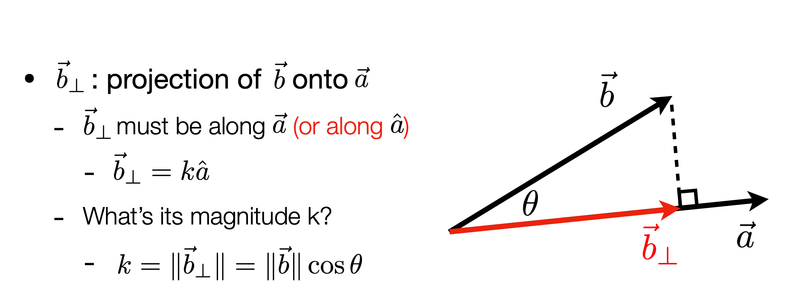
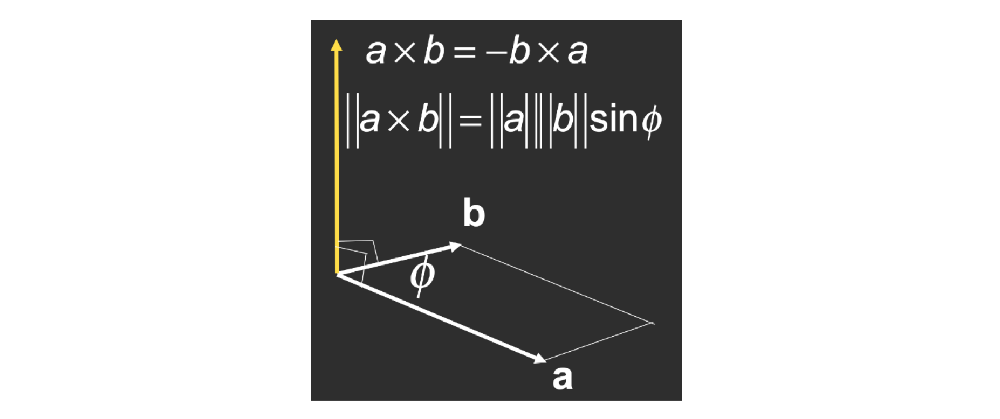
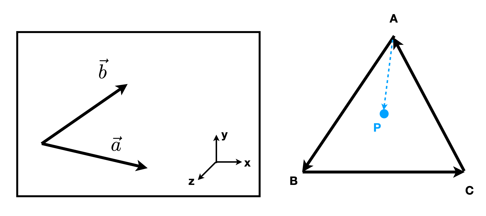

# GAMES101 - 现代计算机图形学课程笔记

> 课程主讲：闫令琪 (Lingqi Yan) | UCSB
> B站课程链接：https://www.bilibili.com/video/BV1X7411F744

---

## 目录

1. [概览与光栅化](#1-概览与光栅化)
2. [向量与线性代数](#2-向量与线性代数)
3. [变换](#3-变换)
4. [光栅化](#4-光栅化)
5. [着色](#5-着色)
6. [几何](#6-几何)
7. [光线追踪](#7-光线追踪)
8. [动画与模拟](#8-动画与模拟)

---

## 1. 概览与光栅化

### 1.1 什么是计算机图形学

- 计算机图形学是研究如何在计算机中表示、处理、显示图形的学科
- 应用领域：游戏、电影、设计、可视化、虚拟现实等

### 1.2 图形学与视觉

- 人眼看到的是光线经物体反射后进入眼睛的结果
- 图形学的核心问题：如何模拟这个过程（正向 vs 逆向）

### 计算机视觉 & 计算机图形学

| 方向 | 输入 | 输出 | 核心任务 |
|:---:|:---:|:---:|:---:|
| 计算机图形学 | 场景/模型/几何 | 图像 | 从模型到图像（渲染） |
| 计算机视觉 | 图像 | 场景理解/特征 | 从图像到理解（识别） |

**正向渲染 (Forward Rendering)**：
- 从场景出发 → 计算光线传播 → 生成图像
- 经典光线追踪、光栅化都属于正向渲染

**逆向问题 (Inverse Problem)**：
- 从图像出发 → 推断场景信息
- 图像分割、物体识别、三维重建

**两者的关系**：
- 计算机图形学和计算机视觉是互逆的过程
- 图形学：模型 → 图像（模拟物理过程）
- 视觉：图像 → 模型（理解视觉信息）
- 深度学习时代两者逐渐融合（如 NeRF、3D Gaussian Splatting）

### 1.3 图形成像基本流程

```
顶点数据 → 顶点着色器 → 图元装配 → 光栅化 → 片元着色器 → 帧缓冲 → 显示
```

---

## 2. 向量与线性代数

> 本章对应课程第 2 讲 [[课件 PDF](https://sites.cs.ucsb.edu/~lingqi/teaching/resources/GAMES101_Lecture_02.pdf)]

### 2.1 向量基础

#### 向量的定义


- 向量有**方向**和**长度**，没有绝对起始位置
- 通常记为 $\vec{a}$ 或粗体 **a**
- 用起止点表示：$\overrightarrow{AB} = B - A$

#### 向量归一化 (Normalization)

- 向量的模（长度）：$||\vec{a}||$
- **单位向量**：模为 1 的向量，用于表示方向
- 归一化：$\hat{a} = \frac{\vec{a}}{||\vec{a}||}$

#### 向量加法

- **几何表示**：平行四边形法则 & 三角形法则
- **代数计算**：对应坐标相加

$$
\vec{a} + \vec{b} = \begin{pmatrix} x_a + x_b \\ y_a + y_b \end{pmatrix}
$$

**向量加法的几何图示**：


> **平行四边形法则**：$\vec{a} + \vec{b} = \vec{b} + \vec{a}$（交换律）
> **三角形法则**：先 $\vec{a}$ 后 $\vec{b}$，首尾相连

#### 笛卡尔坐标系


$$
\vec{A} = \begin{pmatrix} x \\ y \end{pmatrix}, \quad \vec{A}^T = (x, y), \quad ||\vec{A}|| = \sqrt{x^2 + y^2}
$$

---

### 2.2 向量乘法

#### 点积 (Dot Product / Scalar Product)


点积计算，得到的是一个标量，解决这两个向量有多相似（投影、夹角、强度）问题

**定义**：

$$
\vec{a} \cdot \vec{b} = ||\vec{a}|| \cdot ||\vec{b}|| \cdot \cos\theta
$$

$$
\cos\theta = \frac{\vec{a} \cdot \vec{b}}{||\vec{a}|| \cdot ||\vec{b}||}
$$

对于单位向量：$\cos\theta = \hat{a} \cdot \hat{b}$

**坐标计算**：

- 2D：$\vec{a} \cdot \vec{b} = x_a x_b + y_a y_b$
- 3D：$\vec{a} \cdot \vec{b} = x_a x_b + y_a y_b + z_a z_b$

**性质**：

| 性质 | 公式 |
|:---|:---|
| 交换律 | $\vec{a} \cdot \vec{b} = \vec{b} \cdot \vec{a}$ |
| 分配律 | $\vec{a} \cdot (\vec{b} + \vec{c}) = \vec{a} \cdot \vec{b} + \vec{a} \cdot \vec{c}$ |
| 结合律 | $(k\vec{a}) \cdot \vec{b} = \vec{a} \cdot (k\vec{b}) = k(\vec{a} \cdot \vec{b})$ |

**在图形学中的应用**：

1. **计算两向量夹角**（如光线与法线的夹角）
2. **向量投影**：$\vec{b}$ 在 $\vec{a}$ 上的投影 $\vec{b}_\perp = (\vec{b} \cdot \hat{a})\hat{a}$
3. **判断方向**：点积 > 0 同向，< 0 反向，= 0 垂直

**点积的几何意义图示**：

<div style="display: flex; justify-content: space-between; gap: 10px;">
  
  
</div>

> **计算两向量夹角**：$\cos\theta = \frac{\vec{a} \cdot \vec{b}}{||\vec{a}|| \cdot ||\vec{b}||}$
> **向量投影**：$\vec{b}$ 在 $\vec{a}$ 上的投影 $\vec{b}_\perp = (\vec{b} \cdot \hat{a})\hat{a}$

[三角函数](../数学基础/三角函数.md)

**点积判断方向**：


> - $\vec{a} \cdot \vec{b} > 0$：同向（$\theta < 90°$）
> - $\vec{a} \cdot \vec{b} = 0$：垂直（$\theta = 90°$）
> - $\vec{a} \cdot \vec{b} < 0$：反向（$\theta > 90°$）

#### 叉积｜叉乘 (Cross Product / Vector Product)



叉积计算，得到的是一个向量，解决垂直于这两个向量的方向是什么（法线、旋转轴、方向）

**定义**：

- 叉积结果垂直于两个输入向量
- 方向由**右手定则**确定
- 常用于构建坐标系

**性质**：

| 性质 | 公式 |
|:---|:---|
| 反交换律 | $\vec{a} \times \vec{b} = -\vec{b} \times \vec{a}$ |
| 自身叉积 | $\vec{a} \times \vec{a} = \vec{0}$ |
| 分配律 | $\vec{a} \times (\vec{b} + \vec{c}) = \vec{a} \times \vec{b} + \vec{a} \times \vec{c}$ |
| 数乘结合 | $\vec{a} \times (k\vec{b}) = k(\vec{a} \times \vec{b})$ |

**标准正交基关系**：

$$
\vec{x} \times \vec{y} = +\vec{z}, \quad \vec{y} \times \vec{z} = +\vec{x}, \quad \vec{z} \times \vec{x} = +\vec{y}
$$

**坐标计算**：

$$
\vec{a} \times \vec{b} = \begin{pmatrix} y_a z_b - y_b z_a \\ z_a x_b - x_a z_b \\ x_a y_b - y_a x_b \end{pmatrix}
$$

**矩阵形式**（对偶矩阵）：

$$
\vec{a} \times \vec{b} = A^* \vec{b} = \begin{pmatrix} 0 & -z_a & y_a \\ z_a & 0 & -x_a \\ -y_a & x_a & 0 \end{pmatrix} \begin{pmatrix} x_b \\ y_b \\ z_b \end{pmatrix}
$$

**在图形学中的应用**：


1. **判断左右**：叉积方向判断点在向量的左侧还是右侧，如【图一】$\vec{a} \times \vec{b}$，对应坐标系为z轴正方向，及$\vec{b}$在$\vec{a}$的左侧
2. **判断内外**：用于三角形光栅化中判断点是否在三角形内，如【图二】$\vec{AB} \times \vec{AP}$，P在$\vec{AB}$ 的左侧，$\vec{BC} \times \vec{BP}$，P在$\vec{AB}$ 的左侧，$\vec{CA} \times \vec{CP}$，P在$\vec{AB}$ 的左侧
3. **计算法线**：三角形两边叉积得到法向量

**叉积的右手定则图示**：

右手螺旋法则：右手点赞状态，$\vec{a} \times \vec{b}$ ，四个手指从$\vec{a}$卷曲到$\vec{b}$，z轴方向为大拇指方向
> - $\vec{a} \times \vec{b}$ 垂直于 $\vec{a}$ 和 $\vec{b}$ 所在平面
> - 方向由**右手定则**确定：四指从 $\vec{a}$ 转向 $\vec{b}$，大拇指指向叉积方向

**叉积判断左右与内外**：


> **判断左右**：$\vec{a} \times \vec{b}$ 结果为正 → $\vec{b}$ 在 $\vec{a}$ 左侧


> **判断内外**：若 $P$ 在 $\vec{AB}$、$\vec{BC}$、$\vec{CA}$ 的同侧（左侧），则 $P$ 在三角形内
> 用于**三角形光栅化**判断像素是否在三角形内

**正交坐标系的条件**：

$$
||\vec{u}|| = ||\vec{v}|| = ||\vec{w}|| = 1 \quad \text{(单位向量)}
$$

$$
\vec{u} \cdot \vec{v} = \vec{v} \cdot \vec{w} = \vec{u} \cdot \vec{w} = 0 \quad \text{(两两垂直)}
$$

$$
\vec{w} = \vec{u} \times \vec{v} \quad \text{(右手系)}
$$
三位直角坐标系

**任意向量的分解**：

$$
\vec{p} = (\vec{p} \cdot \vec{u})\vec{u} + (\vec{p} \cdot \vec{v})\vec{v} + (\vec{p} \cdot \vec{w})\vec{w}
$$

**应用场景**：

- 坐标系转换：世界坐标、模型坐标、相机坐标、局部坐标
- 后续课程的 MVP 变换基础

**正交坐标系与向量分解图示**：


> **正交坐标系条件**：$||\vec{u}|| = ||\vec{v}|| = ||\vec{w}|| = 1$，且两两垂直，$\vec{w} = \vec{u} \times \vec{v}$


> **向量分解**：$\vec{p} = (\vec{p} \cdot \vec{u})\vec{u} + (\vec{p} \cdot \vec{v})\vec{v} + (\vec{p} \cdot \vec{w})\vec{w}$

**不同坐标系之间的关系**：


> **坐标系转换**：模型坐标 → 世界坐标 → 相机坐标 → 裁剪坐标（后续 MVP 变换）

---

### 2.4 矩阵 (Matrices)

#### 矩阵基本概念

- $m \times n$ 矩阵：$m$ 行 $n$ 列的数组
- 加法和标量乘法：逐元素操作

#### 矩阵乘法

**维度要求**：$(M \times N) \times (N \times P) = (M \times P)$

$\begin{pmatrix} 1 & 3 \\ 5 & 2 \\ 0 & 4 \end{pmatrix} \begin{pmatrix} 3 & 6 & 9 & 4 \\ 2 & 7 & 8 & 3 \end{pmatrix} = \begin{pmatrix} 9 & ? & 33 & 13 \\ 19 & 44 & 61 & 26 \\ 8 & 28 & 32 & ? \end{pmatrix}$

如何得到：以2行4列 26 举例，获取原来的两个向量数据 2行对应的为 5和2，4列对应的为 4和3，点积计算：$5*4 + 2*3 = 26$


$$
C_{ij} = \sum_{k=1}^{N} A_{ik} \cdot B_{kj}
$$


> **计算规则**：$C_{ij}$ 是矩阵 $A$ 的第 $i$ 行与矩阵 $B$ 的第 $j$ 列的点积
> $(M \times N) \times (N \times P) = (M \times P)$

**性质**：

| 性质 | 说明 |
|:---|:---|
| 非交换律 | $AB \neq BA$（一般情况） |
| 结合律 | $(AB)C = A(BC)$ |
| 分配律 | $A(B+C) = AB + AC$ |

#### 矩阵-向量乘法

- 向量视为列矩阵（$m \times 1$）
- 是变换的基础（如反射、旋转、缩放）

**矩阵变换图示**：


> **关于 y 轴对称（反射、镜像）**：$\begin{pmatrix} -1 & 0 \\ 0 & 1 \end{pmatrix} \begin{pmatrix} x \\ y \end{pmatrix} = \begin{pmatrix} -x \\ y \end{pmatrix}$

#### 矩阵转置

原本的2行3列矩阵，转置后变为3行2列矩阵，行列互换

$\begin{pmatrix} 1 & 2 \\ 3 & 4 \\ 5 & 6 \end{pmatrix}^T = \begin{pmatrix} 1 & 3 & 5 \\ 2 & 4 & 6 \end{pmatrix}$


$$
(A^T)_{ij} = A_{ji}, \quad (AB)^T = B^T A^T
$$

#### 单位矩阵与逆矩阵

$I_{3 \times 3} = \begin{pmatrix} 1 & 0 & 0 \\ 0 & 1 & 0  \\ 0 & 0 & 1 \end{pmatrix}$

矩阵的逆：两个矩阵相乘得到为单位矩阵。

> - **单位矩阵** $I$：对角线为 1，其余为 0，$AI = IA = A$
> - **逆矩阵** $A^{-1}$：$AA^{-1} = A^{-1}A = I$，$(AB)^{-1} = B^{-1}A^{-1}$

则 $A^{-1}$ 称为 $A$ 的**逆矩阵**，其中 $I$ 是单位矩阵。
> **注意**：只有**方阵**（行数=列数）且**行列式不为零**（满秩）的矩阵才有逆矩阵。

获取逆矩阵的方法


相机的旋转、平移。


## 3. 变换

### 3.1 二维变换

#### 缩放变换 (Scale)

$$
\begin{bmatrix} x' \\ y' \end{bmatrix} = \begin{bmatrix} s_x & 0 \\ 0 & s_y \end{bmatrix} \begin{bmatrix} x \\ y \end{bmatrix}
$$

#### 旋转变换 (Rotation)

$$
\begin{bmatrix} x' \\ y' \end{bmatrix} = \begin{bmatrix} \cos\theta & -\sin\theta \\ \sin\theta & \cos\theta \end{bmatrix} \begin{bmatrix} x \\ y \end{bmatrix}
$$

#### 平移变换 (Translation)

使用齐次坐标：
$$
\begin{bmatrix} x' \\ y' \\ 1 \end{bmatrix} = \begin{bmatrix} 1 & 0 & t_x \\ 0 & 1 & t_y \\ 0 & 0 & 1 \end{bmatrix} \begin{bmatrix} x \\ y \\ 1 \end{bmatrix}
$$

### 3.2 仿射变换 (Affine Transformation)

- 仿射变换 = 线性变换 + 平移
- 齐次坐标表示：
$$
\begin{bmatrix} x' \\ y' \\ w' \end{bmatrix} = \begin{bmatrix} a & b & t_x \\ c & d & t_y \\ 0 & 0 & 1 \end{bmatrix} \begin{bmatrix} x \\ y \\ 1 \end{bmatrix}
$$

### 3.3 三维变换

- 三维空间中的变换同样使用 4×4 矩阵和齐次坐标
- 旋转矩阵的分解：绕 x、y、z 轴旋转

### 3.4 MVP 变换

1. **Model 变换**：将物体从模型坐标系变换到世界坐标系
2. **View 变换**：将世界坐标系变换到相机坐标系
3. **Projection 变换**：将相机坐标系变换到裁剪坐标系

### 3.5 视图变换 (View Transformation)

- 相机位置 `e`，观察方向 `g`，上方向 `t`
- 视图变换矩阵：
$$
M_{view} = R_{view} \cdot T_{view}
$$

### 3.6 投影变换 (Projection)

#### 正交投影 (Orthographic)

- 将立方体 $[l,r] \times [b,t] \times [f,n]$ 映射到标准立方体 $[-1,1]^3$
- 先平移，再缩放

#### 透视投影 (Perspective)

- 先做透视压缩（远小近大），再做正交投影
- 透视投影矩阵：
$$
M_{persp} = \begin{bmatrix} n & 0 & 0 & 0 \\ 0 & n & 0 & 0 \\ 0 & 0 & n+f & -nf \\ 0 & 0 & 1 & 0 \end{bmatrix}
$$

---

## 4. 光栅化

### 4.1 采样 (Sampling)

- 光栅化本质上是对三角形进行采样
- 判断像素中心点是否在三角形内

### 4.2 判断点在三角形内

使用叉积判断：
- 若 $P$ 在 $\vec{AB}$、$\vec{BC}$、$\vec{CA}$ 的同侧，则 $P$ 在三角形内

```cpp
bool insideTriangle(float x, float y, const Vector3f* _v) {
    // 对每条边计算叉积，判断点是否在同一侧
}
```

### 4.3 包围盒优化

- 使用三角形的轴对齐包围盒 (AABB) 限制采样范围
- 只在包围盒内的像素进行判断

### 4.4 抗锯齿 (Anti-Aliasing)

#### 超采样 (SSAA)

- 将每个像素分为多个子像素，分别采样后取平均
- 效果好但计算量大

#### 多重采样 (MSAA)

- 只在子采样点判断是否在三角形内
- 颜色只在中心点计算，减少计算量

#### FXAA/TAA

- 后处理抗锯齿技术
- FXAA：快速近似抗锯齿
- TAA：时间抗锯齿，利用帧间信息

### 4.5 深度缓冲 (Z-Buffer)

- 存储每个像素的深度值
- 渲染时比较深度，只绘制离相机更近的片元
- 画家算法的改进

```cpp
for each triangle:
    for each sample (x, y, z):
        if z < zbuffer[x, y]:
            framebuffer[x, y] = color
            zbuffer[x, y] = z
```

---

## 5. 着色

### 5.1 Blinn-Phong 反射模型

#### 漫反射 (Diffuse)

- 光线均匀散射到各个方向
- 公式：$L_d = k_d \cdot (I/r^2) \cdot \max(0, \vec{n} \cdot \vec{l})$

#### 高光反射 (Specular)

- 观察方向接近镜面反射方向时看到高光
- 公式：$L_s = k_s \cdot (I/r^2) \cdot \max(0, \vec{n} \cdot \vec{h})^p$
- $\vec{h}$ 为半程向量：$\vec{h} = \frac{\vec{v}+\vec{l}}{||\vec{v}+\vec{l}||}$

#### 环境光 (Ambient)

- 近似全局光照效果
- 公式：$L_a = k_a \cdot I_a$

#### 完整 Blinn-Phong 模型

$$
L = L_a + L_d + L_s = k_a I_a + k_d \frac{I}{r^2} \max(0, \vec{n} \cdot \vec{l}) + k_s \frac{I}{r^2} \max(0, \vec{n} \cdot \vec{h})^p
$$

### 5.2 着色频率

- **平面着色 (Flat Shading)**：每个三角形一个法线
- **顶点着色 (Gouraud Shading)**：每个顶点着色，插值填充
- **像素着色 (Phong Shading)**：每个像素计算着色

### 5.3 纹理映射 (Texture Mapping)

- 将 2D 纹理映射到 3D 表面
- UV 坐标：每个顶点对应纹理上的一个点

### 5.4 纹理放大与缩小

#### 双线性插值 (Bilinear Interpolation)

- 在 4 个最近纹理像素间插值
- 比最近邻插值效果更平滑

#### Mipmap

- 预计算多级纹理，用于纹理缩小
- 根据像素覆盖范围选择合适的层级
- 三线性插值：在两个层级间再做插值

### 5.5 凹凸贴图 (Bump/Normal Mapping)

- 通过扰动法线模拟表面细节
- 不改变实际几何，只影响光照计算

### 5.6 环境贴图 (Environment Mapping)

- 球面环境贴图、立方体环境贴图
- 用于模拟反射效果

---

## 6. 几何

### 6.1 几何表示方法

#### 隐式几何 (Implicit)

- $f(x, y, z) = 0$
- 优点：容易判断点是否在表面内外
- 缺点：难以直接采样
- 例子：球体、代数曲面、CSG

#### 显式几何 (Explicit)

- 参数化表示：$(x, y, z) = f(u, v)$
- 优点：容易采样
- 缺点：难以判断内外
- 例子：三角网格、贝塞尔曲面

### 6.2 贝塞尔曲线 (Bézier Curves)

- 通过控制点定义曲线
- de Casteljau 算法：递归线性插值

```
给定控制点 b0, b1, ..., bn 和参数 t:
重复插值直到只剩一个点：
  b_i^j = (1-t) * b_i^{j-1} + t * b_{i+1}^{j-1}
```

#### 贝塞尔曲线性质

- 端点插值：经过首尾控制点
- 仿射变换不变性
- 凸包性质：曲线在控制点的凸包内

### 6.3 B-Splines (B样条)

- 基函数非负且和为1
- 局部性：修改一个控制点只影响局部曲线
- 比贝塞尔曲线更灵活

### 6.4 曲面细分 (Subdivision)

- Loop 细分：用于三角网格
- Catmull-Clark 细分：用于四边形网格

### 6.5 网格简化 (Mesh Simplification)

- 边坍缩 (Edge Collapse)
- 使用二次误差度量 (QEM) 选择要坍缩的边

---

## 7. 光线追踪

### 7.1 为什么需要光线追踪

- 光栅化难以处理全局效果（软阴影、间接光照等）
- 光线追踪能更准确地模拟光的传播

### 7.2 光线投射 (Ray Casting)

- 从相机发射光线穿过每个像素
- 找到最近交点，计算着色

### 7.3 光线追踪算法

#### Whitted-Style 光线追踪

- 递归追踪反射和折射光线
- 最终颜色 = 直接光照 + 反射贡献 + 折射贡献

#### 光线-表面交点计算

- 光线方程：$\vec{r}(t) = \vec{o} + t\vec{d}$
- 平面交点：求解 $\vec{n} \cdot (\vec{o} + t\vec{d}) + d = 0$
- 三角形交点：Möller-Trumbore 算法

### 7.4 加速结构

#### 包围盒 (Bounding Volume)

- 用简单几何体包围复杂物体
- 光线不与包围盒相交则跳过内部物体

#### 均匀网格 (Uniform Grid)

- 将空间划分为均匀网格
- 只测试光线经过的格子内的物体

#### BVH (Bounding Volume Hierarchy)

- 递归地将物体分成两组
- 构建树结构，遍历时剪枝
- 最常用的加速结构

### 7.5 辐射度量学 (Radiometry)

#### 基本概念

- **辐射能 (Radiant Energy)**：$Q$，单位焦耳
- **辐射通量 (Radiant Flux)**：$\Phi = dQ/dt$，单位瓦特
- **辐射强度 (Radiant Intensity)**：$I = d\Phi/d\omega$，单位瓦特/立体角
- **辐照度 (Irradiance)**：$E = d\Phi/dA$，单位瓦特/平方米
- **辐射率 (Radiance)**：$L = d^2\Phi/(dA \cos\theta d\omega)$

#### 双向反射分布函数 (BRDF)

$$
f_r(\omega_i \rightarrow \omega_r) = \frac{dL_r(\omega_r)}{dE_i(\omega_i)} = \frac{dL_r(\omega_r)}{L_i(\omega_i) \cos\theta_i d\omega_i}
$$

#### 渲染方程 (Rendering Equation)

$$
L_o(p, \omega_o) = L_e(p, \omega_o) + \int_{\Omega} f_r(p, \omega_i \rightarrow \omega_r) L_i(p, \omega_i) \cos\theta_i d\omega_i
$$

### 7.6 蒙特卡洛积分

- 使用随机采样近似积分
- 无偏估计：$F_N = \frac{1}{N} \sum_{i=1}^{N} \frac{f(X_i)}{p(X_i)}$

### 7.7 路径追踪 (Path Tracking)

- 基于蒙特卡洛的全局光照算法
- 递归采样：每次随机选择一个方向继续追踪
- Russian Roulette：以一定概率终止递归

---

## 8. 动画与模拟

### 8.1 动画基础

- 关键帧动画 (Keyframe Animation)
- 物理模拟 (Physics Simulation)

### 8.2 质点弹簧系统 (Mass Spring Systems)

- 用弹簧连接质点模拟布料等
- 弹力：$F_s = k_s \cdot (||p_1 - p_2|| - l)$

### 8.3 粒子系统 (Particle Systems)

- 大量粒子模拟流体、烟雾、火焰
- 每个粒子独立运动，受外力影响

### 8.4 运动学 (Kinematics)

#### 正向运动学 (Forward Kinematics)

- 从根节点到末端，逐级计算位置

#### 逆向运动学 (Inverse Kinematics)

- 给定末端位置，求解关节角度
- 通常需要数值方法求解

---

## 附录：核心公式速查

### MVP 变换
```
最终位置 = Projection × View × Model × 顶点坐标
```

### Blinn-Phong
```
L = k_a*I_a + k_d*(I/r²)*max(0, n·l) + k_s*(I/r²)*max(0, n·h)^p
```

### 渲染方程
```
Lo(p,ωo) = Le(p,ωo) + ∫ fr(p,ωi→ωr) Li(p,ωi) cosθi dωi
```

### 蒙特卡洛估计
```
F_N = (1/N) Σ f(Xi)/p(Xi)
```

---

## 学习资源

- [课程主页](https://sites.cs.ucsb.edu/~lingqi/teaching/games101.html)
- [B站完整课程](https://www.bilibili.com/video/BV1X7411F744)
- [课程作业框架](https://github.com/AK47ASW/GAMES101)

---

*笔记持续更新中...*