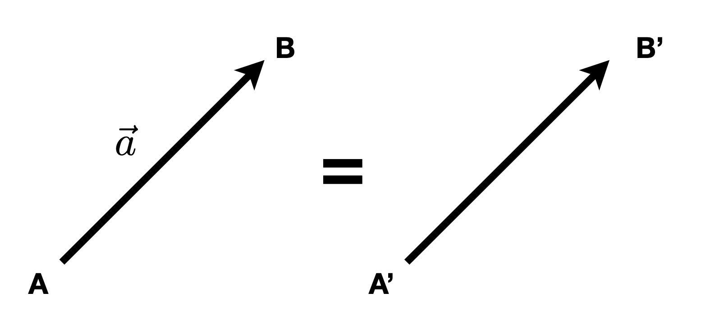
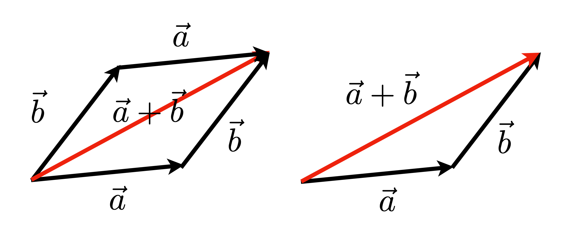
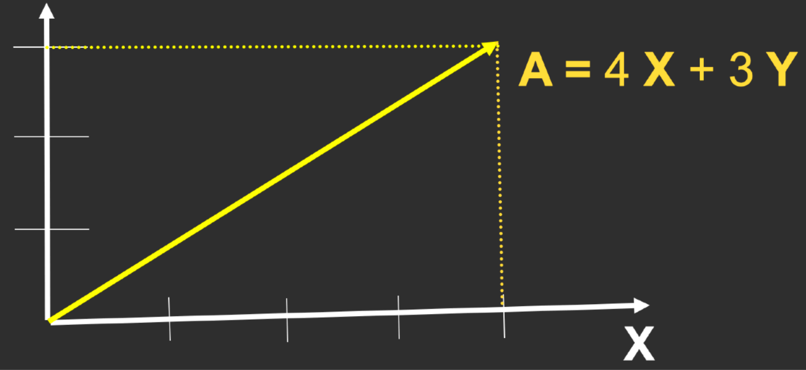
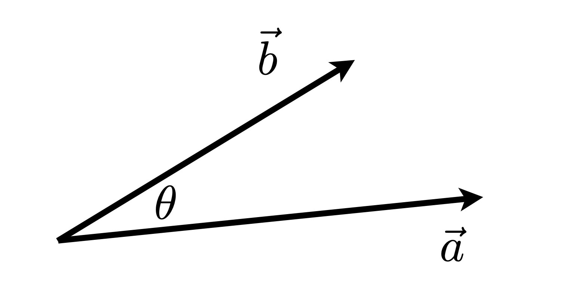
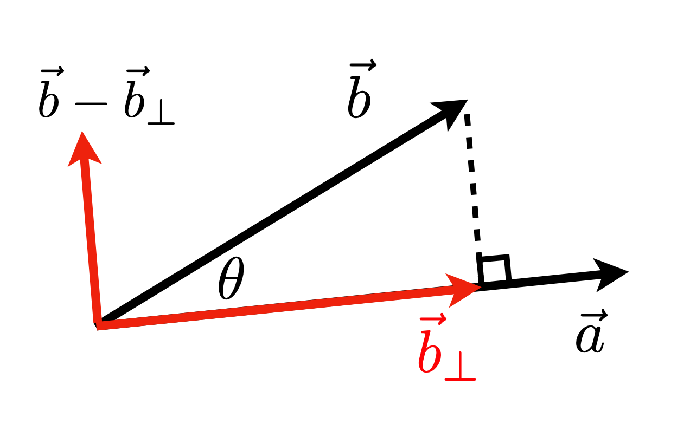
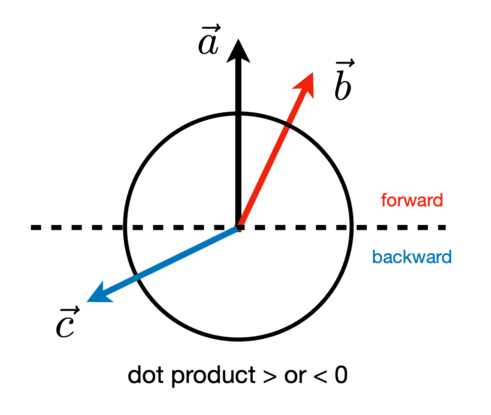
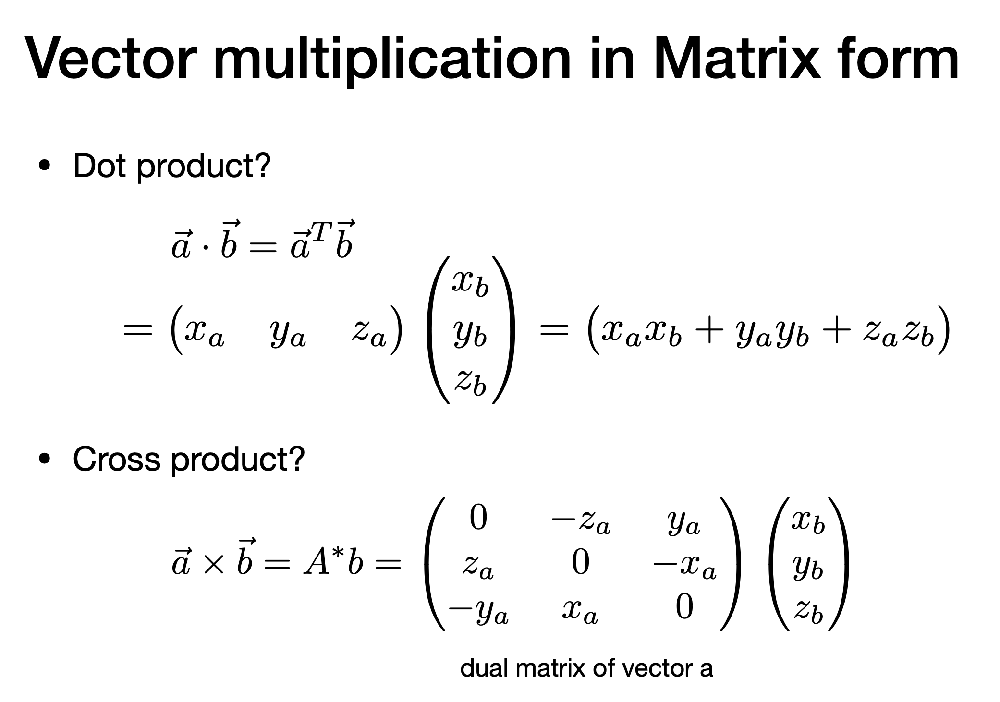

> 本章对应课程第 2 讲 [[课件 PDF](https://sites.cs.ucsb.edu/~lingqi/teaching/resources/GAMES101_Lecture_02.pdf)]

### 2.1 向量基础

#### 向量的定义

- 向量有**方向**和**长度**，没有绝对起始位置
- 通常记为 $\vec{a}$ 或粗体 **a**
- 用起止点表示：$\overrightarrow{AB} = B - A$

#### 向量归一化 (Normalization)

- 向量的模（长度）：$||\vec{a}||$
- **单位向量**：模为 1 的向量，用于表示方向
- 归一化：$\hat{a} = \frac{\vec{a}}{||\vec{a}||}$

#### 向量加法

- **几何表示**：平行四边形法则 & 三角形法则
- **代数计算**：对应坐标相加

$$
\vec{a} + \vec{b} = \begin{pmatrix} x_a + x_b \\ y_a + y_b \end{pmatrix}
$$

**向量加法的几何图示**：

> **平行四边形法则**：$\vec{a} + \vec{b} = \vec{b} + \vec{a}$（交换律）
> **三角形法则**：先 $\vec{a}$ 后 $\vec{b}$，首尾相连

#### 笛卡尔坐标系

$$
\vec{A} = \begin{pmatrix} x \\ y \end{pmatrix}, \quad \vec{A}^T = (x, y), \quad ||\vec{A}|| = \sqrt{x^2 + y^2}
$$

---

### 2.2 向量乘法

#### 点积 (Dot Product / Scalar Product)

点积计算，得到的是一个标量，解决这两个向量有多相似（投影、夹角、强度）问题

**定义**：

$$
\vec{a} \cdot \vec{b} = ||\vec{a}|| \cdot ||\vec{b}|| \cdot \cos\theta
$$

$$
\cos\theta = \frac{\vec{a} \cdot \vec{b}}{||\vec{a}|| \cdot ||\vec{b}||}
$$

对于单位向量：$\cos\theta = \hat{a} \cdot \hat{b}$

**坐标计算**：

- 2D：$\vec{a} \cdot \vec{b} = x_a x_b + y_a y_b$
- 3D：$\vec{a} \cdot \vec{b} = x_a x_b + y_a y_b + z_a z_b$

**性质**：

| 性质 | 公式 |
|:---|:---|
| 交换律 | $\vec{a} \cdot \vec{b} = \vec{b} \cdot \vec{a}$ |
| 分配律 | $\vec{a} \cdot (\vec{b} + \vec{c}) = \vec{a} \cdot \vec{b} + \vec{a} \cdot \vec{c}$ |
| 结合律 | $(k\vec{a}) \cdot \vec{b} = \vec{a} \cdot (k\vec{b}) = k(\vec{a} \cdot \vec{b})$ |

**在图形学中的应用**：

1. **计算两向量夹角**（如光线与法线的夹角）
2. **向量投影**：$\vec{b}$ 在 $\vec{a}$ 上的投影 $\vec{b}_\perp = (\vec{b} \cdot \hat{a})\hat{a}$
3. **判断方向**：点积 > 0 同向，< 0 反向，= 0 垂直

**点积的几何意义图示**：

  
  

> **计算两向量夹角**：$\cos\theta = \frac{\vec{a} \cdot \vec{b}}{||\vec{a}|| \cdot ||\vec{b}||}$
> **向量投影**：$\vec{b}$ 在 $\vec{a}$ 上的投影 $\vec{b}_\perp = (\vec{b} \cdot \hat{a})\hat{a}$

[三角函数](../数学基础/三角函数.md)

**点积判断方向**：

> - $\vec{a} \cdot \vec{b} > 0$：同向（$\theta < 90°$）
> - $\vec{a} \cdot \vec{b} = 0$：垂直（$\theta = 90°$）
> - $\vec{a} \cdot \vec{b} < 0$：反向（$\theta > 90°$）

#### 叉积｜叉乘 (Cross Product / Vector Product)

叉积计算，得到的是一个向量，解决垂直于这两个向量的方向是什么（法线、旋转轴、方向）

**定义**：

- 叉积结果垂直于两个输入向量
- 方向由**右手定则**确定
- 常用于构建坐标系

**性质**：

| 性质 | 公式 |
|:---|:---|
| 反交换律 | $\vec{a} \times \vec{b} = -\vec{b} \times \vec{a}$ |
| 自身叉积 | $\vec{a} \times \vec{a} = \vec{0}$ |
| 分配律 | $\vec{a} \times (\vec{b} + \vec{c}) = \vec{a} \times \vec{b} + \vec{a} \times \vec{c}$ |
| 数乘结合 | $\vec{a} \times (k\vec{b}) = k(\vec{a} \times \vec{b})$ |

**标准正交基关系**：

$$
\vec{x} \times \vec{y} = +\vec{z}, \quad \vec{y} \times \vec{z} = +\vec{x}, \quad \vec{z} \times \vec{x} = +\vec{y}
$$

**坐标计算**：

$$
\vec{a} \times \vec{b} = \begin{pmatrix} y_a z_b - y_b z_a \\ z_a x_b - x_a z_b \\ x_a y_b - y_a x_b \end{pmatrix}
$$

**矩阵形式**（对偶矩阵）：

$$
\vec{a} \times \vec{b} = A^* \vec{b} = \begin{pmatrix} 0 & -z_a & y_a \\ z_a & 0 & -x_a \\ -y_a & x_a & 0 \end{pmatrix} \begin{pmatrix} x_b \\ y_b \\ z_b \end{pmatrix}
$$

**在图形学中的应用**：

1. **判断左右**：叉积方向判断点在向量的左侧还是右侧，如【图一】$\vec{a} \times \vec{b}$，对应坐标系为z轴正方向，及$\vec{b}$在$\vec{a}$的左侧
2. **判断内外**：用于三角形光栅化中判断点是否在三角形内，如【图二】$\vec{AB} \times \vec{AP}$，P在$\vec{AB}$ 的左侧，$\vec{BC} \times \vec{BP}$，P在$\vec{AB}$ 的左侧，$\vec{CA} \times \vec{CP}$，P在$\vec{AB}$ 的左侧
3. **计算法线**：三角形两边叉积得到法向量

**叉积的右手定则图示**：

右手螺旋法则：右手点赞状态，$\vec{a} \times \vec{b}$ ，四个手指从$\vec{a}$卷曲到$\vec{b}$，z轴方向为大拇指方向
> - $\vec{a} \times \vec{b}$ 垂直于 $\vec{a}$ 和 $\vec{b}$ 所在平面
> - 方向由**右手定则**确定：四指从 $\vec{a}$ 转向 $\vec{b}$，大拇指指向叉积方向

**叉积判断左右与内外**：

> **判断左右**：$\vec{a} \times \vec{b}$ 结果为正 → $\vec{b}$ 在 $\vec{a}$ 左侧

> **判断内外**：若 $P$ 在 $\vec{AB}$、$\vec{BC}$、$\vec{CA}$ 的同侧（左侧），则 $P$ 在三角形内
> 用于**三角形光栅化**判断像素是否在三角形内

**正交坐标系的条件**：

$$
||\vec{u}|| = ||\vec{v}|| = ||\vec{w}|| = 1 \quad \text{(单位向量)}
$$

$$
\vec{u} \cdot \vec{v} = \vec{v} \cdot \vec{w} = \vec{u} \cdot \vec{w} = 0 \quad \text{(两两垂直)}
$$

$$
\vec{w} = \vec{u} \times \vec{v} \quad \text{(右手系)}
$$
三位直角坐标系

**任意向量的分解**：

$$
\vec{p} = (\vec{p} \cdot \vec{u})\vec{u} + (\vec{p} \cdot \vec{v})\vec{v} + (\vec{p} \cdot \vec{w})\vec{w}
$$

**应用场景**：

- 坐标系转换：世界坐标、模型坐标、相机坐标、局部坐标
- 后续课程的 MVP 变换基础

**正交坐标系与向量分解图示**：

> **正交坐标系条件**：$||\vec{u}|| = ||\vec{v}|| = ||\vec{w}|| = 1$，且两两垂直，$\vec{w} = \vec{u} \times \vec{v}$

> **向量分解**：$\vec{p} = (\vec{p} \cdot \vec{u})\vec{u} + (\vec{p} \cdot \vec{v})\vec{v} + (\vec{p} \cdot \vec{w})\vec{w}$

**不同坐标系之间的关系**：

> **坐标系转换**：模型坐标 → 世界坐标 → 相机坐标 → 裁剪坐标（后续 MVP 变换）

---

### 2.4 矩阵 (Matrices)

#### 矩阵基本概念

- $m \times n$ 矩阵：$m$ 行 $n$ 列的数组
- 加法和标量乘法：逐元素操作

#### 矩阵乘法

**维度要求**：$(M \times N) \times (N \times P) = (M \times P)$

$$
C_{ij} = \sum_{k=1}^{N} A_{ik} \cdot B_{kj}
$$

- $c_{ij}$ 表示 **C** 的第 $i$ 行第 $j$ 列元素
- $a_{ik}$ 表示 **A** 的第 $i$ 行第 $k$ 列元素
- $b_{kj}$ 表示 **B** 的第 $k$ 行第 $j$ 列元素

设：
$$\mathbf{A} = \begin{bmatrix} a_{11} & a_{12} \\ a_{21} & a_{22} \end{bmatrix}, \quad \mathbf{B} = \begin{bmatrix} b_{11} & b_{12} \\ b_{21} & b_{22} \end{bmatrix}$$

则：
$$\mathbf{AB} = \begin{bmatrix} 
a_{11}b_{11} + a_{12}b_{21} & a_{11}b_{12} + a_{12}b_{22} \\
a_{21}b_{11} + a_{22}b_{21} & a_{21}b_{12} + a_{22}b_{22}
\end{bmatrix}$$

$
\begin{pmatrix} 1 & 3 \\ 5 & 2 \\ 0 & 4 \end{pmatrix}
\begin{pmatrix} 3 & 6 & 9 & 4 \\ 2 & 7 & 8 & 3 \end{pmatrix}
= \begin{pmatrix} 9 & 27 & 33 & 13 \\ 19 & 44 & 61 & 26 \\ 8 & 28 & 32 & 12 \end{pmatrix}
$

如何得到：以2行4列 26 举例，获取原来的两个向量数据 2行对应的为 5和2，4列对应的为 4和3，点积计算：$5*4 + 2*3 = 26$

**性质**：

| 性质 | 说明 |
|:---|:---|
| 非交换律 | $AB \neq BA$（一般情况） |
| 结合律 | $(AB)C = A(BC)$ |
| 分配律 | $A(B+C) = AB + AC$ |

#### 矩阵-向量乘法

- 向量视为列矩阵（$m \times 1$）
- 是变换的基础（如反射、旋转、缩放）

**矩阵变换图示**：

> **关于 y 轴对称（反射、镜像）**：$\begin{pmatrix} -1 & 0 \\ 0 & 1 \end{pmatrix} \begin{pmatrix} x \\ y \end{pmatrix} = \begin{pmatrix} -x \\ y \end{pmatrix}$

#### 矩阵转置

原本的2行3列矩阵，转置后变为3行2列矩阵，行列互换

$\begin{pmatrix} 1 & 2 \\ 3 & 4 \\ 5 & 6 \end{pmatrix}^T = \begin{pmatrix} 1 & 3 & 5 \\ 2 & 4 & 6 \end{pmatrix}$

$$
(A^T)_{ij} = A_{ji}, \quad (AB)^T = B^T A^T
$$

#### 单位矩阵与逆矩阵

$I_{3 \times 3} = \begin{pmatrix} 1 & 0 & 0 \\ 0 & 1 & 0  \\ 0 & 0 & 1 \end{pmatrix}$

矩阵的逆：两个矩阵相乘得到为单位矩阵。

> - **单位矩阵** $I$：对角线为 1，其余为 0，$AI = IA = A$
> - **逆矩阵** $A^{-1}$：$AA^{-1} = A^{-1}A = I$，$(AB)^{-1} = B^{-1}A^{-1}$

则 $A^{-1}$ 称为 $A$ 的**逆矩阵**，其中 $I$ 是单位矩阵。
> **注意**：只有**方阵**（行数=列数）且**行列式不为零**（满秩）的矩阵才有逆矩阵。

获取逆矩阵的方法

相机的旋转、平移。

