> 本章对应课程第 3-4 讲
> - 第 3 讲 [[课件 PDF](https://sites.cs.ucsb.edu/~lingqi/teaching/resources/GAMES101_Lecture_03.pdf)]
> - 第 4 讲 [[课件 PDF](https://sites.cs.ucsb.edu/~lingqi/teaching/resources/GAMES101_Lecture_04.pdf)]
> - [[补充材料](https://sites.cs.ucsb.edu/~lingqi/teaching/resources/GAMES101_Lecture_04_supp.pdf)]

### 3.1 为什么要学习变换

变换在图形学中有两大核心应用：

| 应用场景 | 说明 | 示例 |
|:---:|:---|:---|
| **建模 (Modeling)** | 在场景中摆放物体 | 平移、旋转、缩放物体 |
| **观察 (Viewing)** | 将 3D 场景投影到 2D 图像 | 相机变换、投影变换 |

<!-- 截图：变换的应用示例 -->

---

### 3.2 二维变换

#### 线性变换的统一表示

所有二维线性变换都可以用矩阵乘法表示：

$$
\begin{bmatrix} x' \\ y' \end{bmatrix} = \begin{bmatrix} a & b \\ c & d \end{bmatrix} \begin{bmatrix} x \\ y \end{bmatrix}
$$

即 $\vec{x'} = M \vec{x}$

#### 缩放变换 (Scale)

**均匀缩放**（所有方向等比例）：

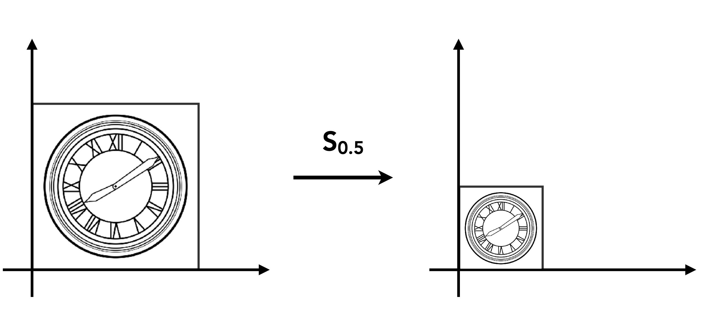

$x' = sx \qquad y' = sy$  

$$
\begin{pmatrix} x' \\ y' \end{pmatrix} = \begin{pmatrix} s & 0 \\ 0 & s \end{pmatrix} \begin{pmatrix} x \\ y \end{pmatrix}
$$

例如：$x = 2, \; y = 2, \; s = 0.5$

$$
\begin{pmatrix} x' \\ y' \end{pmatrix}
= \begin{pmatrix} 0.5 & 0 \\ 0 & 0.5 \end{pmatrix} \begin{pmatrix} 2 \\ 2 \end{pmatrix}
= \begin{pmatrix} 0.5 \times 2 + 0 \times 2 \\ 0 \times 2 + 0.5 \times 2 \end{pmatrix}
= \begin{pmatrix} 1 \\ 1 \end{pmatrix}
$$


**非均匀缩放**（各方向独立缩放）：

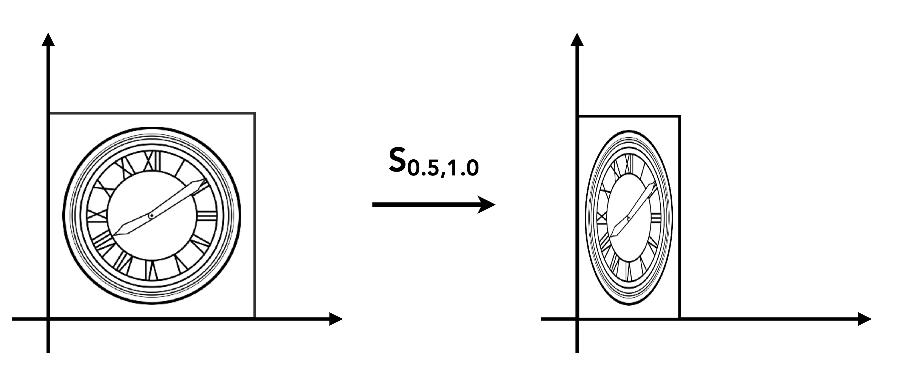

$$
\begin{pmatrix} x' \\ y' \end{pmatrix} = \begin{pmatrix} s_x & 0 \\ 0 & s_y \end{pmatrix} \begin{pmatrix} x \\ y \end{pmatrix}
$$

#### 反射变换 (Reflection)

关于 y 轴的反射：

$$
\begin{pmatrix} x' \\ y' \end{pmatrix} = \begin{pmatrix} -1 & 0 \\ 0 & 1 \end{pmatrix} \begin{pmatrix} x \\ y \end{pmatrix} = \begin{pmatrix} -x \\ y \end{pmatrix}
$$

#### 剪切变换 (Shear)
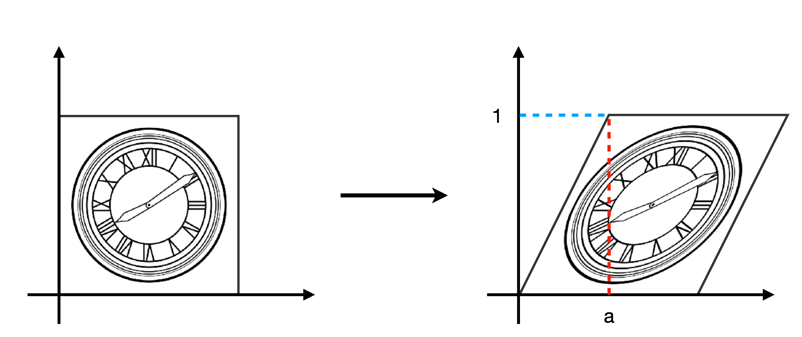
水平剪切（y=0 处不动，y=1 处水平偏移 a）：

$$
\begin{pmatrix} x' \\ y' \end{pmatrix} = \begin{pmatrix} 1 & a \\ 0 & 1 \end{pmatrix} \begin{pmatrix} x \\ y \end{pmatrix}
$$

参数 $a$ 的含义： 控制倾斜程度。$a = 0$ 时矩阵退化为单位矩阵（不变换），$a$ 越大倾斜越明显


#### 旋转变换 (Rotation)

默认旋转的原点为 $(0, 0)$，逆时针为正方向，旋转角度为 $\theta$。


绕原点逆时针旋转 $\theta$ 角：

$$
\begin{pmatrix} x' \\ y' \end{pmatrix} = \begin{pmatrix} \cos\theta & -\sin\theta \\ \sin\theta & \cos\theta \end{pmatrix} \begin{pmatrix} x \\ y \end{pmatrix}
$$

记作 $R_\theta$，特殊地：
- $R_{90°} = \begin{pmatrix} 0 & -1 \\ 1 & 0 \end{pmatrix}$
- $R_{-90°} = \begin{pmatrix} 0 & 1 \\ -1 & 0 \end{pmatrix}$


##### 旋转变换推导公式：

设旋转矩阵为未知数：$
R = \begin{pmatrix} A & B \\ C & D \end{pmatrix}
$ 已知两个基向量旋转后的结果，代入求解：

**基向量 $\hat{e_1} = (1, 0)$ 旋转 $\theta$ 后 → $(\cos\theta, \sin\theta)$：**

$$
\begin{pmatrix} A & B \\ C & D \end{pmatrix} \begin{pmatrix} 1 \\ 0 \end{pmatrix}
= \begin{pmatrix} A \times 1 + B \times 0 \\ C \times 1 + D \times 0 \end{pmatrix}
= \begin{pmatrix} A \\ C \end{pmatrix}
= \begin{pmatrix} \cos\theta \\ \sin\theta \end{pmatrix}
\implies A = \cos\theta, \; C = \sin\theta
$$

**基向量 $\hat{e_2} = (0, 1)$ 旋转 $\theta$ 后 → $(-\sin\theta, \cos\theta)$：**

$$
\begin{pmatrix} A & B \\ C & D \end{pmatrix} \begin{pmatrix} 0 \\ 1 \end{pmatrix}
= \begin{pmatrix} A \times 0 + B \times 1 \\ C \times 0 + D \times 1 \end{pmatrix}
= \begin{pmatrix} B \\ D \end{pmatrix}
= \begin{pmatrix} -\sin\theta \\ \cos\theta \end{pmatrix}
\implies B = -\sin\theta, \; D = \cos\theta
$$

**得到旋转矩阵：**

$$
R_\theta = \begin{pmatrix} \cos\theta & -\sin\theta \\ \sin\theta & \cos\theta \end{pmatrix}
$$

对任意点 $(x, y)$ 旋转的展开过程：

$$
\begin{pmatrix} x' \\ y' \end{pmatrix}
= \begin{pmatrix} \cos\theta & -\sin\theta \\ \sin\theta & \cos\theta \end{pmatrix} \begin{pmatrix} x \\ y \end{pmatrix}
= \begin{pmatrix} x\cos\theta - y\sin\theta \\ x\sin\theta + y\cos\theta \end{pmatrix}
$$

---

### 3.3 齐次坐标 (Homogeneous Coordinates)

#### 为什么需要齐次坐标

**问题**：平移变换**不是**线性变换，无法用 2×2 矩阵表示！

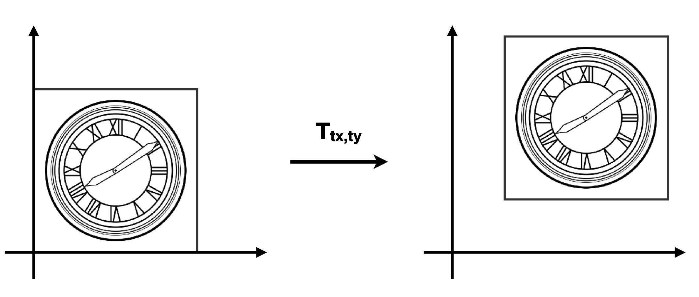

$x' = x+t_x \qquad y' = y+t_y$  

$$
\begin{pmatrix} x' \\ y' \end{pmatrix} = \begin{pmatrix} a & b \\ c & d \end{pmatrix} \begin{pmatrix} x \\ y \end{pmatrix} + \begin{pmatrix} t_x \\ t_y \end{pmatrix}
$$

我们希望用**统一的矩阵形式**表示所有仿射变换（线性变换 + 平移）。

#### 齐次坐标的定义

增加第三个坐标（w 坐标）：

| 类型 | 齐次坐标表示 | 说明 |
|:---:|:---:|:---|
| **2D 点** | $(x, y, 1)^T$ |点有位置 → 需要平移 → w = 1 |
| **2D 向量** | $(x, y, 0)^T$ |向量无位置（只有方向）→ 不需要平移 → w=0|

平移的矩阵表示：

$$
\begin{pmatrix} x' \\ y' \\ w' \end{pmatrix}
= \begin{pmatrix} 1 & 0 & t_x \\ 0 & 1 & t_y \\ 0 & 0 & 1 \end{pmatrix}
\begin{pmatrix} x \\ y \\ 1 \end{pmatrix}
= \begin{pmatrix} 1 \times x + 0 \times y + t_x \times 1 \\ 0 \times x + 1 \times y + t_y \times 1 \\ 0 \times x + 0 \times y + 1 \times 1 \end{pmatrix}
= \begin{pmatrix} x + t_x \\ y + t_y \\ 1 \end{pmatrix}
$$

**关键性质**：$(x, y, w)^T$ 表示的是 2D 点 $(x/w, y/w)^T$（当 $w \neq 0$）

例如：$(1, 0, 0, 1)$ 和 $(2, 0, 0, 2)$ 都表示同一个点 $(1, 0, 0)$

#### 齐次坐标下的运算规则

**运算合法性判断**：结果的 w 坐标为 1 或 0 即为合法运算：

- vector + vector = vector
- point − point = vector
- point + vector = point
- point + point = ?? （w = 2，不合法 → 需要除以 w 归一化）

**齐次坐标还原**：$\begin{pmatrix} x \\ y \\ w \end{pmatrix}$ 对应 2D 点 $\begin{pmatrix} x/w \\ y/w \\ 1 \end{pmatrix}$，其中 $w \neq 0$

|        | w 值 | 含义  | 变换行为             |
| :----: | :-: | :-- | :--------------- |
|  **点** |  1  | 有位置 | 接受旋转、缩放、**平移**   |
| **向量** |  0  | 无位置 | 接受旋转、缩放，**忽略平移** |

---

### 3.4 仿射变换 (Affine Transformation)

#### 定义

仿射变换 = 线性变换 + 平移

$
\begin{pmatrix} x' \\ y' \end{pmatrix} = \begin{pmatrix} a & b \\ c & d \end{pmatrix} \cdot \begin{pmatrix} x \\ y \end{pmatrix} + \begin{pmatrix} t_x \\ t_y \end{pmatrix}
$

#### 齐次坐标下的统一表示

$
\begin{pmatrix} x' \\ y' \\ 1 \end{pmatrix} = \begin{pmatrix} a & b & t_x \\ c & d & t_y \\ 0 & 0 & 1 \end{pmatrix} \cdot \begin{pmatrix} x \\ y \\ 1 \end{pmatrix}
$

#### 二维变换的齐次坐标矩阵汇总

| 变换类型 | 齐次矩阵 |
|:---|:---:|
| **平移** | $T(t_x, t_y) = \begin{pmatrix} 1 & 0 & t_x \\ 0 & 1 & t_y \\ 0 & 0 & 1 \end{pmatrix}$ |
| **缩放** | $S(s_x, s_y) = \begin{pmatrix} s_x & 0 & 0 \\ 0 & s_y & 0 \\ 0 & 0 & 1 \end{pmatrix}$ |
| **旋转** | $R(\theta) = \begin{pmatrix} \cos\theta & -\sin\theta & 0 \\ \sin\theta & \cos\theta & 0 \\ 0 & 0 & 1 \end{pmatrix}$ |

<!-- 截图：齐次坐标下的变换矩阵 -->

---

### 3.5 逆变换 (Inverse Transform)

逆变换就是"撤销"变换的操作

变换矩阵 $M$ 的逆矩阵 $M^{-1}$ 表示**反向变换**：

- 平移 $T^{-1}(t_x, t_y) = T(-t_x, -t_y)$
- 旋转 $R^{-1}(\theta) = R(-\theta) = R^T(\theta)$（正交矩阵的逆等于转置）
- 缩放 $S^{-1}(s_x, s_y) = S(1/s_x, 1/s_y)$


---

### 3.6 复合变换 (Composing Transforms)

#### 变换顺序很重要！

矩阵乘法**不满足交换律**：

$
R_{45°} \cdot T_{(1,0)} \neq T_{(1,0)} \cdot R_{45°}
$

矩阵从**右到左**应用（先写先应用）：

$
T_{(1,0)} \cdot R_{45°} \begin{pmatrix} x \\ y \\ 1 \end{pmatrix} = \begin{pmatrix} 1 & 0 & 1 \\ 0 & 1 & 0 \\ 0 & 0 & 1 \end{pmatrix}\begin{pmatrix} \cos{45°} & -\sin{45°} & 0 \\ \sin{45°} & \cos{45°} & 0 \\ 0 & 0 & 1 \end{pmatrix}\begin{pmatrix} x \\ y \\ 1 \end{pmatrix}
$

表示：先旋转 45°，再平移 (1,0)


#### 变换的组合

多个变换可以通过**矩阵乘法**组合成一个矩阵：

$$
A_n(...A_2(A_1(\vec{x}))) = A_n \cdots A_2 \cdot A_1 \cdot \begin{pmatrix} x \\ y \\ 1 \end{pmatrix}
$$

**预乘** n 个矩阵得到一个代表组合变换的单一矩阵，对性能非常重要！，可以获取旋转平移矩阵。

#### 绕任意点旋转的分解

如何绕给定点 $c$ 旋转？


1. **平移**：将旋转中心 $c$ 移到原点 → $T(-c)$
2. **旋转**：绕原点旋转 → $R(\alpha)$
3. **平移**：移回原位置 → $T(c)$

$$
M = T(c) \cdot R(\alpha) \cdot T(-c)
$$

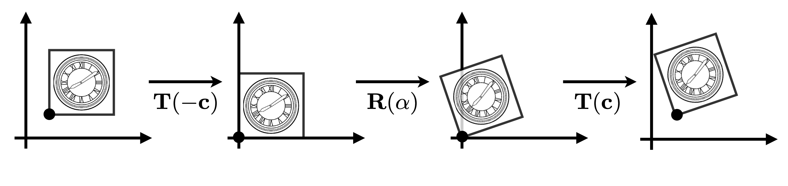

---

### 3.7 三维变换 (3D Transformations)

#### 齐次坐标表示

- **3D 点**：$(x, y, z, 1)^T$
- **3D 向量**：$(x, y, z, 0)^T$
- 一般地，$(x, y, z, w)^T$（$w \neq 0$）表示 3D 点 $(x/w, y/w, z/w)$

使用 **4×4 矩阵**进行仿射变换：

$$
\begin{pmatrix} x' \\ y' \\ z' \\ 1 \end{pmatrix} = \begin{pmatrix} a & b & c & t_x \\ d & e & f & t_y \\ g & h & i & t_z \\ 0 & 0 & 0 & 1 \end{pmatrix} \cdot \begin{pmatrix} x \\ y \\ z \\ 1 \end{pmatrix}
$$

#### 三维变换矩阵

旋转矩阵 $R(\theta)$ 的性质：

$$
R(\theta) = \begin{pmatrix} \cos\theta & -\sin\theta \\ \sin\theta & \cos\theta \end{pmatrix}
$$

$\cos\theta$为对称曲线 $\cos\theta$与$\cos-\theta$值是一致的，$\sin\theta$ 为反对称曲线 $\sin\theta$与$\sin-\theta$值是相反数。由此得出：

$$
R(-\theta) = \begin{pmatrix} \cos\theta & \sin\theta \\ -\sin\theta & \cos\theta \end{pmatrix} = R(\theta)^T
$$

$R(-\theta)$矩阵的行等于 $R(\theta)$矩阵的列，两者为逆矩阵，满足：

$$
R(-\theta) = R(\theta)^{-1} \quad \text{(by definition)}
$$

数学上，一个矩阵的逆矩阵等于他的转置矩阵的条件是该矩阵是正交矩阵，旋转矩阵就是正交矩阵。

**旋转**：

$$
R(\theta) = \begin{pmatrix} \cos\theta & -\sin\theta \\ \sin\theta & \cos\theta \end{pmatrix}
$$

$$
R(-\theta) = \begin{pmatrix} \cos\theta & \sin\theta \\ -\sin\theta & \cos\theta \end{pmatrix} = R(\theta)^T
$$

$$
R(-\theta) = R(\theta)^{-1} \quad \text{(by definition)}
$$


**缩放**：

$$
S(s_x, s_y, s_z) = \begin{pmatrix} s_x & 0 & 0 & 0 \\ 0 & s_y & 0 & 0 \\ 0 & 0 & s_z & 0 \\ 0 & 0 & 0 & 1 \end{pmatrix}
$$

**平移**：

$$
T(t_x, t_y, t_z) = \begin{pmatrix} 1 & 0 & 0 & t_x \\ 0 & 1 & 0 & t_y \\ 0 & 0 & 1 & t_z \\ 0 & 0 & 0 & 1 \end{pmatrix}
$$

**绕坐标轴旋转**：

绕 x 轴旋转：

$$
R_x(\alpha) = \begin{pmatrix} 1 & 0 & 0 & 0 \\ 0 & \cos\alpha & -\sin\alpha & 0 \\ 0 & \sin\alpha & \cos\alpha & 0 \\ 0 & 0 & 0 & 1 \end{pmatrix}
$$

绕 y 轴旋转（注意方向）：

$$
R_y(\alpha) = \begin{pmatrix} \cos\alpha & 0 & \sin\alpha & 0 \\ 0 & 1 & 0 & 0 \\ -\sin\alpha & 0 & \cos\alpha & 0 \\ 0 & 0 & 0 & 1 \end{pmatrix}
$$

绕 z 轴旋转：

$$
R_z(\alpha) = \begin{pmatrix} \cos\alpha & -\sin\alpha & 0 & 0 \\ \sin\alpha & \cos\alpha & 0 & 0 \\ 0 & 0 & 1 & 0 \\ 0 & 0 & 0 & 1 \end{pmatrix}
$$

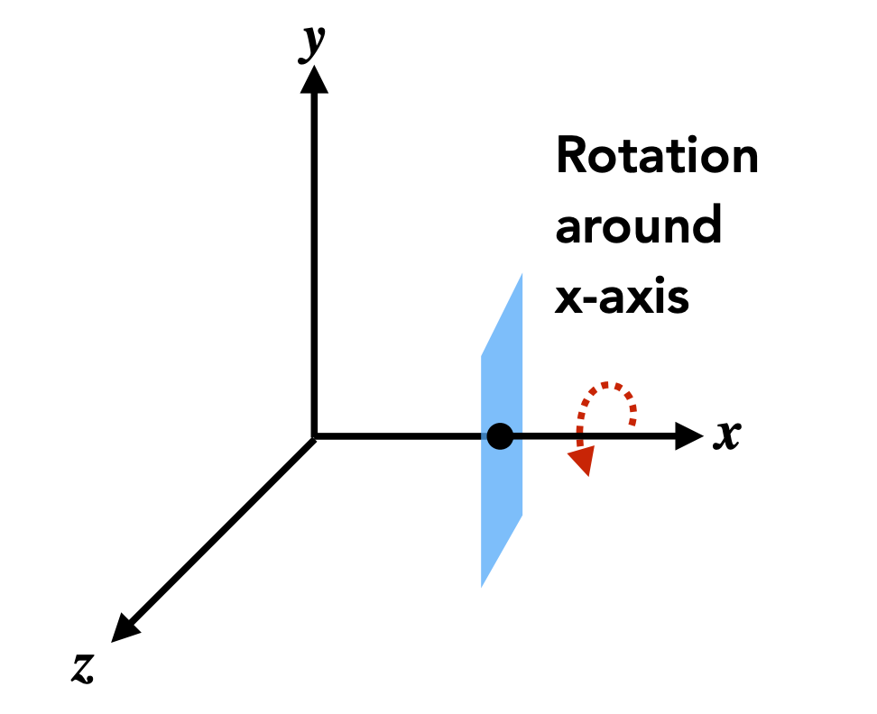


#### 欧拉角 (Euler Angles)

通过组合绕三个轴的旋转来表示任意 3D 旋转：

$$
R_{xyz}(\alpha, \beta, \gamma) = R_x(\alpha) \cdot R_y(\beta) \cdot R_z(\gamma)
$$

常用于飞行模拟器：**滚转 (Roll)、俯仰 (Pitch)、偏航 (Yaw)**


#### 罗德里格斯旋转公式 (Rodrigues' Rotation Formula)

绕任意单位轴 $\vec{n}$ 旋转 $\alpha$ 角：

$$
R(\vec{n}, \alpha) = \cos\alpha \cdot I + (1 - \cos\alpha) \vec{n} \vec{n}^T + \sin\alpha \cdot N
$$

其中 $N$ 是叉积矩阵：

$$
N = \begin{pmatrix} 0 & -n_z & n_y \\ n_z & 0 & -n_x \\ -n_y & n_x & 0 \end{pmatrix}
$$

**推导**：可参考课程补充材料 [[补充材料](https://sites.cs.ucsb.edu/~lingqi/teaching/resources/GAMES101_Lecture_04_supp.pdf)]

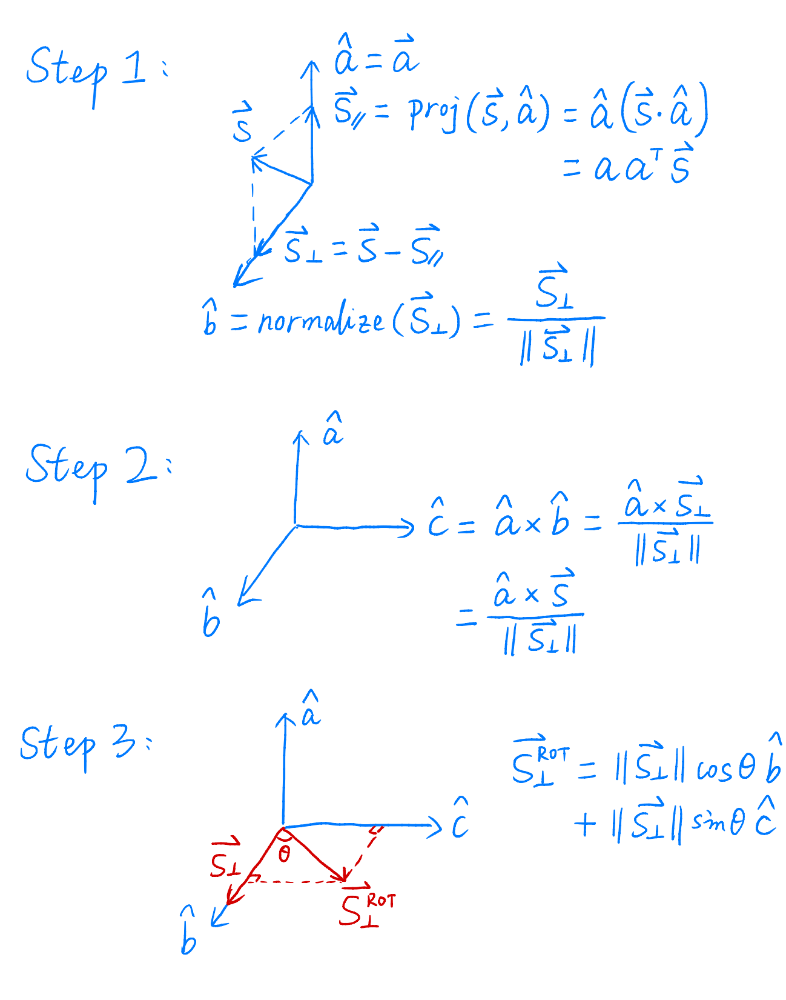

四元数

---

### 3.8 MVP 变换总览

图形渲染管线中的三大变换：

```
模型坐标 → [Model 变换] → 世界坐标 → [View 变换] → 相机坐标 → [Projection 变换] → 裁剪坐标
```

| 变换 | 作用 | 说明 |
|:---:|:---|:---|
| **Model** | 模型坐标 → 世界坐标 | 在场景中摆放物体 |
| **View** | 世界坐标 → 相机坐标 | 确定观察角度 |
| **Projection** | 相机坐标 → 裁剪坐标 | 3D → 2D 投影 |

---

### 3.9 视图变换 (View Transformation)

#### 类比拍照过程

1. **找好位置、安排人物** → Model 变换
2. **找好角度、放置相机** → View 变换
3. **按下快门** → Projection 变换

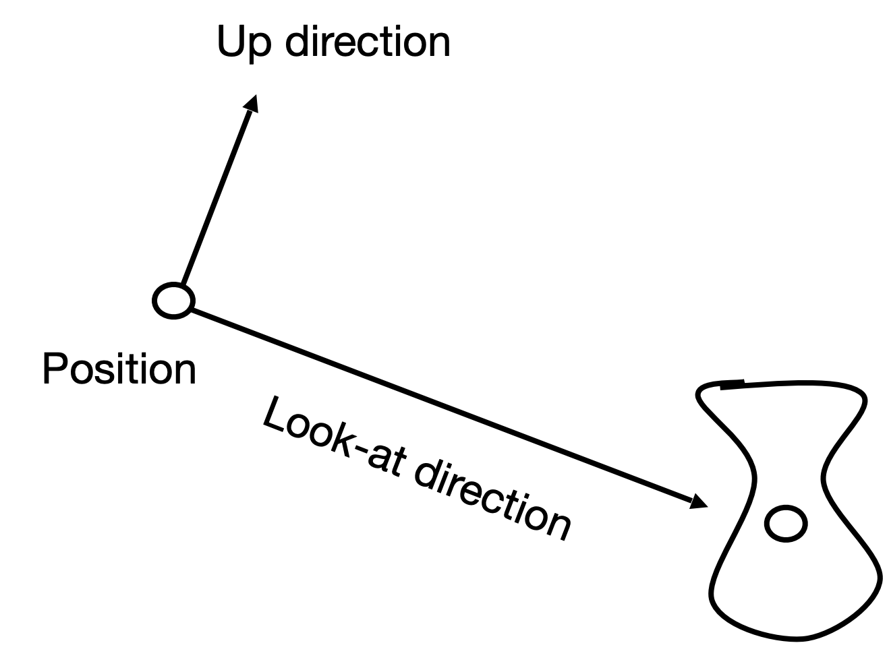

#### 相机的定义

| 参数 | 符号 | 说明 |
|:---:|:---:|:---|
| 位置 | $\vec{e}$ | 相机在世界坐标系中的位置 |
| 观察方向 | $\hat{g}$ | 相机看向的方向 (gaze direction) |
| 上方向 | $\hat{t}$ | 相机的上方 (up direction)，假设与观察方向垂直 |

#### 视图变换的核心思想

**关键观察**：如果相机和所有物体一起移动，"照片"效果相同！

**目标**：将相机变换到：
- 位于**原点**
- 上方向朝 **+Y**
- 观察方向朝 **-Z**

同时将所有物体一起变换。

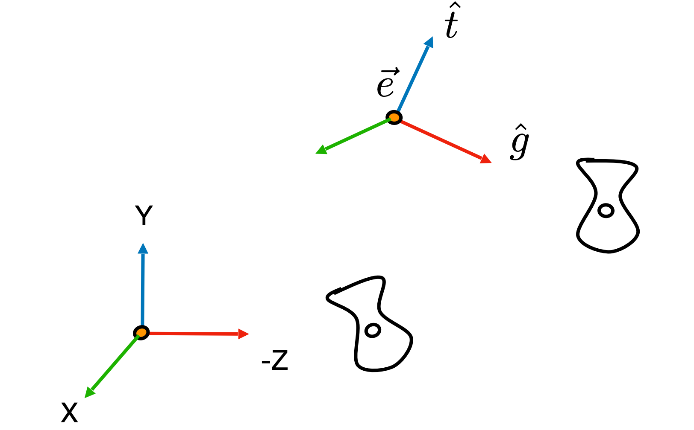

#### 视图变换矩阵推导

$$
M_{view} = R_{view} \cdot T_{view}
$$

**第一步：平移** $T_{view}$，将相机位置 $\vec{e} = (x_e, y_e, z_e)$ 移到原点：

$$
T_{view} = \begin{pmatrix} 1 & 0 & 0 & -x_e \\ 0 & 1 & 0 & -y_e \\ 0 & 0 & 1 & -z_e \\ 0 & 0 & 0 & 1 \end{pmatrix}
$$

**第二步：旋转** $R_{view}$，将相机坐标系对齐到标准坐标系：
- 观察方向 $\hat{g}$ → 对齐 **$-Z$** 轴
- 上方向 $\hat{t}$ → 对齐 **$Y$** 轴
- 右方向 $\hat{g} \times \hat{t}$ → 对齐 **$X$** 轴

##### 为什么考虑逆旋转更简单？

**直接求 $R_{view}$ 的困难**：需要解复杂的方程

$$
R_{view} \cdot \hat{g} = -Z, \quad R_{view} \cdot \hat{t} = Y, \quad R_{view} \cdot (\hat{g} \times \hat{t}) = X
$$

**技巧**：考虑逆变换 $R_{view}^{-1}$，它做相反的事——将标准基变换到相机坐标系：

$$
R_{view}^{-1} \cdot X = \hat{g} \times \hat{t}, \quad R_{view}^{-1} \cdot Y = \hat{t}, \quad R_{view}^{-1} \cdot Z = -\hat{g}
$$

##### 逆变换 $R_{view}^{-1}$ 的矩阵

**关键观察**：矩阵的每一列就是变换后的基向量！

| 标准基 | 变换结果 | 矩阵的列 |
|:---:|:---:|:---:|
| $X = (1,0,0)$ | $\hat{g} \times \hat{t}$（右方向） | 第一列 |
| $Y = (0,1,0)$ | $\hat{t}$（上方向） | 第二列 |
| $Z = (0,0,1)$ | $-\hat{g}$（观察反方向） | 第三列 |

因此：

$$
R_{view}^{-1} = \begin{pmatrix} | & | & | \\ \hat{g} \times \hat{t} & \hat{t} & -\hat{g} \\ | & | & | \end{pmatrix} = \begin{pmatrix} x_{\hat{g} \times \hat{t}} & x_{\hat{t}} & x_{-\hat{g}} & 0 \\ y_{\hat{g} \times \hat{t}} & y_{\hat{t}} & y_{-\hat{g}} & 0 \\ z_{\hat{g} \times \hat{t}} & z_{\hat{t}} & z_{-\hat{g}} & 0 \\ 0 & 0 & 0 & 1 \end{pmatrix}
$$

##### 求 $R_{view}$

旋转矩阵是**正交矩阵**，满足 $R^{-1} = R^T$，所以：

$$
R_{view} = (R_{view}^{-1})^T
$$

转置就是把行变成列：

$$
R_{view} = \begin{pmatrix} x_{\hat{g} \times \hat{t}} & y_{\hat{g} \times \hat{t}} & z_{\hat{g} \times \hat{t}} & 0 \\ x_{\hat{t}} & y_{\hat{t}} & z_{\hat{t}} & 0 \\ x_{-\hat{g}} & y_{-\hat{g}} & z_{-\hat{g}} & 0 \\ 0 & 0 & 0 & 1 \end{pmatrix}
$$

##### 验证

用 $R_{view}$ 作用于 $\hat{g}$，检验是否得到 $-Z$：

$$
R_{view} \cdot \hat{g} = \begin{pmatrix} (\hat{g} \times \hat{t}) \cdot \hat{g} \\ \hat{t} \cdot \hat{g} \\ (-\hat{g}) \cdot \hat{g} \\ 0 \end{pmatrix} = \begin{pmatrix} 0 \\ 0 \\ -1 \\ 0 \end{pmatrix} = -Z \quad \checkmark
$$

解释：
- 第一行：$(\hat{g} \times \hat{t}) \cdot \hat{g} = 0$（叉积垂直于原向量）
- 第二行：$\hat{t} \cdot \hat{g} = 0$（上方向垂直于观察方向）
- 第三行：$(-\hat{g}) \cdot \hat{g} = -|\hat{g}|^2 = -1$

---

### 3.10 投影变换 (Projection Transformation)

#### 两种投影方式

| 投影类型 | 特点 | 应用场景 |
|:---:|:---|:---|
| **正交投影** | 平行线保持平行，无近大远小 | 工程制图、CAD |
| **透视投影** | 平行线汇聚于一点，近大远小 | 游戏、电影、真实感渲染 |


---

#### 正交投影 (Orthographic Projection)

**直观理解**：

1. 相机位于原点，看向 $-Z$，上方向为 $Y$
2. **丢弃 Z 坐标**
3. 将得到的矩形**平移、缩放**到 $[-1, 1]^2$

**一般情况**：

将长方体 $[l, r] \times [b, t] \times [f, n]$ 映射到标准立方体 $[-1, 1]^3$

其中：$l$=左，$r$=右，$b$=下，$t$=上，$n$=近，$f$=远


##### 推导过程

**第一步：平移** $T$，将长方体的**中心**移到原点

长方体的中心坐标为 $\left(\frac{l+r}{2}, \frac{b+t}{2}, \frac{n+f}{2}\right)$，因此平移量取负：

$$
T = \begin{pmatrix} 1 & 0 & 0 & -\frac{r+l}{2} \\ 0 & 1 & 0 & -\frac{t+b}{2} \\ 0 & 0 & 1 & -\frac{n+f}{2} \\ 0 & 0 & 0 & 1 \end{pmatrix}
$$

平移后各方向的范围变为：

| 方向 | 原始范围 | 平移后范围 |
|:---:|:---:|:---:|
| x | $[l, r]$ | $[-\frac{r-l}{2}, \frac{r-l}{2}]$ |
| y | $[b, t]$ | $[-\frac{t-b}{2}, \frac{t-b}{2}]$ |
| z | $[f, n]$ | $[-\frac{n-f}{2}, \frac{n-f}{2}]$ |

**第二步：缩放** $S$，将长方体从 $\left[-\frac{r-l}{2}, \frac{r-l}{2}\right]$ 等缩放到 $[-1, 1]$

各方向的缩放因子：

| 方向 | 范围宽度 | 缩放因子 | 目标 |
|:---:|:---:|:---:|:---:|
| x | $r - l$ | $\frac{2}{r-l}$ | $[-1, 1]$ |
| y | $t - b$ | $\frac{2}{t-b}$ | $[-1, 1]$ |
| z | $n - f$ | $\frac{2}{n-f}$ | $[-1, 1]$ |

例如 x 方向：$\left[-\frac{r-l}{2}\right] \times \frac{2}{r-l} = -1$，$\left[\frac{r-l}{2}\right] \times \frac{2}{r-l} = 1$ ✓

$$
S = \begin{pmatrix} \frac{2}{r-l} & 0 & 0 & 0 \\ 0 & \frac{2}{t-b} & 0 & 0 \\ 0 & 0 & \frac{2}{n-f} & 0 \\ 0 & 0 & 0 & 1 \end{pmatrix}
$$

**组合**：先平移，再缩放（矩阵从右到左应用）

$$
M_{ortho} = S \cdot T = \begin{pmatrix} \frac{2}{r-l} & 0 & 0 & 0 \\ 0 & \frac{2}{t-b} & 0 & 0 \\ 0 & 0 & \frac{2}{n-f} & 0 \\ 0 & 0 & 0 & 1 \end{pmatrix} \cdot \begin{pmatrix} 1 & 0 & 0 & -\frac{r+l}{2} \\ 0 & 1 & 0 & -\frac{t+b}{2} \\ 0 & 0 & 1 & -\frac{n+f}{2} \\ 0 & 0 & 0 & 1 \end{pmatrix}
$$

##### 验证

| 原始点 | 平移后 | 缩放后 | 结果 |
|:---:|:---:|:---:|:---:|
| $(r, t, n)$ | $(\frac{r-l}{2}, \frac{t-b}{2}, \frac{n-f}{2})$ | $(1, 1, 1)$ | ✓ |
| $(l, b, f)$ | $(-\frac{r-l}{2}, -\frac{t-b}{2}, -\frac{n-f}{2})$ | $(-1, -1, -1)$ | ✓ |
| 中心 $(\frac{l+r}{2}, \frac{b+t}{2}, \frac{n+f}{2})$ | $(0, 0, 0)$ | $(0, 0, 0)$ | ✓ |

**注意**：看向 $-Z$ 方向时，近平面 $n > f$（近平面 z 值更大），所以 $n - f > 0$，缩放因子 $\frac{2}{n-f} > 0$

---

#### 透视投影 (Perspective Projection)

**特点**：
- 更远处的物体看起来更小
- 平行线不再平行，汇聚于一点（灭点）

**齐次坐标的重要性质**：

$(x, y, z, 1)^T$ 和 $(kx, ky, kz, k)^T$（$k \neq 0$）表示**同一个点**

例如：$(x, y, z, 1)$ 和 $(xz, yz, z^2, z)$ 都表示 $(x, y, z)$

**透视投影的核心思想**：

1. **第一步**：将视锥体 (frustum) "挤压" 成长方体 (cuboid)
   - 近平面不变：$n \to n$
   - 远平面不变：$f \to f$
   - 记作 $M_{persp \to ortho}$

2. **第二步**：做正交投影（已经知道怎么做了！）

$$
M_{persp} = M_{ortho} \cdot M_{persp \to ortho}
$$


**推导 $M_{persp \to ortho}$**：

对于点 $(x, y, z)$，在挤压后：
- $x' = \frac{n}{z} x$
- $y' = \frac{n}{z} y$


利用齐次坐标：

$$
\begin{pmatrix} x \\ y \\ z \\ 1 \end{pmatrix} \Rightarrow \begin{pmatrix} nx/z \\ ny/z \\ unknown \\ 1 \end{pmatrix} = \begin{pmatrix} nx \\ ny \\ unknown \\ z \end{pmatrix}
$$

因此可以确定矩阵的部分元素：

$$
M_{persp \to ortho} = \begin{pmatrix} n & 0 & 0 & 0 \\ 0 & n & 0 & 0 \\ ? & ? & ? & ? \\ 0 & 0 & 1 & 0 \end{pmatrix}
$$

**确定第三行**：

利用两个条件：
- 近平面上的点变换后不变（$z = n \to z' = n$）,将z替换称为n
$$
\begin{pmatrix} x \\ y \\ n \\ 1 \end{pmatrix} \Rightarrow \begin{pmatrix} x \\ y \\ n \\ 1 \end{pmatrix} == \begin{pmatrix} nx \\ ny \\ n^2 \\ z \end{pmatrix}
$$
第三行
$$
\begin{pmatrix} 0 & 0 & A & B \end{pmatrix} \begin{pmatrix} x \\ y \\ n \\ 1 \end{pmatrix} = n^2 得出 \Rightarrow  A n + B = n^2
$$
- 远平面上的点变换后不变（$z = f \to z' = f$）
$$
\begin{pmatrix} 0 \\ 0 \\ f \\ 1 \end{pmatrix} \Rightarrow \begin{pmatrix} 0 \\ 0 \\ f \\ 1 \end{pmatrix} == \begin{pmatrix} 0 \\ 0 \\ f^2 \\ f \end{pmatrix} 得出\Rightarrow Af + B = f^2
$$

解方程组可得A，B，第三行为 $(0, 0, n+f, -nf)$

**完整的透视投影矩阵**：

$$
M_{persp \to ortho} = \begin{pmatrix} n & 0 & 0 & 0 \\ 0 & n & 0 & 0 \\ 0 & 0 & n+f & -nf \\ 0 & 0 & 1 & 0 \end{pmatrix}
$$

**最终透视投影矩阵**：

$$
M_{persp} = M_{ortho} \cdot M_{persp \to ortho}
$$

---

### 3.11 补充：Field of View (FOV)

#### 直观理解

**视场角 (Field of View, FOV)** 描述了相机能够"看到"的角度范围。

类比人眼：人眼的视野大约是 120°（垂直）× 200°（水平）。FOV 越大，看到的范围越广，但物体看起来越小（类似鱼眼镜头）；FOV 越小，看到的范围越窄，但物体看起来越大（类似望远镜）。

| 类型 | 说明 | 常见值 |
|:---:|:---|:---:|
| **垂直 FOV (fovY)** | 垂直方向的视角范围 | 45° - 90° |
| **水平 FOV (fovX)** | 水平方向的视角范围 | 由 fovY 和宽高比决定 |

#### FOV 的几何含义

想象从相机位置看向近平面：

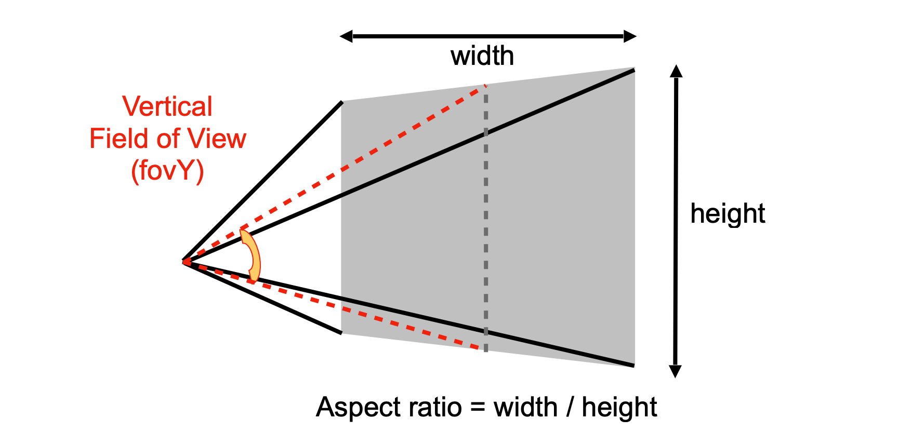

- **fovY**：垂直方向上，从相机看向近平面上下边界的夹角
- **t**：近平面的半高度（从中心到上边界）
- **|n|**：近平面到相机的距离

#### 公式推导

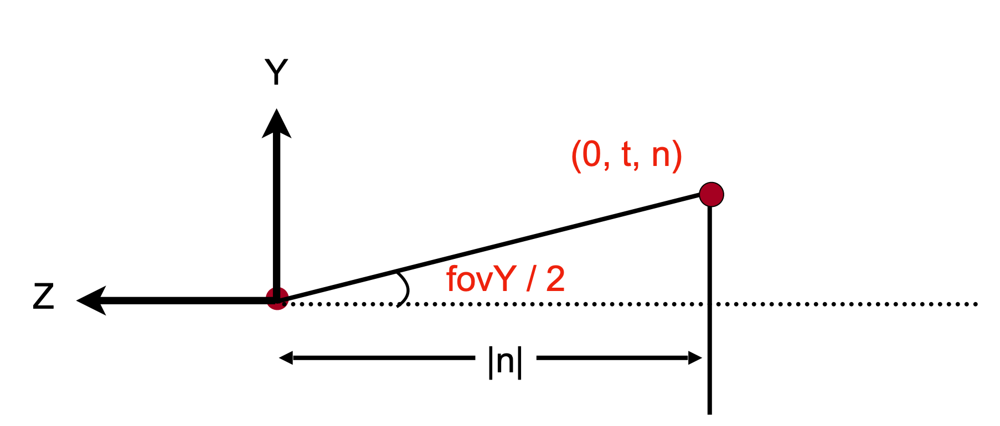

从相机位置看向近平面，形成一个直角三角形：

$$
\tan\left(\frac{fovY}{2}\right) = \frac{t}{|n|}
$$

其中：
- $\frac{fovY}{2}$：半角
- $t$：近平面的半高度（上边界到中心的距离）
- $|n|$：近平面距离（相机到近平面的距离，取绝对值）

**反之**，如果已知 fovY 和近平面距离，可以求出近平面的范围：

$$
t = |n| \cdot \tan\left(\frac{fovY}{2}\right)
$$

#### 宽高比 (Aspect Ratio)

宽高比定义为：

$$
\text{aspect} = \frac{\text{宽度}}{\text{高度}} = \frac{2r}{2t} = \frac{r}{t}
$$

其中 $r$ 是近平面的半宽度。

如果已知垂直 FOV 和宽高比，可以求出水平 FOV：

$$
\tan\left(\frac{fovX}{2}\right) = \frac{r}{|n|} = \frac{t \cdot \text{aspect}}{|n|} = \text{aspect} \cdot \tan\left(\frac{fovY}{2}\right)
$$

#### 实际应用

在游戏和 3D 应用中，FOV 是一个重要的可调参数：

| FOV 范围 | 效果 | 应用场景 |
|:---:|:---|:---|
| **小 FOV (30°-45°)** | 视野窄，物体大，有"望远镜"效果 | 狙击镜、电影镜头 |
| **中 FOV (60°-90°)** | 视野适中，较真实 | 大多数游戏默认值 |
| **大 FOV (90°-120°)** | 视野广，物体小，有"鱼眼"效果 | VR、竞速游戏 |

**示例**：如果 fovY = 60°，近平面距离 |n| = 1，则：

$$
t = 1 \cdot \tan(30°) = \frac{1}{\sqrt{3}} \approx 0.577
$$

若 aspect = 16:9，则：

$$
r = t \cdot \text{aspect} = 0.577 \times \frac{16}{9} \approx 1.026
$$

这样就确定了近平面的范围 $[-r, r] \times [-t, t] = [-1.026, 1.026] \times [-0.577, 0.577]$

---

