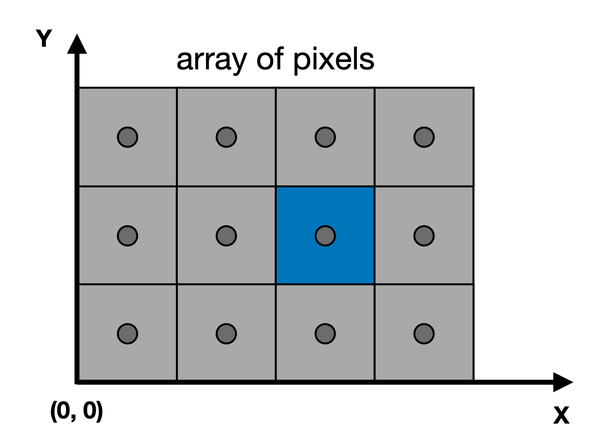
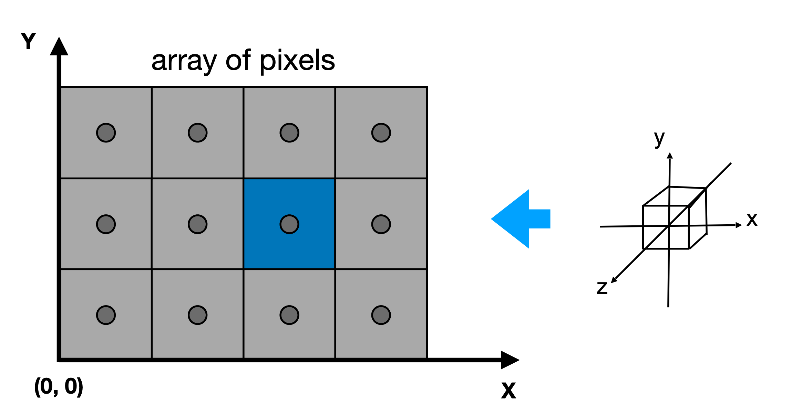

## 4. 光栅化

光栅化 (Rasterization) 是将矢量图形（几何描述）转换为像素图像（光栅图像）的过程。

光栅化 = 把连续的几何图形"画"成离散的像素点，是实时渲染的基础技术。

> 本章对应课程第 5-6 讲
> - 第 5 讲 [[课件 PDF](https://sites.cs.ucsb.edu/~lingqi/teaching/resources/GAMES101_Lecture_05.pdf)]
> - 第 6 讲 [[课件 PDF](https://sites.cs.ucsb.edu/~lingqi/teaching/resources/GAMES101_Lecture_06.pdf)]

### 4.1 视口变换 (Viewport Transformation)

#### 什么是屏幕

- 屏幕是**像素数组**
- 数组大小 = 分辨率 (Resolution)
- Raster（德语）= 屏幕，Rasterize = 光栅化 = 画到屏幕上
- **像素 (Pixel)**：短语 "picture element"，每个像素是一个小方块，颜色为 RGB 混合

#### 屏幕空间定义



| 属性 | 说明 |
|:---|:---|
| 像素索引范围 | $(0, 0)$ 到 $(width-1, height-1)$ |
| 像素中心 | 像素 $(x, y)$ 的中心在 $(x+0.5, y+0.5)$ |
| 屏幕覆盖范围 | $(0, 0)$ 到 $(width, height)$ |

#### 视口变换矩阵



将标准立方体 $[-1,1]^2$ 变换到屏幕空间 $[0, width] \times [0, height]$：

$$
M_{viewport} = \begin{pmatrix} \frac{width}{2} & 0 & 0 & \frac{width}{2} \\ 0 & \frac{height}{2} & 0 & \frac{height}{2} \\ 0 & 0 & 1 & 0 \\ 0 & 0 & 0 & 1 \end{pmatrix}
$$

**注意**：此变换与 z 无关，只在 xy 平面上进行, 平移和缩放

---

### 4.2 为什么用三角形

三角形是最基本的图元，在图形学中有独特优势：

| 特性 | 说明 |
|:---|:---|
| **最基本的多边形** | 任何多边形都可以拆分为三角形 |
| **保证共面** | 三点确定一个平面 |
| **内外定义明确** | 有明确的方法判断点在三角形内/外 |
| **插值方法明确** | 可以在顶点间进行插值（重心坐标） |

---

### 4.3 采样与判断点在三角形内

#### 基本思想

光栅化本质上是对三角形进行**采样**：
- 对屏幕上的每个像素中心，判断是否在三角形内
- 定义二值函数：

$$
inside(tri, x, y) = \begin{cases} 1 & \text{点 (x,y) 在三角形内} \\ 0 & \text{否则} \end{cases}
$$

#### 采样代码

```cpp
for (int x = 0; x < xmax; ++x)
    for (int y = 0; y < ymax; ++y)
        image[x][y] = inside(tri, x + 0.5, y + 0.5);
```

**注意**：采样位置是像素中心 $(x+0.5, y+0.5)$，不是 $(x, y)$

#### 叉积判断法

使用叉积判断点 P 是否在三角形 ABC 内：

```cpp
bool insideTriangle(float x, float y, const Vector3f* _v) {
    // 对每条边 AB, BC, CA 计算叉积
    // 若 P 在三条边的同侧（左侧），则 P 在三角形内
    Vector3f P(x, y, 0);
    
    // 计算三条边向量
    Vector3f AB = _v[1] - _v[0];
    Vector3f BC = _v[2] - _v[1];
    Vector3f CA = _v[0] - _v[2];
    
    // 计算从顶点到 P 的向量
    Vector3f AP = P - _v[0];
    Vector3f BP = P - _v[1];
    Vector3f CP = P - _v[2];
    
    // 叉积判断方向
    float z1 = cross(AB, AP).z;
    float z2 = cross(BC, BP).z;
    float z3 = cross(CA, CP).z;
    
    // 同号则在三角形内
    return (z1 > 0 && z2 > 0 && z3 > 0) || (z1 < 0 && z2 < 0 && z3 < 0);
}
```

#### 边界情况

当采样点恰好在三角形边上时，需要特殊处理：
- 可以约定：点在边上算在三角形内
- 或者：只有在特定边上才算（如左边界和上边界）

---

### 4.4 包围盒优化 (Bounding Box)

#### 问题

遍历整个屏幕的所有像素效率太低，大部分像素不在三角形内。

#### 解决方案

使用三角形的**轴对齐包围盒 (AABB)** 限制采样范围：

```cpp
// 计算包围盒
int minX = max(0, min(v0.x, min(v1.x, v2.x)));
int maxX = min(width - 1, max(v0.x, max(v1.x, v2.x)));
int minY = max(0, min(v0.y, min(v1.y, v2.y)));
int maxY = min(height - 1, max(v0.y, max(v1.y, v2.y)));

// 只在包围盒内采样
for (int x = minX; x <= maxX; ++x)
    for (int y = minY; y <= maxY; ++y)
        if (insideTriangle(x + 0.5, y + 0.5, vertices))
            image[x][y] = color;
```

对于细长或旋转的三角形，还可以使用**增量三角形遍历**进一步优化。

---

### 4.5 锯齿问题 (Aliasing)

#### 什么是锯齿

光栅化后的三角形边缘呈现阶梯状（Jaggies），这是因为**采样不足**导致的**走样 (Aliasing)** 现象。

#### 走样的常见表现

| 类型 | 描述 | 原因 |
|:---:|:---|:---|
| **锯齿 (Jaggies)** | 空间中的阶梯状边缘 | 空间采样不足 |
| **摩尔纹 (Moiré)** | 图像中的条纹图案 | 图像欠采样 |
| **车轮效应 (Wagon Wheel)** | 运动方向看似反转 | 时间采样不足 |

#### 根本原因

信号变化太快（高频），但采样太慢（低频）

---

### 4.6 抗锯齿 (Anti-Aliasing)

#### 频域视角

**傅里叶变换**：将信号分解为不同频率的正弦/余弦波的加权和

$$
F(\omega) = \int_{-\infty}^{\infty} f(x) e^{-2\pi i \omega x} dx
$$

**采样 = 重复频率内容**：采样频率越高，频率域中的副本间隔越大

**走样 = 频率内容混合**：欠采样导致高频信号伪装成低频信号

#### 滤波 (Filtering)

| 滤波类型 | 作用 | 频域效果 |
|:---:|:---|:---|
| **低通滤波** | 模糊图像，去除高频 | 保留低频，去除高频 |
| **高通滤波** | 提取边缘，去除低频 | 保留高频，去除低频 |
| **带通滤波** | 保留特定频率范围 | 去除过高和过低频率 |

**卷积定理**：空间域的卷积 = 频域的乘法

**盒式滤波器 (Box Filter)**：1 个像素宽度的盒式滤波器相当于低通滤波（模糊）

$$
\text{Box Filter} = \frac{1}{9} \begin{pmatrix} 1 & 1 & 1 \\ 1 & 1 & 1 \\ 1 & 1 & 1 \end{pmatrix}
$$

#### 抗锯齿方法

**先滤波，后采样**（正确顺序！）：
1. 滤波：去除高于奈奎斯特频率的高频成分
2. 采样：在滤波后的信号上采样

**先采样，后滤波**（错误顺序！）：会得到模糊的锯齿

#### SSAA (Supersampling Anti-Aliasing)

**超采样抗锯齿**：通过在像素内多次采样来近似 1 像素盒式滤波的效果

**步骤**：
1. 在每个像素内取 $N \times N$ 个采样点
2. 分别判断每个采样点是否在三角形内
3. 对 $N \times N$ 个结果取平均

**示例（2×2 SSAA）**：

```
原始像素：    超采样后：
┌───┐        ┌─┬─┐
│   │        │1│0│  → 50%
└───┘        ├─┼─┤
             │1│0│
             └─┴─┘
```

**优点**：效果好，能有效消除锯齿

**缺点**：计算量增大 $N^2$ 倍

#### MSAA (Multisample Anti-Aliasing)

**多重采样抗锯齿**：SSAA 的优化版本

**与 SSAA 的区别**：
- SSAA：每个采样点都计算颜色
- MSAA：只在像素中心计算颜色，采样点只判断可见性

**步骤**：
1. 在像素内取多个采样点位置
2. 判断每个采样点是否在三角形内（可见性测试）
3. 颜色只在像素中心计算一次
4. 最终颜色 = 颜色 × (可见采样点数 / 总采样点数)

**优点**：比 SSAA 效率高，效果也不错

#### FXAA (Fast Approximate Anti-Aliasing)

**快速近似抗锯齿**：后处理技术

**原理**：
1. 不增加采样点
2. 在渲染完成后，检测图像中的边缘
3. 将边缘附近的像素进行平滑混合

**优点**：速度快，性能开销小

**缺点**：可能丢失细节

#### TAA (Temporal Anti-Aliasing)

**时间抗锯齿**：利用帧间信息

**原理**：
1. 在不同帧中，对像素内的不同位置采样
2. 将多帧结果混合

**优点**：效果好，适合动态场景

**缺点**：可能产生鬼影（ghosting）

---

### 4.7 深度缓冲 (Z-Buffer)

#### 问题

多个三角形可能覆盖同一个像素，如何确定哪个三角形在前面？

#### 画家算法 (Painter's Algorithm)

**思路**：先画远处的物体，再画近处的物体（远的被近的覆盖）

**问题**：
- 需要对三角形排序，计算量大
- 可能出现循环遮挡的情况，无法排序

#### Z-Buffer 算法

**核心思想**：为每个像素存储深度值，渲染时比较深度

**数据结构**：
- **帧缓冲 (Framebuffer)**：存储每个像素的颜色
- **深度缓冲 (Depth Buffer / Z-Buffer)**：存储每个像素的深度值

**算法流程**：

```cpp
// 初始化
for each pixel (x, y):
    zbuffer[x][y] = ∞  // 初始化为最大深度
    framebuffer[x][y] = background_color

// 渲染
for each triangle:
    for each sample (x, y, z):
        if z < zbuffer[x, y]:        // 更近的三角形
            framebuffer[x, y] = color  // 更新颜色
            zbuffer[x, y] = z          // 更新深度
```

**关键特性**：
- 时间复杂度：$O(n)$，n 为像素数（与三角形数量无关）
- 无需排序三角形
- 每个三角形独立处理

**注意**：
- 深度值通常不是线性的（透视投影后）
- 深度精度有限，可能导致 Z-fighting（深度冲突）

---

